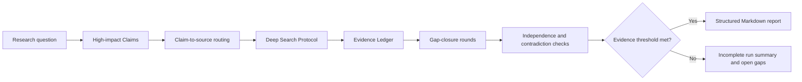

# Industry Research Skill for AI Agents

English | [简体中文](README.zh-CN.md)

A structured, evidence-aware industry and company research skill for general
AI agents. It turns open-ended questions into Markdown reports with industry
mapping, lifecycle assessment, competitive analysis, profitability analysis,
valuation logic, risks, opportunities, and source verification.

Use it for market research, industry analysis, company research, competitive
intelligence, investment research, strategic planning, and commercial due
diligence.

## Quick Start

Install the skill from GitHub with the open agent skills CLI:

```bash
npx skills add lu90/industry-research-skill --skill industry-research
```

Then ask your AI agent a research question, for example:

```text
Analyze the AI agent industry, including its industry map, lifecycle stage,
competitive structure, profitability, risks, opportunities, and key
indicators to monitor.
```

The default deliverable is a structured Markdown report. The skill does not
generate a PDF, presentation, webpage, or mind map unless the user explicitly
requests another format after the Markdown report is complete.

## Why It Is Different

Many research prompts mainly define what the final answer should look like.
This skill also defines how the research should be planned, retrieved,
verified, and admitted into a report.

| Mechanism | How it improves the research process |
|---|---|
| Claim-led planning | A standard or deep report starts with 5-15 high-impact, verifiable Claims. Each Claim receives a stable ID, research boundary, type, and required evidence tier. |
| Claim-to-source routing | Sources are selected for a defined Claim rather than search convenience. Market, policy, company, financial, valuation, and technology Claims follow different primary and fallback source routes. |
| Provider-neutral Deep Search Protocol | Retrieval uses a Search, Visit, and Extract loop that supports breadth search, evidence-derived follow-up queries, deduplication, access recording, safety budgets, and explicit stop reasons without depending on one search provider. |
| Evidence Ledger | Every obtained or attempted document is tied to a `claim_id` and `source_id`, with its period, geography, unit, definition, location, supporting span, access outcome, and evidence tier. An inaccessible document is recorded as a failed attempt, not treated as evidence. |
| Three-round gap closure | High-impact evidence gaps can trigger up to three targeted retrieval rounds. Remaining gaps are labeled as resolved, partially resolved, or unresolved, with their impact and next verification source. |
| Origin-level verification | Independent verification is based on different data-generating origins. Mirrors, syndicated articles, and multiple pages reproducing one original source do not count as independent confirmation. |
| Contradiction handling | Conflicting figures are grouped and explained through differences in definition, period, geography, methodology, or source incentives instead of being forced into one number. |
| Research Run and report gate | Plans, attempts, evidence, gaps, contradictions, budgets, and stop reasons are retained as auditable run artifacts. If the minimum evidence threshold is not met, the workflow returns an incomplete run summary and gaps instead of generating a polished formal report. |
| Deterministic validation | Included checkers validate report structure, required fields, evidence contracts, access honesty, and run artifacts. They improve consistency but do not claim to prove factual accuracy. |

The result is not automatically "true" because it is structured. The goal is
to make important conclusions easier to trace, challenge, and verify.

## Evidence-Aware Research Flow



See [REPORT-STRUCTURE.md](REPORT-STRUCTURE.md) for the complete report-routing
and analysis structure.

## What You Can Research

Ask your AI agent questions such as:

- "Give me a structured overview of the AI agent industry."
- "Why is the Chinese electric vehicle market experiencing a price war?"
- "Analyze Shopee's competitive position in Southeast Asian e-commerce."
- "Assess the long-term competitiveness of Luckin Coffee."
- "Explain the drivers behind Xiaomi's recent share-price decline."
- "Evaluate the profitability, lifecycle stage, risks, and opportunities of
  the Chinese pet food industry."

The skill routes each request into one of three research paths:

1. Industry overview
2. Industry-specific question
3. Company or product analysis

## Example Research Reports

| Research type | Example |
|---|---|
| AI agent industry overview | [AI Agent Industry Research: From Model Capability Competition to Trustworthy Execution Systems](reports/20260717_122444_AI_Agent行业研究.md) |
| Embodied AI industry overview | [Embodied AI Industry Research: From Technical Validation to Constrained Scenario Scaling](reports/20260717_134652_具身智能行业.md) |
| Listed-company capital-market analysis | [Why Xiaomi Group's Share Price Fell](reports/20260717_162703_小米股价大跌原因.md) |

> Example reports demonstrate the research workflow and output structure.
> Generated facts, estimates, and conclusions still require independent
> verification. The current examples are written in Chinese.

## Core Capabilities

| Capability | What it does |
|---|---|
| Research planning | Defines the research boundary, decomposes the question, and builds a source plan |
| Industry mapping | Maps the value chain, participants, products, customers, and profit pools |
| Lifecycle assessment | Evaluates whether an industry is emerging, growing, mature, or declining |
| Competitive analysis | Examines market structure, competitors, entry barriers, and differentiation |
| Company positioning | Places a company or product within its industry and competitive landscape |
| Profitability analysis | Analyzes revenue drivers, cost structure, margins, and operating leverage |
| Valuation logic | Connects business fundamentals with relevant valuation frameworks |
| Evidence management | Separates facts, opinions, inferences, source gaps, and unresolved claims |
| Risk and opportunity analysis | Identifies catalysts, constraints, uncertainties, and verification signals |
| Structured reporting | Produces consistent Markdown reports for review, reuse, and further editing |

## Compatibility

The skill uses an Agent Skills-style directory with a `SKILL.md` entry point,
supporting references, report templates, and validation scripts. It is
designed for AI-agent environments that can load this structure and use the
tools required by the selected research workflow.

Compatibility may vary by agent runtime, available tools, model capabilities,
and network access. Platforms not explicitly tested by the maintainer should
not be assumed to have full feature parity.

## Repository Structure

```text
skills/industry-research/
├── SKILL.md                Main skill instructions and routing rules
├── assets/                 Markdown report and research-prompt templates
├── references/             Research frameworks and output contracts
└── scripts/                Deterministic report validation tools

reports/                    Noncommercial example research reports
tests/                      Contract-checker fixtures and regression tests
```

## Intended Use and Limitations

This skill is intended to improve the structure, traceability, and analytical
coverage of AI-assisted research. It does not guarantee that sources are
available, current, independent, or correct. Output quality depends on the
agent runtime, model, retrieval tools, accessible sources, and the clarity of
the research question.

Users should independently verify high-impact claims, financial data,
regulatory information, forecasts, and investment-related conclusions.

## Licensing

### Skill

The files under `skills/industry-research/` are licensed under the
[Apache License 2.0](LICENSE). Commercial use of the skill is permitted,
including using the skill to generate reports for commercial purposes.

A copy of the Apache License is also included inside the skill directory so
that the license accompanies standalone skill installations.

### Example Reports

The existing reports under `reports/` are licensed separately under the
[Creative Commons Attribution-NonCommercial 4.0 International License](reports/LICENSE).
They may not be used commercially without separate permission from the
copyright holder.

### Generated Outputs

Reports independently generated through normal use of the skill are not
automatically subject to the CC BY-NC 4.0 license applied to `reports/`.
Users may commercialize independently generated reports, subject to applicable
law, third-party rights, model-provider terms, and their own professional or
regulatory obligations.

Output that copies or is substantially derived from an existing report in
`reports/` remains subject to that report's license.

## Support the Project

If this skill is useful in your research workflow, consider starring the
repository. It helps other researchers and AI-agent builders discover the
project.

Feedback, reproducible failure cases, source-quality suggestions, and
improvements to the research framework are welcome through GitHub Issues and
Pull Requests.

## Disclaimer

This project does not provide investment or other professional advice. Users
are responsible for verifying generated content and for all decisions,
distribution, and commercialization based on it. See
[DISCLAIMER.md](DISCLAIMER.md) for the complete disclaimer.
