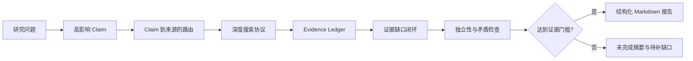

# 面向 AI Agent 的行业研究 Skill

[English](README.md) | 简体中文

一个面向通用 AI Agent 的结构化、证据导向型行业与公司研究 Skill。它能够将开放式问题转化为 Markdown 研究报告，覆盖行业地图、生命周期判断、竞争分析、盈利能力分析、估值逻辑、风险与机会，以及来源核验。

适用于市场研究、行业分析、公司研究、竞争情报、投资研究、战略规划和商业尽职调查等场景。

## 快速开始

使用开放智能体 Skills CLI 从 GitHub 安装：

```bash
npx skills add lu90/industry-research-skill --skill industry-research
```

然后向 AI Agent 提出研究问题，例如：

```text
分析 AI Agent 行业，包括行业地图、生命周期、竞争结构、盈利能力、风险、机会和需要持续跟踪的关键指标。
```

默认交付物为结构化 Markdown 报告。除非用户在 Markdown 报告完成后明确要求其他格式，否则 Skill 不会生成 PDF、演示文稿、网页或思维导图。

## 我们有什么不同

许多研究 Prompt 主要规定最终答案应该长什么样。本 Skill 还会约束研究应该如何规划、检索、核验，以及什么情况下才允许生成正式报告。

| 核心机制                 | 如何改善研究过程                                                                                                    |
| -------------------- | ----------------------------------------------------------------------------------------------------------- |
| Claim 驱动的研究规划        | 标准或深度报告首先定义 5-15 个高影响、可验证的 Claim。每个 Claim 都有稳定 ID、研究边界、类型和所需证据等级。                                           |
| Claim 到来源的路由         | 信息来源根据具体 Claim 选择，而不是根据搜索便利性选择。市场、政策、公司、财务、估值和技术 Claim 会进入不同的首选与后备来源路径。                                     |
| 与检索服务商解耦的深度搜索协议      | 检索采用 Search、Visit 和 Extract 循环，支持广度搜索、由证据推导的递归查询、去重、访问结果记录、安全预算和明确停止原因，不依赖单一搜索服务商。                          |
| Evidence Ledger 证据账本 | 每个已获取或已尝试的文档都通过 `claim_id` 和 `source_id` 建立关联，并记录期间、地域、单位、定义、原文位置、最短支持片段、访问结果与证据等级。无法访问的文档只记录为失败尝试，不会被当作证据。 |
| 三轮证据缺口闭环             | 高影响证据缺口可以触发最多三轮定向检索。剩余缺口会被标记为已补齐、部分补齐或仍未补齐，并说明对结论的影响和下一步核验来源。                                               |
| 来源原点级独立核验            | 是否独立核验取决于数据生成来源是否不同。镜像页面、转载文章，以及重复呈现同一原始来源的多个页面，不会被算作独立确认。                                                  |
| 矛盾证据处理               | 对相互冲突的数据进行分组，并从定义、期间、地域、方法或来源激励等角度解释差异，而不是强行合并成一个数字。                                                        |
| Research Run 与报告准入   | 研究计划、检索尝试、证据、缺口、矛盾、预算和停止原因会被保留为可审计工件。如果未达到最低证据门槛，流程只返回未完成的运行摘要和缺口，不会生成一份看似完整的正式报告。                          |
| 确定性验证                | 随附的检查工具会验证报告结构、必填字段、证据契约、访问状态真实性和 Research Run 工件。这些检查提高一致性，但不声称能够自动证明事实正确。                                 |

结构完整并不代表结论自动为真。这套机制的目标，是让重要结论更容易追溯、质疑和核验。

## 证据导向的研究流程



完整的报告路由和分析结构请参阅 [REPORT-STRUCTURE.md](REPORT-STRUCTURE.md)。

## 可以研究什么

你可以向 AI Agent 提出这类问题：

- “系统分析 AI Agent 行业。”
- “为什么中国新能源汽车市场会发生价格战？”
- “分析 Shopee 在东南亚电商行业中的竞争地位。”
- “评估瑞幸咖啡的长期竞争力。”
- “分析小米近期股价下跌的主要驱动因素。”
- “评估中国宠物食品行业的盈利能力、生命周期、风险与机会。”

Skill 会将请求路由到三类研究路径之一：

1. 行业全览
2. 行业具体问题
3. 公司或产品分析

## 示例研究报告

| 研究类型          | 示例                                                                          |
| ------------- | --------------------------------------------------------------------------- |
| AI Agent 行业全览 | [AI Agent 行业研究报告: 从模型能力竞赛走向可信执行系统](reports/20260717_122444_AI_Agent行业研究.md) |
| 具身智能行业全览      | [具身智能行业研究报告: 从技术验证迈向受约束的场景规模化](reports/20260717_134652_具身智能行业.md)           |
| 上市公司资本市场分析    | [小米集团股价大跌原因研究报告](reports/20260717_162703_小米股价大跌原因.md)                       |

> 示例报告用于展示研究流程和输出结构。报告中的事实、估算与结论仍需独立核验。

## 核心能力

| 能力 | 作用 |
|---|---|
| 研究规划 | 界定研究边界、拆解问题并制定信息来源计划 |
| 行业地图 | 梳理产业链、参与者、产品、客户与利润池 |
| 生命周期判断 | 判断行业处于导入期、成长期、成熟期还是衰退期 |
| 竞争分析 | 分析市场结构、竞争对手、进入壁垒与差异化 |
| 公司定位 | 判断公司或产品在行业与竞争格局中的位置 |
| 盈利能力分析 | 分析收入驱动、成本结构、利润率与经营杠杆 |
| 估值逻辑 | 将业务基本面与适用的估值框架连接起来 |
| 证据管理 | 区分事实、观点、推断、来源缺口与未解决主张 |
| 风险与机会分析 | 识别催化因素、约束条件、不确定性与验证信号 |
| 结构化报告 | 生成便于审阅、复用与继续编辑的 Markdown 报告 |

## 兼容性

本 Skill 采用 Agent Skills 风格的目录结构，以 `SKILL.md` 作为入口，并配套参考资料、报告模板和验证脚本。它适用于能够加载这类目录结构，并能调用所选研究流程所需工具的 AI Agent 环境。

实际兼容性可能受到 Agent 运行时、可用工具、模型能力和网络访问条件的影响。对于维护者尚未明确测试的平台，不应默认其具备完整的功能一致性。

## 仓库结构

```text
skills/industry-research/
├── SKILL.md                Skill 主指令与路由规则
├── assets/                 Markdown 报告与研究提示词模板
├── references/             研究框架与输出契约
└── scripts/                确定性报告验证工具

reports/                    仅限非商业使用的示例研究报告
tests/                      契约检查夹具与回归测试
```

## 适用范围与局限性

本 Skill 用于改善 AI 辅助研究的结构性、可追溯性和分析覆盖度，但不保证信息来源一定可访问、及时、独立或正确。输出质量取决于 Agent 运行时、模型、检索工具、可访问信息来源，以及研究问题本身的清晰度。

对于高影响主张、财务数据、监管信息、预测和投资相关结论，使用者应进行独立核验。

## 许可证

### Skill

`skills/industry-research/` 下的文件采用 [Apache License 2.0](LICENSE) 授权。允许将该 Skill 用于商业用途，包括使用该 Skill 生成用于商业目的的报告。

Skill 目录内也包含一份 Apache 许可证副本，以确保单独安装 Skill 时许可证能够随之提供。

### 示例报告

`reports/` 下现有的报告单独采用 [知识共享署名-非商业性使用 4.0 国际许可协议](reports/LICENSE) 授权。未经版权所有者另行许可，不得将这些报告用于商业用途。

### 生成的输出

通过正常使用该 Skill 独立生成的报告，不会自动受到适用于 `reports/` 的 CC BY-NC 4.0 许可协议约束。在遵守适用法律、第三方权利、模型提供商条款，以及使用者自身专业或监管义务的前提下，使用者可以将独立生成的报告商业化。

复制 `reports/` 中现有报告，或者实质性派生自现有报告的输出，仍然受到该报告许可证的约束。

## 支持项目

如果这个 Skill 对你的研究工作流有帮助，可以考虑为仓库点一个 Star。这会帮助其他研究者和 AI Agent 开发者发现本项目。

欢迎通过 GitHub Issues 和 Pull Requests 提交反馈、可复现的失败案例、信息来源质量建议，以及对研究框架的改进。

## 免责声明

本项目不提供投资建议或其他专业建议。使用者有责任核验生成内容，并对基于生成内容作出的所有决定、分发行为和商业化行为负责。完整免责声明请参阅 [DISCLAIMER.zh-CN.md](DISCLAIMER.zh-CN.md)。
