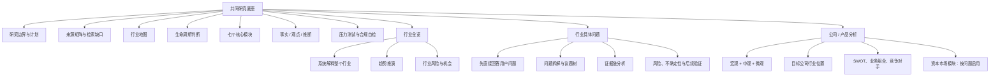

```mermaid
flowchart TD
    A[共同研究底座] --> A1[研究边界与计划]
    A --> A2[来源矩阵与检索缺口]
    A --> A3[行业地图]
    A --> A4[生命周期判断]
    A --> A5[七个核心模块]
    A --> A6[事实 / 观点 / 推断]
    A --> A7[压力测试与合规自检]

    A --> B[行业全览]
    A --> C[行业具体问题]
    A --> D[公司 / 产品分析]

    B --> B1[系统解释整个行业]
    B --> B2[趋势推演]
    B --> B3[行业风险与机会]

    C --> C1[先直接回答用户问题]
    C --> C2[问题拆解与议题树]
    C --> C3[证据链分析]
    C --> C4[风险、不确定性与后续验证]

    D --> D1[宏观 + 中观 + 微观]
    D --> D2[目标公司行业位置]
    D --> D3[SWOT、业务组合、竞争对手]
    D --> D4[资本市场模块：按问题启用]
```
