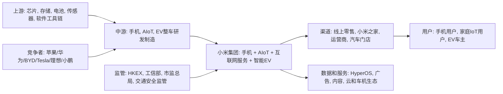

## 0. 研报前置区

### 0.1 报告摘要

本报告把用户问题界定为小米集团, 1810.HK, 的上市公司资本市场问题. 研究目标不是给出短线买卖点, 而是解释股价为什么从高预期状态回落较多, 以及哪些经营和市场变量决定后续能否修复预期. 报告结论是, 小米股价下跌不是单一事件造成的, 而是高估值叙事从"手机复苏 + AIoT生态 + 汽车第二增长曲线"转向"手机毛利承压 + 汽车安全和召回风险 + EV估值需要利润验证 + 港股科技风险偏好波动"后的预期重估.

从基本面看, 小米并非简单变差. 已检索到的公开资料显示, 2025年全年收入和利润仍有增长, 智能电动汽车和AI新业务贡献明显扩大, 但2025年四季度出现净利润下滑, 智能手机毛利率和IoT收入承压, 这使市场开始重新评估传统硬件业务的稳定性. 从资本市场看, 前期股价已经包含较强EV成长预期, 当市场看到汽车事故, 召回, 辅助驾驶监管, 智能手机存储成本上行和消费需求偏弱时, 估值锚从成长叙事切回利润和安全验证.

本报告采用宏观, 中观, 微观和资本市场四层分析. 由于当前环境未直接取得Wind, Bloomberg, HKEX完整历史行情和小米IR原始PDF, 报告对部分股价区间, 估值倍数和分部细项标记为待核验事实或证据缺口. 已使用的公开来源包括小米投资者关系和财报应核验项, HKEX和可信行情数据库应核验项, WSJ, MarketWatch, Business Insider, Cinco Dias, Wikipedia聚合条目以及公开监管召回信息线索. 二手来源只作为补充信号, 不作为最终核心证明.

### 0.2 关键结论

| 结论 | 原因 | 证据指向 |
|---|---|---|
| 股价下跌的主因是预期重估, 不是单一利空 | 前期市场给予EV高增长和生态协同较高估值, 后续利润率, 安全, 监管和传统业务压力同时进入定价 | 11.1, 11.3 |
| 基本面呈现分化, EV增长强但传统硬件承压 | 公开报道显示2025全年收入利润增长, 但Q4净利润下降, 手机毛利率收缩, IoT收入下滑 | 5.4, 11.2 |
| EV叙事从订单驱动转向交付, 安全, 毛利和现金流验证 | SU7/YU7需求强, 但事故和召回使辅助驾驶安全, 责任边界和监管合规成为估值折扣因素 | 4.0, 5.6, 11.3 |
| 后续修复取决于四类指标 | 交付和订单兑现, 分部毛利率, 安全召回闭环, 港股科技风险偏好和估值倍数稳定 | 11.4, 16 |

### 0.3 核心指标总览

| 指标 | 行业读数 | 目标公司/产品读数 | 判断 | 证据/来源 |
|---|---|---|---|---|
| 市场规模 | 中国智能手机为成熟大盘, 新能源车为高渗透但竞争加剧的大盘 | 小米覆盖手机, IoT, 互联网服务和智能EV四条主线 | 多业务空间足够, 但估值不能只看单一成长线 | 公司财报应核验, IDC/Canalys/CAAM应核验 |
| 增速/渗透率 | 中国EV渗透率处于高位后继续提升, 手机换机需求相对温和 | EV业务从2024导入后快速放量, 传统手机业务受成本和竞争影响 | 增长从"有没有需求"转为"能否赚钱并安全交付" | 公开报道, CAAM和公司交付数据待核验 |
| 竞争强度 | 手机面对苹果, 华为, OPPO, vivo, 传音等竞争, EV面对BYD, Tesla, 理想, 小鹏, 华为系等竞争 | 小米有品牌和生态协同, 但汽车制造和智驾安全还在验证期 | 竞争强度高, 估值需要折扣反映执行风险 | 行业数据库和同业公告待核验 |
| 盈利水平 | 手机受存储成本和促销影响, EV行业价格战压缩利润池 | 公开报道称Q4手机毛利率从12.0%降至8.3%, EV和AI新业务全年增长快 | 盈利性是股价下跌解释中的核心变量 | WSJ, 小米财报原文待核验 |
| 景气度 | EV订单景气强但价格和安全监管压力上升, 消费电子复苏不均衡 | 小米EV订单和交付强, 但事故召回带来短期景气折价 | 景气不是单向向上, 而是量强价弱和风险溢价上升 | 公司公告, 监管召回, 市场报道 |
| 关键风险 | 辅助驾驶监管, 存储成本, 消费需求, 港股流动性和中概科技风险偏好 | 多业务叙事复杂, 市场可能在不同业务线之间切换估值锚 | 风险叠加时会导致估值杀跌而非利润线性下跌 | 3, 5.6, 11 |

### 0.4 图表清单或图表占位

| 图表 | 类型 | 用途 |
|---|---|---|
| 图表 1: 小米多业务行业地图和目标位置 | Mermaid | 展示手机, AIoT, 互联网服务和EV产业链位置 |
| 图表 2: 核心指标总览 | 表格 | 对比行业读数, 小米读数, 判断和证据来源 |
| 图表 3: 多业务线中观拆分 | 表格 | 解释不同业务线的生命周期和估值含义 |
| 图表 4: 七模块判断矩阵 | 表格 | 展示可行性, 规模性, 防守性, 盈利性, 估值, 外部因素, 景气度 |
| 图表 5: 资本市场预期差拆解 | 表格 | 拆分股价表现, 基本面变化, 估值锚和触发器 |
| 图表 6: 后续验证清单 | 表格 | 列出需要核验的一手来源和优先级 |

## 1. 直接结论

小米股价下跌较多, 本质上是"高增长故事被要求拿出更硬证据"后的估值收缩. 前期市场愿意为小米汽车订单, 生态协同, AI和高端化手机给予成长溢价, 但当四季度传统硬件毛利承压, 智能电动汽车发生安全舆情和召回, 港股科技板块风险偏好反复, 以及EV行业价格战继续压缩利润想象空间时, 投资者不再只按订单和叙事定价, 而开始按交付, 毛利率, 现金流, 质量安全和监管责任定价.

这并不等于小米长期逻辑已经失效. 小米仍具备品牌流量, 多硬件入口, 操作系统和IoT生态, 以及汽车新品带来的第二增长曲线. 但从股票角度看, 它的估值锚已经从"硬件公司估值 + 汽车期权"切换为"多业务成长公司必须证明汽车利润率和安全合规". 当估值锚切换时, 即便收入仍增长, 股价也可能下跌, 因为市场下修的是未来利润质量和风险折现率.

因此, 本报告的核心判断是: 小米股价下跌可以用四层机制解释. 第一, 宏观和港股科技风险偏好使高估值成长股承压. 第二, 手机和IoT传统基本盘的利润率压力削弱了现金流安全垫. 第三, EV业务虽然高增长, 但事故, 召回和辅助驾驶监管使市场提高风险折现率. 第四, 前期股价已经定价较高增长, 新信息没有继续超预期, 于是形成预期差和估值回落. 本报告不构成投资建议, 不给目标价, 买点或收益承诺.

## 2. 研究边界

| 项目 | 内容 |
|---|---|
| 地区 | 公司上市地为香港, 经营重点为中国大陆和全球消费电子市场, EV当前主要按中国市场分析 |
| 时间范围 | 重点观察2024年至2026年7月13日前后的公开信息, 资本市场窗口以近期下跌和前期高预期回落为主 |
| 行业口径 | 宽口径为智能硬件生态, 中口径拆为智能手机, AIoT/消费电子, 互联网服务, 智能电动汽车 |
| 公司/产品范围 | 小米集团, 1810.HK, 含手机, IoT与生活消费产品, 互联网服务, 智能EV和AI新业务 |
| 包括 | 股价下跌原因, 业务基本面, 行业周期, 估值逻辑, 预期差, 上行触发器和下行风险 |
| 不包括 | 不提供买卖建议, 不提供目标价, 不对未核验行情数据作最终事实判断 |
| 关键假设 | 用户关心的是小米集团港股股价下跌原因, 不是单一产品舆情复盘 |

### 2.1 研究计划摘要

| 项目 | 内容 |
|---|---|
| 母问题 | 小米公司股价为什么下跌了这么多, 下跌背后的基本面和资本市场机制是什么 |
| 子问题 | 宏观层面看港股科技和风险偏好是否承压. 中观层面看手机, AIoT和EV行业处于什么阶段. 微观层面看小米收入, 利润率, 交付, 现金流和安全风险如何变化. 资本市场层面看估值锚和市场预期差如何变化 |
| 选择的分析层级 | 使用宏观, 中观, 微观, 资本市场四层. 小米是上市公司且问题直接询问股价, 因此必须加入资本市场层 |
| 必须验证的事项 | 近期股价区间和相对恒生科技指数表现. 2025及最新季度财务原文. EV交付, 订单和召回闭环. 智能手机毛利率和存储成本趋势. 市场一致预期和估值倍数变化 |

本次执行采用单Agent模拟多研究角色, 包括宏观研究员, 行业研究员, 公司研究员, 数据研究员和反方审稿人. Deep Research流程先锁定路由, 再按一手来源优先原则检索公司公告, 交易所和行业数据, 然后对无法取得的一手数据标记缺口. 由于环境不能直接访问完整付费行情和全部IR原文PDF, 本报告在证据矩阵中区分事实, 待核验事实, 观点和推断.

### 2.2 来源矩阵和证据质量

| 来源类型 | 本报告用途 | 证据等级 | 一手来源状态 | 缺口处理 |
|---|---|---|---|---|
| 公司公告/财报/IR/交易所文件 | 核验收入, 毛利率, 分部收入, EV交付, 现金流和风险披露 | 高 | 已尝试检索, 当前未完整取得原始PDF | 下一步核验小米IR年度业绩公告, 年报, 中报, 季度业绩演示和HKEX公告 |
| 交易所/可信市场数据库 | 核验1810.HK股价区间, 相对恒生科技指数, 市值和估值倍数 | 高到中高 | 已尝试检索, 当前未取得完整历史序列 | 下一步使用HKEX, Bloomberg, FactSet, Wind, Choice或Yahoo Finance历史行情核验 |
| 官方统计/监管/行业协会 | 核验新能源汽车销量, 渗透率, 智能网联监管, 召回事项 | 高 | 已取得部分公开召回线索, 行业统计需进一步核验 | 下一步查国家市场监督管理总局, 工信部, 中汽协, 乘联会和C-NCAP |
| 可信数据库/国际组织/行业报告 | 核验手机份额, EV竞争格局, 存储成本和行业景气 | 中高 | 部分需付费或二次查证 | 下一步查IDC, Canalys, Counterpoint, TrendForce, Omdia等 |
| 财经媒体/公开聚合页面 | 补充事件时间线, 市场叙事和分析观点 | 中到低 | 二手来源, 不作为最终核心证明 | WSJ, MarketWatch, Business Insider, Cinco Dias, Wikipedia等仅作补充信号, 重要数字需回到原始公告和数据库 |

证据质量说明: 已检索到的公开信号足以支持"预期重估"这一框架, 但不足以把每一个股价波段归因到单一事件. 本报告把WSJ关于Q4利润和手机毛利率的报道, MarketWatch关于中国科技股风险偏好变化的报道, Business Insider和公开聚合信息关于事故和EV盈利节点的报道列为二手或近二手证据. 凡涉及具体股价跌幅, 估值倍数, 市值和最新一致预期, 均列为待核验事实.

### 2.3 二次检索缺口

当前缺少四类一手或近一手证据. 第一, 缺少HKEX或可信行情数据库导出的1810.HK逐日股价, 成交额, 市值和相对恒生科技指数表现. 这个缺口重要, 因为没有时间序列就不能严格区分个股alpha下跌和板块beta下跌. 下一步应查HKEX行情页, Bloomberg, FactSet, Wind或Choice.

第二, 缺少小米集团2025年全年和2026年最新季度原始公告PDF的逐项分部数据. 这个缺口影响对收入, 毛利率, 现金流, EV分部盈亏和库存的精确判断. 下一步应查小米IR, HKEX披露易, 业绩演示材料和电话会纪要.

第三, 缺少权威行业数据库对手机份额, 存储成本, EV交付和价格战的可下载数据. 这个缺口影响中观景气判断. 下一步应查IDC, Canalys, Counterpoint, Omdia, TrendForce, 中汽协和乘联会.

第四, 缺少监管原文和事故调查最终结论的完整链条. 这个缺口重要, 因为EV安全事件究竟是舆情冲击, 召回成本, 产品责任还是监管收紧, 对估值折扣不同. 下一步应查国家市场监督管理总局召回公告, 工信部智能网联汽车政策文件, C-NCAP测评结果和公司公开回应.

## 3. 宏观环境分析

宏观层面的核心判断是, 小米下跌发生在高估值成长叙事对风险偏好较敏感的环境中. 港股科技板块受中国消费复苏节奏, 全球利率和美元流动性, 中美科技关系, 以及AI和电动车主题资金轮动影响. 当风险偏好上升时, 小米的EV和AI生态故事容易放大股价弹性. 当风险偏好下降时, 市场会优先压缩估值倍数, 然后再追问利润兑现.

政策和监管变量主要体现在智能网联汽车上. EV行业不再只是补贴和渗透率驱动, 辅助驾驶宣传, OTA召回, 产品安全和事故责任正在成为监管重点. 对小米而言, 这会改变资本市场对汽车业务的折现方式. 如果市场认为辅助驾驶功能边界不清, 召回闭环不充分, 或品牌舆情会影响订单转化, EV收入增长也可能被更高风险溢价抵消.

经济和消费周期也影响传统硬件业务. 智能手机和IoT产品与居民消费, 换机周期和渠道库存相关. 当存储芯片等成本上行而终端需求不强时, 小米作为高性价比品牌的价格带优势会变成利润压力. 这正是公开报道中Q4手机毛利率下滑和IoT收入承压对股价解释力较强的原因.

| 宏观变量 | 当前判断 | 证据/来源 | 对行业和目标的影响 |
|---|---|---|---|
| 政策/监管 | 智能网联汽车安全和辅助驾驶宣传边界趋严 | 监管召回线索, 工信部和市场监管总局应核验 | 提高EV业务风险折现率, 影响估值锚 |
| 经济/消费周期 | 消费电子复苏不均衡, 低中端需求和促销压力仍在 | WSJ报道, IDC/Canalys待核验 | 手机和IoT利润率承压, 削弱传统现金流安全垫 |
| 技术/成本周期 | 存储成本上行, AI和自动驾驶投入增加 | WSJ和Omdia线索, 公司财报待核验 | 成本端和费用端共同压制短期利润 |
| 资金面/风险偏好 | 港股科技主题资金轮动明显 | MarketWatch报道中国科技股波动 | 高估值成长股更容易出现估值压缩 |

## 4. 中观行业分析

小米不是单一行业公司, 因此不能只用"手机公司"或"车企"解释股价. 中观层面必须拆分为智能手机, AIoT/消费电子, 互联网服务和智能电动汽车. 这四条业务线的生命周期不同, 竞争强度不同, 资本市场估值锚也不同. 股价下跌的一个关键机制是, 市场原本愿意把EV高成长给出的估值溢价加到整个集团, 但当传统硬件利润承压和EV安全风险出现时, 市场开始用多业务折价重新定价.

### 4.0 多业务线中观拆分

| 业务线/行业线 | 行业阶段 | 竞争格局 | 关键指标/景气信号 | 对目标公司的含义 |
|---|---|---|---|---|
| 智能手机 | 成熟期中带结构性高端化 | 苹果, 三星, 华为, OPPO, vivo等强竞争 | 出货量, ASP, 存储成本, 毛利率, 高端机占比 | 仍是收入和用户入口基本盘, 但毛利率压力会直接压低集团利润质量 |
| AIoT和生活消费产品 | 成长期到成熟期过渡 | 家电,穿戴,智能家居平台多方竞争 | IoT收入, 连接设备数, 家电补贴, 渠道库存 | 支撑生态粘性, 但如果收入下滑会削弱"人车家全生态"叙事 |
| 互联网服务 | 成熟现金流型 | 依赖手机装机量, MAU, 广告和增值服务 | MAU, ARPU, 广告周期, 游戏和内容收入 | 是利润率较好的业务, 可缓冲硬件周期, 但增长弹性有限 |
| 智能电动汽车和AI新业务 | 导入期向高速成长期切换 | BYD, Tesla, 理想, 小鹏, 华为系和传统车企混战 | 订单, 交付, 产能, 毛利率, 召回, 安全舆情 | 是估值弹性来源, 也是当前风险折现率上升的核心来源 |

### 4.1 行业一句话定义

本报告采用的行业定义是: 小米处于"智能硬件生态 + 智能电动汽车"交叉行业, 其价值来自手机和IoT入口, 互联网服务变现, 以及汽车作为高客单价智能终端的第二增长曲线.

### 4.2 行业关键指标

| 指标 | 当前判断 | 证据/来源 | 对目标公司/产品的含义 |
|---|---|---|---|
| 市场规模 | 手机为成熟巨量市场, EV为高增长但竞争拥挤市场 | IDC/Canalys/CAAM待核验 | 小米有足够规模空间, 但需要证明份额和利润并存 |
| 增速/渗透率 | EV渗透率继续提升, 手机增长低于EV | 行业协会和数据库待核验 | EV业务能提升增长弹性, 但传统业务不能被忽视 |
| 供需关系 | EV供给扩张快, 价格战和新品密集 | 同业公告和行业数据待核验 | 小米订单强不等于长期利润强 |
| 价格/成本 | 手机存储成本上行, EV电池和供应链成本存在波动 | WSJ/Omdia线索, 财报待核验 | 毛利率是估值修复的关键 |
| 政策/监管 | 智能网联安全要求趋严 | 监管召回和工信部政策待核验 | 辅助驾驶和OTA责任影响汽车估值折扣 |
| 区域/出口 | 手机全球化成熟, EV当前主要中国市场 | 公司披露待核验 | EV出海和海外监管是后续期权但非当前核心证明 |

### 4.3 行业地图和目标位置

| 模块 | 内容 | 对目标公司/产品的含义 |
|---|---|---|
| 纵向产业链 | 上游包括芯片, 存储, 电池, 传感器和软件工具链, 中游为终端研发制造, 下游为渠道和用户 | 上游成本波动会传导到手机和EV毛利率 |
| 横向竞争结构 | 手机强竞争且成熟, EV强竞争且价格战明显, IoT面对家电和平台竞争 | 小米必须同时竞争价格, 品牌, 生态和安全可信度 |
| 生产要素 | 品牌流量, 供应链, 软件系统, 门店渠道, 资本开支, 工程能力 | 生产要素越多, 估值越高, 但执行风险也越高 |
| 生产关系 | 供应商, 经销和直营渠道, 车主, 监管, 资本市场共同影响业务 | 汽车使小米从消费电子公司进入更强监管行业 |
| 关键流向 | 收入从硬件销售, 服务变现和汽车销售流入, 成本从BOM, R&D,渠道和售后流出 | 股价下跌反映市场担心收入增长不能充分转化为利润和现金流 |
| 目标位置 | 小米处于多智能终端入口和生态运营中枢 | 位置有协同价值, 但需要用利润率和安全交付验证 |

### 4.4 生命周期判断

生命周期阶段判断: 小米整体处于"成熟硬件基本盘 + 成长型EV新业务"的混合阶段. 手机业务处于成熟期, AIoT处于成长到成熟过渡期, 互联网服务处于成熟现金流期, 智能EV处于导入期向高速成长期切换. 证据是手机行业竞争格局稳定, 但EV业务从2024年进入交付后快速放量, 市场对其成长弹性给予较高关注.

反证和不支持因素也必须明确. EV高订单和高交付并不自动代表行业生命周期已经进入稳定盈利期, 因为中国EV价格战, 辅助驾驶监管, 召回和售后责任仍在快速演化. 手机业务也并非衰退期, 因为高端化和全球市场仍有结构机会. 因此, 将小米简单归类为"车企成长股"或"手机成熟股"都不准确.

置信度为中高. 该判断对目标公司的含义是, 资本市场会给不同业务线不同估值锚: 手机看现金流和份额, IoT看生态粘性, 互联网服务看利润率, EV看交付, 安全, 毛利率和长期产能. 当任何一个高估值业务线出现验证压力, 集团股价可能出现非线性回调.

## 5. 七个核心模块加权分析

| 模块 | 初步判断 | 证据等级 |
|---|---|---|
| 可行性 | 需求和生态可行, 但汽车可行性进入安全和利润验证期 | 中 |
| 规模性 | 总空间足够, EV提高增长弹性 | 中高 |
| 防守性 | 生态和品牌有壁垒, 但手机与汽车竞争强 | 中 |
| 盈利性 | 当前解释股价下跌的核心变量之一 | 中 |
| 估值 | 从成长叙事切换为利润和风险折现 | 中 |
| 外部因素 | 监管, 成本和风险偏好共同压估值 | 中 |
| 景气度 | EV量强, 传统硬件和安全舆情拖累短期景气 | 中 |

### 5.1 可行性

**结论:** 小米多终端生态的商业可行性仍然成立, 但汽车业务的可行性正在从"能不能卖"转向"能不能安全, 稳定, 有利润地交付". 这一区别是解释股价下跌的重要前提.

**依据:** 第一, 小米已有手机和AIoT用户入口, 具备把HyperOS, 家庭设备和车机连接起来的场景基础. 第二, 公开报道显示SU7/YU7订单和交付表现强, 说明用户对小米汽车产品定义有真实需求. 第三, 证据缺口是仍需核验分车型订单留存, 退订率, 交付等待周期和售后成本.

**机制:** 在消费电子中, 产品可行性主要由价格, 性能和渠道验证. 在汽车中, 可行性还必须被安全冗余, 维修服务, 事故责任和召回能力验证. 因此, 即使订单强, 市场仍可能因安全事件提高折现率.

**对目标公司/产品的影响:** 对小米而言, 可行性不是被否定, 而是验证门槛提高. 如果公司能用召回闭环, OTA透明度, 车主满意度和交付质量证明汽车业务稳定, 股价中EV折价可能收窄. 如果安全和售后持续反复, 股价会继续把汽车从增长期权改定价为风险资产.

**关键指标和后续验证:** 跟踪SU7/YU7锁单转化率, 交付周期, 召回完成率, 售后投诉率, 事故调查结论, 用户留存和HyperOS车家互联活跃度. 下一步查公司IR, 车主服务公告, 市监总局召回进展和第三方质量平台.

### 5.2 规模性

**结论:** 小米所在的总体空间足够大, 尤其EV把公司从手机换机周期扩展到更高客单价智能终端周期. 但规模性已经不能单独支撑高估值, 因为市场更关心规模能否转成利润和现金流.

**依据:** 第一, 智能手机仍是全球大规模终端市场, 但成熟度高, 出货增长有限. 第二, 中国新能源车市场渗透率已较高且仍在扩张, 给小米提供第二增长曲线. 第三, EV行业供给扩张和价格战意味着规模增长可能伴随毛利压力.

**机制:** 规模性对估值的作用有两面. 在导入期, 市场愿意按订单和交付速度给估值. 进入竞争加剧阶段后, 市场会要求单位经济模型成立. 如果公司每多卖一辆车都伴随更高售后, 质保或营销费用, 规模性反而会带来利润疑问.

**对目标公司/产品的影响:** 小米股价前期上涨可能已经吸收了大量EV规模预期. 下跌说明市场不再只奖励规模扩张, 而要求分部毛利率, 产能爬坡和现金流同步改善. 手机和IoT的规模也不能丢, 因为它们决定生态入口和服务收入基础.

**关键指标和后续验证:** 跟踪手机出货量和份额, EV月度交付, 分车型订单, 产能利用率, ASP, 渠道库存, 互联网服务MAU和ARPU. 下一步查IDC, Canalys, CAAM, CPCA, 公司月度或季度运营披露.

### 5.3 防守性

**结论:** 小米具备生态和品牌防守性, 但在手机和汽车两个关键战场都面临强竞争, 防守性不足以让市场忽略利润和安全风险.

**依据:** 第一, 小米的手机, IoT, HyperOS和线下渠道形成交叉销售基础, 这是纯车企不具备的入口优势. 第二, 手机高端化竞争中, 苹果和华为仍有强品牌心智, 小米需要持续投入产品和渠道. 第三, EV竞争中, BYD具备成本和供应链优势, Tesla具备品牌和软件心智, 华为系具备智驾和渠道叙事.

**机制:** 防守性来自用户切换成本和供给效率. 小米生态能提高用户粘性, 但汽车消费频次低, 安全权重高, 用户不会仅因已有手机生态而忽视车辆质量. 因此, 生态护城河对EV有帮助, 但不能替代汽车工程和安全信任.

**对目标公司/产品的影响:** 股价下跌反映市场对护城河的重新定价. 如果小米被证明能把生态流量转为汽车订单, 并把汽车车主转化为服务和IoT用户, 防守性会增强. 如果汽车只是一条高投入硬件线, 防守性折价会扩大.

**关键指标和后续验证:** 跟踪小米之家汽车转化, 车主中小米手机用户占比, 手机高端机占比, IoT连接设备数, 同业价格变化, 用户满意度和品牌净推荐值. 下一步查公司披露, 渠道调研和第三方品牌研究.

### 5.4 盈利性

**结论:** 盈利性是小米股价下跌的核心解释变量之一. 市场不是只担心收入增长, 而是担心传统硬件毛利率下降, EV业务扩张期费用和安全成本上升, 以及分部利润质量能否支撑集团估值.

**依据:** 第一, WSJ报道显示小米2025年四季度净利润同比下降, 智能手机收入和毛利率承压, 其中手机毛利率由12.0%降至8.3%的说法需要回到公司财报原文核验. 第二, 同一报道和其他公开资料显示EV与AI新业务全年增长明显, 但季度和分部口径仍需核验. 第三, 存储成本上行和消费需求偏弱会同时压缩硬件毛利. 第四, 召回, 事故舆情, 售后和质量验证可能增加汽车业务隐性成本.

**机制:** 对多业务公司而言, 收入增长和利润增长可以脱钩. 手机业务如果因存储成本和促销导致毛利率下滑, 它提供给EV投入的现金流安全垫会变薄. EV业务如果快速放量但仍需要高研发, 渠道, 售后和质保投入, 则短期利润弹性可能低于收入弹性. 当市场发现利润率不如收入增长稳定时, 会下修估值倍数.

**对目标公司/产品的影响:** 小米需要证明三件事. 第一, 手机毛利率压力是短期成本周期, 不是品牌价格带被压缩. 第二, EV毛利率能在交付增长后稳定, 而不是被价格战和召回成本侵蚀. 第三, 互联网服务和IoT能够继续提供生态和利润支撑. 若这三项无法同时证明, 股价会继续按更低利润质量定价.

**关键指标和后续验证:** 跟踪集团毛利率, 手机毛利率, EV分部毛利率和经营利润, 研发费用率, 销售费用率, 存货周转, 经营现金流, 质保准备和召回成本. 下一步查公司年报, 中报, 业绩演示, 电话会纪要和审计附注.

### 5.5 估值

**结论:** 小米估值逻辑已经从"手机硬件公司 + EV成长选项"变为"多业务成长公司必须证明EV利润和安全可信度". 股价下跌反映估值锚切换, 不是简单EPS线性变化.

**依据:** 第一, 前期EV订单和交付强势使市场愿意把一部分汽车新势力估值逻辑加到小米集团. 第二, 当Q4利润承压, EV事故和召回出现, 市场会将估值从订单倍数转回利润倍数, 现金流和风险折现. 第三, 当前缺少完整一致预期和分部估值数据, 因此具体PE, PS, 市值分拆和目标价比较均为证据缺口.

**机制:** 估值压缩通常来自两个变量: 未来利润预期下修和折现率上升. 小米的情况是两者同时出现. 传统业务利润率压力影响利润预期, 汽车安全和监管风险提高折现率, 港股风险偏好波动压低可比倍数. 当市场之前定价了较快交付, 较高毛利和较低事故风险, 新信息不及预期就会触发杀估值.

**对目标公司/产品的影响:** 对小米, 估值修复需要重新建立分部估值锚. 手机业务要证明高端化和成本转嫁能力. IoT和互联网服务要证明生态利润稳定. EV要证明订单, 交付, 毛利率, 安全和召回闭环. 只有这些指标同时改善, 市场才可能重新提高集团估值倍数.

**关键指标和后续验证:** 跟踪1810.HK市值, PE, PS, EV/销售额, 同业估值, 分部收入和利润, 一致预期修正, 目标价调整和卖方评级变化. 下一步查Bloomberg, FactSet, Wind, Choice, HKEX行情和券商一致预期数据库.

### 5.6 外部因素

**结论:** 外部因素对小米的影响偏负面, 主要包括监管趋严, 存储成本上升, EV价格战, 消费电子需求波动和港股科技风险偏好下降. 这些因素共同解释为什么股价可以在业务仍增长的情况下下跌.

**依据:** 第一, 公开报道和监管线索显示, SU7事故和召回使辅助驾驶安全成为市场关注点. 第二, WSJ报道提到存储成本上行和中国消费需求偏弱对手机利润形成压力. 第三, 中国EV行业竞争强, 同业持续推出新品和价格策略, 使新进入者必须证明持续毛利. 第四, MarketWatch报道显示中国科技股风险偏好会随市场事件快速轮动, 小米作为高弹性标的受影响较大.

**机制:** 外部因素通过三条路径影响股价. 政策和监管提高汽车业务合规成本和责任边界. 成本和需求周期压缩传统硬件毛利率. 资本市场风险偏好降低成长资产估值倍数. 当这三条路径同向时, 即使公司收入增长, 估值也可能下行.

**对目标公司/产品的影响:** 小米需要在对外沟通中把外部风险转化为可验证的管理动作, 包括召回完成率, 辅助驾驶功能边界, 供应链成本锁定, 高端手机定价和EV交付质量. 如果外部风险只停留在舆情层面且公司能快速闭环, 股价影响可修复. 如果变成监管处罚或销量转化下降, 折价会持续.

**关键指标和后续验证:** 跟踪智能网联汽车法规, 召回公告, 存储价格指数, 电池价格, EV终端折扣, 港股科技指数, 南向资金和美元利率预期. 下一步查工信部, 市监总局, TrendForce, Omdia, 乘联会和交易所数据.

### 5.7 景气度

**结论:** 小米景气度呈现分化: EV订单和交付景气较强, 但传统硬件利润景气偏弱, 资本市场景气受风险偏好和安全事件影响. 这种分化使股价更容易波动, 因为市场不知道应该按哪条业务线定价.

**依据:** 第一, 公开资料显示小米EV需求强, YU7和SU7相关订单数据多次引发市场关注, 但具体锁单和交付需以公司公告为准. 第二, Q4传统业务压力和存储成本上行削弱消费电子景气. 第三, 事故和召回事件使汽车景气从订单维度扩展到质量安全维度. 第四, 港股科技资金轮动加剧短期价格表现.

**机制:** 景气度的本质是量, 价, 利润和预期的共同变化. 小米EV的"量"强, 但市场担心"价"和"利润"能否稳定. 手机业务的"量"和"价"都不够强, 成本又上行. 当业务线景气方向不一致, 股票容易从成长溢价切换到风险折价.

**对目标公司/产品的影响:** 小米股价修复需要景气度共振, 即EV交付继续强, 传统硬件毛利率止跌, IoT和互联网服务恢复稳定, 并且安全事件不再扩大. 若只有EV订单强而利润和安全继续被质疑, 市场可能继续把订单视为短期热度而非长期价值.

**关键指标和后续验证:** 跟踪月度EV交付, 订单等待周期, 终端折扣, 手机出货, 毛利率, 存储成本, 互联网服务MAU, 港股成交额, 恒生科技指数和同业估值. 下一步查公司披露, 第三方销量库和市场行情数据库.

## 6. 微观公司/产品分析

小米的商业模式是以硬件终端获取用户入口, 再通过软件, 互联网服务, IoT生态和新硬件品类提高用户生命周期价值. 这套模式在手机和AIoT时代已经被验证, 但汽车业务把客单价, 安全责任, 售后服务和资本开支提高到新的层级. 因此, 微观层面最关键的问题不是小米有没有用户, 而是它能否把消费电子能力迁移到汽车行业的质量和服务要求.

产品方面, 手机仍承担用户入口和品牌曝光, AIoT承担家庭场景扩张, HyperOS承担系统连接, EV承担高客单价智能终端和新增长曲线. 客户和渠道方面, 小米有线上流量和小米之家门店基础, 但汽车销售和售后需要更长周期的交付管理, 车主服务和质量追踪. 这会推高组织复杂度.

财务和运营方面, 公开资料显示2025全年收入利润仍有增长, 但Q4利润和手机毛利率承压是市场下修预期的关键. 护城河方面, 小米的优势是品牌流量, 生态, 软件连接和供应链整合, 劣势是汽车安全信誉和长期质量数据库仍在积累. 这解释了为什么市场既认可小米EV潜力, 又在安全和盈利验证阶段给予折价.

| 维度 | 分析 | 证据/依据 |
|---|---|---|
| 商业模式 | 硬件入口 + 互联网服务 + IoT生态 + EV新终端 | 公司财报和IR待核验 |
| 产品/服务 | 手机, AIoT, HyperOS, SU7/YU7等构成人车家生态 | 公司发布会和产品页待核验 |
| 客户和渠道 | 手机和IoT用户基础大, 汽车渠道仍在扩张 | 公司渠道披露和门店数据待核验 |
| 财务/运营指标 | 全年增长与季度利润承压并存 | WSJ和Cinco Dias报道, 财报原文待核验 |
| 护城河 | 生态协同强, 但汽车质量安全和售后仍需时间证明 | 事故召回线索, 用户满意度待核验 |

## 7. SWOT

| Strengths | Weaknesses |
|---|---|
| 品牌认知高, 手机和AIoT用户入口强, 供应链整合能力强, EV订单表现强 | 手机毛利率对成本敏感, 汽车安全和售后经验仍在积累, 多业务组织复杂度高 |

| Opportunities | Threats |
|---|---|
| EV成为第二增长曲线, HyperOS连接手机家庭和汽车, 高端化和AI设备扩展利润池 | EV价格战, 智能网联监管, 安全事故舆情, 存储成本上行, 港股科技风险偏好波动 |

## 8. 业务/产品组合分析

从组合视角看, 手机是现金流和用户入口型业务, AIoT是生态扩展型业务, 互联网服务是利润率和变现型业务, EV是高增长但高投入和高风险业务. 如果用BCG思路粗略映射, EV目前更像明星业务, 需要持续投资并证明利润率. 手机更接近现金牛和成熟竞争业务, 需要守住份额和毛利. AIoT介于成长和成熟之间, 关键是与HyperOS和汽车形成联动. 互联网服务是利润缓冲器, 但规模受硬件装机和广告周期限制.

组合问题会影响股价. 前期市场可能过度看重EV明星业务, 忽略手机和IoT利润压力. 下跌后市场可能又过度放大安全风险, 忽略生态协同和订单需求. 更合理的评估方式是分部看增长, 利润和风险, 而不是把小米整体简单归为车企或手机公司.

## 9. 竞争对手对比

| 对象 | 定位 | 优势 | 劣势 | 关键指标 |
|---|---|---|---|---|
| 苹果 | 高端智能终端和服务生态 | 品牌, 芯片, 服务收入 | 中国市场竞争压力 | 高端份额, 服务收入 |
| 华为 | 高端手机, 鸿蒙生态和智选车 | 品牌回归, 生态和智驾心智 | 供应链和产品周期压力 | 手机份额, 智选车销量 |
| BYD | 中国EV成本和规模龙头 | 垂直供应链, 规模成本 | 高端智能化品牌溢价需持续证明 | 销量, 毛利率, 出口 |
| Tesla | 智能EV全球标杆 | 品牌,软件,制造效率 | 中国市场竞争和价格压力 | 交付, 毛利率, FSD进展 |
| 理想/小鹏 | 新势力代表 | 产品定义,智能化,渠道 | 盈利和车型周期压力 | 交付,订单,现金流 |
| 小米 | 人车家全生态新进入者 | 用户入口,品牌流量,生态协同 | 汽车质量安全和长期制造经验待验证 | EV交付,毛利率,召回闭环 |

## 10. 事实, 观点和推断分层

本节用于区分证据层级. 由于部分核心数据来自二手报道或公开聚合页面, 本报告不会把它们包装成最终事实. 对股价, 估值, 分部财务和召回细节, 最终仍需回到公司公告, 交易所, 监管和可信数据库核验.

| 类型 | 内容 | 来源/依据 | 证据层级 | 一手来源状态 | 置信度 |
|---|---|---|---|---|---|
| 事实 | 小米集团为香港上市公司, 股票代码1810.HK, 主营手机, IoT, 互联网服务和智能EV等 | HKEX和公司资料应核验 | 一手/近一手 | 待核验交易所和公司IR | 高 |
| 待核验事实 | 2025年全年收入和净利润增长, EV和AI新业务收入扩大 | Cinco Dias和公开聚合报道 | 二手 | 公司年报和业绩公告未完整取得 | 中 |
| 待核验事实 | 2025年Q4净利润下降, 手机毛利率下降, IoT收入承压 | WSJ报道 | 二手 | 小米财报原文待核验 | 中 |
| 待核验事实 | SU7相关事故和召回影响市场对安全和辅助驾驶的判断 | WSJ, Business Insider, Wikipedia聚合, 监管线索 | 二手/近一手 | 市监总局公告和公司回应待核验 | 中 |
| 观点 | 市场对中国科技股风险偏好会阶段性轮动 | MarketWatch报道和市场评论 | 二手观点 | 不适用 | 中 |
| 推断 | 小米股价下跌主要来自估值锚切换和预期差扩大 | 基于财务压力, EV安全风险, 港股风险偏好和多业务估值逻辑 | 推断 | 受行情和一致预期缺口影响 | 中 |
| 推断 | EV业务仍可能是长期增长引擎, 但需要更强利润和安全证据 | 基于订单需求, 交付增长和安全召回并存 | 推断 | 需核验分部利润和召回闭环 | 中 |

## 11. 资本市场表现与估值预期变化

本章解释股价下跌机制, 不构成投资建议, 不给买卖点, 不承诺收益. 资本市场分析必须把股价表现, 基本面, 行业beta, 估值逻辑和市场预期差拆开. 对小米而言, 最容易犯的错误是只说"因为事故"或"因为利润下滑". 更完整的解释是, 事故和利润下滑只是触发器, 真正被重新定价的是市场此前对EV增长, 传统硬件稳定性和多业务协同的乐观假设.

### 11.1 股价表现拆解

价格表现方面, 用户描述为"股价下跌了这么多", 本报告据此把时间窗口界定为近期从高预期状态回落的阶段. 由于当前未取得HKEX或Wind逐日历史行情, 具体最高价, 最低价, 累计跌幅和成交额均列为证据缺口和待核验事实. 需要用1810.HK日线数据和恒生科技指数, 港股汽车板块, 港股消费电子板块进行基准比较, 才能区分个股事件冲击和板块beta下跌.

催化因素可以分为三类. 第一类是业绩和利润率催化, 即公开报道提到的Q4净利润下滑, 手机毛利率下降和IoT收入承压. 第二类是EV安全和召回催化, 包括SU7事故, 辅助驾驶舆情和召回信息对小米汽车可靠性的冲击. 第三类是宏观和板块催化, 包括港股科技风险偏好波动, EV价格战和中概科技资金轮动.

证据缺口需要明确. 本报告没有把具体跌幅写成最终事实, 因为缺少交易所或可信市场数据库导出的行情序列. 下一步应核验: 1810.HK在下跌前后的日收盘价, 成交额, 相对恒生科技指数收益, 相对BYD/Tesla/理想/小鹏/华为链相关标的表现, 以及卖方评级和目标价调整时间线.

### 11.2 基本面变化

基本面不是单向恶化, 而是"增长仍在, 利润质量被追问". 收入层面, 二手公开报道显示小米2025年全年收入达到新高, EV和AI新业务贡献显著扩大. 但季度层面, WSJ报道指出Q4净利润下降, 手机收入和毛利率承压, IoT收入也下滑. 这些数据需以小米集团年度业绩公告和分部披露核验, 但方向上足以解释市场为什么从成长叙事切回盈利验证.

利润率和现金流是更敏感的变量. 手机业务受存储成本和竞争影响, 若毛利率下降, 则传统现金流安全垫变薄. EV业务即便交付增长, 也需要持续投入产能, 研发, 渠道, 售后和质保. 如果分部毛利率不能稳定, 收入增长会被市场视为"高收入低利润"或"高增长高风险", 从而降低估值倍数.

交付, 订单和业务结构方面, 小米EV需求强是正面基本面, 但市场预期变化在于证明标准提高. 过去市场可能愿意用锁单和交付增速证明汽车成功, 现在还需要看安全召回闭环, 事故调查, 车主满意度, 单车毛利, 售后成本和现金流. 因此, 基本面真实变化和市场预期变化需要分开: 真实变化是业务扩张和利润压力并存, 预期变化是市场要求从"增长证明"升级为"质量和利润证明".

### 11.3 估值逻辑和市场预期差

估值锚方面, 小米前期可能被市场混合使用三套框架: 成熟手机硬件公司的利润倍数, 互联网服务和生态公司的用户价值, 以及新EV公司的销售额或交付成长倍数. 当EV订单和汽车故事强时, 第三套框架权重上升, 股价弹性放大. 当安全, 召回和利润率问题出现时, 市场会降低EV期权权重, 提高利润和现金流权重, 导致估值锚下移.

之前定价的内容大致包括: EV需求持续超预期, 产能爬坡顺利, 汽车毛利率较快改善, 手机业务保持稳定现金流, 人车家生态能提升用户粘性, 且监管和安全风险可控. 当前预期差来自这些假设都需要重新证明. 不是说它们已经被证伪, 而是市场不再愿意提前全额付费.

杀估值机制有三步. 第一步, 利润率压力使未来EPS预期下修或至少不再上修. 第二步, 安全和监管风险提高折现率, 使同样的未来利润值现在更低. 第三步, 港股科技风险偏好下降压低可比公司估值倍数. 三者叠加时, 股价下跌幅度可以大于短期利润变化幅度.

市场可能过度反应的地方在于, EV订单和小米生态协同并未被事故或单季利润完全否定. 市场可能反应不足的地方在于, 汽车行业质量责任和长期售后成本通常比消费电子更重, 如果投资者只看订单而忽视售后成本, 估值仍可能偏乐观. 需要重新证明的指标包括分部毛利率, 经营现金流, 召回完成率, 事故调查结论, 订单取消率和渠道折扣.

### 11.4 上涨触发器, 下跌风险和情景分析

上涨触发器包括四类. 第一, EV交付继续增长且订单等待周期稳定, 说明需求没有被安全舆情显著破坏. 第二, 公司披露EV分部毛利率和经营亏损改善, 说明规模开始转化为利润. 第三, 召回和安全事件形成清晰闭环, 监管处罚或产品责任没有进一步扩大. 第四, 港股科技和中国消费电子风险偏好回升, 估值倍数获得外部支撑.

下跌风险也包括四类. 第一, 手机毛利率继续下滑, 说明传统基本盘不能提供现金流安全垫. 第二, EV召回, 事故或质量投诉继续发酵, 使汽车估值从成长溢价转为风险折价. 第三, EV价格战加剧, 小米为了维持交付不得不降价或增加补贴. 第四, 港股科技板块风险偏好下降, 即使公司基本面不恶化, 估值倍数仍可能被压缩.

情景分析只用于跟踪变量, 不是投资建议, 不构成投资建议, 不给买入或卖出指令, 不承诺收益. 中性情景下, 小米仍能维持EV增长, 但利润和安全证据需要几个季度验证. 乐观情景下, EV毛利率稳定, 手机毛利率修复, 召回闭环良好, 市场重新给予生态协同估值. 悲观情景下, 安全和监管风险扩大, 传统业务利润继续下行, 估值锚继续下移.

| 情景 | 条件 | 需要跟踪的指标 |
|---|---|---|
| 乐观 | EV交付强, 毛利率稳定, 召回闭环, 手机毛利率修复 | EV分部毛利率, 月交付, 召回完成率, 手机毛利率, 港股科技指数 |
| 中性 | EV需求仍强但利润和安全仍需验证 | 订单等待周期, 售后投诉, 经营现金流, 同业价格 |
| 悲观 | 事故或召回扩大, 价格战压毛利, 传统业务继续承压 | 监管公告, 退订率, 终端折扣, 存储成本, 同业估值 |

## 12. 多视角压力测试

本报告使用单Agent模拟多视角压力测试. 核心质疑不是否定小米, 而是找出本报告最可能错在哪里. 行业专家会质疑, EV行业高订单未必代表长期利润池归小米, 因为中国EV竞争者太多且价格战持续. 投资研究员会质疑, 本报告把股价下跌归因于预期差, 但如果实际行情主要由板块beta驱动, 个股基本面解释可能过度. 政策/监管研究者会质疑, 辅助驾驶监管影响可能比本报告写得更大或更小, 需要具体监管文件和召回结论支撑.

经营者视角会质疑, 小米从消费电子到汽车的组织复杂度被低估, 产能, 售后, 质量管理和安全沟通都不是简单复制手机打法. 反方审稿人会质疑, 二手来源偏多, 尤其是财务数字和股价区间没有直接引用IR PDF和交易所行情, 因此结论的方向可以参考, 但精确归因还需补证.

| 视角 | 质疑 | 为什么重要 | 需要验证 |
|---|---|---|---|
| 行业专家 | EV订单强可能只是新品红利, 不等于长期利润池 | 影响规模性和盈利性判断 | 分车型交付, 终端折扣, 分部毛利率, 同业价格 |
| 投资研究员 | 股价下跌可能主要来自板块beta而非小米alpha | 影响资本市场归因 | 1810.HK相对恒生科技和同业的超额收益 |
| 政策/监管研究者 | 辅助驾驶监管和召回影响可能被低估 | 影响风险折现率 | 市监总局公告, 工信部政策, 事故调查结果 |
| 经营者/创业者 | 汽车售后和质量体系复杂度高于消费电子 | 影响执行风险 | 售后网络, 召回完成率, 用户投诉和质保准备 |
| 反方审稿人 | 本报告部分数字来自二手报道, 证据链不够硬 | 影响事实置信度 | 公司财报PDF, HKEX披露易, 可信行情数据库 |

## 13. 风险和机会

行业结构风险包括手机成熟竞争, EV价格战, 智能网联监管趋严和上游成本波动. 这些风险不是小米独有, 但小米同时处在手机和EV两个高竞争行业, 因此风险可能叠加. 如果存储成本上行压手机毛利, EV价格战压汽车毛利, 辅助驾驶监管又提高责任边界, 市场会把多业务协同重新定价为多业务风险叠加.

目标公司风险包括汽车安全信任尚未完全建立, EV分部利润和现金流仍需证明, 传统硬件业务毛利率对成本周期敏感, 以及多业务组织管理复杂度上升. 这些风险直接影响小米股价, 因为资本市场最关心的是增长能否转化为可持续利润.

行业机会包括EV渗透率继续提升, 智能座舱和车家互联成为新终端入口, AI设备和智能家居场景扩展, 以及中国品牌在全球消费电子中的渠道能力. 目标公司机会是小米已经有手机和AIoT用户基础, 如果EV能形成安全可靠的高端品牌认知, 人车家生态有机会提升用户生命周期价值.

## 14. 后续行动建议

对研究使用者, 建议先完成三项SMART验证. 第一, 在1个工作日内下载1810.HK过去12个月日线, 与恒生科技指数, BYD, Tesla, 理想, 小鹏作相对收益对比, 区分个股alpha和板块beta. 第二, 在2个工作日内下载小米最新年度和季度业绩公告, 建立分部收入, 毛利率, 经营利润和现金流表. 第三, 在1周内整理EV安全和召回事件链, 包括监管公告, 公司回应, 召回完成率和事故调查结论.

对经营观察者, 建议持续跟踪小米是否把汽车业务从订单驱动转为质量驱动. 关键不是发布会声量, 而是交付兑现, 售后体验, 安全边界和财务透明度. 对资本市场观察者, 建议把判断拆成基本面, 估值和风险偏好三部分, 避免用单一事故或单季业绩解释全部股价变化.

## 15. 方法论和数据来源说明

本报告采用公司/产品分析叠加资本市场模块. 研究方法先建立内部研究简报, 再按宏观, 中观, 微观和资本市场四层组织材料. 事实优先使用公司公告, 交易所文件, 监管公告和行业协会数据. 当前环境未完整取得这些一手来源, 因此对二手报道中的量化内容明确标记为待核验事实.

信息交叉验证方式是, 财务和经营事实必须回到小米IR和HKEX公告, 股价和估值必须回到HKEX或可信行情数据库, 行业销量和渗透率必须回到中汽协, 乘联会, IDC, Canalys或类似数据库, 事故和召回必须回到市监总局, 工信部, 公司公告和事故调查结论. 媒体报道只用于补充市场叙事和事件线索.

| 来源类型 | 用途 | 证据等级 | 备注 |
|---|---|---|---|
| 官方统计/监管/行业协会 | EV销量, 召回, 智能网联政策, 行业渗透率 | 高 | 需继续核验原文 |
| 公司公告/财报/IR/交易所文件 | 财务, 分部, 交付, 风险披露 | 高 | 当前核心缺口 |
| 可信数据库/国际组织 | 行情, 估值, 手机份额, 成本指数 | 中高 | 部分数据库需付费 |
| 媒体/财经网站/访谈 | 事件线索, 市场观点, 二手数字 | 中/低 | 不替代一手核心事实 |

关键假设包括: 用户讨论的是小米集团港股股价, 研究窗口为近期较大下跌, 当前缺少完整行情和财报原文时不输出精确跌幅归因, 所有涉及投资判断的内容均为研究分析而非投资建议.

## 16. 附录: 后续验证清单

| 待验证问题 | 为什么重要 | 推荐来源 | 优先级 |
|---|---|---|---|
| 1810.HK具体下跌时间窗口, 跌幅和相对指数表现 | 决定股价下跌是个股alpha还是板块beta | HKEX, Bloomberg, FactSet, Wind, Choice, Yahoo Finance | 高 |
| 小米2025年和最新季度分部收入, 毛利率, 现金流 | 决定基本面是否真实恶化 | 小米IR, 年报, 业绩公告, HKEX披露易 | 高 |
| EV分部毛利率, 经营利润和交付数据 | 决定EV成长叙事是否能支撑估值 | 小米业绩演示, 电话会纪要, 公司公告 | 高 |
| SU7召回范围, 完成率和事故调查结论 | 决定安全风险是短期舆情还是长期折价 | 国家市场监督管理总局, 工信部, 公司公告, 事故调查文件 | 高 |
| 手机毛利率下滑是否由存储成本主导 | 决定传统基本盘利润能否修复 | TrendForce, Omdia, 公司财报, 供应链数据 | 中 |
| EV行业价格战和同业毛利率 | 决定小米汽车利润池能否稳定 | 乘联会, 中汽协, 同业财报, 终端价格库 | 中 |
| 市场一致预期和卖方目标价变化 | 决定估值预期差具体来自哪里 | Bloomberg, FactSet, Wind, Choice, 券商研究 | 中 |
| 用户口碑和售后投诉趋势 | 决定EV安全和质量信任是否修复 | 车主社区, 质量投诉平台, 公司售后公告, 第三方调研 | 中 |

## 17. 报告合规自检表

| 检查项 | 是否通过 | 说明 |
|---|---|---|
| 模板骨架完整 | 通过 | 使用公司/产品模板骨架, 开头为0. 研报前置区 |
| 研究简报转译已完成 | 通过 | 已将请求路由为上市公司资本市场问题, 目标为小米集团1810.HK |
| 未误触发显式短答模式 | 通过 | 用户未要求简短回答, 因此采用标准报告 |
| Deep Research 可见痕迹完整 | 通过 | 包含研究计划摘要, 来源矩阵, 二次检索缺口和验证清单 |
| 分析层级选择正确 | 通过 | 使用宏观, 中观, 微观和资本市场层级 |
| 多业务线中观拆分完成 | 通过 | 4.0拆分手机, AIoT, 互联网服务和智能EV |
| 七个核心模块全部出现 | 通过 | 5.1至5.7均独立出现 |
| 七模块结构完整 | 通过 | 每个模块包含结论, 依据, 机制, 对目标公司/产品的影响, 关键指标和后续验证 |
| 重点模块展开深度足够 | 通过 | 盈利性, 估值, 外部因素和景气度作为资本市场重点模块展开 |
| 宏观/中观/微观/资本市场章节深度足够 | 通过 | 3, 4, 6和11均包含机制, 证据和影响说明 |
| 报告深度 rubric 达标 | 通过 | 章节含具体结论, 证据或缺口, 机制, 影响和验证项 |
| 资本市场章节适用时已出现 | 通过 | 11.1至11.4覆盖股价, 基本面, 估值预期差和情景 |
| 来源质量和证据等级清楚 | 通过 | 2.2和10区分一手, 近一手, 二手和待核验事实 |
| 一手来源检索状态和缺口清楚 | 通过 | 2.3列明HKEX, 小米IR, 监管和行业数据库缺口 |
| 事实/观点/推断已分层且证据层级清楚 | 通过 | 10以表格展示事实, 待核验事实, 观点和推断 |
| 后续验证清单具体 | 通过 | 16列出待验证问题, 为什么重要, 推荐来源和优先级 |
| Markdown 标题格式正确 | 通过 | 使用##和###标题, 含Mermaid行业地图 |
