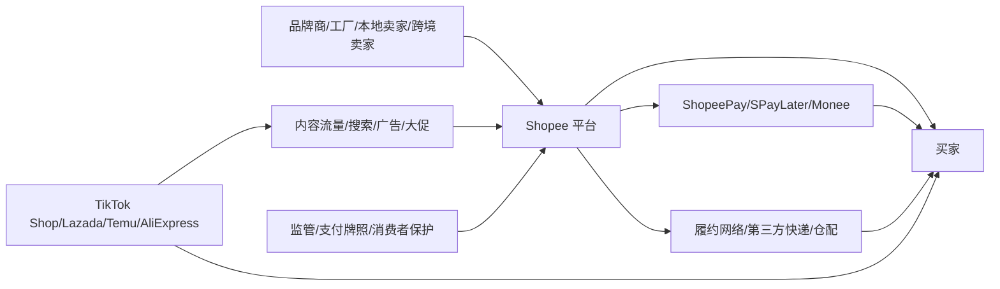

## 0. 研报前置区

### 0.1 报告摘要

本报告分析东南亚电商行业与 Shopee/Sea Limited 的公司位置。研究边界以东南亚六个核心电商市场为主, 即印度尼西亚, 马来西亚, 菲律宾, 新加坡, 泰国, 越南, 同时把台湾, 巴西和拉美扩张作为 Shopee 公司层面的补充变量, 不把它们纳入东南亚行业规模口径。

核心判断是: 东南亚电商已经从早期获客扩张进入“增长后段 + 盈利验证 + 内容电商冲击”的阶段。行业仍有渗透率提升空间, 但平台竞争不再只比流量和补贴, 而是比履约密度, 广告变现, 商家工具, 金融风控, 低价供给和 AI 运营效率。

Shopee 的位置仍然强。它是 Sea 最大业务, 在东南亚拥有规模, 本地化运营, 支付和物流协同, 以及卖家生态优势。但它的风险也很清楚: TikTok Shop/抖音系内容电商, Lazada/Alibaba, Tokopedia/TikTok Indonesia, Temu/AliExpress 类跨境低价供给, 以及各国监管对平台责任, 物流选择和数据安全的约束。

### 0.2 关键结论

| 结论 | 原因 | 证据指向 |
|---|---|---|
| 东南亚电商处于成长后段, 不是成熟停滞 | 中产扩张, 移动互联网, 数字支付和跨境供给仍在驱动线上化 | Google/Temasek/Bain e-Conomy SEA 报告入口, Sea 财报新闻 |
| Shopee 的核心优势来自规模 + 本地履约 + 商家生态 + 金融协同 | 电商 GMV, 订单, 广告和支付金融形成闭环 | Sea 投资者关系页面, Investors.com/Investopedia 财报报道 |
| 竞争焦点从“谁有流量”转向“谁能在低价和盈利之间平衡” | TikTok Shop 带来内容流量, Temu/AliExpress 带来低价跨境供给, 平台补贴压力上升 | IBD 关于竞争和利润率压力的报道 |
| Shopee 的长期价值不只看 GMV, 更应看 take rate, 广告收入, 履约成本, 信贷损失和经营现金流 | 电商平台进入盈利验证阶段后, 增长质量比单纯规模更关键 | Sea Q1 2026 与 2024/2025 财报新闻补充信号 |
| 最大不确定性在监管和金融风险 | 印尼等国家可能限制平台自营物流优先级, 金融业务扩张会带来信用周期风险 | 印尼反垄断调查新闻, SeaMoney/Monee 相关报道 |

### 0.3 核心指标总览

| 指标 | 行业读数 | 目标公司/产品读数 | 判断 | 证据/来源 |
|---|---|---|---|---|
| 市场规模 | e-Conomy SEA 持续跟踪东南亚数字经济和电商板块, 2025 报告已发布 | Shopee 是 Sea 最大业务, 2026 Q1 财报新闻称电商收入约 51 亿美元 | 行业仍大, 但增长质量更重要 | https://economysea.withgoogle.com/, https://www.investors.com/news/technology/sea-stock-q1-2026-results-se-rally/ |
| 增速/渗透率 | 线上化仍受移动互联网, 支付, 物流改善驱动 | 2026 Q1 财报新闻称 Shopee 收入同比增长约 45% | Shopee 增速仍强, 但需验证官方原始财报 | Investors.com Q1 2026 报道 |
| 竞争强度 | TikTok Shop, Lazada, Tokopedia, Temu/AliExpress, 本地垂直平台竞争 | Shopee 需要投入平台能力和营销以保份额 | 高竞争, 但龙头仍有规模优势 | IBD, Investopedia, Wikipedia 仅作补充 |
| 盈利水平 | 行业从亏损换规模转向补贴纪律和广告变现 | 2024 Q4 报道称电商 adjusted EBITDA 转正, 2026 Q1 新闻称单位经济开始改善 | 盈利改善可持续性是关键 | Investors.com Q4 2024/Q1 2026 |
| 景气度 | 消费韧性, 汇率, 跨境贸易和短视频流量决定短期景气 | Sea 电商收入增长强, 但股价和利润率受竞争预期扰动 | 经营景气偏强, 资本市场预期波动较大 | IBD 多篇财报报道 |
| 关键风险 | 监管, 物流合规, 平台补贴, 信贷风险, 假货和诈骗 | 印尼反垄断, Shopee 安全评级和诈骗事件均提示平台责任上升 | 风险不致命, 但会抬高合规和履约成本 | IBD 印尼调查报道, Wikipedia 汇总需核验 |

### 0.4 图表清单或图表占位

| 图表 | 类型 | 用途 |
|---|---|---|
| 图表 1: 东南亚电商产业地图和 Shopee 位置 | Mermaid | 展示平台在供给, 流量, 支付, 履约之间的位置 |
| 图表 2: Shopee 与主要竞争者对比 | 表格 | 比较 Shopee, Lazada, TikTok Shop/Tokopedia, Temu/AliExpress |
| 图表 3: 七模块判断矩阵 | 表格 | 展示行业和 Shopee 的可行性, 规模性, 防守性等 |
| 图表 4: 来源矩阵和证据质量 | 表格 | 区分一手, 近一手, 二手和待核验事实 |
| 图表 5: 后续验证清单 | 表格 | 给运营和投资研究继续跟踪的指标 |

## 1. 直接结论

东南亚电商仍是一个值得长期研究和经营投入的市场, 但已经不是“只要开店就吃增长红利”的早期阶段。行业的主要矛盾从获客不足转向利润池分配: 平台要在买家低价, 卖家 ROI, 物流成本, 广告变现和金融风险之间取得平衡。

Shopee 是这一市场里最重要的综合电商平台之一。它的优势不是单点产品功能, 而是多边网络: 买家端有高频消费和大促心智, 卖家端有中小商家和跨境供给, 平台端有广告和佣金, 生态端有 ShopeePay/SPayLater/SeaMoney-Monee 和物流伙伴。这个结构使 Shopee 能把流量, 交易, 支付, 信贷和履约数据串起来。

但 Shopee 的竞争压力也比过去更复杂。TikTok Shop 改变了流量入口和内容转化方式, Lazada 背后有 Alibaba 的供应链和商家工具, Tokopedia 与 TikTok 在印尼形成强组合, Temu/AliExpress 提供低价跨境冲击。Shopee 如果只靠补贴保份额, 利润率会承压; 如果过快提高佣金和广告负担, 卖家可能转向多平台经营。

## 2. 研究边界

| 项目 | 内容 |
|---|---|
| 地区 | 东南亚核心六国: 印尼, 马来西亚, 菲律宾, 新加坡, 泰国, 越南 |
| 时间范围 | 主要看 2023-2026 年公开信息, 展望 2026-2030 年 |
| 行业口径 | 综合电商平台, 社交/内容电商, 跨境电商, 平台支付和履约协同 |
| 公司/产品范围 | Shopee, 并把母公司 Sea 的 Garena 和 Monee 作为协同或财务背景 |
| 包括 | 平台竞争, 商业模式, 盈利性, 监管风险, 生命周期, 后续指标 |
| 不包括 | 具体股票买卖建议, 单个店铺选品策略, 非东南亚市场规模测算 |
| 关键假设 | Shopee 仍以东南亚为核心利润池, 拉美和台湾为增长补充; 未取得所有官方原始财报 PDF 时, 财务细项需二次核验 |

### 2.1 研究计划摘要

| 项目      | 内容                                                                                             |
| ------- | ---------------------------------------------------------------------------------------------- |
| 母问题     | 东南亚电商行业现在处于什么阶段, Shopee 在其中的竞争力和风险是什么                                                          |
| 子问题     | 行业还有没有增长空间; 竞争格局如何变化; Shopee 的盈利改善是否可持续; 哪些监管和经营指标最关键                                          |
| 选择的分析层级 | 宏观 + 中观 + 微观. 未加入资本市场章节, 因用户未要求股价或估值买卖判断                                                       |
| 必须验证的事项 | 东南亚电商 GMV 和增速; Shopee GMV/订单/收入/EBITDA; TikTok Shop/Tokopedia 份额; 平台 take rate 和广告变现; 金融业务信贷质量 |

### 2.2 来源矩阵和证据质量

| 来源类型 | 本报告用途 | 证据等级 | 一手来源状态 | 缺口处理 |
|---|---|---|---|---|
| 官方统计/监管/行业协会 | 宏观人口, GDP, 监管, 平台合规 | 中高 | 部分取得公开入口 | 需要进一步查 ASEAN, 各国统计局, 印尼 KPPU 原文 |
| 公司公告/财报/IR/交易所文件 | Sea/Shopee 收入, GMV, EBITDA, 战略 | 高 | 已取得 Sea IR 入口, 未完整解析所有 PDF | 财务数字优先以 Sea 年报, 季报, SEC 20-F 核验 |
| 可信数据库/国际组织/行业报告 | 行业规模, 数字经济趋势 | 中高 | 已取得 e-Conomy SEA 2025 报告入口 | 报告正文下载和表格数据需二次抽取 |
| 财经媒体/新闻 | 最新季度结果, 竞争压力, 股价反应 | 中 | 二手来源 | 只作为补充信号, 关键数字需回查 Sea 新闻稿 |
| Wikipedia/百科汇总 | 历史沿革和竞争者背景 | 低到中 | 二手来源 | 不作为核心证明, 仅辅助脉络 |

### 2.3 二次检索缺口

第一, 需要下载并解析 Sea Limited 2025 年报, 2026 Q1 官方财报新闻稿和 earnings presentation, 核验 Shopee 的 GMV, orders, revenue, adjusted EBITDA, take rate 和地区口径。当前报告使用 Sea IR 入口和财经媒体转述作为补充, 不能替代最终一手数字。

第二, 需要从 e-Conomy SEA 2025 完整 PDF 或 Google/Temasek/Bain 数据表中抽取电商 GMV, 增速, 国家拆分和 2030 预测。当前只确认 2025 报告入口和主题, 未完整抽取 PDF 图表。

第三, 需要验证 TikTok Shop/Tokopedia, Lazada, Shopee 和 Temu/AliExpress 的最新 GMV/份额。平台通常不完整披露 GMV, 所以 Momentum Works, Similarweb, Sensor Tower, data.ai 等商业数据库会更接近近一手, 但仍需说明口径。

## 3. 宏观环境分析

东南亚电商的宏观底层是“人口规模大 + 移动互联网普及 + 消费层级分化 + 支付和物流基础设施改善”。与中国和美国相比, 东南亚不是单一市场, 而是多个语言, 宗教, 岛屿物流, 支付习惯和监管体系并存的区域。因此平台需要高度本地化, 这既提高了进入门槛, 也增加了运营复杂度。

消费周期方面, 东南亚年轻人口和城市化仍支持线上消费, 但通胀, 汇率波动, 关税和外部需求会影响客单价和跨境供给成本。平台如果面对低收入或价格敏感人群, 补贴和低价供给对 GMV 很有效, 但会压缩利润。

技术周期方面, AI 对电商的影响不只是客服机器人, 更包括搜索排序, 广告投放, 商家工具, 翻译, 风控, 内容生成, 假货识别和履约预测。Shopee 若能把多语言和多市场数据沉淀为模型能力, 会强化运营效率; 但 AI 投入也可能带来组织调整和短期费用压力。

| 宏观变量 | 当前判断 | 证据/来源 | 对行业和目标的影响 |
|---|---|---|---|
| 政策/监管 | 平台责任和反垄断趋严 | 印尼对 Shopee 物流选择的调查报道 | Shopee 需要降低自营/关联服务优先级争议 |
| 经济/消费周期 | 消费仍增长, 但价格敏感 | e-Conomy SEA 继续跟踪数字经济, 财经媒体提示宏观压力 | 低价和补贴仍重要, 但不能破坏利润纪律 |
| 技术周期 | AI 和内容电商重塑流量和运营 | Sea 与 AI 相关组织调整新闻, Shopee 自有模型论文为补充信号 | 提升搜索, 广告, 商家工具和风控效率 |
| 资金面/风险偏好 | 高增长平台估值更看利润质量 | IBD 对 Sea 股价波动和竞争担忧报道 | 即使收入增长, 利润率和现金流仍会影响市场预期 |

## 4. 中观行业分析

### 4.0 多业务线中观拆分

Shopee 所在的中观层不能只看“电商平台”一个行业。Sea 的相关业务线包括综合电商, 数字金融, 游戏现金流, 以及平台物流和广告工具。对 Shopee 最关键的是电商和数字金融的联动, Garena 的意义更多是集团现金流和用户生态背景。

| 业务线/行业线 | 行业阶段 | 竞争格局 | 关键指标/景气信号 | 对目标公司的含义 |
|---|---|---|---|---|
| 综合电商平台 | 成长后段 | Shopee, Lazada, TikTok Shop/Tokopedia, 本地平台 | GMV, 订单, take rate, 履约成本 | Shopee 主战场, 需要守份额和利润 |
| 内容/社交电商 | 快速成长期 | TikTok Shop 强势, 平台纷纷加强直播和短视频 | 转化率, 内容供给, 创作者佣金 | 改变流量入口, 压迫 Shopee 内容能力 |
| 跨境低价电商 | 成长期 | Temu, AliExpress, Shein 类供给 | 客单价, 物流时效, 关税政策 | 迫使 Shopee 保持价格竞争力 |
| 数字金融 | 成长期但强监管 | ShopeePay, SPayLater, SeaBank/MariBank 等 | 贷款余额, NPL, 支付渗透 | 提升转化和利润, 但增加信用风险 |

### 4.1 行业一句话定义

本报告采用的东南亚电商口径是: 在东南亚核心六国, 通过移动端和互联网平台完成商品发现, 交易, 支付, 履约和售后的一组平台型零售基础设施, 包括传统 marketplace, 品牌商城, 内容电商和跨境低价供给。

### 4.2 行业关键指标

| 指标 | 当前判断 | 证据/来源 | 对目标公司/产品的含义 |
|---|---|---|---|
| 市场规模 | 仍在扩大, 但增速从超高速回落到高质量增长 | e-Conomy SEA 历年报告入口和 2025 报告 | Shopee 不能只追 GMV, 需要提高变现质量 |
| 增速/渗透率 | 线上渗透仍有空间 | 东南亚移动互联网和数字经济报告 | 低线城市, 岛屿地区, 跨境供给仍是增长点 |
| 供需关系 | 卖家多平台经营, 买家价格敏感 | Shopee/Lazada/TikTok Shop 竞争事实 | 平台需要提高卖家 ROI, 降低流失 |
| 价格/成本 | 低价供给和履约成本是核心矛盾 | Temu/AliExpress/TikTok Shop 竞争信号 | Shopee 需要用广告和金融补利润 |
| 政策/监管 | 反垄断, 数据, 消费者保护趋严 | 印尼调查, 新加坡反诈骗评级 | 合规成本会提高 |
| 区域/出口 | 中国和本地卖家共同供给 | 跨境平台扩张和 Shopee 国际平台资料需核验 | 跨境供给能扩品类, 但受关税和物流影响 |

### 4.3 行业地图和目标位置

| 模块 | 内容 | 对目标公司/产品的含义 |
|---|---|---|
| 纵向产业链 | 上游为品牌, 工厂和中小卖家; 中游为平台, 支付, 广告和履约; 下游为消费者 | Shopee 控制交易入口, 但必须平衡卖家和买家利益 |
| 横向竞争结构 | 综合电商, 内容电商, 跨境低价平台, 本地垂直平台并存 | 单一大促和补贴的护城河下降 |
| 生产要素 | 流量, 数据, 商家供给, 履约网络, 支付牌照, AI 技术 | Shopee 的规模数据可沉淀为广告和风控优势 |
| 生产关系 | 平台与卖家, 快递商, 支付金融机构, 监管之间的关系 | 自营或关联服务过强会引发监管和商家反感 |
| 关键流向 | 交易佣金, 广告费, 支付费, 信贷收入, 物流成本, 补贴 | 盈利改善取决于广告和金融能否覆盖履约与营销 |
| 目标位置 | Shopee 是平台枢纽, 连接商品, 流量, 支付和履约 | 枢纽价值强, 但也是监管和竞争压力集中点 |

### 4.4 生命周期判断

东南亚电商处于成长后段到早期成熟之间。证据是: 第一, Shopee, Lazada, TikTok Shop 已经形成稳定头部格局, 市场不再是空白获客; 第二, 平台开始强调 EBITDA, 现金流, 广告和佣金, 说明资本约束下的盈利验证成为主线; 第三, 内容电商和跨境低价平台仍能带来结构性增长, 表明行业尚未成熟到低个位数增长。

反证是: 东南亚多国的电商渗透率, 履约基础设施和数字支付成熟度仍低于中国和美国, 农村及岛屿地区仍有新增用户和频次提升空间。因此本报告不把行业判断为成熟期, 而是“增长仍在, 但竞争和盈利约束明显上升”的阶段。对 Shopee 来说, 这个阶段最重要的是从 GMV 龙头转为利润质量龙头。

## 5. 七个核心模块加权分析

| 模块 | 初步判断 | 证据等级 |
|---|---|---|
| 可行性 | 需求真实且高频, 但平台模式需证明利润纪律 | 中高 |
| 规模性 | 市场空间仍大, 增速从粗放转向结构性 | 中高 |
| 防守性 | Shopee 有规模壁垒, 但内容流量削弱传统护城河 | 中 |
| 盈利性 | 已改善, 但受补贴, 履约和竞争影响 | 中 |
| 估值 | 适合以利润质量和现金流而非单纯 GMV 评估 | 中 |
| 外部因素 | 监管, 汇率, 消费和 AI 是关键变量 | 中 |
| 景气度 | 经营景气偏强, 但竞争景气偏热 | 中 |

### 5.1 可行性

**结论:** 东南亚电商的需求真实性已经被验证, Shopee 的平台模式可行, 但下一阶段的可行性不再是“用户愿不愿意买”, 而是“平台能否在补贴减少后仍保持购买频次, 卖家活跃和履约体验”。

**依据:** e-Conomy SEA 连续多年跟踪东南亚数字经济并在 2025 年继续发布报告, 说明该赛道已成为区域数字经济核心板块。Sea 2026 Q1 财报新闻称 Shopee 电商收入仍有高增长, 这是需求和变现仍在增长的补充信号。证据缺口是需要回查 Sea 官方 Q1 2026 新闻稿和年报中的 GMV, orders 和活跃买家数据。

**机制:** 电商平台的可行性来自双边网络: 买家越多, 卖家越愿意供货; 卖家越多, 买家的选择和价格越好。Shopee 又叠加支付, 分期和履约, 使交易闭环更完整。但当 TikTok Shop 把“发现商品”前移到内容流, Shopee 必须提升站内内容和推荐效率, 否则搜索型流量会被分流。

**对目标公司/产品的影响:** Shopee 的可行性仍强, 但经营重点应从单纯拉新转向提高老用户频次, 商家 ROI, 广告转化率和售后体验。若用户留存和卖家活跃稳定, Shopee 的平台价值可持续; 若订单依赖补贴, 可行性会被利润压力削弱。

**关键指标和后续验证:** 跟踪季度订单数, GMV, 活跃买家, 复购频次, 卖家数量, 广告转化率, 退货率和净推荐值。下一步验证来源为 Sea 年报, 季报 presentation 和 Shopee 卖家中心公开政策。

### 5.2 规模性

**结论:** 东南亚电商规模仍有增长空间, 但增长将更分化: 印尼和越南等大市场仍有体量红利, 新加坡和马来西亚更偏高客单和品牌化, 菲律宾和泰国的增长更依赖物流, 支付和社交内容转化。

**依据:** Google/Temasek/Bain 的 e-Conomy SEA 页面显示 2025 报告已经发布, 且主题为从数字十年走向 AI 现实, 说明东南亚数字经济仍被作为长期增长区域跟踪。财经媒体转述 Sea 的电商收入在 2024-2026 年多次保持较高同比增长, 说明龙头平台仍未进入低增长期。缺口是具体国家 GMV 和电商渗透率需要从完整报告或数据库提取。

**机制:** 规模增长来自三条线: 新用户线上化, 老用户购买频次提升, 以及线下品类如美妆, 家居, 快消, 食品和本地服务逐步线上化。平台越能降低信任成本和履约成本, 越能扩展到低线城市和非标品类。内容电商扩大了发现式购买, 也可能扩大行业总盘子。

**对目标公司/产品的影响:** Shopee 仍有规模红利, 但新增规模的边际利润可能低于早期。如果增长来自高补贴低客单订单, GMV 含金量有限; 如果增长来自广告, 品牌商城, 金融和高频复购, 则更能转化为利润。

**关键指标和后续验证:** 跟踪国家拆分 GMV, 品类 mix, AOV, 订单频次, 城市层级渗透率, 品牌商城占比。推荐来源为 e-Conomy SEA 完整报告, Momentum Works 行业报告, Similarweb 和 Sea 财报。

### 5.3 防守性

**结论:** Shopee 有较强防守性, 但不是不可攻破。它的防守性来自规模, 商家供给, 履约经验, 支付金融和本地运营; 弱点在于流量入口可能被 TikTok Shop 夺走, 低价心智可能被 Temu/AliExpress 稀释。

**依据:** Shopee 长期被财经媒体和百科资料描述为东南亚最大电商平台之一, Sea 财报新闻显示电商是集团最大收入来源。另一方面, 2023-2026 年围绕 TikTok Shop, Lazada, MercadoLibre, Temu/AliExpress 的竞争报道频繁出现, 说明平台壁垒面临多方向攻击。证据缺口是最新份额需要商业数据库核验。

**机制:** 传统 marketplace 的护城河是交易网络和履约服务, 但内容电商把用户停留时间和购买意图绑定到短视频平台, 使 Shopee 的“搜索和大促”入口不再唯一。跨境低价平台则通过供应链和补贴压低价格锚, 迫使 Shopee 在价格和利润间做取舍。

**对目标公司/产品的影响:** Shopee 要增强防守性, 需要提高站内内容化, 强化 Shopee Mall 和品牌可信度, 提升卖家工具, 广告 ROI 和物流体验。单纯依靠规模和大促心智不足以抵御内容电商和低价跨境平台。

**关键指标和后续验证:** 跟踪 Shopee app MAU, DAU, 用户时长, 搜索转化率, 直播 GMV, 卖家留存, 多平台卖家占比和市场份额。推荐来源为 data.ai, Sensor Tower, Similarweb, Momentum Works 和平台卖家调研。

### 5.4 盈利性

**结论:** Shopee 的盈利性已经从“亏损换增长”阶段改善到“利润可证明但需持续验证”的阶段。核心不是某个季度 EBITDA 是否转正, 而是平台能否在竞争升温时保持 take rate, 广告收入和履约效率。

**依据:** Investors.com 对 Sea 2024 Q4 的报道称电商 adjusted EBITDA 从上一年亏损转为正值, 并提到 2025 年 Shopee GMV 增长指引约 20%。2026 Q1 报道称 Shopee 收入同比增长约 45%, 且管理层强调投资和单位经济改善。二手证据限制是这些数字需回到 Sea 官方新闻稿核验。

**机制:** 电商平台利润主要来自佣金, 广告, 支付金融, 物流服务和增值工具, 成本主要是营销补贴, 履约补贴, 客服售后, 技术和合规。规模越大, 固定成本摊薄越好; 但竞争越激烈, 获客和补贴越高。内容电商和低价跨境平台会迫使 Shopee 保持价格竞争, 从而压缩短期利润率。

**对目标公司/产品的影响:** Shopee 的利润改善若来自广告和金融变现, 可持续性较强; 若主要来自减少补贴和费用收缩, 可能在竞争加剧时回吐。对经营者来说, 应重点看卖家广告 ROI 和平台佣金压力; 对研究者来说, 应重点看 e-commerce adjusted EBITDA margin 和自由现金流。

**关键指标和后续验证:** 跟踪 e-commerce revenue/GMV, take rate, advertising revenue, fulfillment cost per order, sales and marketing expense, adjusted EBITDA, operating cash flow, SPayLater 信贷损失率。来源为 Sea 年报, 季报 presentation, earnings call transcript。

### 5.5 估值

**结论:** 对 Shopee 或 Sea 的估值逻辑应从 GMV 倍数转向“收入增长 + 利润率 + 金融风险 + 竞争强度”的综合框架。单纯用 GMV 或收入增速容易高估竞争补贴带来的低质量增长。

**依据:** Sea 股价在 2024-2026 年因电商增长, 盈利改善和竞争担忧多次大幅波动, IBD 报道提到 2025 年股价上涨后又因竞争和利润率担忧回撤。2026 Q1 财报后股价反弹, 但报道也指出仍低于此前高点, 说明市场对增长和利润可持续性存在分歧。

**机制:** 当平台处于早期增长期, 市场更愿意用 GMV, 订单和用户规模定价; 当行业进入成长后段, 估值锚会切换到 EBITDA margin, FCF, take rate 和竞争风险。若 Shopee 能证明高增长同时利润率改善, 估值可获得溢价; 若增长依赖补贴, 则会被按低质量 GMV 折价。

**对目标公司/产品的影响:** Shopee 的估值修复取决于两件事: 一是电商主业利润率能否穿越竞争周期; 二是金融业务能否在扩张中保持可控不良率。Sea 作为多业务公司, Garena 和 Monee 会影响集团估值, 但 Shopee 仍是核心变量。

**关键指标和后续验证:** 跟踪 EV/Sales, EV/EBITDA, e-commerce EBITDA margin, FCF conversion, GMV growth, ad take rate, fintech NPL。来源为交易所/行情数据库, Sea 财报, FactSet/Refinitiv/Wind 等近一手数据库。

### 5.6 外部因素

**结论:** 外部因素对 Shopee 的影响偏高, 尤其是监管, 汇率, 关税, 消费信心, AI 资本开支和平台责任。Shopee 在多个国家经营, 任何单一国家政策变化都可能影响佣金, 物流, 支付和跨境商品。

**依据:** 印尼反垄断机构曾调查 Shopee 是否偏向自身配送服务, 这是平台和关联服务边界的典型监管风险。Google e-Conomy SEA 2025 报告主题把 AI 作为区域数字经济下一阶段重要变量, 说明技术周期正在进入行业核心议程。Shopee 安全和诈骗相关报道也提示消费者保护责任上升。

**机制:** 外部监管会改变平台的可选策略。例如, 如果监管限制平台优先推荐自有物流, Shopee 的履约控制力可能下降; 如果跨境低价商品面临关税或合规检查, Temu/AliExpress 的低价冲击可能减弱, Shopee 本地卖家反而受益。AI 则可能同时降低客服和风控成本, 也带来组织重构成本。

**对目标公司/产品的影响:** Shopee 需要把合规设计前置到产品和运营流程中, 包括配送选择透明度, 卖家收费透明, 商品审核, 反诈骗, 数据保护和金融风控。外部因素不会直接否定 Shopee 的长期位置, 但会决定利润率天花板和扩张节奏。

**关键指标和后续验证:** 跟踪印尼 KPPU, 新加坡监管, 各国跨境电商税制, 平台消费者保护评级, AI 投入/裁员/效率指标。来源为监管公告, 公司公告, 政府网站和行业协会。

### 5.7 景气度

**结论:** 当前 Shopee 经营景气偏强, 但行业竞争景气也偏热。收入增长和订单增长说明需求仍在, 但竞争投入和利润率波动说明平台仍处于争夺份额和效率的阶段。

**依据:** 2026 Q1 财报新闻显示 Sea 总收入和 Shopee 收入均有较高增长; 2024 Q4 报道显示电商 adjusted EBITDA 改善。另一方面, 多篇报道提到 Shopee 面临 TikTok Shop, Lazada, MercadoLibre, Temu/AliExpress 等竞争, 并且投资者关注电商利润率。

**机制:** 景气度需要拆成量, 价, 成本, 利润和现金流。量端由订单和 GMV 驱动; 价端由 AOV 和广告价格驱动; 成本端由履约, 补贴和获客费用驱动; 利润端由 take rate 和费用率决定。行业高景气不必然等于公司高利润, 因为竞争者会把部分增长转化为补贴战。

**对目标公司/产品的影响:** Shopee 应在增长和利润之间保持动态平衡。若 2026 年后收入继续高增且 EBITDA margin 稳定改善, 说明景气度有效转化为利润; 若收入高增但销售费用和履约补贴同步上升, 则景气主要被竞争消耗。

**关键指标和后续验证:** 跟踪 GMV, orders, AOV, take rate, seller ads spend, fulfillment cost, adjusted EBITDA margin, cash flow, 竞争者补贴强度和 app 排名。来源为 Sea 官方披露, app 数据供应商, 商家调研和行业报告。

## 6. 微观公司/产品分析

| 维度      | 分析                                            | 证据/依据                                  |
| ------- | --------------------------------------------- | -------------------------------------- |
| 商业模式    | Shopee 是 marketplace + 广告 + 支付金融 + 履约协同的平台模式  | Sea IR, 财报新闻, Shopee 公开资料              |
| 产品/服务   | C2C/B2C 混合, Shopee Mall, 大促, 搜索推荐, 直播内容, 支付分期 | Shopee 公开资料和行业观察                       |
| 客户和渠道   | 买家端价格敏感, 移动优先; 卖家端包括本地中小商家, 品牌和跨境卖家           | 东南亚电商行业结构                              |
| 财务/运营指标 | 电商是 Sea 最大收入来源, 近年强调收入增长和 adjusted EBITDA 改善  | Investors.com/Investopedia 财报报道, 需官方核验 |
| 护城河     | 规模, 本地化, 商家生态, 支付金融, 履约经验, 数据                 | 推断基于平台网络效应和多业务协同                       |

Shopee 的微观优势首先是执行能力。东南亚是碎片化市场, 语言, 宗教节日, 支付方式, 岛屿物流和监管差异都很大。Shopee 能在多个国家保持领先, 说明其本地运营能力和组织复制能力较强。

第二是生态协同。Shopee 不只是交易平台, 还通过 ShopeePay, SPayLater 和 Sea 的数字金融体系改善支付成功率, 用户转化和商家资金周转。金融业务若风控有效, 会提高平台利润池; 若信用周期恶化, 则会放大风险。

第三是数据和 AI 潜力。Shopee 拥有商品, 搜索, 交易, 履约, 售后和支付金融数据, 这些数据可用于推荐, 广告, 风控和商家工具。AI 能力如果转化为更高转化率和更低客服/审核成本, 会成为下一阶段效率壁垒。

## 7. SWOT

| Strengths | Weaknesses |
|---|---|
| 东南亚头部规模和品牌心智; 多国本地化运营; 支付和金融协同; 大促和卖家生态成熟 | 对补贴和营销仍敏感; 内容电商能力需要继续补强; 物流和金融业务带来监管风险; 多市场管理复杂 |

| Opportunities | Threats |
|---|---|
| AI 提升搜索, 广告和风控; 品牌商城和广告变现; 低线城市和跨境供给; 数字金融扩展 | TikTok Shop 内容流量冲击; Temu/AliExpress 低价冲击; 各国监管趋严; 卖家多平台化削弱粘性 |

## 9. 竞争对手对比

| 对象 | 定位 | 优势 | 劣势 | 关键指标 |
|---|---|---|---|---|
| Shopee | 综合电商平台 | 规模, 本地化, 支付金融, 大促心智 | 竞争投入和合规压力 | GMV, orders, take rate, EBITDA |
| Lazada | Alibaba 系综合电商 | 品牌和供应链能力, Alibaba 技术 | 增长心智弱于 Shopee/TikTok | 品牌商家, app 流量, GMV |
| TikTok Shop/Tokopedia | 内容电商 + 印尼本地平台 | 内容流量, 发现式购买, 创作者生态 | 监管风险, 履约和货架能力需补 | 直播 GMV, 转化率, 创作者佣金 |
| Temu/AliExpress | 跨境低价平台 | 供应链低价, 全球履约经验 | 本地化和监管不确定 | 客单价, 物流时效, 复购 |
| 本地垂直平台 | 品类或国家聚焦 | 专业品类和本地关系 | 规模和资金有限 | 品类份额, 单客价值 |

## 10. 事实, 观点和推断分层

| 类型 | 内容 | 来源/依据 | 证据层级 | 一手来源状态 | 置信度 |
|---|---|---|---|---|---|
| 事实 | Google/Temasek/Bain 的 e-Conomy SEA 2025 报告入口已发布 | Google e-Conomy SEA 页面 | 近一手 | 已取得入口, 未完整抽取 PDF | 高 |
| 事实 | Sea 官网有投资者关系和季度结果页面 | Sea IR 页面 | 一手 | 已取得入口 | 高 |
| 待核验事实 | 2026 Q1 Sea 收入约 71 亿美元, Shopee 收入约 51 亿美元, Shopee 同比增长约 45% | Investors.com 财报报道 | 二手 | 需回查 Sea Q1 2026 新闻稿 | 中 |
| 待核验事实 | 2024 Q4 电商 adjusted EBITDA 转正并改善 | Investors.com Q4 2024 报道 | 二手 | 需回查 Sea FY2024 官方财报 | 中 |
| 观点 | 市场担心 Shopee 在东南亚和拉美面临竞争导致利润率压力 | IBD/Investors.com 分析师转述 | 二手观点 | 不适用 | 中 |
| 推断 | Shopee 的长期竞争力取决于广告变现, 履约效率和金融风控, 而非单纯 GMV | 基于平台生命周期和财报信号 | 推断 | 受官方细项缺口影响 | 中高 |
| 推断 | 内容电商会削弱传统搜索型 marketplace 的流量护城河 | 基于 TikTok Shop 增长和行业机制 | 推断 | 需份额和用户时长数据验证 | 中 |

## 12. 多视角压力测试

本报告未调用外部多 Agent 工具, 采用单 Agent 模拟多视角压力测试。

| 视角 | 质疑 | 为什么重要 | 需要验证 |
|---|---|---|---|
| 行业专家 | 东南亚各国差异过大, 是否能把它们合并为一个行业判断 | 若国家差异被低估, 结论会过度平均 | 国家拆分 GMV, 渗透率, AOV, 物流成本 |
| 投资研究员 | Shopee 的盈利改善是否只是短期减少补贴, 而非结构性利润池提升 | 影响对公司质量和估值的判断 | take rate, 广告收入, EBITDA margin, FCF |
| 政策/监管研究者 | 平台关联物流和金融业务是否会引发更强监管 | 可能限制协同和利润率 | 印尼 KPPU, 各国金融监管和消费者保护规则 |
| 经营者/创业者 | 卖家是否真的能在 Shopee 获得可持续 ROI | 若卖家 ROI 下降, 平台供给质量会恶化 | 卖家广告 ROI, 佣金费率, 退货率, 多平台经营比例 |
| 反方审稿人 | Shopee 领先是否只是历史规模优势, 在内容电商时代可能被重构 | 这是最大结构性风险 | TikTok Shop 份额, 用户时长, 直播 GMV, 复购率 |

## 13. 风险和机会

行业结构风险主要是竞争者从不同方向压缩利润池。TikTok Shop 抢流量入口, Temu/AliExpress 抢低价心智, Lazada 抢品牌和供应链, 本地平台抢垂直品类。Shopee 需要投入内容, 补贴和商家工具, 这会压制利润率。

目标公司自身风险主要是金融和履约协同的边界。支付和信贷能提高转化, 但贷款余额增长会带来信用成本; 履约服务能改善体验, 但关联物流优先级可能引发监管关注。Shopee 越像基础设施, 平台责任越重。

行业机会在于东南亚线上化仍未结束。低线城市, 跨境供给, 品牌商城, 本地服务, AI 商家工具和数字金融都有增量空间。对 Shopee 而言, 最大机会不是再造一个纯流量入口, 而是把交易数据转化为广告, 金融, 风控和履约效率。

## 14. 后续行动建议

1. 建立 Shopee 跟踪仪表盘: 每季度更新 GMV, orders, revenue, take rate, adjusted EBITDA, sales and marketing expense, fulfillment cost, SPayLater 贷款质量。
2. 做国家拆分: 印尼, 越南, 泰国, 菲律宾, 马来西亚, 新加坡分别判断竞争格局, 物流成本和政策风险, 避免用平均数决策。
3. 做卖家侧调研: 抽样比较 Shopee, Lazada, TikTok Shop 的佣金, 广告 ROI, 回款周期, 退货率和售后成本。
4. 跟踪内容电商: 每月监测 TikTok Shop 的 app 排名, 直播 GMV 信号, 创作者激励和平台政策。
5. 验证 AI 效率: 关注 Shopee 是否披露搜索转化, 客服自动化, 风控准确率, 广告投放效率和组织效率改善。

## 15. 方法论和数据来源说明

本报告采用宏观, 中观, 微观三层框架。宏观看人口, 消费, 技术和监管; 中观看行业生命周期, 竞争结构, 价值链和利润池; 微观看 Shopee 的商业模式, 护城河, 财务运营指标和战略风险。

数据来源优先级为: 公司 IR/财报/SEC 文件, Google/Temasek/Bain 等近一手行业报告, 监管和官方统计, 财经媒体和百科资料。由于当前环境未完整解析所有官方 PDF, 部分最新季度数字标记为待核验事实。

| 来源类型 | 用途 | 证据等级 | 备注 |
|---|---|---|---|
| Sea 投资者关系页面 | 公司披露入口 | 高 | https://www.sea.com/investor/quarterlyresults |
| Google e-Conomy SEA | 行业报告入口 | 中高 | https://economysea.withgoogle.com/ |
| Investors.com/Investopedia | 最新季度财报和市场反应 | 中 | 二手, 需回查原始新闻稿 |
| Wikipedia | 历史和竞争者背景 | 低到中 | 不作核心证明 |
| Arxiv Shopee/SEA AI 论文 | AI 能力补充信号 | 中低 | 需确认作者和产业真实性, 不作公司官方披露 |

## 16. 附录: 后续验证清单

| 待验证问题 | 为什么重要 | 推荐来源 | 优先级 |
|---|---|---|---|
| Shopee 最新 GMV, orders, revenue, adjusted EBITDA | 判断增长质量和盈利可持续性 | Sea Q1 2026 新闻稿, FY2025 年报, earnings presentation | 高 |
| 东南亚电商 2025 GMV 和 2030 预测 | 判断行业规模和生命周期 | e-Conomy SEA 2025 完整 PDF | 高 |
| Shopee/TikTok Shop/Lazada 最新份额 | 判断防守性和竞争压力 | Momentum Works, Similarweb, Sensor Tower, data.ai | 高 |
| Shopee take rate 和广告收入占比 | 判断利润池是否改善 | Sea 年报, earnings call | 高 |
| SPayLater/SeaMoney-Monee 信贷质量 | 判断金融协同风险 | Sea 财报, 数字银行披露, 监管文件 | 高 |
| 印尼和各国平台监管政策 | 判断合规成本和平台服务边界 | KPPU, 各国电商和金融监管机构 | 中高 |
| 卖家 ROI 和多平台经营比例 | 判断卖家生态稳定性 | 卖家访谈, 平台费率表, 第三方调研 | 中 |

## 17. 报告合规自检表

| 检查项 | 是否通过 | 说明 |
|---|---|---|
| 模板骨架完整 | 通过 | 保留公司/产品分析核心章节 |
| 研究简报转译已完成 | 通过 | 已按行业 + 公司分析路由处理 |
| 未误触发显式短答模式 | 通过 | 用户未要求短答 |
| Deep Research 可见痕迹完整 | 通过 | 包含研究计划, 来源矩阵, 缺口和验证清单 |
| 分析层级选择正确 | 通过 | 宏观 + 中观 + 微观, 未强行加入资本市场章节 |
| 多业务线中观拆分完成 | 通过 | 拆分综合电商, 内容电商, 跨境电商, 数字金融 |
| 七个核心模块全部出现 | 通过 | 5.1-5.7 均已出现 |
| 七模块结构完整 | 通过 | 每节包含结论, 依据, 机制, 影响, 指标验证 |
| 重点模块展开深度足够 | 通过 | 盈利性, 估值, 外部因素, 景气度重点展开 |
| 宏观/中观/微观章节深度足够 | 通过 | 已覆盖行业地图, 生命周期, 公司模式 |
| 报告深度 rubric 达标 | 通过 | 各主要章节有结论, 证据, 机制, 影响和验证 |
| 资本市场章节适用时已出现 | 不适用 | 用户未问股价, 估值买卖或投资建议 |
| 来源质量和证据等级清楚 | 通过 | 已区分一手, 近一手, 二手和待核验 |
| 一手来源检索状态和缺口清楚 | 通过 | 已说明官方 PDF 和财报细项需二次核验 |
| 事实/观点/推断已分层且证据层级清楚 | 通过 | 第 10 节已分层 |
| 后续验证清单具体 | 通过 | 第 16 节给出来源和优先级 |
| Markdown 标题格式正确 | 通过 | 使用 Markdown 标题和表格 |
