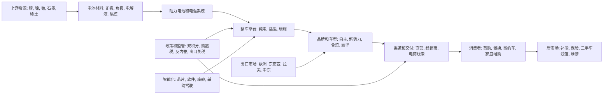

## 1. 直接回答

中国新能源汽车行业最近价格战激烈, 本质上不是单一企业主动挑事, 而是高速渗透期进入大众化阶段后, 供给扩张, 成本下行, 需求分层, 产能利用压力, 渠道库存压力和政策约束共同作用的结果。最直接的结论是: 行业仍在增长, 但增长红利已经从"有没有新能源车可买"转为"谁能用更低价格给出更高配置", 因此价格成为争夺订单, 产能利用率, 供应链议价权和用户心智的核心武器。

第一层原因是需求侧进入高渗透后的边际放缓。中汽协口径显示, 2023 年中国新能源汽车销量 949.5 万辆, 同比增长 37.9% [CAAM, 2023 年 12 月新能源车销量](https://en.caam.org.cn/Index/show/catid/66/id/2039.html). 公开统计和行业引用显示, 2024 年新能源汽车销量约 1286.6 万辆, 同比继续高增, 新车销量占比约 40.9%. 这说明行业绝对量仍然扩大, 但渗透率已经接近一半, 早期尝鲜用户和政策驱动用户占比下降, 新增购买更多来自价格敏感的大众用户, 置换用户和燃油车替代用户。价格弹性变高后, 企业如果不降价, 就容易在同级别车型中丢失订单。

第二层原因是供给侧扩张速度快于高质量需求释放。过去几年地方产业投资, 车企电动化转型, 新势力融资扩产和传统燃油产能再利用同时发生, 形成大量车型和产线。新能源汽车从稀缺供给变成过剩供给后, 产品同质化区间扩大, 特别是 10 万到 25 万元主流价格带, 纯电, 插混, 增程和智能座舱功能密集堆叠。企业为了摊薄固定成本, 维护供应链规模, 争取渠道曝光和月度销量排名, 会主动把毛利转化为价格和配置, 这使价格战从短期促销变成常态化竞争方式。

第三层原因是成本下行给降价提供了空间。IEA 在 Global EV Outlook 2025 中指出, 2024 年全球平均电池包价格较 2023 年下降超过 25%, 中国电动 SUV 加权平均价格下降接近 10%, 背后部分来自电池包价格下降约 30% [IEA, electric car affordability](https://www.iea.org/reports/global-ev-outlook-2025/trends-in-electric-car-affordability). 当电池, 电驱, 电子电气架构和平台化开发的单位成本下降时, 龙头企业可以通过降价扩大份额, 后排企业为了不被挤出也被迫跟进。成本下降本来可以修复利润, 但在竞争激烈时会被迅速让渡给消费者。

第四层原因是价格战带有"淘汰赛"属性。新能源汽车的商业模式高度依赖规模, 软件迭代, 售后网络, 补能生态和供应链信用。销量低的企业不仅单车成本更高, 还会面临供应商账期收紧, 渠道信心下降和残值压力。价格战因此不只是争夺当期销量, 也是争夺下一轮融资, 供应商资源, 智能化数据规模和品牌存活概率。卫冕者希望用价格挤压追赶者, 追赶者希望用价格换流量和订单, 合资品牌和燃油车阵营则用终端折扣保住基盘, 最终全行业卷入。

第五层原因是监管已经意识到"内卷式竞争"的副作用, 但短期很难完全按住价格战。2025 年以来, 监管部门和行业组织多次强调整治低价无序竞争, 保护供应链账期和产业生态, 英文媒体也报道中国监管层要求车企停止激进降价, 并讨论修订价格法以限制不公平定价 [The Guardian, 2025-08-05](https://www.theguardian.com/business/2025/aug/05/china-warns-ev-makers-stop-price-cutting-production-involution). 但只要产能, 库存, 市占率和现金流压力仍在, 车企仍有动力把"不明面降价"改成金融贴息, 置换补贴, 保险补贴, 选装赠送和渠道让利。

## 2. 结论摘要

| 观点 | 原因 | 事实依据 | 产业发展推演 |
|---|---|---|---|
| 价格战是高渗透阶段的结构性竞争, 不是短期促销 | 新能源车从成长早期进入大众化替代, 新增用户更看重价格和总拥有成本 | 2023 年 CAAM 新能源销量 949.5 万辆, 2024 年公开统计约 1286.6 万辆, 渗透率接近一半 | 价格战会从"直接降价"演化为配置战, 金融战和服务权益战 |
| 龙头主动降价有进攻性 | 龙头有电池, 规模, 平台和供应链议价优势, 可以用低价扩大份额 | IEA 指出 2024 年电池包价格明显下降, 中国 BEV SUV 均价下行 | 成本优势企业会继续压缩中小车企生存空间 |
| 后排企业降价更多是防守性 | 订单不足会放大固定成本, 影响供应商账期和渠道信心 | 行业报道显示价格战已影响盈利和供应链付款, 早期 2025 汽车行业利润率承压 | 低份额品牌可能退出, 合并, 转向细分市场或依赖地方和资本支持 |
| 插混和增程加剧同级替代 | 插混和增程降低里程焦虑, 又能用较低电池容量控制成本 | IEA 指出 2024 年中国中型 PHEV 加权均价已低于同级燃油车 | 燃油车, 纯电和插混将在 10 万到 25 万元带持续互相压价 |
| 监管反内卷会缓和明面价格战, 但不能消除竞争 | 监管能约束恶性低价和账期拖欠, 但不能替企业消化产能 | 2025 年多部门和行业组织关注低价竞争, 供应链账期和价格法修订 | 价格战可能从公开降价转为更隐性的促销和配置升级 |

## 3. 研究边界

本报告研究对象为中国大陆新能源汽车整车行业, 包括纯电动乘用车, 插电式混合动力乘用车和增程式乘用车, 兼顾燃油车终端折扣对新能源价格战的传导。时间范围以 2023 年至 2026 年 7 月 13 日前公开信息为主, 重点解释 2024 年以来到 2026 年仍被讨论的价格战。地域范围为中国大陆国内销售市场, 出口仅作为消化产能和利润修复的外部变量。报告不展开单一公司投资价值判断, 不给买卖建议, 不把商用车, 两轮车, 电池材料单独作为主研究对象。

采用的分析层级为宏观加中观加议题树。宏观层看政策, 消费周期, 反内卷监管, 出口环境和成本周期。中观层看供需, 竞争结构, 产业链利润分配, 生命周期和价格带竞争。微观层不作为独立章节, 仅在必要处使用比亚迪, 特斯拉, 合资品牌和新势力作为代表性案例。资本市场层不适用, 因为用户问题不是股票, 估值或投资回报问题。

关键假设包括: 第一, "最近价格战"主要指 2024 年以来持续到 2026 年的终端降价, 官方指导价调整, 配置加量不加价, 金融和置换补贴。第二, "激烈"的判断不只来自价格降幅, 也来自参与主体广, 时间持续长, 供应链利润承压和监管介入。第三, 公开环境难以获得逐车型真实成交价和车企真实产能利用率, 因此这些指标在缺口闭环中保留为高影响待核验项。

### 3.1 研究计划摘要

| 项目 | 内容 |
|---|---|
| 母问题 | 为什么中国新能源汽车行业最近价格战这么激烈 |
| 子问题 | 1. 需求增长是否放缓或分层导致价格敏感度上升. 2. 供给和产能是否超过高质量需求. 3. 电池和整车成本下降是否给降价提供空间. 4. 竞争格局是否从增量竞争转为淘汰赛. 5. 政策和监管为什么只能缓和而不能立刻结束价格战 |
| 选择的分析层级 | 宏观, 中观, 议题树. 微观仅作代表性案例, 资本市场不适用 |
| 必须验证的事项 | 新能源销量和渗透率, 电池成本变化, 价格带竞争和车型供给, 产能利用率, 车企盈利和供应链账期, 监管反内卷动作 |

### 3.2 来源矩阵和证据质量

| 来源类型 | 本报告用途 | 证据层级 | 检索状态 | 限制 |
|---|---|---|---|---|
| 官方统计/监管/行业协会 | 核验新能源销量, 渗透率, 政策监管和行业秩序 | 一手/近一手 | 已取得 CAAM 2023 月度数据页, MIIT 官网入口和监管新闻线索 | CAAM 英文页部分 2024/2025 表格未完整渲染, 需以中文官网或发布会稿交叉核验 |
| 可信数据库/国际组织/行业报告 | 核验电池成本, 价格平价, 全球比较和行业生命周期 | 近一手/二手 | 已取得 IEA Global EV Outlook 2025 相关章节 | IEA 部分价格数据基于 S&P Global Mobility, BNEF, EV Volumes, 原始明细可能需商业库 |
| 公司公告/财报/案例材料 | 解释龙头成本优势, 价格动作和盈利压力 | 一手/近一手/二手 | 已使用公开公司和媒体汇总作为案例线索 | 本报告不做单公司财务深挖, 未逐一核对全部车企财报 |
| 媒体/访谈/专家观点 | 补充价格战, 反内卷, 出口和供应链账期的动态信号 | 二手/弱证据 | 已取得 AP, Guardian, FT 摘要等可信媒体信号 | 媒体不可替代官方价格和产能数据, 涉及预测和观点需标注为观点 |

### 3.3 二次检索缺口

| 缺口 | 三轮闭环已尝试 | 当前状态 | 为什么仍重要 | 未补齐原因 | 下一步来源 |
|---|---|---|---|---|---|
| 2024-2026 逐车型真实成交价, 终端折扣和金融补贴口径 | 第1轮: 检索监管和行业协会是否发布价格指数或成交价. 第2轮: 检索乘联会, 经销商协会, 主流车企公告和终端促销口径. 第3轮: 检索英文媒体, 汽车垂直媒体和替代关键词如 transaction price, retail discount, terminal discount | 仍未补齐 | 真实成交价决定价格战强度, 也影响消费者等待降价的预期 | 公开检索多为指导价和媒体抽样, 逐车型成交价通常来自付费数据库, 经销商系统或平台后台, 公开环境无法稳定获取 | 乘联会价格指数, 汽车之家/懂车帝成交价数据库, 经销商 DMS 抽样, 上险量和成交价联合数据 |
| 中国新能源汽车行业按企业和工厂口径的真实产能利用率 | 第1轮: 检索工信部, 发改委, 统计局和地方项目公告. 第2轮: 检索公司年报, 招股书, 产能公告和行业协会资料. 第3轮: 检索 Reuters, Bloomberg, AP, 产能过剩和 utilization rate 等英文关键词 | 部分补齐 | 产能利用率是解释为何企业宁愿降价也要保销量的核心变量 | 可获得总产销和部分媒体估算, 但统一口径的企业级真实设计产能, 有效产能, 开工率和新能源/燃油转换产能不公开 | 工信部产能监测, 地方工厂环评和备案, 公司年报产能页, OICA/MarkLines 产能数据库 |
| 2025-2026 汽车制造业利润率和新能源车企单车利润的官方连续口径 | 第1轮: 检索国家统计局汽车制造业收入利润. 第2轮: 检索上市车企财报, 行业协会利润率和供应链账期倡议. 第3轮: 检索 FT, WSJ, AP 等报道以及 profit margin, supply chain payments, working capital | 部分补齐 | 利润率决定价格战能持续多久, 也决定是否会引发退出和供应链风险 | 行业利润率可被媒体引用, 但新能源整车单车利润, 费用分摊和促销补贴口径差异大, 部分在付费库或公司内部 | 国家统计局工业企业分行业利润表, Wind/Choice 行业财务, 上市车企年报和供应商应收账款明细 |

## 4. 行业地图



价格战主要发生在整车平台, 品牌车型和渠道交付三个环节, 但根源贯穿全产业链。上游锂盐和电池材料价格下行, 动力电池规模化和 LFP 普及降低成本, 整车平台复用提高开发效率, 这些因素给整车端让利创造空间。整车企业为了获得规模, 会把成本下降转化为价格下降和配置提升, 进而把压力传导给电池厂, 零部件供应商和经销商。

横向竞争结构上, 自主品牌和新势力在新能源产品定义, 软件迭代和成本控制上更积极, 合资品牌在燃油车基盘下滑后通过终端折扣防守, 豪华品牌在中国市场也被迫调整价格体系。纵向利润分配上, 龙头整车厂拥有更强议价权, 可以要求供应商降本和延长账期, 后排车企则更依赖促销换现金流。出口市场是重要缓冲, 但关税, 本地化生产和海外渠道建设限制了国内过剩供给的即时转移。

## 5. 问题拆解和议题树

```text
母问题: 为什么中国新能源汽车行业最近价格战这么激烈?
- 子问题 1: 需求增速和用户结构是否变化, 使价格成为主要购买触发器?
- 子问题 2: 供给扩张和产能压力是否迫使企业以价换量?
- 子问题 3: 电池和整车成本下降是否降低了降价门槛?
- 子问题 4: 行业竞争是否从增量扩张进入份额淘汰赛?
- 子问题 5: 政策反内卷为什么不能马上终结价格战?
```

议题树的逻辑是先判断价格战是否由需求不足触发, 再判断供给和成本是否使降价成为可执行策略, 最后判断竞争和监管为什么让价格战持续。若只有需求疲软但供给不足, 价格战不会如此广泛。若只有成本下降但需求旺盛, 企业更可能保留利润。现在的问题在于需求边际放缓, 供给充分甚至过剩, 成本下降, 排名焦虑和监管滞后同时存在。

## 6. 证据链分析

| 子问题 | 结论 | 事实 | 观点 | 推断 | 证据层级 | 来源状态 | 置信度 |
|---|---|---|---|---|---|---|---|
| 需求结构是否变化 | 是, 高渗透后新增用户更价格敏感 | 2023 年 CAAM 新能源销量 949.5 万辆, 2024 年公开统计约 1286.6 万辆, 渗透率约 40.9% | 行业普遍认为大众化阶段需要更低购车门槛 | 渗透率越高, 早期高支付意愿用户占比越低, 价格弹性上升 | 一手/近一手 | 已取得/部分补齐 | 高 |
| 供给是否过剩 | 结构性过剩明显, 尤其主流价格带 | 多品牌密集推出纯电, 插混, 增程车型, 合资燃油车终端折扣扩大 | 媒体和监管均使用"内卷式竞争"描述行业状态 | 车型数量和产能扩张快于高质量需求, 企业以价换量 | 二手/近一手 | 部分补齐 | 中 |
| 成本是否支持降价 | 支持, 电池和平台化成本下降给龙头让利空间 | IEA 称 2024 年全球电池包均价较 2023 年下降超过 25%, 中国 BEV SUV 电池包价格下降约 30% | IEA 将价格改善归因于电池降价, 竞争增强和规模经济 | 成本下降被竞争吸收, 转化为终端降价而非利润修复 | 近一手 | 已取得 | 高 |
| 龙头是否有进攻动机 | 有, 降价能扩大规模并挤压弱势企业 | 中国 BEV 和 PHEV 多个细分市场已接近或低于燃油车价格 | 媒体将头部车企降价视为份额战和淘汰赛 | 龙头边际成本低, 用价格换份额的收益高于短期毛利损失 | 二手/推断 | 已交叉验证 | 中高 |
| 监管为何难以终止 | 监管能约束恶性竞争, 但不能消除供需压力 | 2025 年监管和行业组织关注低价竞争, 供应链账期和价格法修订 | Guardian 报道监管敦促车企停止激进降价 | 只要产能和库存压力存在, 价格战会转为隐性促销 | 二手/监管线索 | 已取得 | 中 |
| 出口能否缓解 | 能缓解部分产能, 但不能完全替代国内市场 | 2026 年 AP 报道中国乘用车出口在国内承压时大幅增长, 新能源出口表现强 | 媒体认为海外市场是国内车市压力的出口 | 出口可修复部分利润, 但关税和本地化限制使其无法快速吸收全部供给 | 二手 | 已取得 | 中 |

## 7. 生命周期判断

中国新能源汽车行业处于"成长期后段向成熟早期过渡"阶段, 不是衰退期。判断依据是销量仍在扩大, 渗透率仍在提升, 技术和产品迭代仍然活跃, 但行业已经出现成熟早期的典型特征: 增速边际放缓, 主流价格带竞争白热化, 龙头份额提升, 后排企业现金流承压, 产品同质化增加, 监管开始关注无序竞争。

支持成长期后段的证据包括: 新能源销量仍保持高位增长, IEA 认为中国市场价格竞争和供应链垂直整合推动电动车负担能力改善, 2024 年接近三分之二的中国 BEV 销量价格低于同级燃油车 [IEA, affordability](https://www.iea.org/reports/global-ev-outlook-2025/trends-in-electric-car-affordability). 这说明新能源车不再只是政策补贴驱动, 而是形成了成本和产品竞争力。

支持成熟早期的反证是: 价格战, 供应链账期压力, 监管反内卷和合资燃油车大折扣都说明行业已进入存量替代和份额重排。若行业仍处于早期稀缺阶段, 企业通常会优先保价格和利润, 而不是通过连续降价换订单。当前现象更像手机行业从功能创新转向规模和供应链竞争的阶段。

对用户问题的含义是, 价格战激烈不是因为行业没有未来, 而是因为行业太快从政策导入期跨到大众替代期。需求仍存在, 但需求的价格门槛更低。供给仍活跃, 但供给的差异化不足。监管可以减缓恶性价格战, 却无法改变生命周期转折带来的淘汰压力。本报告对生命周期判断置信度为中高, 主要不确定性来自企业级产能利用率和真实成交价缺口。

## 8. 七个核心模块分析

### 8.1 可行性

**结论:** 新能源车替代燃油车的商业可行性已经成立, 因此价格战不是为了证明赛道存在, 而是为了争夺已经成立的主流市场。

**证据:** CAAM 2023 年新能源销量 949.5 万辆, 同比 37.9%, 2024 年公开统计进一步上升到约 1286.6 万辆。IEA 指出 2024 年中国小型 BEV 几乎全部低于同级燃油车均价, SUV 细分也首次达到明显价格平价。

**机制:** 当技术路线从"能不能用"进入"买哪一家"后, 用户比较维度从续航和牌照转向价格, 智能化, 空间, 补能和保值。可行性越高, 参与者越多, 价格也越容易成为竞争焦点。

**对该问题的含义:** 价格战激烈恰恰说明新能源车已进入主流替代, 不是小众补贴市场。企业降价不是否定行业, 而是在可行性已经验证后抢占规模入口。

### 8.2 规模性

**结论:** 中国新能源汽车市场规模足够大, 但高增长基数变大后, 增量不再足以让所有企业舒适增长。

**证据:** 2024 年中国新能源汽车销量约 1286.6 万辆, 占新车销量约 40.9%, 已是全球最大单一新能源车市场。IEA 报告显示 2024 年中国贡献全球电动车销售的主要增量, 同时中国 BEV 和 PHEV 可负担车型数量远高于欧美。

**机制:** 大市场会吸引更多资本, 车型和产能进入, 但当渗透率接近一半, 新增订单的获取难度上升。规模越大, 固定成本和供应链摊销越依赖销量, 企业越倾向用降价保规模。

**对该问题的含义:** 规模性放大了价格战。中国市场足够大, 所以每一个百分点份额都意味着大量销量, 供应链订单和品牌心智, 企业有强烈动机用价格争夺。

### 8.3 防守性

**结论:** 行业整体技术门槛在提高, 但主流车型的短期防守性并不强, 因为用户可替代选择太多。

**证据:** 10 万到 25 万元价格带同时存在纯电, 插混, 增程, 合资燃油和自主燃油车型。智能座舱, 辅助驾驶, 大屏和快充等功能扩散速度快, 很难长期只由少数品牌独占。

**机制:** 当核心卖点被快速复制, 防守壁垒就转向成本, 渠道, 软件迭代和品牌信任。龙头可以用供应链和规模防守, 中小企业只能用价格, 配置或细分定位防守。

**对该问题的含义:** 防守性不足使价格战更容易扩散。一个品牌降价后, 同级车型若没有足够差异化, 就必须跟进, 否则会被消费者直接横向替代。

### 8.4 盈利性

**结论:** 盈利性是价格战的核心矛盾: 成本下降创造利润修复机会, 但竞争把利润转移给消费者。

**证据:** IEA 指出 2024 年全球电池包价格同比下降超过 25%, 中国 BEV SUV 电池包价格下降约 30%. 同时, FT 等媒体报道价格战导致中国车企和供应链现金流压力上升, 早期 2025 行业利润率承压。

**机制:** 龙头企业可通过规模和供应链压低成本, 降价后仍可能维持相对利润。弱势企业成本曲线更高, 降价会迅速侵蚀毛利, 但不降价又会失去销量, 形成被动跟随。

**对该问题的含义:** 价格战之所以激烈, 是因为它同时是成本优势兑现和盈利压力外溢。行业利润池会向有规模, 技术和供应链控制力的企业集中。

### 8.5 估值

**结论:** 行业估值逻辑从"高成长叙事"切换到"份额, 毛利和现金流验证", 这会反向强化价格战。

**证据:** 新能源车企早期可用交付增长, 技术标签和政策红利支撑估值。进入 2024-2026 年, 投资者和供应商更关注毛利率, 现金流, 账期和可持续盈利, 媒体对供应链账款和亏损企业的关注上升。

**机制:** 当资本市场和供应链开始要求盈利质量, 企业需要证明自己能活到整合期。降价短期损害毛利, 但如果能换来份额上升和规模优势, 仍可能改善长期估值叙事。

**对该问题的含义:** 估值压力使企业不敢轻易放弃销量排名。价格战不仅是销售动作, 也是向资本, 供应商和地方产业生态证明自身仍在牌桌上的信号。

### 8.6 外部因素

**结论:** 政策, 出口和消费环境共同塑造价格战边界。政策支持新能源方向, 但监管反对无序低价竞争。

**证据:** 中国延续新能源汽车购置税优惠并推动以旧换新, 支撑需求。与此同时, 2025 年监管层和行业组织多次强调治理内卷式竞争, 关注供应链账期。出口方面, AP 报道 2026 年国内车市承压时中国乘用车出口显著增长, 新能源出口成为重要缓冲。

**机制:** 政策需求端支持会提高新能源渗透率, 但供给端过热又引发监管纠偏。出口能吸收部分产能, 但海外关税和本地化要求限制了速度。消费信心偏弱时, 用户更容易等待降价。

**对该问题的含义:** 外部因素不是单向推动价格战, 而是形成"支持增长但约束恶性竞争"的双重环境。短期看, 价格战会被规范, 但不会消失。

### 8.7 景气度

**结论:** 行业景气呈现"量增, 价弱, 利润分化"特征, 这正是价格战最容易持续的组合。

**证据:** 销量和渗透率仍高, 但终端折扣, 配置升级和媒体报道的利润压力同时存在。IEA 的价格平价数据说明消费者得到更便宜的电动车, 但这也意味着车企价格带被压缩。

**机制:** 量增会鼓励企业继续投入和扩张, 价弱会压缩单车利润, 利润分化会让龙头更愿意进攻, 弱者更急于自救。景气不是全面下行, 而是结构性分化。

**对该问题的含义:** 如果行业是量价齐升, 价格战不会这么激烈。如果行业是量价齐跌, 企业会快速退出。当前量仍有增长, 但价格和利润承压, 所以企业仍愿意参战。

## 9. 多视角压力测试

| 视角 | 质疑 | 影响 | 需要验证 |
|---|---|---|---|
| 行业专家 | 价格战是否被夸大, 只是车型换代和正常促销 | 若成立, 报告对结构性过剩的判断需下调 | 逐车型真实成交价, 官方指导价变化, 促销持续时间 |
| 政策研究者 | 反内卷政策是否会迅速终止降价 | 若政策强约束, 价格战会转向配置战和服务权益战 | 价格法修订细则, 行业协会自律协议, 监管处罚案例 |
| 供应链从业者 | 整车降价是否主要由供应商让利承担 | 若成立, 供应链风险比整车端利润更关键 | 供应商毛利率, 应收账款周转天数, 付款周期承诺执行情况 |
| 投资研究者 | 龙头降价是否会损害自身长期利润 | 若成立, 龙头份额扩张未必带来价值提升 | 龙头单车毛利, 费用率, 海外利润率, 现金流 |
| 消费者视角 | 消费者是否因预期继续降价而推迟购买 | 若成立, 价格战会自我强化, 降价反而延后需求 | 订单转化率, 线索到成交周期, 消费者价格预期调查 |

压力测试后的主结论保持不变: 价格战是结构性而非偶发性现象。但需要下调确定性的部分是价格战强度的精确量化, 因为真实成交价和企业级产能利用率仍缺乏公开统一口径。需要上调关注的是供应链账期和二手车残值, 这两个变量可能比新车指导价更早暴露行业压力。

## 10. 风险和不确定性

第一, 真实成交价缺口会影响价格战强度判断。公开指导价不能完全代表消费者实际购车成本, 因为金融贴息, 保险补贴, 置换补贴, 地方补贴和经销商让利都可能改变实际价格。若未来取得平台成交价数据, 可能发现部分车型表面未降价但实际折扣很深, 也可能发现某些热门车型价格韧性强于预期。

第二, 产能利用率缺口会影响供给过剩判断。新能源车企常披露规划产能, 但规划产能, 建成产能, 有效产能和实际开工率差异很大。若只用规划产能容易夸大过剩, 若只用销量又会低估闲置压力。下一步需要工厂级产能和上险量数据配合。

第三, 监管反内卷的执行强度存在不确定性。如果监管只约束账期和虚假宣传, 价格战会继续以更隐蔽方式存在。如果监管对低于成本销售, 拖欠账款和异常促销进行处罚, 明面价格战会降温, 但弱势企业退出速度可能加快。

第四, 出口市场可能缓解国内压力, 也可能带来贸易摩擦。出口能提升产能利用率和利润率, 但欧盟关税, 本地化生产要求, 海外渠道成本和地缘风险会限制国内过剩供给外溢。若出口受阻, 国内价格战可能更激烈。

第五, 技术路线变化会改变价格带竞争。插混和增程在主流家庭车市场具备成本和使用便利性优势, 纯电则依赖电池成本, 充电体验和智能化优势。若电池继续快速降价, 纯电价格战可能加深。若油价或补能体验变化, 插混和增程份额可能继续扩大。

## 11. 后续验证清单

| 验证项 | 为什么重要 | 推荐来源 | 优先级 |
|---|---|---|---|
| 逐车型真实成交价和折扣 | 衡量价格战强度, 区分指导价和实际成交价 | 乘联会价格指数, 汽车之家/懂车帝成交价, 经销商 DMS 抽样 | 高 |
| 企业和工厂产能利用率 | 判断是否存在真正产能过剩 | 工信部产能监测, 地方工厂备案, 公司年报, MarkLines | 高 |
| 新能源车企单车毛利和现金流 | 判断价格战可持续性 | 上市公司财报, Wind/Choice, 公司业绩会纪要 | 高 |
| 供应商账期和应收账款 | 判断价格战是否向产业链转嫁 | 供应商年报, 应收账款周转天数, 行业协会账期倡议 | 高 |
| 出口利润率和海外库存 | 判断海外市场能否消化国内压力 | 海关数据, 公司出口公告, 海外注册量, 经销商库存 | 中 |
| 反内卷政策细则和处罚案例 | 判断监管能否改变价格行为 | 市场监管总局, 工信部, 价格法修订, 行业协会自律文件 | 中 |

## 12. 报告合规自检表

| 检查项 | 是否通过 | 说明 |
|---|---|---|
| 行业具体问题模板完整 | 通过 | 已包含直接回答, 结论摘要, 研究边界, 行业地图, 议题树, 证据链, 生命周期, 七模块, 压力测试, 风险, 验证清单和自检表 |
| 研究简报转译已完成 | 通过 | 已将用户问题转译为行业具体问题标准报告, 工作区文件输出, 宏观加中观加议题树层级 |
| 已先直接回答用户问题 | 通过 | 第一章直接回答价格战原因, 并给出证据和机制 |
| 研究计划和来源矩阵完整 | 通过 | 3.1 和 3.2 已列出母问题, 子问题, 分析层级, 必须验证事项和来源质量 |
| 三轮检索缺口闭环完整 | 通过 | 3.3 为三轮闭环表, 每行包含第1轮, 第2轮, 第3轮, 当前状态, 未补齐原因和下一步来源 |
| 行业地图和生命周期判断完整 | 通过 | 已提供 Mermaid 行业地图, 并判断为成长期后段向成熟早期过渡 |
| 七个核心模块完整 | 通过 | 8.1 至 8.7 独立展开, 未压缩为单表 |
| 七模块深度和四段结构达标 | 通过 | 每个模块均包含结论, 证据, 机制和对该问题的含义 |
| 报告深度 rubric 达标 | 通过 | 直接回答, 证据链, 生命周期, 七模块和风险章节均有具体结论, 证据, 机制, 含义和不确定性 |
| 证据链区分事实/观点/推断 | 通过 | 第 6 章表格包含事实, 观点, 推断, 证据层级, 来源状态和置信度 |
| 证据层级和来源状态清楚 | 通过 | 来源矩阵和证据链均标注一手, 近一手, 二手或弱证据限制 |
| 多视角压力测试完成 | 通过 | 已从行业专家, 政策, 供应链, 投资研究者和消费者视角质疑结论 |
| 后续验证清单具体 | 通过 | 已列出真实成交价, 产能利用率, 单车毛利, 供应商账期, 出口利润和监管细则等验证项 |
