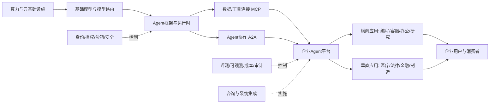

# AI Agent行业研究报告

## 1. 行业一句话定义

AI Agent 行业是以基础模型为认知引擎, 通过规划, 记忆, 工具调用, 身份授权和反馈循环, 代表用户或组织完成多步骤数字任务的软件产品与基础设施集合. 本报告采用中口径: 纳入 Agent 开发框架, 运行时, 数据和工具连接, AgentOps 与安全治理, 通用及垂直 Agent 应用和实施服务; 普通单轮聊天机器人, 不含自主决策的传统 RPA, 单纯模型 API 收入和具身机器人硬件本体不直接计入, 但作为上游或替代品观察.

## 2. 研究边界

| 项目   | 内容                                                                        |
| ---- | ------------------------------------------------------------------------- |
| 地区   | 全球市场, 重点观察美国, 中国和欧盟                                                       |
| 时间范围 | 历史观察以 2024-2026 年为主, 趋势推演至 2029 年                                         |
| 行业口径 | 软件型 Agent 中口径, 不把全部生成式 AI 或全部自动化收入等同为 Agent 市场                            |
| 包括   | 模型工具调用, Runtime, 编排, 记忆, MCP/A2A, AgentOps, IAM, 安全, 企业平台, 横向和垂直应用, SI 服务 |
| 不包括  | 普通 Chatbot, 无自治的 RPA, 纯基础模型训练, GPU 制造收入, 具身机器人硬件                          |
| 关键假设 | “生产部署”要求有真实业务动作, 可观测运行记录和明确责任人, 账号开通或 PoC 不视为规模部署                         |

### 2.1 研究计划摘要

| 项目 | 内容 |
|---|---|
| 母问题 | AI Agent 是否正在形成可持续行业, 价值将沉淀在哪些环节, 未来 1-3 年机会与风险是什么 |
| 子问题 | 定义与市场边界; 产业链和竞争结构; 需求真实性; 市场规模和渗透; 利润池; 护城河; 生命周期; 政策与安全; 景气指标 |
| 选择的分析层级 | 宏观 + 中观; 微观仅使用 Microsoft, Salesforce, Google, AWS, OpenAI, 阿里, 百度等代表性案例 |
| 必须验证的事项 | Agent 生产采用率, 任务可靠性, 厂商独立 Agent 收入, 总拥有成本, 协议采用, 事故率和监管落位 |

本次研究为标准行业概览, 不加入资本市场层. 内部 Claim 路由重点覆盖 `claim-agent-adoption`, `claim-agent-reliability`, `claim-platform-commercialization`, `claim-agent-protocols`, `claim-agent-security`, `claim-agent-market-size`, `claim-cost-economics` 和中美欧监管 Claim. 对最影响结论的市场规模, 生产采用和安全事故率执行三轮缺口闭环, 并将未闭环项保留在 2.3.

### 2.2 来源矩阵和证据质量

| 来源类型 | 本报告用途 | 证据层级 | 检索状态 | 限制 |
|---|---|---|---|---|
| 政府/监管/国际组织 | 中美欧政策, 安全, 身份授权, 企业 AI 使用 | 一手/近一手 | 已取得 | Agent 尚无统一统计分类, 法律通常按场景落位 |
| 原始研究/透明基准 | 任务可靠性, 时间跨度, 安全与生产可接受性 | 一手/近一手 | 已取得 | 软件任务和模拟环境不等于全部知识工作 |
| 公司财报/IR/官方产品资料 | 商业化, 客户数, 平台架构, 定价 | 一手 | 已取得 | 厂商自定义指标, 不能直接横向相加 |
| Stanford AI Index/OECD 等汇编 | AI 采用, 能力, 投资和就业代理指标 | 近一手/二手 | 已取得 | 部分底层数据来自调查或商业数据库 |
| Gartner/商业咨询市场报告 | 市场预测, 项目取消风险, 口径对比 | 二手 | 已取得 | 完整方法常付费, 预测不是事实 |
| 媒体/社区 | 发现线索 | 弱证据 | 未作为核心证据 | 不替代原始来源 |

证据最强的部分是政策时点, 上市公司披露, 协议发布和公开基准. 证据较弱的部分是“全球 AI Agent 独立市场规模”和跨厂商事故率. 详细 Claim-to-document 记录保存在同批 Evidence Ledger, 市场规模冲突以同一 `contradiction_group` 管理, 未把相似预测误当成独立验证.

### 2.3 二次检索缺口

| 缺口 | 三轮闭环已尝试 | 当前状态 | 为什么仍重要 | 未补齐原因 | 下一步来源 |
|---|---|---|---|---|---|
| 统一口径的全球 Agent 软件收入 | 第1轮: 官方统计和国际组织, 无独立分类. 第2轮: 公司财报和云平台披露, 仅有局部指标. 第3轮: GVR, MarketsandMarkets, Deloitte 交叉比较 | 部分补齐 | 决定市场天花板与规模性判断 | 商业报告口径不同且方法付费, AI 云/SaaS/服务存在重复 | IDC/Gartner 付费数据库的定义页, 主要厂商分部披露, 后续行业协会统计 |
| 企业生产环境渗透率 | 第1轮: Stanford AI Index/OECD. 第2轮: McKinsey 企业调查. 第3轮: Microsoft/Salesforce/阿里厂商生产指标 | 部分补齐 | 区分热度, 试点和真实收入 | “使用, 试验, 付费, 上线, 规模部署”定义不一致 | 各厂商 10-K/20-F 中统一的生产账户, 任务量, 续费和流失数据 |
| Agent 真实事故率和经济损失 | 第1轮: NIST hijacking 测试. 第2轮: NIST 2026 RFI 总结. 第3轮: 公开 benchmark 与事故数据库 | 仍未补齐 | 决定治理成本, 保险和高风险场景边界 | 无跨厂商, 跨场景的强制报告数据库 | NIST 后续测评, 监管事件通报, 厂商透明度报告, 保险理赔数据 |
| 中国 Agent 协议标准编号和强制性 | 第1轮: 国务院/工信部政策. 第2轮: 全国标准平台. 第3轮: 行业任务指南和公开项目 | 部分补齐 | 影响国内互操作和采购门槛 | 项目处于孵化/研制阶段, 状态变化快 | 全国标准信息公共服务平台, MIIT/TC1 工作计划和正式征求意见稿 |
| 2026 年欧盟 AI Act 延期修法最终文本 | 第1轮: 欧委会实施页. 第2轮: Council 时间线. 第3轮: EUR-Lex 检索 | 部分补齐 | 影响高风险 Agent 合规时间表 | 已取得政治协议和官方说明, 最终生效文本需继续核验 | EUR-Lex 最终修订法规和 Official Journal |

## 3. 行业地图

AI Agent 不是单一软件品类, 而是一条从算力和模型到“可审计业务结果”的长链. 上游决定能力上限和推理成本, 中游把非确定模型变成可运行系统, 下游掌握业务数据, 权限, 分发和付费预算. 生产环境还横跨一条控制链: 身份授权, 沙箱, 策略, 评测, Trace, 审计, 人工接管和事故响应.

| 模块 | 内容 |
|---|---|
| 纵向产业链 | GPU/云 -> 基础模型 -> Runtime/编排 -> 数据和工具 -> 企业 Agent 平台 -> 横向/垂直应用 -> 最终用户 |
| 横向竞争结构 | 模型原生平台, 云平台, SaaS/工作流厂商, 开源框架, 独立横向应用, 垂直 Agent, 咨询和 SI |
| 生产要素 | 推理算力, 模型, 企业数据, API/工具, 身份权限, 领域专家, 评测集, 分发入口和资本 |
| 生产关系 | 模型与云供应, SaaS 系统记录权, 企业采购, 开发者生态, 监管责任, 用户委托和第三方工具供应链 |
| 关键流向 | 收入从席位/token 向动作和结果迁移; 成本包含推理, 工具, Runtime, 审阅和失败损失; 数据由交互流向生产反馈闭环 |

协议层正在形成分工. [Anthropic 于 2024 年开源 MCP](https://www.anthropic.com/news/model-context-protocol), 主要解决 Agent 与数据/工具的连接; [Google 于 2025 年发布 A2A](https://developers.googleblog.com/en/a2a-a-new-era-of-agent-interoperability/), 主要解决跨框架 Agent 发现和协作. 2025 年末 Linux Foundation 成立 Agentic AI Foundation 并接纳 MCP 等项目, 表明连接协议正向中立基础设施演进. 这会扩大生态, 同时压缩只靠通用编排和连接器收费的中间层租金.

竞争的关键已从“谁有一个 Agent Demo”转向五种控制权: 模型能力和成本控制权, 企业系统记录数据, 身份与动作权限, 用户分发入口, 真实生产反馈与评测闭环. 因此 Microsoft/Salesforce/ServiceNow 等存量软件商, AWS/Google/阿里等云厂商和模型原生平台会长期重叠竞争; 独立厂商必须靠垂直数据, 结果责任或跨平台中立性避开捆绑压力.

### 3.1 竞争阵营和供需结构

模型原生平台的优势是能力迭代, 开发者心智和原生工具, 短板是对企业历史数据与业务责任的控制不足. 云平台掌握算力, IAM, 多模型选择和企业合同, 可以把 Agent Runtime 变成新的云消耗入口, 但产品复杂度和云锁定会给中立平台留下空间. SaaS/工作流厂商掌握 CRM, ERP, ITSM, 办公文档等系统记录, 最接近真实动作和预算, 却依赖外部模型并受跨系统边界限制. 独立框架和横向应用迭代快, 需要用跨平台体验或任务完成率对抗平台复制; 垂直 Agent 销售慢且合规重, 但可凭专业数据, 专家网络和结果责任建立更稳的议价权.

需求并非一个统一买方市场. 大企业购买的是安全, 集成, 治理, 全球支持和责任闭环, 通常先从现有云/SaaS 供应商扩容. 中小企业更重视开箱即用, 低成本和模板, 容易选择按量 SaaS 或行业 Agent. 开发者购买模型, Runtime 和可观测组件; 业务部门购买解决工单, 生成合格线索或缩短流程周期; IT 和安全部门则决定权限及上线. 一个项目往往同时面对多个预算所有者, 这解释了为什么 Agent 能迅速获得试验预算, 却可能在生产采购阶段因 ROI 和责任不清停滞.

供给端当前明显过剩于成熟需求: 模型, 框架, Agent Builder 和连接器快速增加, 但可公开验证的生产结果集中在客服, 编程, 搜索研究和少数后台流程. 这种错配会造成两种整合. 横向上, 大平台通过捆绑降低独立功能价格; 纵向上, 应用厂商吸收 Runtime, 评测和安全能力以交付端到端结果. 纯框架公司若不能进入托管运行, 治理或垂直应用, 容易被开源和云厂商夹击.

### 3.2 生产要素, 生产关系和关键瓶颈

推理算力和模型决定 Agent 的能力, 速度与直接成本, 但企业数据质量和 API 可操作性决定其能否完成工作. 同一模型接入干净的主数据, 稳定工具和明确权限时可以表现良好, 接入陈旧知识库, 非结构化权限和遗留 UI 时则会产生检索错误, 工具失败和长链重试. 因此 Agent 的关键生产要素不仅是 GPU 和 token, 还包括可验证任务定义, 高质量例外样本, 人工纠错标签以及能够回放的生产轨迹.

生产关系的核心是“谁授权 Agent 代表谁做什么”. 用户委托权, SaaS 系统记录权, 云端执行权和模型供应权可能分别属于不同主体. 当 Agent 跨邮件, CRM, 支付和外部 MCP 工具执行任务时, 每一跳都涉及身份传递, 最小权限, 凭证生命周期和责任归属. 这也是 NIST 把 Agent identity and authorization 单列为标准议题的原因. 若委托链和审计证据不完整, 企业只能把 Agent 限制在读取和建议模式, 无法释放动作价值.

当前最稀缺的要素是带真实后果标签的生产数据. 通用互联网数据可以训练模型回答问题, 却很少告诉系统某次动作是否被业务接受, 是否引发返工, 是否违反政策以及最终带来多少毛利. 掌握这类闭环数据的企业平台和垂直应用可以改进路由, 评测和风险策略. 随着 MCP/A2A 降低基础连接门槛, 生产反馈, 权限治理和结果担保的重要性会进一步上升.

## 4. 生命周期判断

**阶段结论:** AI Agent 行业整体处于“导入期后段向早期成长期过渡”. 开发工具和平台供给已进入快速扩张, 付费商业化出现强信号, 但跨行业生产渗透, 可靠性, 责任分配和统一计价单位尚未成熟. 编程和客服等窄场景接近早期成长, 高权限通用 Agent 仍处于导入期.

**证据:** 供给端, OpenAI, Google, AWS, Microsoft, Salesforce 和中国云厂商均已发布 Agent 平台与治理组件; Google 2025 年披露 ADK 下载超过 700 万次. 商业端, [Salesforce FY2026 披露 Agentforce ARR 达 8 亿美元, 累计 2.9 万单](https://investor.salesforce.com/news/news-details/2026/Salesforce-Delivers-Record-Fourth-Quarter-Fiscal-2026-Results/default.aspx), [Microsoft FY2025 披露 Copilot Studio 被超过 23 万家组织使用](https://www.microsoft.com/investor/reports/ar25/index.html). 需求端, [Stanford 2026 AI Index](https://hai.stanford.edu/ai-index/2026-ai-index-report/economy) 指出 2025 年组织 AI 采用率达 88%, 但几乎所有业务职能中的 Agent 部署仍为个位数比例.

**反证:** 高客户数不等于生产规模, 厂商口径可能包含免费, 试验和轻量扩展. [Stanford 2026 AI Index 技术章节](https://hai.stanford.edu/ai-index/2026-ai-index-report/technical-performance) 总结 Agent 在结构化 benchmark 上仍约三分之一失败; CRM, Web 和代码评测也显示多轮, 合规和维护者接受率显著低于单次名义完成率. [Gartner](https://www.gartner.com/en/newsroom/press-releases/2025-06-25-gartner-predicts-over-40-percent-of-agentic-ai-projects-will-be-canceled-by-end-of-2027) 预测到 2027 年底超过 40% 项目会因成本, 价值不清或风险控制不足而取消, 该预测为二手观点但与落地障碍方向一致.

**置信度:** 中高. 生命周期方向由多类独立证据支持, 但不同场景差异很大, 且没有统一生产渗透统计.

**行业含义:** 未来 1-3 年仍是“高增长 + 高淘汰”阶段. 市场会奖励能把 PoC 转为生产, 证明每个合规完成结果的全成本, 并承担持续运营责任的厂商; 仅靠 Prompt, UI 或模型包装的产品将快速同质化.

## 5. 七个核心模块

### 5.1 可行性

**结论:** AI Agent 在高频, 边界清楚, 结果可验证, 错误可逆的数字流程中已经具备商业可行性; 对模糊目标, 高上下文, 高权限且不可逆的端到端工作, 仍应采用“确定性工作流 + 局部自治 + 人工接管”, 而非完全自主.

**证据:** Salesforce 披露 Agentforce 已形成 ARR 和生产账户增长, Microsoft, Google, AWS 和阿里均将 Runtime, 连接, 评测和治理产品化, 说明客户愿意为执行而非单纯问答付费. 另一方面, [NIST 的 Agent hijacking 测试](https://www.nist.gov/news-events/news/2025/01/technical-blog-strengthening-ai-agent-hijacking-evaluations) 指出可信指令和不可信外部数据混合会导致劫持; 多轮 CRM 和 Web 任务的合规完成率也低于名义完成率.

**机制:** Agent 把自然语言意图转换为一系列模型判断和工具动作. 当步骤增加时, 单步错误会累积, 还会引入权限, 数据和第三方工具风险. 状态机, 检查点, 预算上限, 最小权限, 可逆动作和人工批准可缩小非确定性, 从而把模型能力转成可经营产品.

**行业含义:** 最先规模化的不是“虚拟全能员工”, 而是客服分流, 代码修改, 工单处理, 研究汇总和销售运营等窄流程. 采购验收应看合规完成率, 人工返工, 例外升级和严重错误, 而非只看 Demo 成功率.

### 5.2 规模性

**结论:** 行业潜在影响空间很大, 但可确认的独立软件收入仍小于其对云, SaaS, IT 服务和劳动力预算的影响. 不宜用“可替代的白领工资”作为近期 TAM, 也不能把 AI 云收入与 Agent 应用收入直接相加.

**证据:** 商业研究对 2025 年全球 Agent 市场估计大致落在 76-83 亿美元, 对 2030 年预测约 350-530 亿美元, 但纳入范围和方法不透明. 更可靠的代理信号是 Salesforce 8 亿美元 Agentforce ARR, Microsoft 23 万组织使用 Copilot Studio, 阿里披露百炼已构建超过 80 万个 Agent, 以及 2026 AI Index 显示美国招聘信息中 AI agents, Agentic AI, LangGraph 等技能需求高速增长. 这些均不能直接相加为市场规模.

**机制:** 规模由四个乘数决定: 可被数字化的任务量, Agent 可稳定闭环的比例, 每个结果的支付意愿, 从试点转生产的速度. 模型能力扩大可行域, 协议降低接入成本, 但可靠性和组织改造决定兑现速度. 套件捆绑会提升渗透却降低独立市场收入的可见度.

**行业含义:** 未来市场统计应同时跟踪 Agent 软件/平台收入, Agent 影响的云消耗, 任务量和劳动力重构价值, 但四者必须分开. 基准情景下软件与基础设施收入高速增长, 大部分价值先通过既有云和 SaaS 合同兑现.

### 5.3 防守性

**结论:** 通用编排层防守性偏弱, 企业数据, 工作流, 身份权限, 分发入口, 生产评测和领域责任构成更强壁垒. 基础模型仍决定能力上限, 但模型差距缩小时, 控制业务动作和反馈数据的一方更容易留住利润.

**证据:** MCP 和 A2A 的开放降低了工具及 Agent 互联的迁移成本; 多家云和模型平台已内置相似的编排, 记忆, Trace 和多 Agent 功能. 同时 Microsoft 依托 Office/Entra/Graph, Salesforce 依托 CRM/Data Cloud, ServiceNow 依托 ITSM, 中国平台依托云和超级应用分发, 能直接接触系统记录数据和用户权限.

**机制:** Prompt, 通用 UI 和单一 API 封装容易复制. 真正高切换成本来自历史流程配置, 经审计权限, 专有数据对象, 人工纠错和失败知识库, 合规认证以及与组织 KPI 的绑定. 开放协议会商品化连接层, 却同时扩大 IAM, 策略执行和跨 Agent 信任市场.

**行业含义:** 初创公司应优先占据垂直工作流或中立控制平面, 避免只与平台比功能清单. 可验证壁垒指标包括生产数据独占性, 迁移工期, 结果准确率, 净收入留存, 工作流深度和客户是否愿意把不可逆动作交给产品.

### 5.4 盈利性

**结论:** 近期利润池主要流向模型/云消耗, 企业数据与工作流平台, 以及集成和流程重构服务; 中长期更高质量的利润可能沉淀在可审计结果, 垂直数据, AgentOps, 身份安全和交易授权. 纯编排和简单连接器利润率面临开源与捆绑挤压.

**证据:** Salesforce 已从每会话扩展到 Flex Credits/动作计价, Microsoft 采用席位, 套件与 Copilot Credits, AWS/Google 将 Runtime, 代码执行, 会话, 记忆和评测拆分计费. [Google Agent Engine 的价格更新](https://cloud.google.com/blog/products/ai-machine-learning/new-enhanced-tool-governance-in-vertex-ai-agent-builder) 显示总成本不只有 token. Salesforce 的 ARR 证明应用层可以形成独立收入, 但多数厂商尚未披露 Agent 毛利率, 续费率和人工服务占比.

**机制:** 单任务毛利等于客户支付减去模型 token, 工具/API, Runtime, 检索和存储, 重试, 评测, 人工审阅, 失败赔付和实施成本. 模型降价不必然提高毛利, 因为更长轨迹和更高自治可能扩大用量与尾部风险. 掌握定价权的厂商能把“动作价值”与底层可变成本解耦.

**行业含义:** 应采用“每个合规完成结果的全成本”而非每百万 token 作为核心 UE. 云与模型层收入大但资本开支高; SI 早期收入强但人力密集; 垂直 Agent 若能降低人工复核并承担结果责任, 最有机会从 IT 预算扩展至业务和劳动力预算.

### 5.5 估值

**结论:** 行业处于导入向成长过渡, 估值逻辑应从纯期权价值逐步转向收入质量和生产使用. 对初创平台可观察 ARR 增长, 生产客户, 留存和单位经济; 对多业务上市公司应做分部/增量估值, 避免把全部云或 SaaS 收入标记为 Agent 收入.

**证据:** Salesforce 已能披露 Agentforce ARR, 但 Microsoft, Google, AWS, 阿里和百度的 Agent 价值多混在云, 办公或企业软件中. 咨询机构对市场规模预测差异大, 说明仅用高 CAGR 支撑 PS 倍数风险较高. 协议开放, 模型降价和套件捆绑还会快速改变独立厂商的可比组.

**机制:** 早期估值依赖 TAM 和技术可行性, 进入成长阶段后市场会追问 PoC 转生产率, 6/12 月留存, 每任务毛利, 人工接管率, 客户集中度和安全负债. 如果收入主要来自一次性实施, 应更接近 IT 服务估值; 如果有高留存用量或结果分成, 才更接近高质量 SaaS.

**行业含义:** 估值陷阱有两类: 把 Agent 影响的全部劳动力价值当作可获取收入, 以及把模型调用增长当作应用层护城河. 更稳健的框架是场景分部估值 + 概率加权, 并对平台下沉, 价格下降和合规成本设置折价.

### 5.6 外部因素

**结论:** 政策总体支持应用扩张, 同时把可追溯, 风险分级, 人类监督, 身份授权和内容标识推向采购门槛. 美国偏创新, 采购和自愿标准, 中国偏“人工智能+”场景工程与内容/算法/数据治理, 欧盟偏风险分类和强制合规.

**证据:** [NIST 于 2026 年启动 AI Agent Standards Initiative](https://www.nist.gov/news-events/news/2026/02/announcing-ai-agent-standards-initiative-interoperable-and-secure), 聚焦标准, 开源协议, 安全和身份. 中国 2026 年政府工作报告提出加快智能体推广和重点行业规模化应用, 2025 年生成合成内容标识规则已经实施, 2026 年拟人化互动服务新规又区分陪伴型与普通工作助手. 欧盟 AI Act 已分阶段适用, GPAI 义务自 2025 年生效, 高风险和透明度时间表仍需跟踪最终修法.

**机制:** 政策一方面扩大政府和重点行业需求, 另一方面使日志, 权限, 评测和人工接管从“附加功能”变成准入成本. 数据跨境, 芯片出口和本地部署要求会形成区域技术栈; 电力和算力约束也影响长轨迹 Agent 的成本与延迟.

**行业含义:** 跨境厂商需要统一控制面 + 地区策略层, 按场景识别 provider/deployer 角色. 合规基础设施是成本也是机会, 尤其是 Agent IAM, provenance, policy engine, audit log, incident response 和高风险行业评测.

### 5.7 景气度

**结论:** 行业当前景气度为“高热度, 高投入, 早期收入加速, 生产质量仍分化”. 领先平台商业数据和开发者活动向上, 但全行业缺乏库存等传统指标, 应以生产任务量, 付费客户, 任务成功与成本作为量价代理.

**证据:** Salesforce Agentforce ARR 同比增长 169%, 生产账户环比接近增长 50%; Microsoft Copilot Studio 组织使用数持续增加; Google ADK 下载和阿里百炼 Agent 数显示供给生态扩张. [OpenAI 2025 年披露 Responses API 已有数十万开发者使用并处理数万亿 token](https://openai.com/index/new-tools-and-features-in-the-responses-api/), 但开发活动不是生产收入. 反向信号是 Gartner 的项目取消预测, Stanford 所示具体职能 Agent 采用仍为个位数, 以及公开基准上的失败率.

**机制:** 景气上行来自模型能力, 成本下降, 协议标准化, 云/SaaS 捆绑和企业 AI 预算; 下行约束来自 PoC 堆积, 数据和权限改造, 无法证明 ROI, 安全事故与重复建设. 供给发布领先于需求兑现, 因而收入与估值波动会大于实际任务量增长.

**行业含义:** 最重要的前瞻指标不是发布会数量, 而是 PoC-to-production 转化率, 月度活跃生产 Agent, 合规完成任务数, 每结果全成本, 人工接管率, 续费/扩张和重大事故. 若这些指标改善, 行业将从早期成长进入更可确认的规模期.

## 6. 趋势推演

未来三年更可能出现六条主线. 第一, 产品从“对话入口”转向“流程闭环”, UI 价值下降, 系统记录和动作授权价值上升. 第二, 架构从开放式完全自治回到受控自治, 以工作流节点, 策略检查, 预算终止器和人机升级保障生产可靠性. 第三, MCP/A2A 等协议普及使连接和编排商品化, IAM, 策略, 评测和审计成为新控制层.

第四, 商业模式从席位/token 向动作, 工作单元和结果计费迁移, 但归因与责任会限制纯结果收费. 第五, 通用平台继续捆绑扩张, 独立应用向专业数据, 高价值窄流程和可担责服务集中. 第六, 中美欧形成多技术栈并存: 美国模型/云/SaaS 主导, 中国强化开源, 本地云和行业交付, 欧盟合规要求影响全球产品设计.

| 情景 | 2027-2029 触发条件 | 行业结果 |
|---|---|---|
| 基准 | 可靠性稳步提高, 企业重构部分流程, 无系统性重大事故 | Agent 通过云/SaaS 合同快速渗透, 独立收入增长但统计仍碎片化; 垂直应用和治理基础设施胜出 |
| 乐观 | 多轮合规完成率显著提升, 协议/身份标准成熟, 每结果成本下降, ROI 可复制 | 从辅助工具升级为业务流程操作层, 结果计费扩大, 软件预算向劳动力预算延伸 |
| 悲观 | 安全事故频发, 项目无法证明 EBIT, 云成本和人工复核居高, 监管趋严 | 大量项目回退为 Copilot/RPA, 平台整合, 纯 Agent 初创淘汰, 高权限自治推迟 |

能够证伪基准判断的信号包括: 关键业务流程连续达到接近传统软件 SLA 的合规完成率且人工复核显著下降; 或相反, 生产事故和项目取消持续上升, 任务量增长主要来自补贴与内部试验而非续费扩张.

## 7. 风险和机会

| 类型 | 内容 | 证据/依据 |
|---|---|---|
| 机会 | 垂直工作流 Agent | 专业数据, 责任边界和高价值结果形成差异化, 适合从半自动逐步提高自治 |
| 机会 | AgentOps 和持续评测 | benchmark pass 不等于生产接受, 企业需要轨迹回放, 版本评测, 漂移和失败归因 |
| 机会 | Agent IAM 与授权 | NIST 已把身份/授权纳入标准议程, 企业需要委托链, 临时凭据, 最小权限和不可抵赖日志 |
| 机会 | 成本治理 | 模型路由, 缓存, 上下文压缩, 确定性子流程, 预算/重试上限直接改善每结果毛利 |
| 机会 | 流程重构和运营服务 | 企业瓶颈包含数据, 权限, KPI, 例外处理和岗位设计, 不是单纯模型采购 |
| 风险 | 可靠性复合衰减 | 多步骤链条放大单步错误, 多轮与合规完成率往往低于单次名义成功率 |
| 风险 | Prompt injection 和工具供应链 | 外部数据可能劫持 Agent, 第三方 MCP/A2A 工具扩大攻击面 |
| 风险 | ROI 口径失真 | 忽略审阅, 返工, Runtime, 工具和失败损失会高估价值 |
| 风险 | 平台捆绑与开源替代 | 云/SaaS 下沉和开放协议压缩通用中间件与 Wrapper 的定价权 |
| 风险 | 权限与责任事故 | 高权限 Agent 误操作可造成数据泄露, 错误交易和行业监管责任 |
| 风险 | 统计和估值泡沫 | “试验, 使用, 客户, Agent 数, token”均不等于生产收入或经济利润 |

## 8. 事实, 观点和推断分层

| 类型 | 内容 | 来源/依据 | 证据层级 | 来源状态 | 置信度 |
|---|---|---|---|---|---|
| 事实 | Salesforce FY2026 披露 Agentforce ARR 8 亿美元, 累计 2.9 万单 | Salesforce IR | 一手 | 已取得, 单一公司口径 | 高 |
| 事实 | Microsoft FY2025 披露超过 23 万组织使用 Copilot Studio | Microsoft 年报 | 一手 | 已取得, 口径宽于生产 Agent | 高 |
| 事实 | 2025 年组织 AI 采用达 88%, 但具体职能 Agent 使用多数为个位数 | Stanford 2026 AI Index | 近一手 | 已取得, 底层包含调查 | 中高 |
| 事实 | MCP, A2A 先后公开, NIST 2026 启动 Agent 标准倡议 | Anthropic, Google, NIST | 一手 | 已取得 | 高 |
| 待核验事实 | 2025 年全球 Agent 市场约 76-83 亿美元, 2030 年约 350-530 亿美元 | GVR, MarketsandMarkets, Deloitte | 二手 | 完整方法付费, 口径冲突 | 低 |
| 观点 | 到 2027 年底超过 40% Agentic AI 项目将取消 | Gartner 预测 | 二手 | 已取得新闻稿, 非实际结果 | 中 |
| 推断 | 行业处于导入后段向早期成长过渡 | 商业化, 采用率, 可靠性与标准化综合 | 多源 | 受生产渗透缺口影响 | 中高 |
| 推断 | 利润将从通用编排迁往工作流, 数据, 身份, 评测和结果责任 | 开放协议, 平台定价, 企业控制点 | 多源 | 待分部毛利与续费验证 | 中 |
| 推断 | 套件厂商将先于纯 Agent 初创公司获取大部分企业预算 | Microsoft/Salesforce 采用与分发结构 | 一手 + 推断 | 可由独立厂商 ARR 反证 | 中 |

## 9. 多视角压力测试

| 视角 | 质疑 | 影响 | 需要验证 |
|---|---|---|---|
| 行业专家 | “Agent”被广泛用于包装 Chatbot/RPA, 行业规模可能重复计算 | 高估市场规模和成长阶段 | 建立自主规划, 工具动作, 状态和责任四项最低定义; 要求厂商拆分收入 |
| 投资研究员 | 高增长 token/客户数未必转化为高毛利和留存 | 估值可能建立在不可获取 TAM 上 | Agent ARR, 毛利率, 6/12 月留存, 生产任务增长, 实施服务占比 |
| 政策/监管研究者 | 跨境规则按场景和角色落位, “Agent”名称不能决定义务 | 合规成本和责任尾部可能被低估 | 高风险用例清单, provider/deployer 责任, 身份授权, 日志, 事故报告 |
| 经营者/创业者 | 模型升级不会自动解决流程所有权, 数据质量和例外处理 | PoC 难转生产, 销售周期和服务成本上升 | 流程 owner, RACI, PoC 转化率, 人工接管, 90/180 天财务闸门 |
| 安全工程师 | 高权限 Agent 应按潜在内部人而非聊天机器人设计 | 错误或被劫持动作可能造成重大损失 | 攻击成功率, 最小权限覆盖, 临时凭据, 不可逆动作审批, kill-switch 时延 |
| 反方审稿人 | 长时运行和 benchmark pass 不等于真实工作闭环 | 可靠性叙事可能过度外推 | 真实权限, 模糊目标, 中途变更下的连续 30 天闭环率和专家接受率 |

压力测试后的修正是: 不采用“通用 Agent 将在短期替代大多数知识工作”的强结论, 不把咨询市场规模当作确定事实, 不把协议标准化视为已解决安全和责任. 中心判断保留为“高增长但尚未充分去风险的早期规模化赛道”.

## 10. 后续研究建议

第一, 建立季度景气看板, 只跟踪可比的生产指标: 付费/生产客户, 月活生产 Agent, 合规完成任务数, PoC 转化率, 人工接管率, P50/P95 每结果成本, 续费扩张和重大事故. 第二, 选客服, 编程, 销售运营, 财务和 IT 运维五个场景做 cohort 研究, 比较任务可验证性, 权限, 人工复核和毛利结构.

第三, 对 Microsoft, Salesforce, ServiceNow, Google, AWS, OpenAI, 阿里, 百度和字节建立同口径产品/定价/生产采用数据库, 区分免费构建, 付费合同, 生产账户和结果工作单元. 第四, 继续追踪 MCP/A2A 活跃实现, Agent 身份和授权标准, 中国 Agent 协议项目及欧盟最终修法. 第五, 用真实企业流程做前后对照实验, 将模型, 工具, Runtime, 人工和失败损失全部计入 ROI.

研究或经营决策可采用一个简化筛选器: 优先选择高频, 规则清楚, 结果可验证, 失败可逆, 单次价值较高且数据权限可获得的流程; 先做 Copilot/半自动, 达到合规完成率和经济闸门后再提高自治. 这比从“需要一个通用数字员工”出发更容易形成可复制商业价值.

## 11. 报告合规自检表

| 检查项 | 是否通过 | 说明 |
|---|---|---|
| 行业全览模板完整 | 通过 | 保留 1-11 标准行业概览骨架 |
| 研究简报转译已完成 | 通过 | 已锁定行业概览, 中文, 标准深度, 宏观 + 中观和 Workspace Report File |
| 研究边界和研究计划完整 | 通过 | 明确全球/中美欧, 2024-2029, 中口径和排除项 |
| 来源矩阵和二次检索缺口完整 | 通过 | 展示证据等级, 三轮闭环, 当前状态, 原因和下一来源 |
| 行业地图和生命周期判断完整 | 通过 | Mermaid + 产业链表, 生命周期含证据, 反证, 置信度和行业含义 |
| 七个核心模块完整 | 通过 | 5.1-5.7 独立展开 |
| 七模块深度和四段结构达标 | 通过 | 每节含结论, 证据, 机制和行业含义, 重点模块扩展 |
| 报告深度 rubric 达标 | 通过 | 主要章节按结论, 证据, 机制, 含义和验证维度复核, 达到标准报告阈值 |
| 事实/观点/推断已分层 | 通过 | 第 8 节区分事实, 待核验事实, 观点和推断 |
| 证据层级和来源状态清楚 | 通过 | 一手, 近一手, 二手和弱证据分级, 标注厂商口径与方法限制 |
| 多视角压力测试完成 | 通过 | 实际并行完成宏观监管, 行业竞争和反方经营三路研究 |
| 后续研究建议具体 | 通过 | 给出季度指标, 场景 cohort, 厂商数据库, 标准跟踪和 ROI 实验 |

本报告仅供研究和信息参考, 不构成投资建议, 也不构成任何收益承诺.
