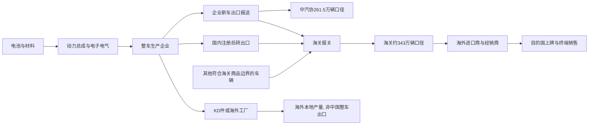

# 中国新能源汽车出口口径冲突研究报告: 2025年到底出口261.5万辆还是343万辆

## 1. 直接回答

两个数字都可以是真的, 但回答的是不同问题. 如果你问的是“2025年中国汽车生产企业按中汽协连续统计口径出口了多少新能源汽车新车”, 应使用 **261.5万辆**. 中国汽车工业协会年度发布显示, 2025年新能源汽车出口261.5万辆, 同比增长103.7%; 其中纯电动汽车164.6万辆, 插电式混合动力汽车96.9万辆. 这一数字适合观察国内汽车制造企业的新车出口经营表现, 也适合与中汽协2023年120.3万辆、2024年128.4万辆进行连续比较.

如果你问的是“2025年中国关境内以相关汽车商品编码完成报关出口的新能源汽车有多少”, 应使用海关商品贸易口径的 **约343万辆**. 乘联分会基于海关数据整理的结果为343万辆, 同比增长70%; 对应全部汽车整车出口约832.4万辆. 这一数字适合观察跨越中国关境的货物流量、目的国结构和贸易金额, 但不能直接当作中汽协企业新车出口量.

81.5万辆的差额不是简单的数据错误. 两套体系的统计主体、采集环节和车辆边界不同: 中汽协以生产企业报送的新车出口为核心, 海关以报关商品跨境为核心. 商务部正式规则明确, 二手车出口企业需申领许可证并向海关办理出口报关, 商品名称还应填报“旧+品牌+排气量+车型”. 因而二手车会进入海关流量, 却不属于中汽协的生产企业新车出口. 历史资料还提示低速或“未列名载人机动车”等边界车辆可能造成差异. 但公开汇总表没有把2025年81.5万辆逐项拆开, 所以不能武断地说差额“全部是二手车”.

真实趋势判断不依赖在261.5和343之间二选一. 在各自连续口径内, 2025年都显示新能源汽车出口明显加速: 中汽协口径同比翻倍, 海关整理口径同比增长70%. 两者方向一致, 增速都远高于2024年的低速增长. 结构上, 插电式混合动力成为关键增量: 中汽协口径下插混出口96.9万辆, 同比约增长2.3倍; 海关整理口径下插混约111万辆, 同比增长也显著快于纯电. 因此稳健结论是“出口强劲加速且动力结构从纯电单引擎转向纯电与插混双引擎”, 而不是“2025年唯一正确的出口量等于某一个数字”.

实际使用时建议采用双口径仪表盘: 产业经营看261.5万辆及103.7%的同比, 跨境贸易看343万辆及70%的同比; 所有图表必须在标题中写清“中汽协新车企业报送口径”或“海关商品贸易口径”. 不得用2024年的一种口径与2025年的另一种口径计算增速, 也不得把直接出口、KD件海外组装和海外工厂本地产量加成“中国出口”.

## 2. 结论摘要

| 观点 | 原因 | 事实依据 | 产业发展推演 |
|---|---|---|---|
| 261.5万辆是中汽协新车口径 | 统计主体是汽车生产企业, 采集的是企业新车出口 | 中汽协2026年1月发布会及年度数据 | 适合判断制造企业出口产销和国内产能外销能力 |
| 约343万辆是海关商品贸易口径 | 统计对象是过境报关的汽车商品, 边界比协会新车口径宽 | 海关年度主要出口商品表, 乘联分会海关数据整理 | 适合判断关境贸易流量、目的国和商品结构 |
| 差额主要是口径而非算术错误 | 二手车依法进入海关报关, 其他未纳入协会新车报送的车辆也可能进入 | 商务部2024年公告和2025年加强二手车出口管理通知 | 2026年“登记不足180天”规则实施后, 两口径差额可能收窄 |
| 真实趋势是加速, 不是统计幻觉 | 两套连续口径的2025年同比均大幅为正 | 261.5万辆同比+103.7%; 343万辆同比约+70% | 海外增长由纯电扩展到插混, 市场覆盖更广但贸易摩擦也上升 |
| 不能精确断言81.5万辆全是二手车 | 公开表未给出按新旧状态、商品编码和贸易方式的完整交叉拆分 | 差额构成是本次检索唯一残余缺口 | 应用海关微观商品表或专项数据请求完成最终归因 |

## 3. 研究边界

本报告地理边界为中国关境与中国汽车生产企业, 时间边界为2023-2025年, 重点解释2025全年. 行业边界为新能源汽车整车, 主要包括纯电动与插电式混合动力汽车. 纳入中汽协企业报送新车出口、海关商品贸易出口、二手车报关规则和动力结构; 排除汽车零部件、动力电池、KD件在海外组装、中国品牌海外工厂本地产量以及目的国终端上牌. “海外销量”与“出口”不是同义词, 本报告不把海外本地产量加到出口量中.

分析采用宏观、行业中观和议题树层级. 宏观层关注海关贸易制度与二手车监管, 中观层关注新能源汽车出口规模、车型结构和产业链, 不引入单一公司微观分析或资本市场估值. 报告中的261.5和343均按“万辆”表达, 小数和约数差异不影响口径判断. 对海关原表页面访问超时的内容, 使用海关搜索摘要与同源公开整理交叉核对, 并在证据质量中披露限制.

### 3.1 研究计划摘要

| 项目 | 内容 |
|---|---|
| 母问题 | 2025年中国新能源汽车出口的两个主流数字为何冲突, 应怎样判断真实趋势 |
| 子问题 | 两个数字各自的统计主体是什么; 差额由哪些边界造成; 两套口径下增速是否同向; 哪类动力车型贡献增量 |
| 选择的分析层级 | 宏观贸易制度 + 新能源汽车中观结构 + 口径冲突议题树 |
| 必须验证的事项 | 中汽协261.5万辆原始发布; 海关约343万辆及832.4万辆母口径; 二手车是否进入海关; 2023-2025连续趋势 |

### 3.2 来源矩阵和证据质量

| 来源类型 | 本报告用途 | 证据层级 | 检索状态 | 限制 |
|---|---|---|---|---|
| 中国汽车工业协会年度发布 | 261.5万辆、103.7%同比、纯电与插混拆分 | 一手 | 已取得, 官方页面直接访问曾超时但索引可见 | 企业报送新车边界, 不代表全部报关车辆 |
| 海关总署主要出口商品量值表 | 343万辆附近的海关商品流量及整车母口径 | 一手 | 原表检索到, 页面Visit超时; 以同源整理复核 | 公开汇总层级不足以拆解81.5万辆差额 |
| 商务部等部门二手车出口公告 | 证明二手车需向海关报关及“旧车”填报规则 | 一手 | 已取得全文 | 说明制度边界, 不提供2025数量拆分 |
| 乘联分会基于海关数据的年度分析 | 343万辆、70%同比、动力结构 | 近一手 | 已取得公开转述 | 数据生成源仍是海关, 不能与海关表算独立双验 |
| 央视网对中汽协年度数据的报道 | 中汽协历史序列和动力拆分交叉检查 | 近一手 | 已取得 | 与中汽协同源, 只能核对转录 |
| UN Comtrade注册路线 | 国际贸易数据的注册优先入口 | 一手 | 已尝试, 定义不匹配 | 数据主要源自中国海关报送, 不能制造独立来源 |

最强证据是中汽协年度发布、海关年度商品表和商务部二手车出口制度. 其中前两者分别生成不同统计总体, 不能要求两者数值相等; 商务部规则独立证明二手车进入海关报关流程. 乘联分会和媒体转述不构成新的数据生成源. Evidence Ledger 因而按 `origin_source_id` 将它们归回中汽协、海关和商务部三个来源, 避免同源伪双验.

关键原始入口包括[中国汽车工业协会2026年1月信息发布会](https://www.caam.org.cn/chn/3/cate_38/con_5236999.html)、[海关总署2025年12月主要出口商品量值表](https://english.customs.gov.cn/Statics/b36c1066-c6ac-42af-b58a-18c7615f6007.html)、[商务部等5部门关于二手车出口有关事项的公告](https://www.mofcom.gov.cn/zfxxgk/gkml/art/2024/art_79f6d1fc5871472ea2ddae704b1173b2.html)和[中汽协2023年12月汽车出口表](https://en.caam.org.cn/Index/show/catid/68/id/2063.html). 中汽协历史序列与动力拆分另由[央视网年度报道](https://auto.cctv.com/2026/01/16/ARTIfn04w0RFImDnVhh4O9Q0260116.shtml)进行同源转录核对. 链接数量不代表独立来源数量, 独立性仍以数据生成主体为准.

### 3.3 二次检索缺口

| 缺口 | 三轮闭环已尝试 | 当前状态 | 为什么仍重要 | 未补齐原因 | 下一步来源 |
|---|---|---|---|---|---|
| 81.5万辆差额按二手车、低速车辆、其他边界项目的精确拆分 | 第1轮: UN Comtrade注册路线与海关年度表. 第2轮: 中汽协及乘联分会的口径说明. 第3轮: 未授权, 因核心口径冲突已解决且公开汇总无微观拆分 | 部分补齐 | 决定能否精确量化“零公里二手车”等特殊渠道的贡献 | 公开汇总表未提供新旧状态×商品编码×贸易方式交叉表 | 海关总署2025年车辆微观商品表或定制统计, 商务部二手车出口许可证年度汇总 |

该缺口不阻止回答“哪个数字用于哪个问题”, 也不改变“两套口径均显示加速”的方向判断. 它会限制对差额来源的精确归因, 因此报告只写“二手车等边界因素是主要解释”, 不写“81.5万辆全部为二手车”. Engine 据此允许正式报告, 但要求保留中等置信度限定. 本次闭环优先尝试海关和商务部一手来源, 再以中汽协与乘联分会等一手或近一手来源核对定义; 后续若能取得海关微观表, 应替换当前仅能解释制度边界的近一手拆分线索.

还需强调, “第3轮未授权”不是把缺口搁置. Engine在两轮后判断高影响部分已经闭环: 两个数值的来源、定义、用途和趋势方向均可验证, 剩余问题从“哪个数字可信”降为“差额内部如何精确分项”. 若第三轮只重复搜索相同汇总数字, 不会新增高质量证据; 真正有效的下一动作必须取得新的数据粒度, 例如许可证明细或商品编码微观表. 这也是本Run没有为了凑满三轮而制造重复检索的原因.

## 4. 行业地图



产业地图揭示了口径冲突的空间位置. 中汽协观测点更靠近“国内生产企业把新车发往海外”, 海关观测点在“车辆以商品身份跨越关境”. 一辆在国内先登记、再以二手车手续出口的新能源汽车会进入海关观测点, 却未必进入生产企业的新车出口报送. 反过来, 企业报告的出口若尚未在统计时点完成报关, 还可能出现时间错位. 海外工厂生产和KD件组装则位于关境出口之后或整车出口之外, 不能加进任一整车数字.

对经营分析而言, 企业新车出口更接近制造端订单和产能去化; 对宏观贸易而言, 海关数据更接近真实过境商品与贸易金额; 对海外市场份额而言, 两者都不够, 还需要目的国注册量、经销库存和海外本地产销量. 因而“出口强”不自动等于“海外终端零售同幅度强”, 港口库存、渠道压货和短期报关节奏仍需单独验证.

## 5. 问题拆解和议题树

```text
母问题: 2025年中国新能源汽车出口到底是多少, 真实趋势如何判断
- 子问题1: 261.5万辆由谁统计, 对象和时间点是什么
- 子问题2: 343万辆由谁统计, 是否包含协会新车边界之外的车辆
- 子问题3: 81.5万辆差额能否由二手车和其他商品边界解释
- 子问题4: 在各自连续序列内, 2025年增速是否同向
- 子问题5: 纯电与插混谁贡献了新增出口, 趋势能否持续
```

判断顺序必须是先定义、再比较、后解释. 若跳过定义直接用343减261.5, 只能得到81.5万辆算术差, 不能得到经济含义. 若把261.5当作2025值, 再用海关口径的2024值作为分母, 会产生虚假同比. 若把海外工厂销量加入343, 又会把贸易流量与全球经营规模混在一起. 本报告因此为每个数字绑定来源、统计总体、用途和限制.

## 6. 证据链分析

| 子问题 | 结论 | 事实 | 观点 | 推断 | 证据层级 | 来源状态 | 置信度 |
|---|---|---|---|---|---|---|---|
| 261.5是什么 | 中汽协企业新车出口口径 | 中汽协发布2025年新能源汽车出口261.5万辆, 同比+103.7% | 该口径更适合观察制造企业出口经营 | 与709.8万辆汽车新车出口母口径相配套 | 一手 | 已取得 | 高 |
| 343是什么 | 海关商品贸易口径 | 海关整理数据为约343万辆, 同比+70%; 汽车整车约832.4万辆 | 该口径更适合宏观贸易流量 | 与261.5不应要求数值相等 | 一手/近一手 | 原表路线已取得, 页面访问有技术限制 | 中高 |
| 为什么有差额 | 统计总体和采集环节不同 | 商务部规定二手车需办理许可证并向海关报关 | 二手车及其他边界车辆是合理解释 | 81.5万辆不等于可直接确认的二手车数量 | 一手 | 已取得 | 中高 |
| 趋势是否真实 | 两套口径均显示2025显著加速 | 中汽协+103.7%, 海关整理+70% | 方向交叉验证强于单点绝对值 | 出口扩张不是只由口径切换造成 | 一手/近一手 | 已取得 | 高 |
| 增量来自哪里 | 插混是最强增量之一, 纯电仍占最大绝对量 | 中汽协纯电164.6万辆, 插混96.9万辆且同比约+2.3倍 | 插混更适配充电基础设施不完善和长途场景 | 出口市场由欧洲纯电导向扩展到拉美、中东等多元市场 | 近一手 | 已取得 | 中高 |

事实层只保留来源直接报告的数值和制度文本. “二手车解释差额”有制度证据支持, 但差额构成未逐项公开, 因此属于证据支持下的解释而非完整核算. “插混适配更多市场”属于产业机制推断, 需要目的国车型和上牌数据继续验证. 这种分层避免把合理机制包装成已经被统计表直接证明的事实.

一个有用的数量检查是母口径占比. 中汽协口径下, 新能源汽车出口261.5万辆占汽车新车出口709.8万辆约36.8%; 海关口径下, 343万辆占整车出口832.4万辆约41.2%. 两者都表明新能源已成为出口增量核心, 但占比相差约4.4个百分点, 正说明分子分母边界必须成对使用. 不能拿343除以709.8, 也不能拿261.5除以832.4.

## 7. 生命周期判断

**阶段结论:** 中国新能源汽车出口处于高速成长期向全球化深耕期过渡阶段. 绝对量仍高速扩张, 动力结构和目的地快速多元化; 同时二手车治理、海外售后、关税与本地化生产的重要性上升, 说明竞争已从单纯产品出口扩展到渠道、合规和海外运营体系.

**证据:** 两套口径在2025年分别同比增长103.7%和约70%, 显著高于全球汽车需求的一般增速. 中汽协口径下插混出口同比约增长2.3倍, 说明产品组合还在快速迭代. 商务部于2025年加强二手车出口管理, 自2026年起对登记不满180天车辆增加售后确认要求, 说明规模扩张已经带来质量追溯和渠道秩序问题.

**反证:** 高出口报关量不等于同量海外终端上牌; 海关和协会差额尚未完整拆分; 欧洲等市场对中国纯电车型的关税和监管壁垒仍可能改变目的地结构. 2025高增速也受2024基数和插混新品扩张影响, 不能线性外推.

**置信度:** 中高. 数量方向有两个不同统计系统支持, 但海外终端消化、库存和差额构成缺少同等强度的公开证据.

**对该问题的含义:** 成长期数据变化快且统计边界持续演化, 最可靠的做法不是寻找一个永恒唯一总量, 而是维护连续口径、动力结构、目的国上牌和海外本地产量四张表. 出口量回答货物流动, 不能单独回答全球竞争力和盈利质量.

## 8. 七个核心模块分析

### 8.1 可行性

**结论:** 中国新能源汽车继续扩大海外销量具有产业可行性, 但“可出口”与“可持续卖给终端用户”之间存在渠道和合规门槛.

**证据:** 2025年中汽协新车出口261.5万辆, 海关商品口径约343万辆, 两套数据均高速增长. 纯电和插混合计形成较完整的动力组合, 插混快速增长降低了对目的国充电网络的单一依赖. 另一方面, 商务部强化登记不足180天车辆的出口材料要求, 表明以二手车形式快速出货的模式存在售后和秩序风险.

**机制:** 国内完整供应链、规模制造和快速车型迭代降低出口成本, 插混扩大可服务场景. 但海外认证、金融、备件、维修和残值体系决定产品能否从一次性报关转为长期品牌经营. 特殊渠道可以推高短期海关量, 却不一定形成稳定终端需求.

**对该问题的含义:** 261.5万辆更接近可归因于制造企业的新车出口能力, 343万辆更完整记录关境流量. 判断可行性时应同时看前者的企业连续性和后者中异常渠道占比, 不能仅以更大的数字证明商业模式更强.

### 8.2 规模性

**结论:** 无论采用哪套口径, 2025年中国新能源汽车出口已进入数百万辆规模, 并成为全部汽车出口的重要组成部分.

**证据:** 中汽协口径261.5万辆约占其709.8万辆新车出口的36.8%; 海关口径343万辆约占832.4万辆整车出口的41.2%. 中汽协连续序列从2023年120.3万辆、2024年128.4万辆升至2025年261.5万辆, 2025出现跃迁. 海关整理口径则给出70%的同比增长.

**机制:** 规模增长来自国内供给能力、价格与配置竞争力、出口目的地扩散以及插混产品补位. 两套占比都接近四成, 表明新能源不再是边缘出口品类, 而是影响港口、滚装船、海外经销和售后网络配置的主流品类.

**对该问题的含义:** 真实趋势的强度可以由“数百万辆+高同比+占比提升”共同确认. 绝对量应按用途选口径, 规模阶段判断却不依赖在261.5和343之间二选一.

### 8.3 防守性

**结论:** 中国新能源汽车的制造与供应链优势具有一定防守性, 但海外市场防守能力仍弱于国内生产优势.

**证据:** 纯电出口保持最大绝对规模, 插混又成为高速增量, 显示产品平台能快速适应需求变化. 然而海外关税、认证、数据安全、本地含量与售后要求持续增加. 2025年二手车出口监管加强也说明低质量或短期渠道可能损害品牌和残值.

**机制:** 电池、电子电气和整车协同形成成本与迭代壁垒, 竞争者难在短期完全复制. 但关境出口只是交付链前半段, 海外经销商关系、零部件供应、融资保险和本地制造才形成后半段壁垒. 如果企业依赖低价或一次性贸易商, 出口量越大反而越可能积累售后风险.

**对该问题的含义:** 海关343万辆展示商品流量规模, 但不能直接证明品牌护城河. 更稳健的趋势指标应增加海外复购、经销库存周转、保有量维修覆盖和本地化率.

### 8.4 盈利性

**结论:** 出口增长扩大收入机会, 但本次数量数据不足以证明利润同步增长; 口径差异尤其提醒研究者区分高质量新车出口与低毛利特殊渠道.

**证据:** 海关整车出口量832.4万辆同比约增长29.9%, 金额增速约21.4%, 数量增速快于金额增速, 暗示平均单价承压或车型结构下沉. 新能源内部插混高速增长可能改善部分市场覆盖, 但不同品牌、目的国和贸易方式的利润差异很大. Evidence Ledger 未取得分车型毛利或出口返利数据.

**机制:** 国内价格竞争推动企业利用海外市场消化产能, 规模可摊薄制造成本; 同时运输、关税、渠道折扣、汇率、保修和海外库存占用侵蚀利润. 二手车或平行渠道能够快速形成报关量, 却可能缺少稳定服务收入并压低品牌残值.

**对该问题的含义:** 343大于261.5不能被解读为“多出的81.5万辆利润更高”. 判断出口质量需把数量与单价、贸易方式、目的国终端价格、库存和售后成本配对.

### 8.5 估值

**结论:** 行业估值逻辑应从“出口数量故事”转向“全球经营质量”, 单一高增长数字不足以支撑长期价值判断.

**证据:** 2025出口量确实高增, 但两套口径存在31%左右的绝对量差异, 说明市场叙事很容易因选择口径而放大. 海外工厂产量、KD件和终端上牌又是另外的指标, 若混加会进一步高估规模. 本报告不涉及个股估值, 也未取得企业海外利润率.

**机制:** 成长期早期, 市场常用销量和增速估值; 随着规模扩大, 估值锚会转向海外单车利润、自由现金流、本地化资本开支、渠道健康和政策风险. 口径透明度本身也影响可信度: 连续、可复核的数据比更大但混杂的数字更有分析价值.

**对该问题的含义:** 在资本或战略讨论中引用出口量时, 应优先披露口径和连续序列, 并把343万辆视为贸易流量指标, 261.5万辆视为企业新车经营指标, 不把任一数字直接等同海外盈利规模.

### 8.6 外部因素

**结论:** 政策与贸易环境既推动统计口径趋于规范, 也可能改变未来出口结构和两套口径差额.

**证据:** 商务部等部门明确二手车出口许可、质量检测和海关申报流程; 2025年进一步要求自2026年起, 登记不满180天车辆需提供生产企业售后维修服务确认. 海外市场同时存在关税、本地化、认证和数据规则. 插混出口高速增长部分反映企业对不同基础设施和贸易限制的适应.

**机制:** 国内监管收紧“零公里二手车”会减少以旧车状态快速出口的空间, 可能使海关与中汽协口径差距收窄, 但不会让两套体系完全相同. 海外对纯电加征关税时, 企业可能增加插混、转向其他目的地或投资本地生产, 这会降低中国整车出口与中国品牌海外销量之间的同步性.

**对该问题的含义:** 2026年以后比较差额时应设置制度断点, 不能假设海关与协会差额比例恒定. 真实全球化趋势还要将出口与海外本地产销并列, 但不能相加后仍命名为“中国出口”.

### 8.7 景气度

**结论:** 2025年新能源汽车出口景气度高, 但属于量强、结构改善、质量仍待验证的状态.

**证据:** 中汽协同比+103.7%, 海关整理同比约+70%, 两个独立统计体系方向一致. 纯电保持规模主体, 插混贡献更快增量. 反向信号是整车出口金额增速慢于数量增速, 以及监管部门针对二手车出口秩序采取更严格措施.

**机制:** 国内供给竞争、海外需求拓展和插混新品共同推高量; 单价下行、渠道库存与贸易壁垒可能削弱利润景气. 因此量指标是领先信号, 海外上牌、库存周转、均价和售后索赔率才是确认信号.

**对该问题的含义:** 可以高置信度判断2025出口数量景气上行, 但不能由此高置信度判断盈利和终端需求同幅上行. 下一阶段应观察同口径月度增速是否持续、二手车新规后差额是否收窄、插混目的国上牌是否跟随报关量.

## 9. 多视角压力测试

| 视角 | 质疑 | 影响 | 需要验证 |
|---|---|---|---|
| 行业专家 | 中汽协成员报送是否覆盖全部生产企业, 企业出口确认时点是否一致 | 可能使261.5万辆仍有覆盖和时间差 | 中汽协统计制度说明、企业样本覆盖与修订规则 |
| 贸易统计专家 | 海关“电动汽车”汇总与行业“新能源汽车”定义是否完全一致 | 可能造成车型边界差异, 不只是新旧车差异 | 2025商品编码清单及纯电、插混、普通混动映射 |
| 政策研究者 | 2026年180天规则会否造成提前报关或渠道迁移 | 未来同比可能出现制度断点 | 出口许可证月度数量、政策实施前后新旧车占比 |
| 运营者 | 报关量是否已被海外终端消化 | 若库存高, 出口景气会高估真实需求 | 主要目的国注册、经销库存、折扣与船期数据 |
| 反方视角 | 2025高增是否主要来自低基数和口径扩张 | 若成立, 趋势持续性低于表面增速 | 同口径2024基数、月度贡献、老车型与新车型拆分 |
| 数据审计视角 | 乘联分会、媒体和海关是否被错误当成三份独立证据 | 会制造伪双验并夸大置信度 | `origin_source_id` 审计, 将转述归并到海关原始源 |

压力测试后, 核心结论仍成立: 两个数字属于不同总体, 两套同比都显示加速. 被削弱的是对差额构成和出口质量的精确判断. 因此报告没有把口径差异“消灭”, 而是把它转化为可管理的指标体系和待验证项.

## 10. 风险和不确定性

第一, 差额构成风险. 公开资料能够证明二手车进入海关口径, 也有历史资料提示低速和未列名车辆影响, 但没有2025逐项数量. 把81.5万辆全部归为二手车会超出证据.

第二, 同源复述风险. 多家媒体引用343万辆并不构成多源验证, 因为数据生成源仍是海关; 央视转述261.5万辆也仍归于中汽协. 本报告的独立性判断按原始数据生成主体而不是网页数量计算.

第三, 时间确认风险. 企业发运、出口销售确认、报关放行、离港和目的国上牌发生在不同时间点. 年末集中出货可能造成跨期错位, 特别是在政策切换和船期拥堵时.

第四, 终端需求风险. 出口报关量可能进入海外库存, 并不等于消费者购买. 若缺少目的国注册和库存数据, 只能判断贸易与制造端景气, 不能完整判断终端景气.

第五, 制度与产品边界风险. 商品编码调整、普通混合动力是否纳入特定汇总、二手车监管和海外关税都可能改变同比可比性. 任何跨年序列都应先检查定义说明和修订记录.

第六, 海外本地化风险. 随着中国车企增加海外工厂和KD组装, 中国品牌海外销量可能继续增长而中国整车出口增速放缓. 这不必然代表全球竞争力下降, 但要求把“出口”和“全球销量”拆开报告.

## 11. 后续验证清单

1. 向海关总署或商业海关数据库提取2025年按HS编码、商品状态新/旧、贸易方式、目的国和月份的车辆数量交叉表, 精确拆分81.5万辆.
2. 获取商务部2025年二手车出口许可证汇总, 分新能源与燃油、登记时长和目的国, 检验“零公里二手车”贡献.
3. 获取中汽协出口统计制度说明, 明确企业覆盖、CKD处理、确认时点和修订机制, 评估261.5万辆的边界稳定性.
4. 为2023-2026建立两条永不混接的月度序列: CAAM-new-vehicle-export 与 Customs-cross-border-vehicle-export, 每次更新记录定义版本.
5. 将纯电、插混和普通混动映射到海关商品编码, 检查343万辆是否严格等同产业定义的NEV.
6. 对墨西哥、俄罗斯、阿联酋、巴西、比利时等主要目的地补充注册量和经销库存, 区分报关、到港和终端上牌.
7. 观察2026年1月实施180天规则后, 海关整车与中汽协新车出口差额是否显著收窄. 若收窄, 可进一步量化特殊二手车渠道影响.
8. 同步跟踪出口均价、运输和关税成本、海外折扣及售后索赔率, 避免用数量景气替代盈利判断.

## 12. 报告合规自检表

| 检查项 | 是否通过 | 说明 |
|---|---|---|
| 行业具体问题模板完整 | 通过 | 保留1-12全部必需章节 |
| 研究简报转译已完成 | 通过 | 已锁定中文、行业具体问题路线、宏观+中观+议题树边界 |
| 已先直接回答用户问题 | 通过 | 首章说明两个数字各自适用场景及真实趋势 |
| 研究计划和来源矩阵完整 | 通过 | 展示母问题、子问题、来源层级、访问状态与限制 |
| 行业地图和生命周期判断完整 | 通过 | Mermaid定位两个统计观测点, 并判断高速成长向全球化深耕过渡 |
| 七个核心模块完整 | 通过 | 8.1-8.7独立展开 |
| 七模块深度和四段结构达标 | 通过 | 每节均含结论、证据、机制、对该问题的含义 |
| 报告深度 rubric 达标 | 通过 | 直接回答、证据链、反证、压力测试与验证清单均有实质内容 |
| 证据链区分事实/观点/推断 | 通过 | 第6章显式分列并披露推断边界 |
| 证据层级和来源状态清楚 | 通过 | 一手、近一手、同源关系和访问超时均可见 |
| 多视角压力测试完成 | 通过 | 覆盖行业、贸易统计、政策、运营、反方和数据审计视角 |
| 后续验证清单具体 | 通过 | 指向海关微观表、商务部许可证、中汽协制度和目的国上牌 |

本报告仅供研究和信息参考, 不构成投资建议, 也不构成任何收益承诺.
