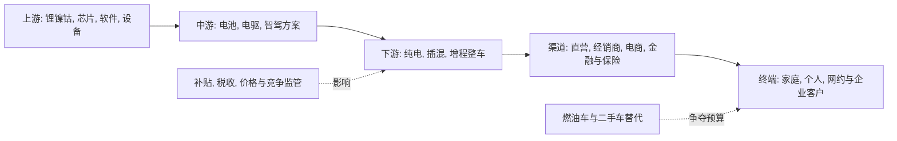

# 中国新能源汽车行业问题研究报告: 为什么最近价格战这么激烈

## 1. 直接回答

中国新能源汽车价格战激烈, 核心不是单一的"产能过剩", 而是五股力量在同一时期叠加: 新能源汽车从增量普及进入存量替代和份额争夺阶段; 车企前期形成的产能, 门店, 研发和供应链投入具有很高固定成本; 电池和零部件降本给头部企业提供了降价空间; 智驾, 快充和混动技术快速迭代使旧款库存加速贬值; 同时经销商, 供应商和资本市场都用销量或份额评价车企, 促使企业把短期销量放在单车利润之前.

需求并不弱. 2025年中国新能源汽车销量达到1649万辆, 同比增长28.2%, 新车销量占比47.9%. 但行业供给扩张和车型投放更快, 竞争对象也从新能源品牌之间扩大为新能源对燃油车, 自主品牌对合资品牌, 纯电对插混和增程的多线竞争. 因而"总量高增长"与"单个企业订单不足"可以同时成立. [工信部转载中汽协数据](https://www.miit.gov.cn/jgsj/zbys/qcgy/art/2026/art_4c5ed7009d21485da32b2a01abcf2819.html)

价格战之所以容易启动, 是因为汽车是高固定成本产业. 当工厂, 模具, 研发和渠道已经投入后, 多卖一辆车可以摊薄固定成本并带来现金流. 国家统计局显示, 2025年二季度汽车制造业产能利用率为71.3%, 同比下降1.7个百分点. 这一口径包含燃油车与新能源汽车, 不能直接等同于新能源产能利用率, 但足以说明整车体系存在较强的开工和摊销压力. [国家统计局](https://www.stats.gov.cn/xxgk/sjfb/zxfb2020/202507/t20250715_1960404.html)

成本下降又让降价成为可执行策略. IEA称中国2024年电池价格下降近30%, 平均纯电动车电池包价格降至每千瓦时100美元以下; 宁德时代年报披露碳酸锂价格从2022年四季度超过60万元/吨降至2024年12月约7.2万元/吨. 成本降幅并不必然全部让给消费者, 但在激烈竞争中, 头部车企会把成本红利转化为低价, 迫使其他企业跟进. [IEA](https://www.iea.org/commentaries/the-battery-industry-has-entered-a-new-phase), [宁德时代2024年年报](https://www.catl.com/en/uploads/1/file/public/202505/20250512071033_9of2dqw816.pdf)

最后, 这是一次产业洗牌. 头部企业希望用规模, 垂直整合和现金流优势提高淘汰门槛; 腰尾部企业则需要销量证明生存能力, 维持渠道信心和融资能力. 因此双方都有降价动机. 监管正在限制低于成本倾销, 虚假促销和过长供应商账期, 会降低无序竞争的极端程度, 但不会消除基于真实降本, 产品升级和规模效率的价格竞争. [市场监管总局价格行为合规指南](https://www.samr.gov.cn/zw/zfxxgk/fdzdgknr/jjjzs/art/2026/art_10120651065444b5b3b070dcae41e98a.html)

进一步看, 第一重矛盾是"行业高增长"与"企业目标更高". 1649万辆是很大的市场, 但企业决策并不是按行业总量进行. 每家车企都基于自身工厂, 平台和渠道设定销量目标, 多家企业目标相加往往高于真实需求. 新能源还在替代燃油车, 传统车企不能退出; 新势力需要证明商业模式, 也不能主动放弃规模. 于是供给不仅是物理产能, 还包括组织的销量目标, 新车型计划和渠道任务. 当目标总和超过消费者当期购买量, 价格就成为最快的清算工具.

第二重矛盾是"规模经济"带来的策略不对称. 汽车研发, 工厂, 模具, 软件平台和门店都是前置投入, 短期内无论销量多少都要承担. 对拥有现金和成本优势的企业, 降价可以提高开工率, 摊薄研发与折旧, 还可能挤压对手. 对弱企业, 不跟价会立即损失订单和经销商信心, 跟价则侵蚀现金. 强者和弱者动机不同, 行动却相同: 都选择降价. 这解释了为什么即使很多企业公开反对价格战, 市场仍会反复出现跟价.

第三重矛盾是"成本下降"和"利润下降"同时存在. 电池材料降价, 磷酸铁锂普及, 平台化设计, 一体化压铸和国产芯片替代确实降低了部分制造成本. 但企业也在增加智驾算力, 传感器, 快充, 座舱和营销投入, 价格降幅还可能超过成本降幅. 因此不能简单说降价都是亏本倾销, 也不能说降本足以覆盖全部优惠. 应当比较单一车型的成本下降, 配置变化和真实成交价, 而不是只看指导价.

第四重矛盾是"快速创新"造成旧产品折价. 传统汽车的换代周期较长, 新能源汽车的软件, 芯片, 电池和补能技术却可能在一年内明显升级. 新款一旦以相近价格提供更长续航或更强智驾, 旧款即使指导价不变也会失去竞争力. 厂商只能降价清库, 经销商则担心库存贬值而加大促销. 消费者预期未来更便宜又会延后购买, 迫使厂商用限时权益刺激订单, 构成价格预期的自我强化.

第五重矛盾是"国内竞争"与"全球消化"不同步. 中国车企拥有成本和供应链优势, 出口和海外建厂提供增量空间, 但关税, 本地法规, 渠道建设和品牌认知使海外扩张速度低于国内产能释放速度. 短期不能出口的供给仍回到国内市场争夺. 因而出海可以缓解但不能立刻终止价格战; 只有海外销量, 国内产能退出和品牌集中共同推进, 供需压力才会实质下降.

综合排序, 供给和销量目标过密是底层条件, 成本下降是可执行条件, 技术迭代是触发器, 规模与现金流竞争是放大器, 监管与行业出清则决定持续时间. 这比把原因归结为补贴或某一家企业降价更完整. 单一企业可以点燃某一轮降价, 但如果没有上述结构性条件, 其他企业不会如此迅速和广泛地跟进.

## 2. 结论摘要

从因果重要性看, "供给与目标过密"应排第一. 它不等于简单的工厂产能过剩, 还包括同一价格带车型过多, 新车发布节奏过快, 品牌销量目标之和过高, 燃油车产能向新能源转型但尚未退出等组织性供给. 如果没有这一层, 电池降本更可能转化为利润; 正因为订单稀缺, 降本才被迅速让渡给消费者.

"成本与规模优势"排第二. 头部企业能够把电池, 电驱, 芯片, 平台和渠道协同, 单车边际成本更低. 它们降价不仅为了卖出当前车型, 还为了扩大供应链采购量, 提高数据积累, 摊薄软件研发并建立行业价格锚. 当龙头重新定义某一价格带的配置标准, 竞争者面对的不是是否愿意降价, 而是原产品是否还有可比性.

"技术迭代与库存"排第三. 2025年以来智驾配置向主流价位下沉, 800伏快充, 混动效率和座舱芯片也在更新. 这些变化使价格战不再只表现为现金优惠: 同价增配, 免费软件, 金融贴息, 置换补贴和保险权益都会降低消费者的有效支付价格. 因此只统计厂商指导价会低估竞争强度.

"渠道与考核"排第四. 经销商承担库存资金和旧款贬值风险, 厂商承担销量目标与工厂开工压力. 当新车上市或季度末考核临近, 厂商返利和经销商折扣叠加, 容易形成短期价格踩踏. 直营模式虽减少经销商自主折扣, 但也可能通过限时权益, 金融方案和免费选装实现类似效果.

"政策与资本"更多是放大或约束变量. 以旧换新和税收优惠可以释放需求, 也会造成消费者等待政策窗口; 融资和市值压力可能鼓励企业追求交付规模; 反内卷和价格合规规则则限制低于成本排挤, 虚假促销和供应链压榨. 政策不会替企业决定正常市场价格, 但会改变哪些竞争手段可以持续.

判断价格战是否真正缓和, 不应只看某个月是否少了降价新闻. 更可靠的组合信号是: 行业真实成交价连续企稳; 批发与零售差收窄; 经销商库存下降; 新车型数量和销量目标趋于理性; 弱势品牌退出或合并; 供应商应收账款周期改善; 头部企业单车利润和经营现金流不再以更大促销换取. 只有这些指标同时改善, 才说明竞争从透支利润的价格战转向由真实效率支持的性价比竞争.

对消费者而言, 短期低价提高可负担性, 但选车时应同时考察企业持续经营能力, 售后网络, 电池质保, 软件维护和二手残值. 如果低价来自不可持续的现金补贴而非真实降本, 未来可能通过服务收缩, 保值率下降或品牌退出转嫁成本. 因此"买得便宜"和"持有成本低"并不总是同一件事.

| 观点 | 原因 | 事实依据 | 产业发展推演 |
|---|---|---|---|
| 供给扩张快于单一品牌的有效需求 | 固定资产, 新车型和渠道同时扩张 | 2025年二季度汽车制造业产能利用率71.3% | 淘汰落后产能和弱品牌, 集中度上升 |
| 降本扩大价格战弹药 | 电池材料, 制造效率和平台化降本 | 中国电池价格2024年下降近30% | 价格中枢继续下移, 配置继续上移 |
| 技术迭代把价格战变成配置战 | 智驾, 快充, 混动快速下沉 | 2025年智驾向10万至20万元区间普及 | 老款降价清库, 新款增配不加价 |
| 企业优先抢份额和现金流 | 规模摊薄固定成本, 渠道和融资看销量 | 2024年汽车行业利润率4.3%, 2025年一季度3.9% | 弱企业现金流风险上升 |
| 监管只能约束无序竞争 | 合规规则禁止低于成本排挤和虚假促销 | 2026年价格行为合规指南生效 | 明面价格战收敛, 价值战与效率战持续 |

## 3. 研究边界

| 项目 | 内容 |
|---|---|
| 地区 | 中国大陆新车市场 |
| 时间范围 | 重点观察2023年至2026年上半年, 以2025年完整数据为主 |
| 行业口径 | 新能源乘用车整车及其核心供应链, 同时纳入燃油车替代竞争 |
| 包括 | 纯电, 插混, 增程; 整车, 动力电池, 渠道, 消费者和监管 |
| 不包括 | 商用车专项竞争, 二手车独立市场, 单一上市公司估值 |
| 关键假设 | "最近"指2025年以来的新一轮降价与增配; 价格战包含直接降价, 保险补贴, 置换补贴和增配不加价 |

### 3.1 研究计划摘要

| 项目 | 内容 |
|---|---|
| 母问题 | 为什么总量仍高增长时, 中国新能源汽车价格竞争却进一步激化 |
| 子问题 | 供需是否失衡; 降本是否支持降价; 技术与渠道如何放大竞争; 企业为什么接受低利润; 监管能否终止价格战 |
| 选择的分析层级 | 宏观政策与消费, 中观供需与竞争结构, 议题树; 微观仅用代表性机制 |
| 必须验证的事项 | 新能源销量与渗透率, 产能利用率, 行业利润率, 电池成本, 监管边界 |

### 3.2 来源矩阵和证据质量

| 关键 Claim | 来源类型 | 本报告用途 | 证据层级 | 证据质量 | 来源状态 | 独立验证状态 | 限制和缺口处理 |
|---|---|---|---|---|---|---|---|
| `claim-nev-sales-2025`: 2025年新能源汽车销量1649万辆, 占新车47.9% | 工信部转载中汽协 | 市场规模和渗透率 | near-primary | high | obtained | single-source-primary | 工信部页面注明数据源为中汽协 |
| `claim-auto-utilization-2025q2`: 2025年二季度汽车制造业产能利用率71.3% | 国家统计局 | 供给压力代理指标 | primary | high | obtained | single-source-primary | 包含燃油车, 不等于新能源专属产能利用率 |
| `claim-industry-profit-pressure`: 2024年行业利润率4.3%, 2025年一季度3.9% | 工信部转载评论及行业数据 | 盈利压力 | near-primary | medium | obtained | single-source-primary | 需用分车企财报验证结构差异 |
| `claim-battery-cost-decline`: 中国电池价格2024年下降近30% | IEA分析 | 降本机制 | near-primary | high | obtained | independently_verified | 与宁德时代原料价格披露不同口径交叉验证 |
| `claim-price-regulation`: 监管限制低于成本排挤和虚假促销 | 市场监管总局 | 政策边界 | primary | high | obtained | single-source-primary | 法规约束不等于价格竞争消失 |

关键证据质量说明: 销量, 产能利用率和监管规则来自官方或近一手来源, 可靠性较高. 产能数据不能细分新能源, 行业利润率也不能反映企业间巨大差异, 因此本报告对"全面产能过剩"和"所有车企亏损"不作事实断言.

### 3.3 检索缺口闭环结果

| 缺口 | 已尝试轮次和来源 | 当前状态 | 为什么仍重要 | 未补齐原因 | 下一步来源 |
|---|---|---|---|---|---|
| `gap-nev-capacity-utilization`: 新能源乘用车专属产能利用率 | 第1轮国家统计局汽车制造业; 第2轮中汽协; 第3轮公开行业资料 | 部分补齐 | 决定供给过剩程度 | 公开官方口径仅提供汽车制造业总体值, 未提供统一新能源分项. | 中汽协企业产能调查或车企工厂级产销数据 |
| `gap-real-transaction-price`: 全行业真实成交价降幅 | 第1轮监管价格文件; 第2轮协会数据; 第3轮公开车型价格资料 | 部分补齐 | 区分标价, 权益和真实降幅 | 指导价, 权益, 金融贴息和置换补贴口径不统一, 公开环境无完整数据库. | 乘联会车型成交价数据库或保险上牌价格 |
| `gap-brand-unit-economics`: 分品牌单位经济性 | 第1轮统计局行业利润; 第2轮代表车企财报; 第3轮公开行业分析 | 部分补齐 | 判断谁能长期打价格战 | 财报业务分部与确认口径不同, 无法形成可比全行业数据. | 车企年报, 业绩会和车型级成本拆分 |

## 4. 行业一句话定义

中国新能源汽车行业是以纯电, 插电混动和增程乘用车为终端, 由电池, 电驱, 芯片, 软件, 整车制造, 直销或经销渠道及充换电服务共同构成, 并与燃油车争夺同一购车预算的产业系统.

## 5. 行业地图



| 模块 | 内容 | 与问题的关系 |
|---|---|---|
| 纵向产业链 | 原材料和芯片 -> 电池电驱 -> 整车 -> 渠道 -> 消费者 | 上游降本向整车传导, 整车又向供应商压价和延长账期 |
| 横向竞争结构 | 传统自主, 新势力, 合资, 纯电, 插混, 增程, 燃油车 | 多种路线在同一价格带重叠, 任何一方降价都会触发连锁跟随 |
| 生产要素 | 资本, 工厂, 软件人才, 数据, 品牌, 渠道和供应链 | 固定成本高, 规模和数据飞轮使企业优先争销量 |
| 生产关系 | 整车厂主导供应商与渠道, 政府规范竞争, 平台掌握流量 | 压力沿供应链传递, 终端权益变得复杂 |
| 关键流向 | 消费者收入流向整车和金融; 成本流向电池与零部件; 数据回流智驾研发 | 价格战不仅争订单, 也争数据, 渠道信心和生态入口 |

## 6. 问题拆解和议题树

```text
母问题: 为什么中国新能源汽车行业最近价格战这么激烈
- 子问题1: 供给扩张是否快于单一品牌可获得的需求
- 子问题2: 成本下降和规模经济是否为降价提供空间
- 子问题3: 技术迭代, 产品同质化和渠道机制如何触发跟价
- 子问题4: 企业为何愿意牺牲短期利润换取份额
- 子问题5: 监管能否让竞争从价格回到价值
```

## 7. 证据链分析

| 子问题 | 结论 | 事实 | 观点 | 推断 | 来源/依据 | 证据层级 | 证据质量 | 来源状态 | 置信度 |
|---|---|---|---|---|---|---|---|---|---|
| 供需是否失衡 | 行业总需求强, 但品牌和车型层面供给更拥挤 | 2025年新能源销量增长28.2%; 汽车产能利用率二季度71.3% | 中汽协称无序价格战影响行业效益 | 总量增长不能消除结构性过剩 | 工信部, 国家统计局 | near-primary | high | obtained | 高 |
| 降本是否支持降价 | 部分降价来自真实成本下降 | 中国电池价格2024年下降近30% | IEA认为竞争使车企把价格压到可承受利润边界 | 头部垂直整合企业更有主动降价能力 | IEA, 宁德时代年报 | near-primary | high | obtained | 高 |
| 技术如何放大 | 新技术下沉使旧款快速失去相对价值 | 智驾向10万至20万元区间普及 | 行业称竞争从价格战向智驾战扩展 | 增配不加价实质上也是价格下降 | 省工信厅转载新华网及百人会观点 | secondary | medium | obtained | 中 |
| 企业为何跟价 | 销量关系固定成本摊薄, 现金流和生存预期 | 行业利润率下降, 供应商账期拉长 | 监管称无序竞争冲击研发和供应链 | 腰尾部不跟价可能先失去渠道和融资 | 工信部 | near-primary | medium | obtained | 中高 |
| 监管是否终止 | 监管抑制低价倾销与虚假促销, 但不禁止效率竞争 | 2026年价格合规指南生效 | 政策目标是优质优价和公平竞争 | 价格战将转成成本, 配置, 服务和出海效率竞争 | 市场监管总局 | primary | high | obtained | 高 |

## 8. 生命周期判断

**阶段结论:** 中国新能源汽车行业整体处于高增长后半程, 并开始呈现成熟期的份额竞争特征.

**证据:** 2025年销量仍增长28.2%, 新车占比已达47.9%. 高渗透说明需求真实性和规模性已经验证; 同时利润率承压, 车型密集投放, 龙头主动降价和监管介入, 都是从增量扩张转向存量竞争的信号.

**反证:** 新能源对燃油车的替代仍未完成, 海外市场和区域下沉仍可带来增量, 电池与智能化仍在快速创新, 因此不能把行业整体判定为成熟或衰退.

**置信度:** 中高. 销量和渗透率证据强, 但缺少新能源专属产能利用率与统一成交价数据库.

**研究含义:** 高增长后半程最容易出现价格战: 市场还足够大, 吸引众多企业投入; 但份额格局开始固化, 落后者的追赶窗口收窄, 因此企业争夺规模与淘汰资格的动机同时增强.

## 9. 七个核心模块分析

### 9.1 可行性

**结论:** 新能源汽车商业需求已被验证, 价格战不是需求不存在, 而是消费者对同质化产品更加价格敏感.

**证据:** 2025年销量1649万辆且占新车47.9%. 纯电和插混已覆盖从微型车到大型SUV的主要价格带. 但消费者仍会比较补能, 保值率, 智驾和售后, 单一续航卖点的溢价下降.

**机制:** 当产品从尝鲜品转为大众耐用品, 用户更关注全生命周期成本和配置性价比. 企业只能通过降价或增配消除购买犹豫.

**研究含义:** 价格战会促进普及, 但不能替代安全, 服务和可靠性; 缺少这些能力的低价车型难形成长期需求.

**关键指标和后续验证:** 上牌量, 退订率, 保值率, 用户净推荐值, 质保成本; 推荐查公安上牌, 保险和车企售后数据.

### 9.2 规模性

**结论:** 行业仍有替代空间, 但增长红利不足以让所有既有品牌和规划产能同时达标.

**证据:** 新能源新车占比接近一半, 说明剩余燃油车市场仍可转化; 同时汽车制造业二季度产能利用率71.3%, 表明体系开工压力仍在. 两个指标口径不同, 只能合并为结构性判断.

**机制:** 厂商对总市场增长的乐观预期会转化为相似产品和产能, 但消费者购买只集中到少数爆款. 总量扩张由此与企业层面的产能闲置并存.

**研究含义:** 未来销量仍可能增长, 但价格战不会因增长自动终止; 集中度, 车型成功率和出口消化能力更关键.

**关键指标和后续验证:** 分品牌产销差, 工厂开工率, 库存系数, 新车上市后三个月销量; 推荐查中汽协, 乘联会和车企公告.

### 9.3 防守性

**结论:** 单一车型和硬件配置壁垒下降, 规模, 垂直整合, 软件数据, 品牌和渠道服务成为主要防线.

**证据:** 电池和智驾能力快速下沉, 竞争者可以在较短周期复制参数. 与此同时, 头部企业能够内部采购电池和关键零部件, 共享平台并摊薄研发.

**机制:** 参数同质化降低转换成本, 迫使企业用价格争订单; 只有形成低成本供应链, 用户生态和售后网络, 才能避免被迫逐次跟价.

**研究含义:** 价格战会提高名义销量门槛, 但最终淘汰的不是价格最高者, 而是没有成本优势也没有差异化价值者.

**关键指标和后续验证:** 单平台销量, 零部件自制率, 软件活跃率, 售后网点, 获客成本和复购率; 推荐查年报及渠道调研.

### 9.4 盈利性

**结论:** 整车利润池被压缩并向具备规模和供应链议价权的少数企业集中, 压力同时向经销商和零部件供应商传导.

**证据:** 工信部转载材料显示2024年汽车行业利润率4.3%, 2025年一季度3.9%. 2025年6月, 17家重点车企承诺供应商支付账期不超过60天, 反映此前竞争压力已表现为账期拉长和供应商周转困难. [工信部](https://www.miit.gov.cn/xwfb/mtbd/wzbd/art/2025/art_2a725e2698934b4091148cd56fa4bca0.html)

**机制:** 降价先压缩单车毛利; 为维持研发和营销, 整车厂会要求供应商降价, 延后付款或增加返利. 强势企业凭规模摊薄成本, 弱势企业则可能陷入"销量越低, 单车成本越高, 越需要降价"的循环.

**研究含义:** 价格战的真实终点取决于现金流和供应链承受力, 不是新闻发布的指导价. 企业退出, 并购和车型收缩将是更重要的结束信号.

**关键指标和后续验证:** 单车毛利, 经营现金流, 应付账款天数, 经销商库存和供应商坏账; 推荐查整车与核心零部件公司财报.

### 9.5 估值

**结论:** 行业估值逻辑由"渗透率增长"转向"可持续盈利与现金流", 这会反过来促使企业在短期继续争规模.

**证据:** 高渗透和低利润同时出现, 资本市场不再只奖励交付增长, 也关注毛利, 现金流和出海. 但本报告未进行上市公司估值比较, 该判断属于行业层面的推断.

**机制:** 当企业担心失去规模叙事与融资能力时, 可能用优惠维持交付; 当市场转而惩罚亏损时, 企业又必须收缩促销. 两种压力交替使价格政策更频繁.

**研究含义:** 估值压力是价格战的放大器而非根因. 根因仍是供给, 成本和竞争格局; 资本只改变企业承受亏损的时间.

**关键指标和后续验证:** 现金储备, 自由现金流, 融资事件, 销量目标完成率; 推荐查交易所公告和财报.

### 9.6 外部因素

**结论:** 政策从单纯鼓励扩张转向"促消费加反内卷", 在托底需求的同时约束不合规降价.

**证据:** 2025年工信部明确整治汽车行业内卷式竞争; 2026年市场监管总局发布价格合规指南, 要求以成本为基础和供求为导向定价, 并提示低于生产成本排挤竞争对手的法律风险.

**机制:** 以旧换新和税收政策刺激总需求, 也可能造成政策窗口前抢销量; 竞争监管则抬高虚假促销, 低价倾销和压榨供应链的合规成本. 出口壁垒又限制国内产能向海外转移的速度.

**研究含义:** 无序价格战可能降温, 但合规的成本下降和产品竞争仍会持续. 价格透明度提高后, 竞争会更多体现为配置, 金融, 服务和残值保障.

**关键指标和后续验证:** 购置税与以旧换新政策, 价格执法案例, 出口关税和本地化产能; 推荐查财政部, 商务部, 市场监管总局和海关.

### 9.7 景气度

**结论:** 行业呈现"量强, 价弱, 利分化"的景气组合, 短期价格竞争仍有惯性.

**证据:** 2025年新能源销量增长28.2%, 但行业利润率此前下滑, 监管部门连续提示无序价格竞争和供应链账期. 这说明销量繁荣尚未普遍转化为利润繁荣.

**机制:** 电池降本, 新车投放和促销共同拉动销量, 同时压低成交价和旧车型残值. 头部企业以量换规模效率, 尾部企业以价换生存时间, 形成竞争惯性.

**研究含义:** 只有库存下降, 车型淘汰, 产能退出和现金流改善同时出现, 才能判断价格战实质缓和. 单月涨价或停止某项权益不足以说明周期反转.

**关键指标和后续验证:** 零售与批发差, 库存预警指数, 平均成交价, 行业利润率, 供应商账期和企业退出数量; 推荐月度跟踪中汽协, 乘联会和统计局.

## 10. 多视角压力测试

本次因并行Agent名额已满, 采用单Agent模拟多视角压力测试.

| 视角 | 质疑 | 为什么重要 | 需要验证 |
|---|---|---|---|
| 行业专家 | 71.3%的产能利用率包含燃油车, 不能直接证明新能源产能过剩 | 若新能源产能利用率更高, 核心解释应从产能转向车型同质化 | 新能源工厂和品牌分项开工率 |
| 投资研究员 | 行业平均利润率掩盖头部盈利和尾部亏损 | 价格战持续时间由强者现金流而非行业均值决定 | 分企业汽车业务毛利和自由现金流 |
| 政策研究者 | 监管可能显著提高低价倾销成本 | 会改变促销形式和退出速度 | 价格指南执法案例和处罚口径 |
| 经营者 | 消费者真正看的是总购车成本, 不是指导价 | 保险, 金融和置换权益可能使表面价格失真 | 真实成交价及全生命周期成本 |
| 反方视角 | 价格下降也可能是正常技术进步, 不应全部称为恶性价格战 | 混淆二者会高估行业风险并低估消费者福利 | 成本降幅与成交价降幅的车型级拆分 |

## 11. 风险, 机会和不确定性

| 类型 | 内容 | 证据/依据 | 触发条件 |
|---|---|---|---|
| 事实风险 | 利润与现金流压力传向供应商和售后 | 工信部披露账期拉长及供应商周转困难 | 促销扩大而付款周期再度上升 |
| 假设风险 | 将汽车总体产能利用率代表新能源产能 | 当前缺少统一新能源专属口径 | 分项数据证明新能源产能高利用率 |
| 数据缺口 | 缺少统一真实成交价和单车贡献利润 | 权益形式复杂, 财报口径不同 | 获得保险或车型级价格数据库 |
| 上行机会 | 真实降本提升可负担性并加速燃油车替代 | 电池成本下降, 新能源占比提高 | 成本降幅大于价格降幅且质量稳定 |
| 触发条件 | 行业从价格战转向价值战 | 监管, 产能退出, 库存下降和产品差异化共同发生 | 成交价企稳且现金流改善 |

## 12. 后续验证清单

| 待验证问题 | 当前证据状态 | 为什么重要 | 推荐来源 | 优先级 |
|---|---|---|---|---|
| 新能源专属产能利用率是多少 | 部分补齐 | 判断供给压力真实程度 | 中汽协企业调查, 工厂产销公告 | 高 |
| 2025至2026年平均真实成交价下降多少 | 部分补齐 | 衡量价格战强度 | 乘联会, 保险上牌价格 | 高 |
| 哪些企业具备正的单车贡献利润 | 部分补齐 | 判断谁能长期降价 | 车企财报与业绩会 | 高 |
| 供应商60天账期承诺是否落实 | 已取得政策承诺, 执行待验证 | 衡量压力是否缓解 | 工信部检查, 供应商应收账款 | 中高 |
| 价格合规指南是否改变促销方式 | 新规已取得, 效果待观察 | 判断监管对竞争形式的影响 | 市场监管总局执法案例 | 中高 |

## 13. 报告合规自检表

| 检查项 | 是否通过 | 说明 |
|---|---|---|
| 行业具体问题模板完整 | 通过 | 保留1至13节完整结构 |
| 研究简报转译已完成 | 通过 | 内部锁定具体问题, 标准深度, 中文输出 |
| 已先直接回答用户问题 | 通过 | 第1节先给出五因素结论和机制 |
| 研究计划和来源矩阵完整 | 通过 | 含计划, 来源状态, 独立性和缺口闭环 |
| 行业地图和生命周期判断完整 | 通过 | 地图位于生命周期和七模块之前 |
| 七个核心模块完整 | 通过 | 9.1至9.7独立展开 |
| 七模块深度和五段结构达标 | 通过 | 均含结论, 证据, 机制, 研究含义和验证 |
| 报告深度 rubric 达标 | 通过 | 直接回答, 证据链和重点盈利模块充分展开 |
| 证据链区分事实/观点/推断 | 通过 | 第7节使用规范字段 |
| 证据层级和来源状态清楚 | 通过 | 关键来源标注primary或near-primary |
| 多视角压力测试完成 | 通过 | 并行名额不足, 已明示单Agent模拟5个视角 |
| 后续验证清单具体 | 通过 | 明确问题, 当前状态, 来源和优先级 |

本报告仅供研究和信息参考, 不构成投资建议, 也不构成任何收益承诺.
