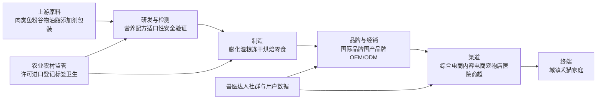

# 中国宠物食品行业研究报告

## 1. 行业一句话定义

中国宠物食品行业是为家庭饲养的犬猫等伴侣动物研发, 生产和销售满足日常营养, 零食互动及特定健康需求的食品体系. 本报告采用中口径, 覆盖犬猫干主粮, 湿粮, 冻干和烘焙粮, 零食及营养补充品, 不把宠物医疗, 用品, 服务和活体交易计入市场规模. 核心判断是: 行业仍处成长阶段, 但竞争指标已从品类渗透和渠道铺货, 转向品牌信任, 科学配方, 供应链效率, 全域复购和合规能力.

## 2. 研究边界

| 项目 | 内容 |
|---|---|
| 地区 | 中国大陆, 城镇犬猫消费为主要统计对象 |
| 时间范围 | 历史观察以2020-2025年为主, 基准年采用证据较完整的2024年, 趋势覆盖2026-2028年 |
| 行业口径 | 中口径宠物食品, 以犬猫商品粮为核心 |
| 包括 | 主粮, 湿粮, 零食, 冻干, 烘焙粮, 营养补充品, 上游原料, 制造, 品牌和渠道 |
| 不包括 | 宠物医疗, 药品, 用品, 美容, 保险, 寄养, 活体交易和非犬猫食品 |
| 关键假设 | 用户需要标准行业全览. 宏观与中观为必选层, 微观公司仅作为行业证据样本. 市场规模以城镇犬猫终端消费口径为主 |

### 2.1 研究计划摘要

| 项目 | 内容 |
|---|---|
| 母问题 | 中国宠物食品行业处于什么阶段, 增长与利润从哪里来, 竞争壁垒和未来机会风险是什么 |
| 子问题 | 市场规模与增速, 犬猫数量和单宠支出, 产业链利润池, 国产替代, 渠道迁移, 监管要求, 未来三年趋势 |
| 选择的分析层级 | 宏观层覆盖监管, 消费与社会结构. 中观层覆盖规模, 产业链, 竞争, 生命周期和七模块. 微观层只引用代表企业披露 |
| 必须验证的事项 | 2024年城镇犬猫数量及消费, 食品占比与细分口径, 监管有效性, 头部公司收入毛利与费用, 2025年行业延续性 |

本次研究建立了八个高影响 Claim, 优先访问农业农村部监管文件, 巨潮资讯上市公司年报和国家标准信息, 再用新华社及行业报告补充趋势. 由于协作槽位已被其他并行任务占满, 多视角环节降级为单一研究代理模拟行业, 投资, 监管, 经营和反方视角, 但证据准入规则不变.

### 2.2 来源矩阵和证据质量

| 关键 Claim | 来源类型 | 本报告用途 | 证据层级 | 证据质量 | 来源状态 | 独立验证状态 | 限制和缺口处理 |
|---|---|---|---|---|---|---|---|
| `claim-cn-pet-consumption-2024`: 2024年城镇犬猫消费3002亿元, 食品占52.8% | 白皮书经上市公司年报披露 | 市场规模, 生命周期 | near-primary | medium | obtained | same-origin-cross-check | 乖宝等多份年报均转引同一白皮书, 不是独立样本 |
| `claim-cn-pet-food-size-2024`: 按上述口径食品规模约1585亿元 | 白皮书数据与算术推导 | 规模性 | near-primary | medium | obtained | single-source-primary | 3002×52.8%, 与1668亿元公开口径不可直接并列 |
| `claim-cn-pet-population-2024`: 2024年犬5258万只, 猫7153万只 | 白皮书经乖宝年报披露 | 需求与猫经济 | near-primary | medium | obtained | single-source-primary | 仅覆盖城镇犬猫, 原始抽样方法未公开取得 |
| `claim-cn-pet-feed-regulation`: 行业实行生产许可, 进口登记, 标签与卫生管理 | 农业农村部第20号公告 | 合规门槛, 外部因素 | primary | high | obtained | single-source-primary | 属权威法规事实, 下一步核验地方执法和抽检强度 |
| `claim-gambol-2024-performance`: 乖宝2024年营收52.45亿元, 毛利率42.32% | 公司年报 | 盈利与头部样本 | primary | high | obtained | single-source-primary | 公司样本不能代表行业平均 |
| `claim-cn-pet-prosperity-2025h1`: 2025年上半年多家头部公司收入继续增长但分化 | 新华社对中报汇总 | 景气度 | secondary | medium | obtained | secondary-only | 应逐份核对2025中报, 报道仅作延续性信号 |
| `claim-cn-domestic-brand-share`: 国产品牌偏好和份额上升 | 新华社, Euromonitor转引, 公司披露 | 竞争格局 | secondary | medium | obtained | secondary-only | 数据库原始页未取得, 不作为精确CR值 |
| `claim-gambol-profit-mechanism`: 原料与营销费用共同决定利润 | 乖宝年报成本与费用明细 | 盈利机制 | primary | high | obtained | single-source-primary | 需用中宠和佩蒂相同口径做横向验证 |

最强证据是农业农村部公告与上市公司法定年报. 市场总量证据质量为中等, 原因是中国尚无按统一口径公开发布的宠物食品官方统计, 多份年报实际复用了同一行业白皮书. 报告因此把1585亿元作为2024年城镇犬猫食品消费的可复算代理, 而非国家统计意义上的精确市场总额.

### 2.3 检索缺口闭环结果

缺口闭环始终沿一手或近一手路线推进: 优先官方监管文件, 公司公告与财报, 交易所披露和行业协会原始调查, 仅在上述路径无法取得时使用可信数据库或权威媒体作补充. 表中没有虚构未执行的第三轮, 已证明存在付费或后台访问壁垒的项目按规则提前停止.

| 缺口 | 已尝试轮次和来源 | 当前状态 | 为什么仍重要 | 未补齐原因 | 下一步来源 |
|---|---|---|---|---|---|
| `gap-market-size-definition`: 2024年食品规模1585亿元与1668亿元的定义差异 | 初始: 乖宝年报白皮书口径. 第1轮: 新华社2025年报道. 第2轮: 世界宠物协会及合作贸易协会转述 | 部分补齐 | 直接影响市场规模和增速基线 | 公开材料没有给出1668亿元的完整方法表和可加总分项. | 获取2025中国宠物行业白皮书原表及新华社原始数据源方法附录. |
| `gap-market-concentration`: 全渠道品牌CR5和国产品牌份额连续序列 | 初始: 上市公司年报. 第1轮: 新华社转引Euromonitor. 第2轮: 行业报告公开摘要 | 仍未补齐 | 决定防守性和集中度判断 | 原始数据库为付费访问, 公开页只提供单品牌或平台口径. | Euromonitor Passport或NielsenIQ全渠道零售监测. |
| `gap-channel-economics`: 平台投放, 佣金和分渠道利润率 | 初始: 乖宝销售费用. 第1轮: 公司渠道收入. 第2轮: 平台公开资料 | 仍未补齐 | 决定品牌增长能否转化为净利润 | 平台后台和品牌投放ROI不公开, 已建立明确访问壁垒. | 生意参谋, 蝉妈妈, 公司CRM和投资者交流纪要. |

这些缺口分别约束规模基线, 竞争集中度和渠道利润判断. 在取得所列原始数据前, 本报告只保留方向性结论, 不把冲突口径拼接成单一精确市场规模, 也不推导未经验证的行业集中度或投放回报率.

## 3. 行业地图

| 模块 | 内容 |
|---|---|
| 纵向产业链 | 上游原料和包装, 配方与检测, 中游制造, 品牌运营, 经销与零售, 终端犬猫家庭 |
| 横向竞争结构 | 国际品牌在专业营养和长期品牌心智上领先. 国产头部以本土产品迭代, 内容电商和性价比追赶. 大量中小品牌与OEM形成长尾 |
| 生产要素 | 稳定动物蛋白, 配方人才, 适口性测试, 检测与追溯, 自动化工厂, 渠道运营, 用户复购数据和品牌信任 |
| 生产关系 | 原料商和工厂决定成本安全, 平台控制流量, 品牌承担营销和产品责任, 宠物店与医院影响专业推荐, 监管决定准入边界 |
| 关键流向 | 终端收入经平台和门店回流品牌与工厂. 原料, 物流与流量构成主要成本流. 用户反馈和喂养数据形成产品迭代的数据流 |

行业地图揭示了一个关键矛盾: 制造进入门槛被成熟OEM体系降低, 但长期经营门槛被食品安全, 配方可信度和高复购获客成本抬高. 因此市场会持续出现新品牌, 但稳定利润更可能沉淀在掌握品牌信任, 产品验证和渠道效率的少数企业.

## 4. 生命周期判断

**阶段结论:** 中国宠物食品整体仍处成长阶段, 但正从高速普及转向结构性成长. 主粮商业化已经较成熟, 湿粮, 冻干, 功能营养和猫食品仍保持较强品类扩张, 行业评价从单看销售增长转为同时看份额, 复购和利润质量.

**证据:** 乖宝年报转引的白皮书显示, 2024年城镇犬猫消费3002亿元, 同比增长7.5%; 犬猫总量达到1.2411亿只且猫增速高于犬. 食品占52.8%, 仍是最大支出项. 乖宝2024年收入增长21.22%, 2025年上半年乖宝和中宠收入仍分别增长32.72%和24.32%, 说明头部企业成长快于行业代理增速.

**反证:** 总体消费增速已从早期双位数高增长放缓到中高个位数, 佩蒂2025年上半年收入和利润下降, 表明行业增长并非所有企业共享. 市场集中度, 渠道费用率和2025年完整规模尚缺统一数据, 不能据头部公司表现推断全行业高景气.

**置信度:** 中高. 市场和企业数据支持成长判断, 但行业统计来自白皮书且同源复用, 对精确规模与集中度的置信度仅为中等.

**研究含义:** 对中国宠物食品行业而言, 成长仍提供总量与品类红利, 但成功条件已经前置成熟. 企业需要从流量爆品升级为可验证的产品体系和稳定复购, 资本与经营者应更重视利润率, 销售费用效率和食品安全记录.

## 5. 七个核心模块分析

### 5.1 可行性

**结论:** 商业可行性强. 食品贯穿宠物生命周期, 具有高频, 必需和强复购属性, 需求同时受生理刚需与家庭成员化情感支出支持.

**证据:** 2024年食品占城镇犬猫消费52.8%, 远高于用品和服务. 农业农村部已建立宠物饲料生产许可, 进口登记, 标签和卫生制度, 说明供给和需求已进入可标准化经营阶段. 乖宝2024年宠物食品及用品收入52.20亿元, 主粮和零食均形成大规模销售.

**机制:** 宠物需要每日进食, 主粮负责稳定复购, 零食和湿粮增加互动与客单, 功能营养满足健康管理. 成熟制造降低新品试产门槛, 监管与检测又把低质量供给挡在长期市场之外. 需求成立并不自动保证品牌盈利, 因为配方同质化和买量可能消耗毛利.

**研究含义:** 对中国宠物食品行业, 可行性的争议已从“有没有需求”转成“能否以合理获客成本形成可信复购”. 新进入者应优先验证留存, 换粮原因和客诉, 而不是只验证首单GMV.

**关键指标和后续验证:** 90/180天复购率, 主粮购买周期, 退货和客诉率, 单客贡献毛利, 获客回收期. 下一步应取得品牌CRM和平台复购数据, 并核验农业农村部地方许可与抽检记录.

### 5.2 规模性

**结论:** 市场空间仍可扩张, 但增长将更多来自猫食品, 单宠支出和品类升级, 而非犬猫数量单一驱动. 按可复算口径, 2024年城镇犬猫食品消费约1585亿元.

**证据:** 2024年城镇犬猫消费3002亿元, 食品占52.8%, 两者相乘为1585亿元. 宠物犬5258万只, 同比增1.6%; 宠物猫7153万只, 同比增2.5%. 主粮, 零食和营养品分别占宠物总消费35.7%, 13.5%和3.6%的公开转述, 与食品总占比基本相加吻合.

**机制:** 市场规模约等于宠物数量×商品粮渗透×单宠购买量×平均价格. 数量增速趋缓后, 湿粮替代部分干粮, 功能配方, 老龄宠营养和中高端国产化可以提高单宠支出. 反向约束来自宏观消费压力和平台比价, 它们可能把升级转成同价增质.

**研究含义:** 中国宠物食品行业的天花板仍未封闭, 但应避免用宠物经济总盘替代食品盘. 经营机会应落到细分动物, 生命阶段, 健康诉求和价格带, 而不是笼统押注“宠物经济”.

**关键指标和后续验证:** 城镇犬猫数量, 商品粮渗透率, 单宠年食品支出, 猫湿粮比例, 各价格带销量. 下一步需获取白皮书原始样本与NielsenIQ全渠道零售额, 解决1585亿元与1668亿元口径差异.

### 5.3 防守性

**结论:** 行业防守性呈两极分化. 制造本身中等, 头部品牌和专业营养体系较强, 依赖单一爆品和流量的白牌较弱.

**证据:** 乖宝披露截至2024年底累计形成5035份有效喂养数据报告, 并建设检测, 研发和消费者数据平台, 展示了头部企业在研发数据上的积累. 农业农村部要求许可, 标签与卫生合规, 抬升基础门槛. 另一方面, OEM/ODM成熟和电商上架降低了新品进入成本.

**机制:** 真正壁垒由产品安全记录, 配方和适口性验证, 供应链追溯, 品牌心智, 渠道自然流量和用户数据共同构成. 配方可以模仿, 但长期无事故记录与复购口碑难以速成. 平台流量让进入容易, 也让没有自然复购的品牌持续付费.

**研究含义:** 中国宠物食品行业可能在保持品牌多样性的同时提高头部份额. 细分品牌仍能凭单一功能或人群立足, 但需要把细分认知变成可验证效果和复购, 否则会被大品牌快速复制.

**关键指标和后续验证:** 全渠道CR5/CR10, 品牌自然搜索占比, 复购率, 研发与检测投入, 食品安全事件, 核心SKU生命周期. 下一步需取得Euromonitor或NielsenIQ连续份额序列.

### 5.4 盈利性

**结论:** 利润池主要位于自有品牌和高效渠道, 纯代工与低价白牌利润更易被原料和客户议价挤压. 高毛利不必然转成高净利, 销售费用是核心变量.

**证据:** 乖宝2024年宠物食品及用品毛利率42.32%, 境内毛利率45.62%, 直销毛利率53.11%, OEM/ODM毛利率33.18%. 同期销售费用10.55亿元, 同比增46.31%, 快于收入21.22%的增幅. 直接材料占其生产成本75.62%, 显示肉类等原料仍是制造成本核心.

**机制:** 自有品牌通过定价和用户资产获得毛利, 直销减少经销分成却增加投放, 履约与平台成本. 规模扩大可摊薄制造费用, 但若增长依赖直播和付费流量, 销售费用会吞噬品牌溢价. 原料成本下行能改善毛利, 但竞争可能把节省转为降价.

**研究含义:** 对行业盈利性的判断应同时看品牌毛利, 销售费用率, 经营现金流和存货, 不能只看收入. 更优模型是主粮形成稳定复购, 零食和湿粮提升客单, 功能产品提高毛利, 自有或深度绑定供应链稳定质量成本.

**关键指标和后续验证:** 分品类毛利率, 销售费用率, 投放ROI, 存货周转, 原料价格, 经营现金流. 下一步以乖宝, 中宠, 佩蒂和路斯2024-2025年报统一重算, 排除业务结构差异.

### 5.5 估值

**结论:** 行业适用消费品牌与食品制造的混合估值逻辑. 品牌型公司看收入增长, 份额, 复购和费用效率, 制造或出口型公司更应看产能利用率, 客户集中, 毛利与现金流.

**证据:** 乖宝2024年自有品牌收入35.45亿元, 占收入67.59%, 同比增29.14%; 其OEM/ODM毛利率明显低于直销. 佩蒂披露部分海外产能仍在爬坡, 国内品牌业务处战略投入期, 显示相同赛道内企业利润兑现周期不同.

**机制:** 成长期时份额提升可以支撑较高增长预期, 但当行业总增速回落, 市场会把估值锚转向可持续利润和现金流. 自有品牌提高长期价值, 也会在建设期抬高销售费用. 海外工厂和并购扩张能带来规模, 同时增加利用率与整合风险.

**研究含义:** 对中国宠物食品行业的估值研究应先按品牌, 代工, 出口和渠道结构分组, 不宜用一个倍数横比全部企业. 行业资本更可能奖励稳定复购和利润质量, 对单平台爆品与单一海外客户依赖给予折价.

**关键指标和后续验证:** 自有品牌占比, EBITDA与自由现金流, ROIC, 产能利用率, 客户集中度, 净现金. 下一步用上市公司公告和交易所数据建立可比组, 本报告不提供目标价或投资建议.

### 5.6 外部因素

**结论:** PEST总体支持行业成长, 但监管和消费分层同时加强. 政策推动规范化, 社会结构支持陪伴需求, 技术促进功能化, 经济压力则强化性价比竞争.

**证据:** 农业农村部第20号公告自2018年起建立宠物饲料专门管理, 并要求2019年后产品标签和卫生指标符合专门规定. 2025年国家标准计划启动全价犬粮和狗咬胶等标准修订, 说明标准体系仍在迭代. 猫数量和消费增速高于犬, 与城市小户型及年轻陪伴需求方向一致, 但后者属于机制推断而非本轮独立人口调查事实.

**机制:** 监管会淘汰无许可, 标签不规范和安全能力弱的供给, 同时增加检测与研发成本. 收入和消费信心决定高端化速度; 压力期消费者可能从进口高端转向国产中端, 不一定减少喂养量. 工艺和数据技术推动冻干, 烘焙, 湿粮和精准营养, 但功能宣称需要更强证据.

**研究含义:** 对行业而言, 合规不是成本附注而是品牌信任基础. 国产品牌最大的结构机会可能是“可信且有性价比”, 而不是单纯低价. 功能食品需把营销语言收敛到可验证的营养与健康支持边界.

**关键指标和后续验证:** 新版国家标准进度, 生产许可数量, 进口登记, 抽检不合格率, 居民可支配收入与消费信心, 国产品牌偏好. 下一步核验农业农村部及地方年度抽检数据库.

### 5.7 景气度

**结论:** 当前景气度中高但明显分化. 量端有复购和宠物数量支撑, 头部国产品牌仍获份额, 但企业间业绩差异和营销费用上升表明景气不是无差别上行.

**证据:** 2025年上半年, 新华社汇总显示乖宝和中宠收入分别增长32.72%和24.32%, 净利润分别增长22.55%和42.56%; 同期佩蒂收入下降13.94%, 净利润下降19.23%. 乖宝2024年销售量增长16.04%, 库存量下降5.70%, 是较健康的量库组合, 但只代表单一头部样本.

**机制:** 食品刚需使销量相对稳定, 猫食品和国产替代提供结构增量. 企业景气差异来自品牌力, 国内外业务结构, 新产能爬坡, 客户订单和渠道投放效率. 当流量成本高于毛利增量时, 收入景气不会转化为利润景气.

**研究含义:** 中国宠物食品行业总量仍向上, 但选品类和经营模式比押注行业均值更重要. 需要把上市公司收入当作供给侧信号, 不把它直接等同于终端市场增速.

**关键指标和后续验证:** 终端零售额和销量, 平均售价, 平台排名, 原料成本, 销售费用率, 库存和经营现金流. 下一步取得2025完整白皮书与企业年报, 交叉验证终端和供给侧景气.

## 6. 趋势推演

未来三年的基准情景是行业保持中个位数至高个位数的终端增长, 头部国产品牌仍可能凭份额提升跑赢行业. 这一判断的机制是宠物数量温和增长, 食品刚需, 猫占比提升和科学喂养升级, 但宏观消费和平台价格竞争限制全面提价. 领先指标包括城镇犬猫数量, 单宠食品支出, 猫湿粮比例, 国产品牌全渠道份额及头部企业销售费用效率.

第一条趋势是猫食品与湿态化. 2024年猫数量7153万只且增速高于犬, 猫市场消费增速也快于犬. 猫的饮水, 泌尿和适口性诉求有利于罐头, 妙鲜包和功能主粮. 触发条件是猫数量持续快于犬, 湿粮每公斤价格下降且消费者教育继续; 反向风险是同质化和高水分产品物流成本压低利润.

第二条趋势是国产替代从价格替代升级为可信替代. 新华社转引数据显示, 麦富迪2024年份额升至6.2%, 国产品牌偏好上升. 真正的持续条件不是营销声量, 而是检测, 追溯, 喂养验证和长期无重大安全事故. 若国产品牌能在中端价格带持续证明安全与营养, 进口大众高端品牌将承压; 若发生行业性安全事件, 信任可能迅速回流国际品牌.

第三条趋势是功能细分和老龄宠营养. 肠胃, 泌尿, 口腔, 皮毛和体重管理可提高客单与忠诚, 但必须区分营养支持和疾病治疗. 触发条件是标准更清晰, 企业积累可重复的喂养试验与兽医合作; 风险是夸大宣称和低证据配方引发监管或信任损失.

第四条趋势是渠道从单平台买量转向全域复购. 内容电商负责发现, 综合电商承接搜索复购, 宠物店与医院建立专业信任, 品牌会员沉淀用户数据. 乖宝直销增长59.33%但销售费用增长46.31%, 已显示增长与费用并存. 未来赢家需要让自然搜索, 会员和线下推荐降低边际获客成本.

上行情景由消费改善, 食品安全记录稳定, 国产中高端份额提升和原料成本平稳触发; 下行情景由重大安全事件, 平台价格战, 肉类成本上行和消费降级叠加触发. 最需要监测的不是单一GMV, 而是销量, 复购, 费用率, 库存和现金流是否同步改善.

从供给演化看, 行业还会经历一次从“产品多”到“证据强”的筛选. 膨化, 冻干和烘焙等工艺名称本身很容易成为营销标签, 但消费者最终需要的是营养完整性, 适口性, 消化表现和长期安全. 当国家标准修订, 平台信息披露和品牌检测报告逐步完善, 单靠新奇工艺获得溢价的难度会提高. 领先企业会把原料批次追溯, 喂养试验, 客诉分析和配方迭代连接成闭环, 中小企业则可能选择与专业工厂和第三方实验室深度合作. 该趋势的验证指标包括新品上市一年后的留存率, 质量投诉率, 检测批次覆盖率以及核心配方的持续复购.

从产业组织看, 并购和合作更可能围绕能力互补而不是单纯扩产. 品牌商需要湿粮, 冻干或海外生产能力, 制造商需要国内品牌和用户运营, 渠道商需要稳定的自有产品. 但并购是否创造价值取决于渠道和研发能否真正共享, 不能把收入简单相加. 若行业总增速回落而头部仍保持双位数增长, 份额集中和并购概率会上升; 若平台持续扶持长尾品牌, 集中过程可能更慢. 因此应同时观察头部企业内生增长, 并购商誉, 工厂利用率和全渠道份额.

区域上, 一二线城市更可能贡献湿粮, 功能营养和高端细分, 下沉市场更依赖国产中端主粮与高性价比零食. 这一判断目前是机制推断, 尚缺分城市等级的连续零售数据. 如果低线城市养宠家庭增长快于单宠预算, 行业会出现量增价平; 如果中高收入家庭把宠物健康预算从医疗前移至营养, 则功能食品会获得量价共振. 后续应使用白皮书城市样本, 平台收货地与价格带数据进行证伪.

## 7. 事实, 观点和推断分层

| 类型 | 内容 | 来源/依据 | 证据层级 | 证据质量 | 来源状态 | 置信度 |
|---|---|---|---|---|---|---|
| 事实 | 2024年城镇犬猫消费3002亿元, 食品占52.8% | 乖宝2024年报转引白皮书 | near-primary | medium | obtained | 中高 |
| 事实 | 宠物饲料受专门许可, 进口登记, 标签和卫生制度管理 | 农业农村部第20号公告 | primary | high | obtained | 高 |
| 事实 | 乖宝2024年收入52.45亿元, 宠食用品毛利率42.32% | 乖宝2024年报 | primary | high | obtained | 高 |
| 待核验事实 | 2024年宠物食品规模1668亿元 | 新华社2025年报道 | secondary | medium | obtained | 中, 与1585亿元定义冲突 |
| 观点 | 国产品牌正在从性价比替代走向产品信任替代 | 新华社采访, Euromonitor转引, 企业披露 | secondary | medium | obtained | 中 |
| 推断 | 行业处于成长阶段但竞争指标提前成熟 | 市场增速, 监管, 头部公司与费用数据综合 | near-primary | medium | obtained | 中高 |
| 推断 | 利润池将向强品牌和高效供应链集中 | 毛利差异, 费用结构和行业地图 | primary | medium | obtained | 中高 |

## 8. 多视角压力测试

| 视角 | 质疑 | 为什么重要 | 需要验证 |
|---|---|---|---|
| 行业专家 | 把行业归为成长阶段是否忽略一二线主粮成熟度 | 生命周期不同会改变规模和竞争权重 | 分城市等级商品粮渗透, 主粮与湿粮增速 |
| 投资研究员 | 头部收入高增是否主要依赖销售费用而非品牌复利 | 决定利润质量和估值锚 | 分平台投放ROI, 自然流量, 经营现金流 |
| 政策/监管研究者 | 功能营养宣称是否可能快于证据和标准 | 可能触发合规与信任风险 | 标签抽检, 广告处罚, 新版犬猫粮标准 |
| 经营者/创业者 | 细分功能品牌是否会被综合品牌快速复制 | 决定创业切入窗口 | 核心SKU复购, 专利与试验, 大品牌跟进速度 |
| 反方审稿人 | 1585亿元市场规模依赖同一白皮书, 可能存在样本偏差 | 会改变增长基线和市场吸引力 | 原始白皮书方法, 零售监测和企业sell-out交叉验证 |

压力测试后的修正是: 不把“头部高增”等同于“全行业高增”, 不把“国产偏好上升”等同于“国产全面胜出”, 也不把1585亿元视为无误差的官方统计. 结论保留在结构方向与机制层面, 精确份额和2025规模进入后续验证清单.

## 9. 风险, 机会和不确定性

| 类型 | 内容 | 证据/依据 | 触发条件 |
|---|---|---|---|
| 事实风险 | 销售费用增速可能快于收入 | 乖宝2024年销售费用增46.31%, 收入增21.22% | 平台流量价格上升, 自然复购不足 |
| 事实风险 | 企业景气分化 | 2025年上半年乖宝中宠增长, 佩蒂下降 | 海外订单, 新产能和品牌投放差异扩大 |
| 假设风险 | 猫经济持续快于犬经济 | 2024年猫数量和消费增速较快 | 猫数量增速回落或湿粮渗透停滞 |
| 数据缺口 | 市场规模, 集中度和渠道利润缺统一全渠道口径 | 2.3检索缺口 | 新数据库数据推翻当前代理口径 |
| 上行机会 | 国产中高端可信替代 | 头部份额和国产偏好上升信号 | 产品验证增强且无重大安全事件 |
| 上行机会 | 湿粮, 功能营养和老龄宠细分 | 猫占比与健康管理机制 | 消费者教育, 标准和兽医推荐共同推进 |

## 10. 后续验证清单

| 待验证问题 | 当前证据状态 | 为什么重要 | 推荐来源 | 优先级 |
|---|---|---|---|---|
| 1585亿元与1668亿元如何按对象和渠道桥接 | 部分补齐 | 决定市场规模基线 | 白皮书原表, 新华社原始数据源方法 | 高 |
| 2025年食品终端规模及真实增速 | 部分补齐 | 判断当前景气 | 2026白皮书原文, NielsenIQ, 上市公司sell-out | 高 |
| 全渠道CR5和国产品牌份额 | 仍未补齐 | 判断防守性和集中度 | Euromonitor, NielsenIQ | 高 |
| 各平台获客成本与复购 | 仍未补齐 | 判断利润质量 | 生意参谋, 蝉妈妈, 公司CRM | 高 |
| 宠物食品抽检不合格率和召回 | 仍未补齐 | 判断安全与合规壁垒 | 农业农村部及地方农业执法数据库 | 中高 |
| 猫湿粮和功能粮分项增速 | 部分补齐 | 验证主要结构机会 | 全渠道零售监测, 白皮书品类表 | 中高 |

## 11. 报告合规自检表

| 检查项 | 是否通过 | 说明 |
|---|---|---|
| 行业全览模板完整 | 通过 | 使用v63行业全览1-11章骨架 |
| 研究简报转译已完成 | 通过 | 内部锁定标准报告, 中文, Workspace Report File |
| 研究边界和研究计划完整 | 通过 | 含地区, 时间, 口径, 包括, 排除, 假设及研究计划 |
| 来源矩阵和检索缺口闭环结果完整 | 通过 | 来源字段与Evidence状态一致, 未虚构第三轮 |
| 行业地图和生命周期判断完整 | 通过 | 地图在生命周期与七模块之前 |
| 七个核心模块完整 | 通过 | 5.1-5.7均独立展开 |
| 七模块深度和五段结构达标 | 通过 | 每节含结论, 证据, 机制, 研究含义, 关键指标和后续验证 |
| 报告深度 rubric 达标 | 通过 | 主要章节达到具体结论, 双证据或命名缺口, 机制与验证要求 |
| 事实/观点/推断已分层 | 通过 | 第7章独立分层并披露冲突 |
| 证据层级和来源状态清楚 | 通过 | 使用v61枚举, 同源不计独立验证 |
| 多视角压力测试完成 | 通过 | 环境槽位满, 按规则降级为五视角模拟 |
| 后续验证清单具体 | 通过 | 明确问题, 状态, 来源和优先级 |

本报告仅供研究和信息参考, 不构成投资建议, 也不构成任何收益承诺.
