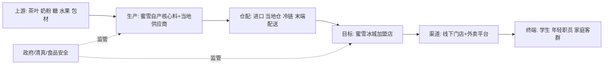

# 蜜雪冰城在东南亚市场的增长前景研究报告

## 0. 研报前置区

### 0.1 报告摘要

本报告的核心判断是: 蜜雪冰城在东南亚仍有较大的中长期增长空间, 但增长路径已经从“依靠加盟快速开店”转向“关店出清+单店提质+本地供应链补课后再扩张”。这意味着, 2026-2027年的门店净增数可能仍不稳定, 但若加盟商存活率、单店杯量、物流成本和合规率改善, 2028年以后可恢复更可持续的增长。

最强的正面因素是价格带匹配。蜜雪集团披露其产品通常约为1美元, 而印尼和越南拥有大量对价格敏感的年轻消费者。世界银行数据显示, 印尼2025年GDP增长5.1%, 越南2025年增长8.0%, 区域需求基础仍在扩张。但宏观增长不会自动转化为单店回报: 印尼实际工资承压、越南茶饮潮流迭代和高密度布店都会压低店均收入。

最关键的负面证据是, 公司2025年海外门店从4,895家减至4,467家, 净减428家; 公司特别指出印尼和越南门店数下降, 并将重点放在存量门店运营优化。因此, 门店数不能再作为唯一增长指标。本报告将“海外同店GMV、关店率、加盟商续约率、单店配送成本和食品安全/清真合规”视为比净开店更重要的验证变量。

### 0.2 关键结论

- 中长期前景评级为“审慎乐观”: 大众价格带、品牌IP和标准化供应链有明显匹配度, 但前提是单店模型通过二次验证。
- 2025年海外净关店428家表明第一轮粗放扩张已经碰到选址、密度、加盟商管理和物流效率瓶颈。
- 印尼仍是最大的增量市场, 但也是合规和群岛物流难度最高的市场; 越南的需求成长快, 但竞争和门店重叠需要更严格的商圈保护。
- 公司的真正护城河是“供应链+低价IP+加盟管理”, 但该护城河在中国已被验证, 在东南亚尚未完全本地化复制。
- 建议将未来5年分为“2026-2027优化期”和“2028-2030再扩张期”, 不以全区域齐头并进为目标。

### 0.3 核心指标总览

| 指标 | 行业读数 | 目标公司/产品读数 | 判断 | 证据/来源 |
|---|---|---|---|---|
| 市场规模 | 无可比统一口径, 印尼和越南人口及F&B需求庞大 | 海外门店4,467家 | 中长期空间大, 短期先优化 | 世界银行, 蜜雪2025年报 |
| 增速/渗透率 | 印尼2025年GDP+5.1%, 越南+8.0% | 海外店数同比-8.7% | 需求成长与门店出清并存 | 世界银行, 蜜雪2025年报 |
| 竞争强度 | 连锁品牌与本地品牌并存, 转换成本低 | 低价, IP和供应链形成差异 | 中高强度 | AP采访, 公司年报 |
| 盈利水平 | 低客单价使利润对杯量和租金敏感 | 集团利润59.3亿元, 海外利润未披露 | 集团强, 海外待证明 | 蜜雪2025年报 |
| 景气度 | 需求中性偏上 | 海外门店周期处于筑底优化 | 行业强于公司微观门店周期 | 宏观数据, 公司管理层披露 |
| 关键风险 | 合规, 同质化, 原料和汇率 | 印尼、越南店效, 加盟商回报不透明 | 核心风险是开店速度快于运营能力 | BPJPH, 蜜雪2025年报 |

### 0.4 图表清单或图表占位

| 图表编号 | 图表名称 | 形式 | 用途 |
|---|---|---|---|
| 图表1 | 蜜雪冰城东南亚价值链和目标位置 | Mermaid | 展示供应链, 门店和监管关系 |
| 图表2 | 2024-2025年海外门店数变化 | 指标表 | 识别从扩张转向优化的阶段变化 |
| 图表3 | 印尼, 越南和其他市场的分层策略 | 策略矩阵 | 将国家增长与仓配和商圈密度对齐 |
| 图表4 | 乐观, 基准和悲观情景的触发条件 | 情景表 | 将前景判断转化为可跟踪信号 |

## 1. 目标公司/产品综合判断

蜜雪冰城在东南亚的竞争定位不是高端茶饮, 而是“高频、低价、标准化甜品和饮品”。这个定位与印尼和越南的收入结构、炎热气候、年轻人口和社交消费匹配。其低价不只是营销策略, 而是来自自产核心原料、集中采购、仓配和大规模加盟的系统成果。因此, 只要本地供应链能够达到足够的密度, 它比单纯依靠门店现场采购的本地小品牌更有成本优势。

但实际经营已经证明, 中国模型不能按门店比例线性移植。2025年印尼和越南门店减少, 说明前期的加盟申请、商圈密度、加盟商能力和配送半径之间存在错配。对集团而言, 加盟店销售的主要是食材、包装和设备, 因此总部销售增长与加盟商投资回报可能不同步。如果加盟商经营压力未被尽早发现, 快速开店反而会透支品牌和加盟生态。

综合来看, 蜜雪的能力边界是: 擅长用工业化供应链把平价产品做到足够稳定, 但对跨国商圈管理、本地加盟商能力评估、清真和食品安全合规仍需建立更细粒度的系统。若公司能用2025年的出清换取2026-2027年的单店效率改善, 东南亚仍可成为第二增长曲线; 若只恢复开店速度而不披露店效, 增长质量将保持低置信度。

## 2. 研究边界

地理边界为东南亚, 重点是印尼和越南, 并纳入马来西亚、泰国、菲律宾、柬埔寨、老挝和新加坡作为比较。时间边界为2022-2025年的实绩回看和2026-2030年前景。产业口径是现制茶饮、果饮和冰淇淋零售, 不将包装饮料和正餐连锁纳入核心市场规模。目标对象是蜜雪集团旗下蜜雪冰城品牌, 不将幸运咖和鲜啤福鹿家在中国的增长纳入东南亚核心结论。

本报告选择宏观、中观和微观三层。由于用户未询问股价、估值或投资性, 不启用资本市场章节。不做精确门店数预测, 因为公司未披露按国家的店效、关店原因和开店计划; 本报告以情景和可验证指标代替伪精确预测。

### 2.1 研究计划摘要

| 项目 | 内容 |
|---|---|
| 条件模块 | multi_business_split=disabled; portfolio_analysis=disabled; capital_market=disabled |

| 子问题 | 分析层 | 需验证的核心证据 |
|---|---|---|
| 价格带是否存在持续需求 | 宏观/中观 | GDP、居民收入、F&B消费和茶饮趋势 |
| 门店是否还能规模化扩张 | 中观 | 存量门店、开关店、商圈密度和市场空白 |
| 中国成本优势能否复制 | 中观/微观 | 海外仓配、本地采购、配送半径和毛利率 |
| 加盟商生态是否健康 | 微观 | 单店GMV、回本期、续约率、关店原因 |
| 监管和本地化是否构成瓶颈 | 宏观/微观 | 清真、食品安全、劳动、特许经营和税务合规 |

### 2.2 来源矩阵和证据质量

| 关键 Claim | 来源类型 | 本报告用途 | 证据层级 | 证据质量 | 来源状态 | 独立验证状态 | 限制和缺口处理 |
|---|---|---|---|---|---|---|---|
| `claim-mixue-overseas-stores-2025`: 2025年海外门店减少 | 港交所年报 | 判断扩张阶段 | primary | high | obtained | single-source-primary | 公司未披露各国完整明细 |
| `claim-mixue-id-vn-optimization`: 印尼、越南存量店调整 | 港交所年报 | 识别运营瓶颈 | primary | high | obtained | single-source-primary | 缺少关店原因和店效 |
| `claim-mixue-financial-capacity`: 集团收入、利润和毛利率 | 审计年报 | 评估资金和供应链能力 | primary | high | obtained | single-source-primary | 未单独披露海外利润 |
| `claim-sea-macro-demand`: 印尼和越南宏观增长 | 世界银行 | 判断需求背景 | primary | high | obtained | single-source-primary | 宏观数据不等于茶饮需求 |
| `claim-vietnam-beverage-trends`: 越南F&B消费趋势 | iPOS/Nestlé抽样调研 | 判断品类趋势 | near-primary | medium | obtained | single-source-primary | 样本方法与蜜雪客群不完全等同 |
| `claim-indonesia-halal`: 印尼清真认证要求 | BPJPH官方说明 | 识别合规节点 | primary | high | obtained | single-source-primary | 需按原料和门店主体逐项核对 |

一手来源检索状态: 已取得港交所2025年年报、世界银行及印尼清真产品保障机构资料。尚未取得蜜雪按东南亚国家拆分的店效、收入、加盟商回报和关店原因, 因此对单国盈利的判断仅为中置信度推断。

### 2.3 检索缺口闭环结果

| 缺口 | 已尝试轮次和来源 | 当前状态 | 为什么仍重要 | 未补齐原因 | 下一步来源 |
|---|---|---|---|---|---|
| `gap-country-store-count`: 印尼、越南2025年末各自门店数 | 第1轮港交所年报; 第2轮招股书; 第3轮当地媒体转述 | 部分补齐 | 决定哪个市场处于出清或再扩张 | 年报只披露两国均下降, 没有期末分国表. | 公司IR门店清单或加盟系统. |
| `gap-store-economics`: 同店GMV和加盟商回本期 | 第1轮年报; 第2轮招股书; 第3轮公开搜索 | 仍未补齐 | 是判断增长质量的核心 | 公司未公开披露, 公开搜索无可靠统一口径. | 公司IR及独立加盟商抽样调研. |
| `gap-sea-market-size`: 东南亚现制茶饮可比市场规模 | 第1轮官方统计; 第2轮行业调研; 第3轮国别F&B报告 | 部分补齐 | 影响TAM判断 | 各来源对茶饮, 咖啡, 餐饮和包装饮料的定义不一致. | 分国别原始消费者调研和统计局细分零售表. |

## 3. 宏观环境分析

东南亚宏观环境对平价现制饮品总体有利, 但对蜜雪最重要的不是高速GDP, 而是消费者可支配现金、租金和劳动成本的相对变化。世界银行披露印尼2025年增长5.1%, 但2018-2024年实际工资年均下降1.1%。这对蜜雪是双向因素: 消费降级强化其低价吸引力, 但也压制加价和店均销售上限。越南2025年增长8.0%, 2026年仍预计保持较高增长, 对年轻消费和商业地产需求更有支撑。

社会文化上, 炎热气候、冰饮的日常性和年轻人的社交媒体传播都有利于高频消费。但产品口味不能静态复制。iPOS与Nestlé的2024年越南F&B调研涉及4,005家餐饮/咖啡门店和4,453名消费者, 显示抹茶采用率升至29.6%, 而曾经流行的浓茶风味采用率回落至21.4%。这说明流行趋势切换快, 蜜雪需在标准化与本地上新之间取得平衡。

政策与合规是会改变扩张节奏的硬约束。印尼BPJPH表明, 中大型企业食品和饮料清真认证义务已于2024年10月起生效, 小微主体及外国产品的后续节点指向2026年10月。这不只是门店证照问题, 还要求原料、添加剂和供应链文档能够追溯。任何一个上游环节的认证滞后, 都可能影响多家加盟店, 因此合规应被纳入供应链能力, 而不是仅当作法务成本。

## 4. 中观行业分析

### 4.1 行业一句话定义

本报告将东南亚大众现制饮品定义为: 通过街边店、社区店和商场店现场制作, 主要满足年轻消费者高频、即时、价格敏感型的茶饮、果饮和冰淇淋需求的连锁零售行业。

### 4.2 行业关键指标

| 指标 | 当前判断 | 证据/来源 | 对目标公司/产品的含义 |
|---|---|---|---|
| 市场规模 | 无可比官方统一口径, 但人口与门店消费代理指标庞大 | 世界银行、国别F&B调研 | 应自下而上测算商圈, 不宜套用一个TAM数字 |
| 增速/渗透率 | 需求增长, 但头部城市连锁店密度已较高 | 宏观增长、蜜雪关店信号 | 增量更可能来自次级城市和店型优化 |
| 供需关系 | 品牌供给快速增加, 消费者选择增多 | AP行业采访、门店趋势 | 价格优势必须与产品新鲜度并存 |
| 价格/成本 | 消费价格低, 原料、冷链和租金对利润敏感 | 公司产品定价与毛利率 | 供应链密度是盈利前提 |
| 政策/监管 | 食品安全、清真、特许经营和税务要求分国别 | BPJPH等官方来源 | 增加前置成本, 也有利于合规头部品牌 |
| 区域/出口 | 供应链正从中国输出向本地仓配和采购过渡 | 公司海外八国仓配 | 本地化速度决定关税、汇率和配送风险 |

### 4.3 行业地图

| 模块 | 内容 | 对目标公司/产品的含义 |
|---|---|---|
| 纵向产业链 | 原料-工厂-跨境/本地仓配-加盟店-消费者 | 仓配与店网密度必须协同 |
| 横向竞争结构 | 本地茶饮/咖啡、台式连锁、中国出海品牌和便利店饮品 | 低价有区分度, 但替代选择很多 |
| 生产要素 | 商圈、加盟资本、人员、标准化设备、数据和仓配 | 数字化选址和加盟管理是当前短板 |
| 生产关系 | 总部向加盟商销售料包和设备, 平台提供流量 | 总部与加盟商利益需通过店效而非开店对齐 |
| 关键流向 | 消费收入流向门店, 料包和设备收入流向总部 | 应避免总部收入增长掩盖加盟商回报下滑 |
| 目标位置 | 品牌、供应链组织者和加盟系统管理者 | 有规模优势, 同时承担食安与加盟生态责任 |

### 4.4 生命周期判断

**阶段结论:** 东南亚大众现制饮品总体处于成长期, 但蜜雪在印尼和越南的局部网络已进入“高速扩张后的整固期”。

**证据:** 区域宏观与F&B消费仍有增长, 中国茶饮品牌持续进入; 但蜜雪2025年海外门店下降8.7%, 且管理层将印尼、越南存量运营优化列为重点。

**反证:** 海外门店减少可能是主动提质而非需求衰退; 没有同店GMV和关店原因, 无法判定调整幅度是否足够。

**置信度:** 中。总量及公司战略证据较强, 分国别店效证据不足。

**研究含义:** 对蜜雪冰城东南亚业务而言, 当前优先级应从“抢占空白点位”切换为“验证商圈、保护加盟商回报和提升供应链密度”。

## 5. 七个核心模块分析

### 5.1 可行性

**结论:** 需求可行性较强, 但加盟商单店可行性必须按国家和商圈重新验证。约1美元的价格带与印尼、越南价格敏感的年轻客群匹配, 冰淇淋、果饮和茶饮也适配热带气候下的高频场景。

**证据:** 第一, 公司年报表明主要产品价格约1美元, 海外仍有4,467家门店, 证明需求并非未被验证。第二, AP在印尼采访显示其奶茶价格比可比台式品牌低约三分之一, 低价是消费者选择的直接原因。但同期海外净关店428家, 表明门店层面的需求密度、租金和竞争条件并不均匀。

**机制:** 低价可提高试用率和频次, 但低客单价意味着单店必须依靠足够杯量覆盖租金、人工和外卖佣金。当同一商圈店数过多时, 低价不会阻止内部分流, 反而使每家店更难达到盈亏平衡。

**研究含义:** 蜜雪应将市场可行性和开店可行性分开: 国家需求向好不等于某一商圈可以继续加密。

**关键指标和后续验证:** 跟踪分国别同店GMV、日均杯量、外卖占比、关店率、加盟商回本期和续约率; 下一步应向公司IR及当地加盟商获取分位数数据。

### 5.2 规模性

**结论:** 区域级规模空间较大, 但可服务市场应按仓配半径和商圈重新计算, 而不是用人口乘以中国门店密度。印尼人口庞大, 越南增长较快, 而菲律宾、马来西亚和泰国仍提供分散的次级增量。

**证据:** 第一, 蜜雪在2024年已建立4,895家海外店的规模, 证明加盟和供应体系可跨国运行。第二, 公司2025年末在海外8个国家建有本地仓储和配送网络, 说明规模化基建正在形成。反面证据是海外店数在2025年不增反减, 表明市场规模并不等于当前可规模化开店数。

**机制:** 蜜雪的规模经济来自大批量采购、自产料包、标准设备和仓配利用率。新市场开始时门店少, 物流固定成本无法被充分分摊; 开店太快又会稀释单店需求。只有当店网密度与仓配密度同步上升, 规模优势才会显现。

**研究含义:** 东南亚应采用“国家-城市群-仓配半径-商圈”四层扩张, 优先将现有网格做密做强, 而非追求地图上的国家数。

**关键指标和后续验证:** 跟踪每个仓的覆盖店数、配送成本/杯、缺货率、库存损耗、城市级门店密度和新店首12个月存活率。

### 5.3 防守性

**结论:** 蜜雪的供应链和IP形成中等偏强的组合壁垒, 但东南亚市场的消费者转换成本很低, 竞争对手可通过模仿低价、本地口味和社交营销分流。因此它的防守性主要体现在成本和加盟系统, 而不是产品独占性。

**证据:** 第一, 公司披露自产100%核心食材, 并建立采购、生产、物流、研发和质控的端到端供应链。第二, “雪王”IP和高密度门店带来品牌可见度。但越南调研显示饮品风味潮流快速更替, 说明产品组合不能长期不变。

**机制:** 对手可以复制某一款低价产品, 但难以同时复制大规模采购、食品安全、物流、设备、培训和IP。反之, 若蜜雪的海外仓配密度不足或加盟管理失效, 这一系统壁垒就会在本地端断裂。

**研究含义:** 防守重点不应是进一步价格下探, 而是提高品质稳定性、产品本地化速度和加盟商盈利可持续性。

**关键指标和后续验证:** 跟踪品牌自然提及率、复购率、新品销售占比、客诉率、食安事件、缺货率和加盟商续约率。

### 5.4 盈利性

**结论:** 总部盈利基础强, 但东南亚的分国别利润池尚未透明; 可持续盈利取决于加盟商的单店现金回报, 而不是总部一次性设备和开店料包销售。当前应将盈利性评为“集团强、海外待证明”。

**证据:** 第一, 集团2025年收入335.6亿元、利润59.3亿元, 分别增长35.2%和33.1%, 并拥月近200亿元的现金、定期存款及金融资产。第二, 商品及设备销售毛利率从31.2%降至29.9%, 公司归因于收入结构和部分原料采购成本上升。第三, 印尼和越南门店减少暗示部分加盟门店无法在当地成本结构下持续运营。

**机制:** 总部利润来自料包、包装、设备和加盟服务, 门店利润则来自杯量减去原料、租金、工资、能源和平台佣金。开店可在短期提升总部设备收入, 却可能因商圈内耗压低加盟商回报。长期只有当加盟商存活并稳定采购时, 总部的供应链利润才可持续。

**研究含义:** 海外管理应设置“加盟商回报红线”, 对高关店率商圈暂停开放加盟。公司现金充沛, 有能力为本地仓配、数字选址和加盟商培训投资, 不必用最快的开店速度换短期收入。

**关键指标和后续验证:** 应获取分国别收入、毛利率、物流费用率、店均采购额、加盟商EBITDA、现金回本期和关店损失; 公司IR与抽样加盟商访谈是优先来源。

### 5.5 估值

**结论:** 本报告不做证券估值, 而对东南亚业务采用“单店经济价值+网络选择权”框架。在出清阶段, 不应用海外门店数乘以国内单店价值; 只有被证明具有稳定复购、合理关店率和可达配送密度的城市网格才创造可持续价值。

**证据:** 第一, 海外门店从4,895家降至4,467家, 显示“已开出”不等于“可持续运营”。第二, 公司在海外8个国家拥有本地仓配, 这些基础设施和运营经验为未来增长提供了真实选择权。但公司未披露海外利润和资本回报, 使当前价值难以量化。

**机制:** 加盟网络价值来自持续的料包需求和供应链利润, 而非首次开店费用。若门店生存期延长、店均采购增长, 每个城市网格的终身价值上升; 若关店率高, 开店越快反而可能增加重组和品牌成本。

**研究含义:** 评估蜜雪东南亚的战略价值时, 应将“存量店生存期”和“店均采购毛利”放在“门店数”之前。

**关键指标和后续验证:** 跟踪分国别单店生存曲线、累计自由现金流、店均料包毛利、仓配资产利用率和扩张所需资本支出。

### 5.6 外部因素

**结论:** 外部因素净影响中性偏正面: 人口和经济增长支持需求, 但汇率、原料、合规和地缘贸易会影响低价模型的利润安全垫。其中印尼清真认证是2026年最明确的近期合规节点之一。

**证据:** 政策方面, BPJPH官方文件明确食品、饮料及相关原料的清真义务分阶段实施。经济方面, 世界银行对印尼和越南保持正增长判断, 但同时提醒印尼就业质量和实际工资问题, 以及越南对外贸易不确定性。技术方面, 外卖平台和数字支付扩展销售半径, 但平台佣金会压缩低客单价门店利润。

**机制:** 蜜雪依靠低价大批量销售, 对每杯几个百分点的成本变化很敏感。汇率贬值、进口关税或认证延误都可推高单杯成本; 若无法提价, 压力会在总部供应链和加盟商之间重新分配。

**研究含义:** 本地采购、多币种管理、原料可追溯和合规数据库应与开店系统同等重要。先完成供应链合规再扩店, 能将监管从风险转化为对小品牌的相对壁垒。

**关键指标和后续验证:** 跟踪清真认证覆盖率、原料本地采购比例、汇率敏感度、物流时效、平台佣金率、食安抽检合格率和监管处罚记录。

### 5.7 景气度

**结论:** 行业需求景气度中性偏上, 但蜜雪海外门店周期仍处于下行后的筑底阶段。直到门店净增恢复同时关店率下降, 才能确认微观景气转折。单纯的新店增长不足以构成上行信号。

**证据:** 量方面, 海外门店2025年净减8.7%, 印尼和越南是优化重点。价方面, 低价定位限制了名义提价空间。成本方面, 集团商品和设备毛利率下降1.3个百分点, 表明原料成本与结构压力已经显现。前瞻方面, 公司仍明确深耕东南亚, 并计划扩大及优化当地加盟网络。

**机制:** 行业景气由消费需求决定, 公司景气还要受店网质量、仓配密度和加盟商信心影响。当关店数下降、存量店采购增长且新店生存率上升时, 总部供应链销售会从“开店驱动”切换为“动销驱动”, 这才是高质量上行。

**研究含义:** 2026年应被视为验证年而非纯扩张年。若公司只披露海外总门店增长, 而不披露关店、店效或同店销售, 应保持审慎。

**关键指标和后续验证:** 建立月度仪表盘, 包括净开店、毛开店、关店、同店GMV、店均采购、原料成本、仓库履约率、加盟商申请/退出比和消费者复购率。

## 6. 微观公司/产品分析

蜜雪的商业模式是以加盟店为消费者接触点, 总部主要向加盟商销售食材、包材、设备并提供管理服务。这使公司能够以较低的门店资本投入迅速扩张, 也使食安、选址和服务质量取决于大量独立加盟商的执行。在东南亚, 总部的成本优势需要通过跨境供应链、本地仓配和加盟商培训才能传导到单店。

| 维度 | 分析 | 证据/依据 |
|---|---|---|
| 商业模式 | 轻门店资产、重供应链和加盟管理 | 年报收入结构 |
| 产品/服务 | 低价冰淇淋、果饮和茶饮, 易试用但易被替代 | 公司产品描述与iPOS趋势 |
| 客户和渠道 | 学生、年轻职员和家庭客群, 线下与外卖并行 | 价格带及门店模型 |
| 财务/运营指标 | 集团高增长高现金, 海外店效不透明 | 2025年年报 |
| 护城河 | 自产核心料、集中采购、仓配、低价IP和加盟系统 | 供应链披露 |

微观层面的最大战略问题是利益对齐。对总部而言, 新店会带来设备和初始料包销售; 对加盟商而言, 只有持续杯量才能回收投资。2025年的关店调整是一个及时信号: 如果公司将审批KPI从开店数改为首24个月生存率和单店现金回报, 该模型可以恢复健康扩张。

产品层面也需要将“标准化”拆成两部分。食品安全、操作流程、设备参数和核心料包应保持高度统一, 以降低加盟门店的执行偏差; 口味、甜度、配料和季节上新则需要按当地消费者反馈做有边界的适配。若两者都由总部统一, 品牌会反应过慢; 若两者都交给本地加盟商, 品质和合规又容易失控。因此更好的组织形态是总部控制底层标准, 国家团队拥有可衡量的本地化权限, 并通过小范围测店后再扩散。

数字化不应只用于线上促销。对蜜雪而言, 价值更高的用途是将选址、店效、库存、配送、客诉和加盟商现金流整合到同一张城市网格图中。当新店将明显分流邻近存量店, 或当配送半径使单杯成本超出上限时, 系统应直接降低开店评分。这种前置风险控制比关店后的运营整改更节省资本, 也更能保护加盟商信心。

组织能力的验证标准应从“能否进入一个国家”提高到“能否在该国建立自循环网格”。自循环意味着当地门店数能支撑仓配, 仓配能支撑低价, 低价和稳定品质又能支撑复购, 最终让加盟商持续投资和续约。印尼和越南是最适合首先完成这一验证的市场; 在自循环未被证明前, 同时进入更多国家会分散仓配、管理和合规资源。

## 7. SWOT

| Strengths | Weaknesses |
|---|---|
| 约1美元的大众定价; 自产核心原料; 大规模采购和仓配; 高识别度雪王IP; 充足现金 | 分国别店效不透明; 加盟管理跨国复制难; 低价限制提价空间; 对仓配密度高度依赖 |

| Opportunities | Threats |
|---|---|
| 印尼、越南消费增长; 次级城市; 本地仓配降本; 数字化选址和会员运营; 平价消费偏好 | 同质化和价格战; 商圈内部分流; 清真/食安合规; 汇率与原料波动; 加盟商退出损害品牌 |

## 9. 竞争对手对比

| 对象 | 定位 | 优势 | 劣势 | 关键指标 |
|---|---|---|---|---|
| 蜜雪冰城 | 大众平价茶饮+冰淇淋 | 供应链、IP、加盟规模 | 低价与海外店效压力 | 关店率、店均杯量、仓配成本 |
| Chatime等台式连锁 | 中价乳茶 | 较早的区域品牌认知和本地经验 | 价格高于蜜雪 | 同店销售、会员复购 |
| 本地咖啡/茶饮连锁 | 本地口味与社交空间 | 本地化快、渠道和口味深 | 供应链规模不一 | 客单价、门店密度、产品上新 |
| 其他中国出海品牌 | 低价或中高端差异化 | 扩张快、数字营销强 | 本地化和供应链同样未完全验证 | 净开店、店效、加盟回报 |

与竞争对手相比, 蜜雪最强的是低价的系统性, 而非单品爆款。它最弱的是跨国加盟网络的细粒度管理。因此竞争策略不应是继续大幅降价, 而应是用合规、稳定、快速履约和更好的加盟商回报形成差异。

## 10. 事实, 观点和推断分层

| 类型 | 内容 | 来源/依据 | 证据层级 | 证据质量 | 来源状态 | 置信度 |
|---|---|---|---|---|---|---|
| 事实 | 2025年海外门店4,467家, 少于2024年4,895家 | [蜜雪集团2025年报](https://www.hkexnews.hk/listedco/listconews/sehk/2026/0423/2026042301901.pdf) | primary | high | obtained | 高 |
| 事实 | 公司表示印尼、越南在2025年优化存量店, 两国店数下降 | [蜜雪集团2025年报](https://www.hkexnews.hk/listedco/listconews/sehk/2026/0423/2026042301901.pdf) | primary | high | obtained | 高 |
| 事实 | 2025年集团收入增长35.2%, 利润增长33.1% | [蜜雪集团2025年报](https://www.hkexnews.hk/listedco/listconews/sehk/2026/0423/2026042301901.pdf) | primary | high | obtained | 高 |
| 事实 | 印尼2025年GDP增长5.1%, 越南增长8.0% | [世界银行印尼数据](https://data.worldbank.org/country/indonesia), [2026年东亚太平洋经济更新](https://documents1.worldbank.org/curated/en/099040726112086288/pdf/P512544-036b898e-39e0-480c-941a-d2c73f0ad4f8.pdf) | primary | high | obtained | 高 |
| 事实 | 印尼清真认证义务分阶段生效 | [BPJPH官方说明](https://bpjph.halal.go.id/en/detail/phasing-period-ends-halal-certification-obligation-takes-effect-starting-october-18-2024/) | primary | high | obtained | 高 |
| 观点 | 东南亚中国F&B品牌正借助低价和效率扩张 | [AP专题报道](https://apnews.com/article/c04140204473b59558ea3d9279420877) | secondary | medium | obtained | 中 |
| 推断 | 蜜雪东南亚将先经历优化期, 再进入可持续扩张; 分国店效缺口使该推断仍需验证 | 基于门店减少、管理层战略和仓配建设 | secondary | medium | obtained | 中 |

## 12. 多视角压力测试

由于当前多 Agent 并发槽位已满, 本节采用单 Agent 模拟多视角, 不引入主分析之外的新事实。

| 视角 | 质疑 | 为什么重要 | 需要验证 |
|---|---|---|---|
| 行业专家 | 宏观增长和低价并不代表茶饮门店还有无限密度 | 过度估计TAM会导致再次关店 | 城市级店密度、同店GMV和商圈重叠 |
| 投资研究员 | 集团高利润可能掩盖海外加盟商的弱回报 | 总部和加盟商利益错配会损害长期增长 | 海外分部利润、加盟商回本期和续约率 |
| 政策/监管研究者 | 清真和食安要求可能无法靠门店级培训单独解决 | 原料端合规失败会影响整个网络 | 每个SKU的认证、追溯和供应商审核状态 |
| 经营者/创业者 | 低客单价模式是否能承受商场租金和外卖佣金 | 直接决定店型和选址 | 街边店、社区店、商场店的分店型损益 |
| 反方审稿人 | 2025年净关店可能不是“主动优化”, 而是单店模型走弱 | 这是核心结论最可能出错的地方 | 关店原因、关店前销售、加盟商损失和优化后同店改善 |

## 13. 风险, 机会和不确定性

事实风险包括2025年海外门店净减、商品及设备毛利率下降, 以及印尼清真要求继续推进。这些风险会分别影响加盟商信心、总部供应链利润和产品准入。行业结构性风险是低转换成本、快速上新和当地品牌的口味优势; 目标公司自身风险则是选址、加盟审批和跨国供应链执行。

假设风险是本报告将关店解读为可修复的出清。如果后续数据显示关店后同店GMV仍下降, 或加盟商续约率继续走低, 则需将结论下调为“结构性增长受阻”。数据缺口主要是分国别门店、店效、关店原因和盈利数据, 它们限制了对单国前景的精度。

上行机会来自三个触发器: 一是印尼、越南优化后的同店增长恢复; 二是本地仓配覆盖扩展并降低单杯成本; 三是在低密度城市和菲律宾等市场验证新的可盈利网格。但这些机会只有在关店率、店效和合规同时改善时才算被触发。

**触发条件:** 基准情景是2026-2027年保持审慎开店, 印尼和越南净门店数小幅波动, 但关店率下降和店均采购回稳。进入乐观情景需要同时观察到三个信号: 同店GMV连续两个半年期改善, 新店12个月存活率明显高于优化前批次, 以及单店配送成本随仓配密度上升而下降。进入悲观情景的信号则是关店仍快于新店存活, 加盟商续约率走弱, 或重要原料的清真和食安合规阻断供应。

| 情景 | 条件 | 对增长前景的影响 | 需要跟踪的证据 |
|---|---|---|---|
| 乐观 | 同店恢复, 关店率下降, 仓配降本且合规完整 | 2028年后可进入更快的城市网格复制 | 同店GMV, 存活率, 配送成本, 认证覆盖 |
| 基准 | 店效温和改善, 净开店缓慢恢复 | 东南亚成为稳定的第二增长曲线, 但不复制国内速度 | 店均采购, 续约率, 现金回本期 |
| 悲观 | 同店下降, 持续净关店或发生系统性合规问题 | 增长空间被重新定义为局部国家机会 | 关店原因, 加盟商损失, 食安事件 |

这些情景不是销售额预测, 而是将当前证据缺口转化为可证伪条件。其中最有信息量的是加盟商存活和店均采购, 因为它们能同时反映终端需求、商圈内耗和总部供应链收入的持续性。如果公司未公开这些指标, 可通过对不同城市和店型的加盟商做分层抽样, 并与门店线上评论量、外卖销量和线下客流交叉验证。

## 14. 后续行动建议

1. 在2026年第四季度前建立印尼、越南城市级店网健康仪表盘, 覆盖同店GMV、关店率、新店12个月存活率和加盟商现金回报; 在红色商圈暂停新开店。
2. 在2027年上半年前完成印尼食品、饮料、原料和加盟门店的清真合规地图, 将认证到期日、追溯文件和替代供应商纳入供应链系统。
3. 以仓配网格为单位设定扩张门槛: 只有当履约率、配送成本/杯和店均采购连续两个季度达标时才开放新加盟。
4. 对每个重点国家建立“70%核心标准品+30%本地化品”的测试框架, 用新品复购率和毛利贡献决定保留, 而非仅看社交声量。
5. 每半年向董事会报告一次海外加盟商健康, 将续约率、回本期和关店损失纳入海外管理层KPI, 降低“开店数优先”的激励偏差。

## 15. 方法论和数据来源说明

本报告采用宏观-中观-微观三层结构, 以公司年报、港交所披露、世界银行、印尼BPJPH为一手或近一手来源, 以国别F&B调研和媒体采访为补充信号。报告将已披露数据与分析推断分开, 不使用未经验证的精确市场规模或门店预测。

| 来源类型 | 用途 | 证据层级 | 证据质量 | 备注 |
|---|---|---|---|---|
| 官方统计/监管/行业协会 | 宏观与合规 | primary/near-primary | high | 核对日期、地理和口径 |
| 公司公告/财报/IR/交易所文件 | 门店、财务和战略 | primary | high | 公司数据属单一生成源 |
| 可信数据库/国际组织 | GDP和宏观前景 | primary/near-primary | high | 预测与实绩分开 |
| 媒体/财经网站/访谈 | 消费案例和竞争观点 | secondary/weak | medium/low | 不作为核心定量事实的唯一依据 |

主要参考来源包括: [蜜雪集团2025年报](https://www.hkexnews.hk/listedco/listconews/sehk/2026/0423/2026042301901.pdf), [港交所公司文件索引](https://www1.hkexnews.hk/search/titlesearch.xhtml?category=0&lang=EN&market=SEHK&stockId=1000249228), [世界银行东亚太平洋经济更新](https://documents1.worldbank.org/curated/en/099040726112086288/pdf/P512544-036b898e-39e0-480c-941a-d2c73f0ad4f8.pdf), [世界银行印尼经济展望](https://www.worldbank.org/en/news/press-release/2025/12/16/indonesia-s-economy-maintains-resilience-amid-global-uncertainty), [iPOS/Nestlé越南F&B调研说明](https://ipos.vn/en/thong-cao-bao-chi-ipos-vn-va-nestle-professional-cong-bo-bao-cao-thi-truong-kinh-doanh-am-thuc-tai-viet-nam-nam-2024/), [印尼BPJPH清真认证说明](https://bpjph.halal.go.id/en/detail/phasing-period-ends-halal-certification-obligation-takes-effect-starting-october-18-2024/) 和 [AP东南亚中国F&B品牌报道](https://apnews.com/article/c04140204473b59558ea3d9279420877)。

## 16. 后续验证清单

| 待验证问题 | 当前证据状态 | 为什么重要 | 推荐来源 | 优先级 |
|---|---|---|---|---|
| 印尼和越南各自的2025年开店、关店和期末店数 | 部分补齐 | 区分哪个市场正在主动出清 | 公司IR、当地公司登记和加盟系统 | 高 |
| 分国别同店GMV、日均杯量和加盟商回本期 | 仍未补齐 | 直接决定增长质量 | 公司IR和独立加盟商抽样 | 高 |
| 关店原因是选址、内部分流、盈利或合规 | 仍未补齐 | 验证“可修复出清”假设 | 关店加盟商访谈、房东和当地监管记录 | 高 |
| 海外分国别收入、毛利和现金流 | 未披露 | 判断总部利润与加盟生态是否对齐 | 年报分部附注、IR和当地子公司报表 | 高 |
| 印尼原料和门店清真认证覆盖率 | 官方规则已取得, 公司状态未取得 | 影响2026年合规和供应连续性 | BPJPH认证数据库和公司合规记录 | 高 |

## 17. 报告合规自检表

| 检查项 | 是否通过 | 说明 |
|---|---|---|
| 模板骨架完整 | 通过 | 使用公司/产品报告骨架, 未渲染不适用条件模块 |
| 研究简报转译已完成 | 通过 | 已锁定路由、语言、边界、来源和深度 |
| 未误触发显式短答模式 | 通过 | 用户未要求简短回答 |
| Deep Research 可见痕迹完整 | 通过 | 含研究计划、来源矩阵和缺口闭环 |
| 分析层级选择正确 | 通过 | 宏观+中观+微观, 不启用资本市场 |
| 多业务线中观拆分完成 | 不适用 | 范围仅聚焦蜜雪冰城品牌东南亚业务 |
| 七个核心模块全部出现 | 通过 | 5.1-5.7独立展开 |
| 七模块结构完整 | 通过 | 均含结论、证据、机制、研究含义和验证 |
| 重点模块展开深度足够 | 通过 | 规模性、盈利性、外部因素和景气度详细展开 |
| 宏观/中观/微观/资本市场章节深度足够 | 通过 | 前三层有实质分析, 资本市场不适用 |
| 报告深度 rubric 达标 | 通过 | 主要章节包含结论、证据、机制、含义和不确定性 |
| 资本市场章节适用时已出现 | 不适用 | 未询问股价、估值或投资性 |
| 来源层级, 证据质量和来源状态清楚 | 通过 | 来源矩阵和事实分层表已标注 |
| 一手来源优先 | 通过 | 核心事实优先使用港交所年报, 世界银行和BPJPH primary来源 |
| 独立验证状态和缺口清楚 | 通过 | 不将同源公司披露当作独立验证 |
| 事实/观点/推断已分层且证据层级清楚 | 通过 | 第10节独立展示 |
| 后续验证清单具体 | 通过 | 指定问题、状态、来源和优先级 |
| Markdown 标题格式正确 | 通过 | 仅一个动态H1, 公司路由开篇正确 |

本报告仅供研究和信息参考, 不构成投资建议, 也不构成任何收益承诺.
