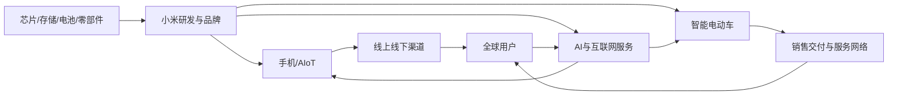

# 小米集团股价大幅回撤原因研究报告

## 0. 研报前置区

### 0.1 报告摘要

小米集团-W（1810.HK）从2025年6月27日61.45港元的历史高点回落至2026年7月中约26港元, 高点至今跌幅约58%. 这不是一个事件造成的, 而是典型的“盈利预期下修乘以估值倍数压缩”: 高点时市场同时给了小米汽车爆发, 手机高端化, AI生态扩张和港股科技重估四重溢价; 此后手机出货与收入下降, 存储成本上升, 汽车从年度盈利转回季度亏损, 安全与召回事件抬升风险溢价, 港股科技风险偏好也转弱. 多个假设同时降级, 股价跌幅因此远大于单一财务指标的变化.

基本面并非“崩塌”. 2025年全年收入4572.9亿元, 调整后净利润392亿元, 汽车交付41.1万辆, AIoT连接设备仍增长; 2026年第一季度汽车交付也同比增长6.6%. 但股票定价看边际变化和未来现金流. 2026年第一季度收入同比下降10.9%, 调整后净利润下降43.1%, 手机出货下降19.2%, 汽车及AI新业务经营亏损31亿元. 这些数据足以把市场关注点从“销量与故事”切换到“利润率, 自由现金流和投入回报”.

因此, 最准确的解释不是“小米汽车失败”, 也不是“纯粹被错杀”, 而是小米从高增长叙事股重新被按多业务硬件公司定价. 后续能否修复, 取决于手机量价与毛利稳定, 汽车毛利和经营利润回升, 安全与品牌风险可控, AI投入出现可量化回报, 以及港股科技风险偏好改善. 本报告只做研究分析, 不提供买卖点或目标价.

### 0.2 关键结论

| 结论 | 原因 | 证据指向 |
|---|---|---|
| 第一原因是预期过高后的估值去泡沫 | 高点对应YU7订单与生态重估, 后续盈利兑现速度低于定价 | 11.1, 11.3 |
| 第二原因是手机基本盘量利承压 | 2026Q1手机出货下降19.2%, 收入下降12.5%, 毛利率10.1% | 5.4, 11.2 |
| 第三原因是汽车盈利质量反复 | 交付增长6.6%, 但汽车及AI新业务经营亏损31亿元, ASP下降 | 4.0, 5.4 |
| 安全和召回事件提高风险溢价 | 官方召回116887辆SU7标准版, 事故造成单日显著下跌 | 5.6, 11.1 |
| 板块风险偏好是放大器而非根因 | 恒生科技指数走弱, 但小米跌幅显著更大 | 3, 11.1 |
| 长期价值仍需用利润和现金流重新证明 | AIoT与互联网服务仍有韧性, 回购显示管理层信心, 但不能替代盈利兑现 | 5.5, 11.4 |

### 0.3 核心指标总览

| 指标 | 行业读数 | 目标公司/产品读数 | 判断 | 证据/来源 |
|---|---|---|---|---|
| 市场规模 | 全球手机2026Q1出货2.94亿台; 中国智能车仍扩张 | 手机全球第三; 汽车2026Q1交付80856辆 | 市场大但成熟与成长业务分化 | [IDC](https://www.idc.com/promo/smartphone-market-share/), [2026Q1公告](https://www.hkexnews.hk/listedco/listconews/sehk/2026/0526/2026052600770.pdf) |
| 增速/渗透率 | 全球手机Q1出货同比-2.9% | 集团收入-10.9%, 手机出货-19.2%, 汽车交付+6.6% | 传统业务跑输, 汽车仍增长 | IDC, 小米公告 |
| 竞争强度 | 手机和新能源车均处高强度竞争 | 手机削减中低端出货, 汽车进入多车型竞争 | 竞争压低销量或利润 | 小米公告与行业数据 |
| 盈利水平 | 成本上涨压缩安卓硬件利润 | 调整后净利润-43.1%, 新业务经营亏损31亿元 | 利润恶化是去估值核心 | 小米公告 |
| 景气度 | 手机下行, 新能源车增长放缓 | AIoT收入-23.7%, 互联网+4.3%, 汽车+6.6% | 集团短期景气偏弱且分化 | 小米公告 |
| 关键风险 | 存储成本, 智驾监管, 港股风险偏好 | 高点至约26港元回撤约58%; 召回116887辆SU7 | 盈利和风险溢价双重压力 | [小米IR/LSEG](https://ir.mi.com/stock-information/historical-price-lookup), [市场监管总局](https://www.samr.gov.cn/zw/zh/art/2025/art_2152a981c72a430b9d10d6ef5cd9c09b.html) |

### 0.4 图表清单或图表占位

| 图表 | 类型 | 用途 |
|---|---|---|
| 图表1: 人车家产业地图 | Mermaid | 展示小米跨产业链位置与风险传导 |
| 图表2: 高点后预期变化 | 时间线 | 区分订单催化, 事故召回, 成本与财报 |
| 图表3: 业务线景气与盈利 | 表格 | 对比手机, AIoT,互联网, 汽车 |
| 图表4: 情景与验证指标 | 表格 | 展示修复条件与证伪条件 |

## 1. 目标公司/产品综合判断

小米的核心矛盾已经从“能不能造出受欢迎的汽车”转向“能否让手机, AIoT, 互联网和汽车共同产生可持续利润及现金流”. 公司在品牌, 用户规模, 渠道, 供应链和生态协同方面仍有真实优势; 2025年汽车快速放量也证明其产品定义和组织执行力. 但资本市场在2025年高点把这种优势提前外推成了高增长, 高毛利和低风险的组合, 给了接近平台型科技公司的溢价.

2026年第一季度暴露出三处断点. 第一, 手机销量下滑幅度大于行业, 说明小米削减中低端机型和推动高端化虽抬高ASP, 却牺牲了规模. 第二, 汽车交付增长没有转化为经营利润, 税费补贴, 零部件涨价, 新车型切换和高研发投入共同拖累盈利. 第三, 智驾安全和召回事件让市场重新计入尾部风险. 这三处断点共同降低未来利润预测, 同时抬高折现率, 对股价形成双杀.

综合判断是“经营基础仍在, 估值叙事已重置”. 当前价格相较高点已消化大量乐观预期, 但低估值并不自动等于低风险. 如果手机出货继续明显跑输行业, 汽车经营亏损不能收窄, 或安全事件继续出现, 估值可能保持硬件制造折价; 反之, 若汽车利润转正并稳定, 手机高端化实现量价平衡, 互联网服务和AI生态贡献增量现金流, 才可能重新获得生态平台溢价.

## 2. 研究边界

| 项目 | 内容 |
|---|---|
| 地区 | 香港资本市场; 经营范围为全球, 手机重点全球和中国, 汽车重点中国大陆 |
| 时间范围 | 股价自2025-06-27高点至2026-07-16; 财务至2026Q1 |
| 行业口径 | 智能手机, AIoT和互联网服务, 智能电动车, AI新业务 |
| 公司/产品范围 | 小米集团-W, 1810.HK, 不分析人民币柜台流动性差异 |
| 包括 | 行情, 财务, 经营, 行业, 安全监管, 估值预期差 |
| 不包括 | 目标价, 买卖建议, 短线技术分析, 未公开渠道数据 |
| 关键假设 | 用户所说“跌了这么多”指历史高点以来回撤; 公开行情可能有延迟 |

### 2.1 研究计划摘要

| 项目 | 内容 |
|---|---|
| 母问题 | 小米为何从历史高点回撤约六成, 是基本面恶化还是估值回归? |
| 子问题 | 股价窗口, 财务边际, 手机与汽车行业, 事故召回, 估值锚, 修复条件 |
| 选择的分析层级 | 宏观+中观+微观+资本市场, 因多业务与估值共同影响价格 |
| 必须验证的事项 | 高点与现价, Q1收入利润, 手机出货, 汽车利润, 召回规模, 当前估值 |
| 条件模块 | multi_business_split=enabled; portfolio_analysis=enabled; capital_market=enabled |

### 2.2 来源矩阵和证据质量

| 关键 Claim | 来源类型 | 本报告用途 | 证据层级 | 证据质量 | 来源状态 | 独立验证状态 | 限制和缺口处理 |
|---|---|---|---|---|---|---|---|
| `claim-xiaomi-price-drawdown`: 股价回撤约58% | 小米IR/LSEG与S&P Global行情 | 高点和当前价格 | near-primary | high | obtained | independently_verified | 收盘时点略有差异, 不影响量级 |
| `claim-xiaomi-q1-deterioration`: 2026Q1收入和利润下降 | 公司/港交所公告 | 财务事实 | primary | high | obtained | single-source-primary | IR与港交所为同源披露 |
| `claim-xiaomi-phone-pressure`: 手机量价变化 | 公司公告+IDC | 公司与行业对比 | near-primary | high | obtained | independently_verified | 公司数据为一手披露, 行业对比主要采用IDC近一手数据库; IDC详细品牌数据部分为商业数据库 |
| `claim-xiaomi-ev-economics`: 汽车量增但亏损 | 公司公告 | 汽车盈利质量 | primary | high | obtained | single-source-primary | 分部合并AI, 不能精确拆出纯汽车利润 |
| `claim-xiaomi-safety-risk`: 116887辆召回 | 国家市场监管总局 | 安全与监管风险 | primary | high | obtained | single-source-primary | 召回不等同于事故责任认定 |
| `claim-xiaomi-valuation-derating`: 当前市盈率约14-17倍 | 公开行情页 | 估值快照 | secondary | medium | obtained | secondary-only | GAAP/调整口径与时点不同, 不用于目标价 |

### 2.3 检索缺口闭环结果

| 缺口 | 已尝试轮次和来源 | 当前状态 | 为什么仍重要 | 未补齐原因 | 下一步来源 |
|---|---|---|---|---|---|
| `gap-consensus-revisions`: 月度一致预期EPS与目标价修正 | 第1轮公司IR; 第2轮Bloomberg/LSEG入口; 第3轮公开券商报告 | 部分补齐 | 可量化盈利下修与倍数压缩各自贡献 | 完整历史一致预期序列需要Bloomberg, FactSet或LSEG付费数据库, 公开页面仅给当前快照或个别券商观点. | Bloomberg BEST, LSEG I/B/E/S或FactSet Estimates的月度历史导出. |
| `gap-index-relative-return`: 与恒生科技精确同区间总回报 | 第1轮小米IR; 第2轮恒指公司; 第3轮公开指数与ETF | 部分补齐 | 区分行业Beta和公司Alpha | 公开页面的历史区间和复权口径不完全一致, 但已足以确认小米显著跑输板块. | LSEG Workspace或Bloomberg导出1810 HK与HSTECH同区间复权序列. |

## 3. 宏观环境分析

宏观层面对小米是放大器. 2025年上半年中国科技和AI资产经历估值扩张, 小米又叠加YU7订单高热度, 资金愿意为远期汽车和AI利润支付高倍数. 进入2026年后, 全球地缘不确定性, 港股科技风险偏好回落和AI主题内部轮动提高了成长资产的折现率. 恒生科技指数年内也明显调整, 说明小米并非独自下跌; 但小米跌幅远大于板块, 公司自身盈利和风险重估才是主因.

消费与成本周期同时不利. IDC显示2026Q1全球手机出货同比下降2.9%, 中国市场也收缩; 存储器供给紧张和价格上升迫使安卓厂商提价或减少低端产品. 小米的历史优势是中低价位的性价比与规模, 因而比高端占比更高的品牌更敏感. 中国家电补贴力度回落也使小米IoT收入从高基数下降.

监管环境对智能汽车的影响权重上升. 智驾宣传, OTA升级, 隐藏式门把手和事故信息披露正在被更严格审视. 对新进入汽车行业的品牌, 一次安全事件不仅产生召回成本, 还会影响订单转化, 保险定价, 监管投入和品牌信任. 这些风险难以用当期利润表完全捕捉, 资本市场通常通过提高风险溢价提前反映.

| 宏观变量 | 当前判断 | 证据/来源 | 对行业和小米的影响 |
|---|---|---|---|
| 消费周期 | 手机换机偏弱, 补贴高基数消退 | IDC, 小米公告 | 压制手机和IoT销量 |
| 成本周期 | 存储和部分商品价格上涨 | 小米2026Q1公告 | 挤压硬件毛利或迫使提价 |
| 监管 | 智驾与OTA监管趋严 | 市场监管总局 | 提高汽车合规和品牌成本 |
| 资金面/风险偏好 | 港股科技由扩张转去估值 | 恒生科技公开行情 | 压缩远期故事的现值 |

## 4. 中观行业分析

### 4.0 多业务线中观拆分

| 业务线/行业线 | 行业阶段 | 竞争格局 | 关键指标/景气信号 | 对目标公司的含义 |
|---|---|---|---|---|
| 智能手机 | 成熟期 | 苹果, 三星, 华为及安卓品牌激烈竞争 | 出货, ASP, 存储成本, 毛利 | 现金牛但量下滑最伤估值底座 |
| AIoT与家电 | 成长后段 | 传统家电与生态品牌交叉竞争 | 连接设备, 补贴, 海外收入, 毛利 | 用户生态仍增, 但收入受补贴基数影响 |
| 互联网服务 | 成熟增长 | 广告与内容平台竞争 | MAU, ARPU, 广告收入, 76.1%毛利率 | 高毛利稳定器, 但规模不足以独立驱动集团 |
| 智能电动车 | 高增长转淘汰赛 | 比亚迪, 特斯拉, 华为系, 新势力 | 交付, ASP, 毛利, 经营利润, 安全 | 最大增量与最大资本消耗并存 |
| AI与芯片 | 导入期 | 大模型与端侧芯片竞争 | 研发投入, 活跃用户, 商业化收入 | 期权价值高, 当前主要体现为费用 |

### 4.1 行业一句话定义

本报告将小米定义为以智能手机和AIoT为现金流底座, 向智能电动车与AI扩张的多业务智能硬件生态公司, 因而不能只按手机公司或车企单独估值.

### 4.2 行业关键指标

| 指标 | 当前判断 | 证据/来源 | 对小米的含义 |
|---|---|---|---|
| 手机规模 | 全球2026Q1同比-2.9% | IDC | 存量竞争加剧 |
| 小米手机份额 | 全球11.3%, 第三 | 小米公告/Omdia | 地位仍稳但份额较2025全年下降 |
| 汽车交付 | 2026Q1 80856辆, +6.6% | 小米公告 | 需求仍在, 增速不再爆发 |
| 汽车毛利 | 新业务分部20.1% | 小米公告 | 毛利尚可, 但经营费用吞噬利润 |
| 互联网服务 | 收入+4.3%, 毛利76.1% | 小米公告 | 为集团提供高毛利缓冲 |
| 研发 | 2026Q1 90亿元, +33.4% | 小米公告 | 长期能力增强, 短期利润承压 |

### 4.3 行业地图

小米位于系统集成, 产品定义, 品牌和生态运营环节, 上游依赖存储, 芯片, 电池和汽车零部件, 下游依赖零售, 交付, 售后和互联网分发. 收入从硬件销售与互联网服务流入, 成本主要流向零部件, 制造, 渠道, 研发和售后; 数据在手机, 家庭设备与汽车之间回流, 构成生态协同.

**目标位置:** 小米不是单一零部件供应商, 也不是纯互联网平台, 而是同时控制终端产品, 品牌, 操作系统入口和部分渠道的系统集成商. 这一位置使其能把手机用户迁移到家电与汽车, 也使其同时承担库存, 质量, 售后和资本开支风险. 对本次股价问题而言, 市场正在重新判断这种中游集成位置究竟应获得生态溢价, 还是因多业务重资产属性承受集团折价.

横向竞争并非一组对手. 手机对手是苹果, 三星, 华为, OPPO和vivo; AIoT对手是美的, 海尔, 华为等; 汽车对手是比亚迪, 特斯拉, 华为系及新势力. 多战线让小米能共享品牌和用户, 也意味着资本, 管理注意力和技术人才被多业务争夺. 当资本市场风险偏好下降时, 协同未量化的多业务通常被给予集团折价.

### 4.4 生命周期判断

**阶段结论:** 小米处于“成熟手机现金牛 + 成长中AIoT + 高增长但竞争白热化的汽车 + 导入期AI”叠加阶段, 集团整体从叙事扩张转向盈利验证.

**证据:** 手机行业出货下降且竞争由份额转利润; 汽车交付仍增长但经营亏损; AIoT连接设备同比增长18.5%; AI研发仍以前期投入为主.

**反证:** 汽车订单和交付仍显示强产品需求, 互联网服务毛利高, 研发可能形成新的生态协同, 因此不能把集团简单判为成熟或衰退.

**置信度:** 中高. 业务阶段差异有公司和行业数据支持, 但AI商业化和汽车长期单位经济尚未充分披露.

**研究含义:** 对小米的估值应从单一收入增速转向分部利润, 现金流和风险调整后的分部加总; 汽车与AI必须证明增量利润, 而非只证明销量或技术存在.

## 5. 七个核心模块分析

### 5.1 可行性

**结论:** “人车家全生态”在需求与产品层面可行, 但是否成为高回报商业模式尚未完全证明.

**证据:** 2025年汽车交付411082辆, 2026Q1仍交付80856辆; AIoT连接设备达到11.19亿台, 同比增长18.5%, 五台以上设备用户增长22.3%. 反面证据是新业务2026Q1经营亏损31亿元, 说明用户需求不等于股东回报.

**机制:** 同一账号, 操作系统, 线下门店和品牌可降低获客成本并提高跨品类销售, 但汽车研发, 工厂, 售后与安全责任显著增加固定成本. 只有协同带来的收入和毛利大于新增资本与费用, 生态才在经济上可行.

**研究含义:** 小米已跨过“能不能卖”的门槛, 尚在验证“能不能持续赚钱”. 股价修复不能只看发布会订单.

**关键指标和后续验证:** 跟踪跨设备活跃率, 多设备用户ARPU, 汽车单车毛利, 获客成本, 售后与保修成本; 核验公司分部披露和管理层指引.

### 5.2 规模性

**结论:** 市场空间大, 但集团增速更多依赖汽车与海外AIoT, 手机本身难再提供高双位数增长.

**证据:** 手机2026Q1全球市场下降2.9%, 小米手机出货下降19.2%; 同期汽车收入增长5.1%, 互联网收入增长4.3%, 海外IoT收入创纪录. 这表明增长引擎正在迁移, 但新引擎尚未完全抵消旧业务下滑.

**机制:** 成熟手机市场以换机和份额为主, 高端化可增收却可能减量; 汽车TAM更大, 但竞争, 产能和资本约束更强. 多业务可以扩大总市场, 也让增长质量更依赖资源配置.

**研究含义:** 小米的规模故事没有消失, 只是从“手机加速”转为“汽车扩张能否覆盖手机收缩”.

**关键指标和后续验证:** 全球手机份额, 3000元以上机型占比, 汽车月交付与订单转化, 海外IoT收入, 分部资本开支; 来源为公司季度报告, IDC/Omdia和乘联会.

### 5.3 防守性

**结论:** 品牌, 用户生态, 渠道和供应链形成中等护城河, 但各单品替代性高, 汽车安全事件会跨业务侵蚀品牌资产.

**证据:** 小米连续23个季度位居全球手机前三, 全球MAU 7.46亿, 中国门店超过16000家; 但手机份额并未阻止出货大跌, 汽车召回涉及116887辆. 生态规模是真实资产, 但不是绝对转换成本.

**机制:** 大用户盘降低新品推广成本, 供应链规模改善采购, 多设备数据提升体验; 但Android设备转换成本有限, 汽车消费者更重视安全和长期服务. 品牌信任既可协同, 也会产生负面传染.

**研究含义:** 小米防守重点应从“便宜和流量”转为“核心技术, 高端品牌, 安全质量和服务网络”.

**关键指标和后续验证:** 份额稳定性, 用户留存, 五设备用户增长, 高端机复购, 汽车NPS, 召回完成率与事故率; 优先核验公司披露和监管数据.

### 5.4 盈利性

**结论:** 这是股价下跌最直接的基本面原因. 集团收入下降10.9%而调整后净利润下降43.1%, 说明经营杠杆反向作用; 手机成本压力和汽车费用投入同时侵蚀利润.

**证据:** 2026Q1手机收入443亿元, 同比下降12.5%, 毛利率10.1%; 手机出货下降19.2%, ASP上升8.2%. AIoT收入下降23.7%, 主要因中国补贴减少. 汽车及AI新业务收入199亿元, 毛利率20.1%, 但经营亏损31亿元. 同期研发费用90亿元, 同比增长33.4%, 销售及营销费用82.8亿元. 互联网服务收入95亿元, 毛利率76.1%, 是少数稳定缓冲.

**机制:** 小米提高手机ASP并减少低端出货, 能保护部分单位毛利, 却使销量和规模摊销下降; 存储涨价又抬高单位成本. 汽车虽有20.1%的分部毛利, 但研发, 销售网络, 新车型切换, 购置税补贴和零部件涨价使经营费用超过毛利. 当旧现金牛下滑而新业务尚未稳定盈利, 集团利润对小变化高度敏感.

**研究含义:** 市场不再奖励单纯交付量, 会要求汽车经营亏损持续收窄, 手机毛利不以份额大幅丢失为代价, 高毛利互联网服务扩大占比. 若只靠削减低端机抬高ASP, 可能得到更好单机利润却失去生态入口.

**关键指标和后续验证:** 手机毛利率与出货, 存储成本传导, AIoT毛利, 汽车单车ASP和毛利, 新业务经营利润, 自由现金流, 库存周转及补贴强度. 下一步需公司2026Q2分部数据与现金流量表.

另一个容易误读的点是分部口径把智能电动车, AI和其他新业务合并. 31亿元经营亏损不能全部归因于汽车, 但也不能因AI投入存在就忽略汽车经济性. 下一次验证应把分部毛利减去可识别的汽车销售网络, 售后, 研发和折旧, 并与交付量联动观察. 只有单位亏损随规模稳定下降, 才能确认经营杠杆开始转正.

### 5.5 估值

**结论:** 股价约58%的回撤大于利润下降幅度, 说明除了盈利预测下修, 估值倍数也显著压缩. 小米从“汽车+AI生态成长股”重新锚定为“多业务硬件公司”.

**证据:** 2025年6月27日高点61.45港元, 当时YU7订单热度强化汽车高增长预期; 2026年7月约26港元. 公开行情快照显示历史市盈率已回到约14-17倍区间, 相较2025年10月FT快照约29.5倍明显下移. 同时2026Q1调整后净利润下降43.1%, 使分母和倍数同时承压. 公开一致预期历史序列缺失, 因此无法精确分解二者贡献.

**机制:** 股价等于未来现金流乘以估值倍数. 手机销量和汽车利润不及预期会下修现金流; 安全事件, 监管和港股风险偏好下降会抬高折现率; AI投入回报不明又增加远期不确定性. 当高点价格隐含多个业务同时成功, 任一假设落空都会去估值, 多个假设同时落空则形成非线性回撤.

**研究含义:** 低倍数只能说明预期已降低, 不能自动证明便宜. 合理框架是分部加总: 手机与AIoT看稳定利润和现金流, 互联网服务看高毛利用户变现, 汽车看正常化利润与资本需求, AI看概率加权期权价值, 再扣集团折价与安全风险.

**关键指标和后续验证:** 一致预期EPS修正, 分部经营利润, 自由现金流, 净现金, 回购, 同业前瞻PE/EV销售额及风险溢价. 下一步用LSEG I/B/E/S或Bloomberg BEST复核, 不以公开快照推导目标价.

估值还需处理利润口径. 小米持有大量投资, 公允价值变动可能使GAAP利润与经营利润偏离; 汽车又处在利润爬坡阶段, 单一历史PE可能过低或过高. 更可靠的验证是同时观察剔除投资收益后的经营利润, 未来两年一致预期, 净现金及分部资本开支, 并对汽车采用跨周期正常化利润, 而不是把一个季度亏损永久化.

### 5.6 外部因素

**结论:** 存储成本, 智驾监管, 消费补贴和港股资金偏好共同构成外部逆风, 其中存储和监管最具公司敏感性.

**证据:** 小米公告明确称存储和商品价格显著上涨; IDC判断2026年全球手机市场进入存储约束下的困难周期. 市场监管总局确认召回116887辆SU7标准版, 原因涉及L2高速领航在极端场景的识别, 预警或处置不足. 中国AIoT收入又受国家补贴减少影响. 公司同时面临地缘, 汇率和海外监管不确定性.

**机制:** 小米性价比定位使其比高端品牌更难把存储涨价完全转嫁给消费者; 提价会伤销量, 不提价会伤毛利. 智驾监管提高测试, OTA, 信息披露和责任成本, 安全事件还可能降低订单转化. 补贴退坡使前期需求透支, 而港股科技资金撤离会压低所有远期现金流的估值倍数.

**研究含义:** 外部逆风不是管理层能完全控制, 但产品结构, 采购锁价, 安全冗余和信息披露能决定受损程度. 若同业承压而小米跌得更深, 说明市场认为小米敏感度更高.

**关键指标和后续验证:** DRAM/NAND合约价, 手机零售价与促销, 国家补贴政策, 智驾法规和召回完成率, 港股南向资金与恒生科技相对表现, 美元人民币汇率. 来源优先监管, 公司与行业数据库.

外部因素之间也会相互强化. 存储涨价迫使手机提价, 消费疲弱又降低提价承受力; 汽车价格战限制ASP, 监管趋严同时增加安全与合规支出. 若资金面再提高折现率, 市场会在利润尚未出现前就下调估值. 反过来, 存储价格见顶和监管不确定性消退可以在利润恢复前先改善风险溢价, 因此需要区分先行变量和滞后财务指标.

### 5.7 景气度

**结论:** 集团短期景气偏弱但内部高度分化: 手机与中国AIoT向下, 互联网稳定, 汽车需求尚可但盈利处于车型切换和投入低谷. 股价已经交易了弱景气, 但修复要看先行指标连续改善.

**证据:** 2026Q1集团收入环比下降15.2%, 调整后净利润环比下降4.4%; 手机出货同比下降19.2%, AIoT收入下降23.7%. 相对积极的是互联网收入增长4.3%, 汽车交付增长6.6%, 新一代SU7初期锁单超过8万辆, AIoT连接设备增长18.5%, 公司截至5月22日回购约84亿港元. 这些积极信号尚未抵消利润下降.

**机制:** 手机库存和存储成本先影响出货与毛利, 再传导到广告和生态活跃; 新车订单先于交付, 交付又先于规模利润. 回购能改善每股价值与信心, 但不能改变业务周期. 因此景气拐点应由订单, 交付, 毛利和现金流共同确认, 不能只看一天股价反弹.

**研究含义:** 当前更像“预期已低, 经营尚待确认”的阶段. 若手机降幅收窄, 存储成本见顶, 汽车亏损连续收窄, 则低预期可能形成修复; 若出货继续跑输且汽车投入扩大, 低估值会变成价值陷阱.

**关键指标和后续验证:** 月度汽车交付与锁单转化, 手机季度份额和渠道库存, 存储价格, 分部毛利, 集团经营现金流, 回购执行, 互联网ARPU. 重点等待2026Q2与Q3连续数据.

景气判断还应关注基数效应. 2025年部分手机与家电需求受到补贴和新品推动, 2026年的同比下降未必全部代表终端需求崩塌; 但若环比, 同业相对份额和渠道库存同时恶化, 就不能只用高基数解释. 因此后续必须把同比, 环比和同业相对表现放在同一张表中, 避免因单一比较口径得出过度乐观或过度悲观结论.

## 6. 微观公司/产品分析

小米商业模式的优势是以硬件获得用户, 以互联网和生态服务提高生命周期价值, 再用品牌与渠道进入汽车和AI. 2026Q1互联网服务76.1%的毛利率证明生态变现有价值, 但互联网收入只占集团约9.6%, 仍不足以覆盖手机与汽车的波动. 汽车收入占比升至约19%, 已从期权变成影响集团利润的实质业务.

公司执行力依然突出: 短期内建立汽车产品, 产能和销售服务网络, 手机保持全球前三, AIoT连接规模继续增长. 但组织正在同时承担高端手机, 大家电, 汽车, 自研芯片和大模型投入, 资源配置与管理复杂度明显上升. 研发费用高速增长可能形成未来壁垒, 也可能在商业化不足时降低资本回报.

财务层面需警惕利润质量. 2025年经营利润包含金融工具公允价值收益, 评估持续盈利能力更应看调整后净利润, 分部经营利润和现金流. 2026Q1收入下降而费用刚性较强, 展示了负向经营杠杆. 公司大额回购是积极信号, 但只能说明管理层认为长期价值被低估, 不能替代业务证据.

| 维度 | 分析 | 证据/依据 |
|---|---|---|
| 商业模式 | 硬件获客+互联网变现+生态扩张 | 公司分部披露 |
| 产品 | 手机成熟, AIoT丰富, 汽车快速放量, AI早期 | 2026Q1公告 |
| 渠道 | 中国超过16000家门店, 汽车490个销售中心 | 公司公告 |
| 财务 | 收入与利润下降, 新业务重回亏损 | 2026Q1公告 |
| 护城河 | 品牌, 用户, 供应链, 渠道中等偏强; 安全与替代风险存在 | 行业与监管证据 |

## 7. SWOT

| Strengths | Weaknesses |
|---|---|
| 全球品牌与用户规模; 手机前三; AIoT生态; 汽车产品定义和执行; 充足研发投入 | 手机利润薄且对存储敏感; 多业务资本消耗; 汽车安全与售后能力待验证; AI商业化不透明 |

| Opportunities | Threats |
|---|---|
| 汽车规模盈利; 手机高端化; 海外AIoT; AI跨设备代理; 回购提升每股价值 | 手机需求收缩; 新能源车价格战; 监管与召回; 地缘和汇率; 多战线资源分散 |

## 8. 业务/产品组合分析

按资源配置看, 手机与互联网是现金流底座, AIoT是协同型增长业务, 汽车是高增长高投入业务, AI和芯片是战略期权. 问题在于现金牛手机自身承压, 同时汽车和AI需要大额投入, 使组合缺少稳定的“融资发动机”. 互联网服务虽高毛利, 规模仍有限. 未来组合健康度取决于汽车尽快从耗现转向贡献现金, 手机维持份额与利润平衡, AI投入采用阶段性里程碑管理.

**证据:** 2026Q1手机与AIoT收入合计仍占集团80%, 汽车与AI新业务占20%; 互联网服务毛利率76.1%, 但收入只占约9.6%; 研发费用同比增长33.4%. 这说明传统业务仍负责提供绝大部分毛利与现金, 新业务已经足以影响集团利润, 却尚未成为稳定现金来源.

**验证:** 每季度比较各业务收入占比, 毛利贡献, 经营利润, 资本开支和自由现金流. 若汽车连续转正且不依赖大额补贴, AI出现独立商业化KPI, 组合折价可能收窄; 若手机利润下滑速度快于新业务改善, 应提高集团折价而不是给所有业务成长倍数.

## 9. 竞争对手对比

| 对象 | 定位 | 优势 | 劣势 | 关键指标 |
|---|---|---|---|---|
| 小米 | 人车家全生态 | 用户, 渠道, 性价比, 执行 | 多业务投入与安全风险 | 手机份额, 汽车利润 |
| 苹果 | 高端终端生态 | 品牌, 芯片, 服务利润 | 汽车缺位, 中国竞争 | ASP, 服务收入 |
| 华为生态 | 技术与渠道平台 | 通信, OS, 智驾, 高端品牌 | 非上市, 口径不可比 | 终端份额, 智驾装机 |
| 比亚迪 | 垂直整合车企 | 电池, 成本, 规模 | 消费电子生态弱 | 单车利润, 海外销量 |
| 特斯拉 | 纯电与软件 | 全球规模, 品牌,制造效率 | 产品周期和地区风险 | 毛利, 交付, FSD |

比较表说明小米的独特价值是跨场景生态, 但其估值也最难. 与苹果相比, 小米硬件利润率低; 与比亚迪相比, 汽车规模与垂直整合仍弱; 与华为相比, 核心技术和智驾口碑仍需积累. 若跨业务协同无法转化为利润, 多业务只会增加集团折价.

## 10. 事实, 观点和推断分层

| 类型 | 内容 | 来源/依据 | 证据层级 | 证据质量 | 来源状态 | 置信度 |
|---|---|---|---|---|---|---|
| 事实 | 2026Q1收入-10.9%, 调整后净利润-43.1% | 港交所公司公告 | primary | high | obtained | 高 |
| 事实 | 手机出货-19.2%, ASP+8.2% | 公司公告 | primary | high | obtained | 高 |
| 事实 | 新业务经营亏损31亿元 | 公司公告 | primary | high | obtained | 高 |
| 事实 | 召回116887辆SU7标准版 | 市场监管总局 | primary | high | obtained | 高 |
| 待核验事实 | 当前历史PE约14-17倍 | 公开行情快照 | secondary | medium | obtained | 中 |
| 观点 | 安全事件提高汽车风险溢价 | Reuters/Bloomberg等市场解读 | secondary | medium | obtained | 中 |
| 推断 | 股价下跌是盈利下修与倍数压缩双杀 | 上述财务, 行情和风险事实 | near-primary | high | obtained | 高 |
| 推断 | 小米被从生态成长股重估为多业务硬件公司; 历史一致预期序列仍部分补齐 | 倍数下降, 盈利结构与市场叙事 | near-primary | medium | obtained | 中高 |

## 11. 资本市场表现与估值预期变化

### 11.1 股价表现拆解

本节**时间窗口**为2025年6月27日至2026年7月16日. 小米在起点达到61.45港元历史高点, 主要背景是YU7发布与订单热度把汽车第二增长曲线推到市场叙事中心. 到2026年7月中股价约26港元, 高点回撤约58%; 6月26日一度触及21.30港元的52周低点. 从高点到低点的最大回撤约65%. 这已不是一般波动, 而是估值框架重置.

时间线上, 2025年3月底SU7致命事故曾令股价单日下跌约5.5%, 但之后YU7热度又推升至新高, 说明单次事故并非整个回撤的起点. 高点后, 9月官方召回116887辆SU7标准版, 10月又有事故舆情引发单日大跌, 安全风险逐渐从孤立事件变成估值折价. 2026年3月新SU7定价引发毛利担忧, 5月Q1财报确认收入与利润大幅下降, 回撤逻辑从情绪转为财务验证.

恒生科技指数同期也走弱, 说明流动性与板块Beta贡献了部分跌幅. 但小米一年跌幅超过五成, 明显跑输指数, 不能只归咎于港股. 精确相对回报因公开复权序列不一致仍需LSEG或Bloomberg补齐, 但公司特异性因素的方向明确.

**证据缺口:** 公开环境没有取得1810.HK与恒生科技指数完全同一复权口径的逐日总回报序列, 也没有完整的事件日异常收益研究. 因此本报告能确认绝对回撤与明显跑输, 但不把每个事件贡献精确到百分点. 下一步应从LSEG或Bloomberg导出同区间价格, 成交量和指数数据, 用事件窗口区分板块与公司冲击.

### 11.2 基本面变化

2025年全年其实很强: 收入同比增长25%至4572.9亿元, 调整后净利润增长43.8%至392亿元, 汽车交付41.1万辆. 这解释了为何股价曾被推到高位. 问题是2025Q4调整后净利润降至63亿元, 为三年来首次季度利润同比下降, 存储成本和竞争开始显性化.

2026Q1进一步确认拐点. 集团收入991亿元, 同比下降10.9%; 调整后净利润60.7亿元, 下降43.1%. 手机出货3380万台, 下降19.2%, 收入下降12.5%; AIoT收入下降23.7%. 互联网服务增长4.3%, 无法抵消硬件收缩. 这不是会计噪音, 而是核心业务规模和利润同步承压.

汽车基本面具有两面性. 交付仍增长6.6%, 新一代SU7锁单强, 说明需求未崩; 但汽车ASP下降, 新业务经营亏损31亿元, 相比2025全年首次实现9亿元经营利润明显反转. 一部分来自车型切换, 购置税补贴和研发投入, 未必永久; 但市场会要求连续季度数据证明亏损能收窄.

现金流和业务结构同样重要. Q1资本开支约33亿元, 同比增长20%, 同时研发继续高增; 汽车收入占比升至20%, 意味着集团越来越受重资产业务影响. 公司没有给出足以锁定全年分部利润的明确指引, 因而市场只能用订单, 交付, 毛利和费用推算. 后续应核验经营现金流, 自由现金流, 汽车资本开支及管理层对手机出货和汽车盈利的最新指引.

### 11.3 估值逻辑和市场预期差

市场**之前定价**至少四个乐观假设: YU7把汽车交付推向高速增长; 汽车毛利随规模快速改善; 手机高端化在不丢份额的情况下抬高利润; AI与人车家生态获得平台型科技估值. 这些假设并非毫无依据, 但被同时定价意味着容错率极低.

实际结果与预期出现差距: 汽车增速降至个位数且经营亏损; 手机高端化提高ASP却伴随19.2%的出货下降; 存储成本使硬件毛利更脆弱; AI研发增长尚未形成独立收入披露; 事故与召回提高风险溢价. 市场因此既下修未来利润, 又降低愿意支付的倍数.

这就是核心**市场预期差**: 市场原本等待汽车规模利润和手机高端化共同上行, 实际看到的是旧业务量缩和新业务亏损同时出现. 由此发生的不是简单“股价跟随利润”, 而是从生态成长溢价向硬件制造估值的**杀估值**. 未来若汽车利润与手机份额重新改善, 才可能发生反向**重估**.

当前公开历史PE约14-17倍, 相比2025年10月约29.5倍快照已大幅去估值. 但倍数口径受GAAP利润, 投资公允价值收益和时间点影响, 不能简单与同业横比. 更稳健的估值锚是正常化分部利润和自由现金流. 市场可能过度反应之处在于忽视AIoT用户增长, 互联网高毛利和汽车需求; 可能反应不足之处是低估存储周期, 安全责任和长期资本开支.

需要**重新证明**的验证指标包括: 手机份额与毛利能否同时稳定, 汽车经营利润能否连续改善, AI投入是否带来收入或成本节省, 自由现金流是否覆盖研发和资本开支, 安全召回是否完成. 在这些指标形成连续证据前, 低倍数更像低预期而非确定性低估.

### 11.4 上涨触发器, 下跌风险和情景分析

上行触发器必须可验证. 第一, 手机出货降幅显著收窄且毛利率稳定, 证明高端化不是用份额换价格. 第二, 汽车经营亏损连续两个季度收窄并转正, 同时交付与ASP稳定. 第三, 安全召回完成且没有新的重大事故或监管处罚. 第四, AI或芯片投入出现可披露收入, 节省成本或用户ARPU提升. 第五, 自由现金流改善并延续回购.

下行风险也同样具体: 存储成本继续上涨导致手机提价和份额进一步下滑; 新车价格竞争压缩汽车毛利; 事故或召回扩大; 大额研发和资本开支不能形成回报; 海外监管与汇率恶化; 港股科技风险偏好继续下降. 任何一项都可能让低估值维持更久.

情景分析不预测价格, 只定义证据. 乐观情景需要手机, 汽车利润和安全三项同时改善; 中性情景是手机承压但汽车亏损收窄, 集团低速增长; 悲观情景是手机继续跑输, 汽车毛利下降且安全风险再现. 投资者应根据季度数据更新概率, 而不是依据发布会热度或单日反弹.

| 情景 | 条件 | 需要跟踪的指标 |
|---|---|---|
| 乐观 | 手机量价平衡, 汽车转正, 安全风险受控 | 手机份额/毛利, 汽车经营利润, 召回完成率 |
| 中性 | 传统业务弱, 汽车亏损收窄, 互联网稳定 | 集团收入, 分部利润, 现金流 |
| 悲观 | 手机继续大跌, 汽车价格战, 新安全事件 | 出货, ASP, 单车毛利, 事故与监管 |

## 12. 多视角压力测试

受并发资源限制, 本节采用单代理模拟多视角, 不引入新事实.

| 视角 | 质疑 | 为什么重要 | 需要验证 |
|---|---|---|---|
| 行业专家 | 是否把存储周期误判为公司竞争力下降? | 决定手机下滑可逆性 | 同业出货, 份额和毛利对比 |
| 投资研究员 | 当前低PE是否被公允价值收益扭曲? | 决定估值是否真低 | 正常化利润与自由现金流 |
| 政策/监管研究者 | 召回是否会扩大为更严监管或责任成本? | 决定汽车风险溢价 | 监管公告, 事故调查, 召回完成率 |
| 经营者 | 多业务同时投入是否超出组织承载能力? | 决定资本回报 | 分部预算, 人效, 上市节奏 |
| 反方审稿人 | 如果汽车订单仍强, 市场是否过度悲观? | 防止把短期亏损永久化 | 新SU7/YU7订单转交付和利润 |
| 用户视角 | 安全与售后是否削弱跨品类品牌信任? | 可能产生生态负协同 | NPS, 退订, 售后和复购数据 |

## 13. 风险, 机会和不确定性

事实风险包括手机出货和利润下降, 汽车新业务亏损及官方召回; 假设风险是把车型切换期亏损外推为长期亏损, 或反过来把强订单等同于可持续利润. 数据缺口主要是历史一致预期修正, 纯汽车分部利润, 渠道库存和安全事件的最终调查结论.

行业结构风险来自成熟手机竞争, 存储涨价和新能源车价格战; 公司特异风险来自多业务资源分散, 安全口碑, 新业务资本开支和管理层执行. 上行机会则来自汽车规模盈利, 手机高端化成功, 海外AIoT增长, AI跨设备商业化及持续回购.

触发条件必须成对观察. 交付增长只有在毛利和现金流改善时才是正面; ASP提升只有在份额稳定时才是正面; 研发增长只有在收入, 成本节省或用户粘性可量化时才支持估值. 这是避免再次被单一叙事误导的核心纪律.

还需警惕叙事切换造成的错配. 市场在乐观阶段容易把汽车订单, AI模型排名和门店扩张都视为同一条增长曲线, 在悲观阶段又可能把手机下滑, 召回和研发费用全部外推为永久损失. 更稳健的方法是为每项风险设置可证伪条件: 手机风险由同业份额和毛利验证, 汽车风险由单车利润与召回完成率验证, AI风险由商业化收入或可量化降本验证. 只有当多个独立指标同向变化, 才调整长期判断, 这能降低对单一发布会, 单日事故或单季财报的过度反应.

## 14. 后续行动建议

未来两个季度建立四组监控表: 每季更新手机出货, ASP和毛利; 每月更新汽车交付, 每季更新汽车经营利润; 实时记录召回与监管; 每季更新自由现金流和回购. 若至少三组连续两个季度改善, 才可认为基本面修复; 若手机和汽车利润同时恶化, 应下调修复概率. 对估值只使用同一口径的正常化利润, 不把一次性公允价值收益当作持续盈利.

## 15. 方法论和数据来源说明

本报告采用宏观, 中观, 微观和资本市场四层框架, 先用公司与监管一手资料确认财务和风险事实, 再用IDC及市场数据库交叉验证行业与价格. 行情高点由S&P Global/FT与小米IR的LSEG数据交叉验证; 财务来自港交所公告; 召回来自国家市场监管总局. Reuters等媒体仅用于事件当日市场反应和叙事, 不替代核心事实.

研究运行档案已保存于 `research_runs/20260716_205126_小米股价大跌原因研究/`. 最大限制是付费一致预期历史数据不可访问, 因此对盈利下修与倍数压缩只做机制判断, 不做精确归因百分比. 估值快照来自二手行情源, 未用于目标价.

| 来源类型 | 用途 | 证据层级 | 证据质量 | 备注 |
|---|---|---|---|---|
| 公司公告/港交所 | 财务, 交付, 毛利, 回购 | primary | high | 核心事实 |
| 监管公告 | 召回与安全风险 | primary | high | 不等同事故责任认定 |
| IDC/Omdia | 手机行业与份额 | near-primary | high/medium | 商业数据库定义需注意 |
| LSEG/S&P Global行情 | 股价与估值 | near-primary | high/medium | 时点和复权口径需统一 |
| 财经媒体 | 事件反应与市场观点 | secondary | medium | 只作补充 |

## 16. 后续验证清单

| 待验证问题 | 当前证据状态 | 为什么重要 | 推荐来源 | 优先级 |
|---|---|---|---|---|
| 2026Q2手机出货和毛利能否改善 | 等待披露 | 验证手机压力是否周期性 | 小米Q2公告, IDC/Omdia | 高 |
| 汽车经营亏损能否连续收窄 | Q1亏损31亿元 | 决定汽车估值锚 | 公司分部公告 | 高 |
| SU7召回完成率和事故最终结论 | 召回事实已确认 | 决定安全风险溢价 | 市场监管总局, 公安调查 | 高 |
| 一致预期下修与倍数压缩各贡献多少 | 部分补齐 | 精确解释股价回撤 | Bloomberg/LSEG/FactSet | 中 |
| AI投入是否形成收入或成本节省 | 披露不足 | 决定AI期权价值 | 公司IR和分部KPI | 中 |
| 同期跑输恒生科技的精确幅度 | 部分补齐 | 区分Beta与Alpha | LSEG或Bloomberg同源数据 | 低 |

## 17. 报告合规自检表

| 检查项 | 是否通过 | 说明 |
|---|---|---|
| 模板骨架完整 | 通过 | 保留0-17及条件模块 |
| 研究简报转译已完成 | 通过 | 路由为公司资本市场标准报告 |
| 未误触发显式短答模式 | 通过 | 用户未要求短答 |
| Deep Research 可见痕迹完整 | 通过 | 计划, 来源矩阵, 缺口闭环与运行档案齐全 |
| 分析层级选择正确 | 通过 | 宏观, 中观, 微观, 资本市场 |
| 多业务线中观拆分完成 | 通过 | 手机, AIoT, 互联网, 汽车, AI |
| 七个核心模块全部出现 | 通过 | 5.1-5.7独立 |
| 七模块结构完整 | 通过 | 含五个规范块, 重点模块更深 |
| 重点模块展开深度足够 | 通过 | 盈利, 估值, 外部, 景气扩展 |
| 宏观/中观/微观/资本市场章节深度足够 | 通过 | 机制与验证均已说明 |
| 报告深度 rubric 达标 | 通过 | 主要章节达到标准报告阈值 |
| 资本市场章节适用时已出现 | 通过 | 11.1-11.4完整 |
| 来源层级, 证据质量和来源状态清楚 | 通过 | 2.2和10披露 |
| 一手来源优先规则已执行 | 通过 | 财务用港交所公告, 召回用监管原文, 行情用近一手数据库 |
| 独立验证状态和缺口清楚 | 通过 | 行情双源, 财报同源说明 |
| 事实/观点/推断已分层且证据层级清楚 | 通过 | 第10章 |
| 后续验证清单具体 | 通过 | 第16章含来源与优先级 |
| Markdown 标题格式正确 | 通过 | 一个H1, 规范H2/H3 |

本报告仅供研究和信息参考, 不构成投资建议, 也不构成任何收益承诺.
