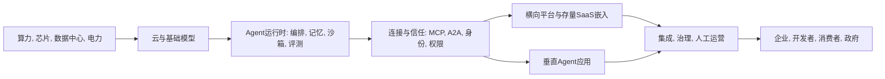

# AI Agent 行业研究报告: 从模型能力竞赛走向可信执行系统

## 1. 行业一句话定义

AI Agent 行业是以大模型为推理核心, 围绕用户或组织目标进行规划, 调用工具与业务系统, 在约束下执行多步任务并交付可验证结果的软件与服务产业. 本报告采用中等偏窄口径: 核心市场包括模型与云、Agent 运行时、连接器和互操作协议、横向及垂直应用、实施治理与安全; 纯聊天问答、仅内容生成、只给建议而不执行的 Copilot 以及实体机器人本体不计入核心市场, 但作为相邻需求和技术入口讨论.

核心判断是: AI Agent 已从概念验证进入早期成长期, 但尚未跨越企业级规模化的可靠性与单位经济门槛. 行业景气度高, 真正的生产部署率显著低于广义 AI 使用率; 未来利润不会平均分布在所有“Agent”产品中, 而会向掌握可信上下文、身份权限、工作流入口、专有任务数据、可观测治理和分发渠道的控制点集中.

## 2. 研究边界

| 项目 | 内容 |
|---|---|
| 地区 | 全球, 重点覆盖中国和美国, 欧盟用于监管比较 |
| 时间范围 | 2023—2026 年现状, 未来 3—5 年趋势 |
| 行业口径 | 中等偏窄的软件型 AI Agent 口径 |
| 包括 | 模型与云, 运行时与开发工具, 上下文和连接器, MCP/A2A/AIP 等协议, 横向和垂直应用, 实施治理与安全 |
| 不包括 | 纯聊天机器人, 仅内容生成, 不执行动作的助手, 实体机器人硬件本体, 与 Agent 无法拆分的全部生成式 AI 收入 |
| 关键假设 | 广义 AI 采用率只作需求底座; 商业市场规模估算按口径分列; 公司披露的 ARR 和客户数视为一手但未必经独立审计 |

### 2.1 研究计划摘要

| 项目 | 内容 |
|---|---|
| 母问题 | AI Agent 行业现在处于什么阶段, 价值链如何构成, 谁更可能获得收入和利润, 未来机会与风险是什么 |
| 子问题 | 真实采用与市场空间; 技术和协议成熟度; 竞争与护城河; 单位经济和利润池; 中美欧政策; 景气指标与趋势触发器 |
| 选择的分析层级 | 宏观 + 中观; 微观公司仅作为代表性案例; 不启用资本市场层 |
| 必须验证的事项 | Agent 生产部署率; 独立收入规模; 长任务可靠性; 单次成功任务成本; 权限和安全控制; 商业化续约与扩容 |

本轮研究由三个独立研究面并行完成: 技术与政策、需求与市场、竞争与经济性. 主线对 10 项高影响 Claim 进行证据归并, 对市场规模和单位经济两个缺口执行三轮定向闭环, 并对口径冲突保留而不强行合并.

### 2.2 来源矩阵和证据质量

| 关键 Claim | 来源类型 | 本报告用途 | 证据层级 | 证据质量 | 来源状态 | 独立验证状态 | 限制和缺口处理 |
|---|---|---|---|---|---|---|---|
| `claim-industry-stage`: 行业处于早期成长期 | 公司 IR + 企业采用调查 | 生命周期 | primary | medium | obtained | single-source-primary | 单一厂商增长不能代表全市场, 与采用调查交叉解释 |
| `claim-enterprise-adoption`: 试验率高于规模化率 | 全球企业调查 | 需求阶段 | secondary | medium | obtained | secondary-only | 样本为受访组织, 非官方总体统计 |
| `claim-us-ai-baseline`: 美国广义 AI 使用率约 17%—20% | 官方统计 | 采用底座 | primary | high | obtained | single-source-primary | 非 Agent 专项, 2025 年 11 月问题口径改变 |
| `claim-commercial-traction`: 部分 Agent 产品已有可观测 ARR | 公司 IR | 商业验证 | primary | high | obtained | single-source-primary | 公司自报, 不代表独立 Agent 净收入或行业利润 |
| `claim-market-size-uncertain`: 市场规模估算口径分裂 | 商业研究 | 规模区间与冲突 | secondary | medium | obtained | independently_verified | 方法透明度有限, 不做简单平均 |
| `claim-protocol-adoption`: MCP 与 A2A 正成为重要开放协议 | 基金会和官方技术文档 | 标准成熟度 | primary | high | obtained | single-source-primary | 支持组织数不等于生产流量或安全成熟 |
| `claim-security-risk`: 注入和权限风险阻碍采用 | 政府研究 | 安全门槛 | primary | high | obtained | single-source-primary | 风险频率仍缺统一事故统计 |
| `claim-cn-governance`: 中国形成直接面向智能体的框架 | 监管政策 | 中国外部因素 | primary | high | obtained | single-source-primary | 政策意见、推荐性标准和强制标准项目效力不同 |
| `claim-profit-pool`: 基础设施与企业软件利润结构分化 | 两家公司财报/IR | 盈利性 | primary | high | obtained | independently_verified | 邻近自动化软件不能完全等同纯 Agent 经济性 |
| `claim-long-horizon-reliability`: 长任务可靠性仍不足 | 原始论文与基准 | 技术反证 | primary | medium | obtained | single-source-primary | 主要为计算机使用任务, 不外推所有行业 |

证据质量最强的是美国 Census 企业调查、NIST、中国网信部门政策、上市公司财务披露和原始技术论文. 证据较弱处集中于商业市场规模、供应商自报 ARR、客户案例 ROI 以及中国 Agent 独立收入. 因此报告对“是否有需求”和“是否开始商业化”给出中高置信度, 对“整个市场究竟多大”和“最终利润率多高”只给出条件判断.

### 2.3 检索缺口闭环结果

| 缺口 | 已尝试轮次和来源 | 当前状态 | 为什么仍重要 | 未补齐原因 | 下一步来源 |
|---|---|---|---|---|---|
| `gap-audited-agent-market-revenue`: 全球及中国统一可审计的 Agent 独立收入 | 第1轮: 全球商业研究; 第2轮: 同机构不同版本和企业 GenAI 支出; 第3轮: 中国公开摘要与 MaaS 替代指标 | 仍未补齐 | 决定 TAM、生命周期和估值锚 | 公开资料定义分裂, 原始模型和中国细分数据多位于付费数据库, 且上市公司通常不单列agent收入 | 付费行业数据库原始方法附录, 主要厂商分部披露和企业采购样本 |
| `gap-independent-unit-economics`: 跨厂商成功任务成本和人工接管率 | 第1轮: 公开定价与 IR; 第2轮: 客户案例和调查; 第3轮: 独立 ROI 研究与财务拆分 | 仍未补齐 | 决定毛利、续约和结果计费可持续性 | 供应商只披露价格单位或个案, 客户合同与真实推理, 实施, 人工复核成本通常不公开 | 匿名客户合同样本, 厂商分层毛利披露和独立生产部署基准 |

## 3. 行业地图

| 模块 | 内容 |
|---|---|
| 纵向产业链 | 芯片/服务器/网络/电力 → 云与模型 → 运行时与工具 → 上下文/连接器/协议 → 横向平台和垂直应用 → 实施治理 → 终端客户 |
| 横向竞争结构 | 上游由 NVIDIA、Microsoft、Google、AWS 等全栈厂商主导; 中游有 OpenAI、Anthropic、LangChain、Glean 等; 下游由 Salesforce、ServiceNow、SAP、UiPath 及大量垂直创业者竞争; 中国主要平台包括阿里、腾讯、字节、百度、华为及模型和应用创业公司 |
| 生产要素 | 算力与电力, 模型能力, 领域数据, 任务轨迹, 连接器, 身份权限, 工程人才, 资本, 客户工作流和责任承担能力 |
| 生产关系 | 云与模型供应商向应用收费; 应用接入客户记录系统; 渠道和实施商控制落地; 监管者约束数据与行为; 客户通过续约、扩容和结果付费分配利润 |
| 关键流向 | 收入从席位向对话、动作、工作单元和结果迁移; 成本包含推理、工具、沙箱、重试、监控和人工复核; 数据与权限流向决定可执行范围; 政策流影响高风险场景自治边界 |

这张地图说明, “Agent”不是模型的一项功能标签, 而是一套执行系统. OpenAI 2026 年 Agents SDK 已把可配置记忆、文件与命令工具、MCP、原生沙箱、状态快照和恢复纳入正式运行时, 并明确把 harness 与 compute 分离以降低凭证暴露和提高持久性, 体现产业瓶颈正由单次回答质量转向受控执行系统.[OpenAI, The next evolution of the Agents SDK](https://openai.com/index/the-next-evolution-of-the-agents-sdk/)

## 4. 生命周期判断

**阶段结论:** AI Agent 处于“导入后期向成长期初段过渡”, 更准确地说是基础能力和开发者供给已进入成长期, 企业生产部署仍停留在早期. 行业不是成熟 SaaS 的稳定续费市场, 也不再只是实验室原型.

**证据:** McKinsey 2025 年近 2,000 名受访者调查显示, 62% 的组织至少在试验 Agent, 其中 23% 已在至少一个职能扩大部署, 39% 仍在试验; 这说明兴趣和试点已跨越导入期, 但企业级规模化尚未普及.[McKinsey, The State of AI 2025](https://www.mckinsey.com/capabilities/quantumblack/our-insights/the-state-of-ai) 商业侧已有强增长样本: Salesforce FY2026 披露 Agentforce ARR 达 8 亿美元, 同比增长 169%, 累计 2.9 万笔交易, 生产账户环比增长接近 50%; 但这是单一存量 SaaS 平台的公司口径.[Salesforce FY2026 Q4](https://investor.salesforce.com/news/news-details/2026/Salesforce-Delivers-Record-Fourth-Quarter-Fiscal-2026-Results/default.aspx)

**反证:** 美国 Census 的全国代表性企业调查显示, 2025 年 12 月至 2026 年 5 月广义 AI 使用率只有约 17%—20%, 且这还不是 Agent 专项; 小企业采用明显落后.[U.S. Census BTOS](https://www.census.gov/library/stories/2026/05/ai-use-businesses.html) OSWorld 2.0 的长时计算机任务中, 最佳系统在 500 步下二元完成率仍只有 20.6%, 表明短 benchmark 的高分尚不能转化为稳定的端到端执行.[OSWorld 2.0](https://arxiv.org/abs/2606.29537)

**置信度:** 中高. 采用调查、厂商商业数据、官方广义 AI 基准和技术评测共同指向“高试验、低规模化”. 不确定性主要来自 Agent 定义尚未统一和生产部署指标缺少官方统计.

**研究含义:** 对 AI Agent 行业而言, 当前最重要的不是争论一个精确 TAM, 而是验证从试点到生产、从局部 KPI 到企业损益、从模型可用到系统可控的三个转化率. 未来 2—3 年将是平台固化、应用淘汰和利润池重新分配的阶段.

## 5. 七个核心模块分析

### 5.1 可行性

**结论:** 需求真实, 但只有“任务边界清晰、结果可测、错误可恢复、人工基准成本明确”的场景已具备较强商业可行性. 软件开发与测试、IT 运维、客服、企业搜索后接动作、票据/对账/工单等后台流程位于第一梯队; 医疗最终决策、信贷、支付和关键工业控制仍应采用建议加审批.

**证据:** McKinsey 调查显示试验已经广泛发生, Salesforce 的 ARR 与生产账户增长证明至少部分产品能从试点转成付费生产. 另一方面, 只有 39% 的受访组织报告企业层面 EBIT 影响, 局部生产率改善尚未普遍穿透损益表. 供应商案例中“每天节省 40—60 分钟”等数字多为活跃用户自报, 不能直接作为财务回报.

**机制:** Agent 的价值来自把“理解—决策—执行—验证”串成闭环, 因而比只生成文本更接近替代任务成本或创造收入. 但多步链路会累积错误, 并新增工具调用、重试、沙箱、监控和人工复核成本. 业务价值只有在成功任务净收益覆盖这些全栈成本后成立.

**研究含义:** AI Agent 行业进入生产的最短路径不是追求最高自治, 而是选择可回滚任务, 把高风险步骤设为审批点, 用人工兜底逐步降低接管率. 创业者应从一个高频流程的结果交付切入, 而非先做通用“万能员工”.

**关键指标和后续验证:** 端到端任务成功率、一次通过率、无人工完成率、人工升级率、返工率、周期时间、单次成功任务成本、事故率和 6—12 个月续约扩容. 下一步需要客户侧真实日志和独立 ROI 样本.

### 5.2 规模性

**结论:** 长期可服务空间很大, 但公开“Agent 市场规模”数字不能作为单一锚. 更可靠的测算方法是从可自动化任务量、每任务经济价值和可接受自治比例自下而上估算, 并分别呈现软件收入、专业服务、云推理和基础设施支出.

**证据:** Grand View Research 估算 2025 年全球 AI Agents 收入约 76 亿美元, 2026 年约 109 亿美元; MarketsandMarkets 的两个 2025 年版本却分别给出约 70.6 亿和 138.1 亿美元基数, 同一年相差接近一倍.[GVR](https://www.grandviewresearch.com/industry-analysis/ai-agents-market-report) [MarketsandMarkets](https://www.marketsandmarkets.com/Market-Reports/agentic-ai-market-208190735.html) 这不是正常误差, 而是是否纳入虚拟助手、机器人自动化、平台、服务和不同预测版本造成的定义差异. 中国公开数字也混合软件、企业应用和项目服务, 不宜与美元全球口径换算比较.

**机制:** 市场扩张由三项相乘: 可执行任务数量 × 生产部署渗透率 × 每成功任务价格. 模型价格下降会扩大任务边界, 但如果长任务的重试、工具和人工成本不降, 单位成功任务成本未必同步下降. 存量 SaaS 的打包销售还可能使使用量增长而独立市场收入被低估或被席位收入吸收.

**研究含义:** AI Agent 行业未来可能同时出现“使用量指数增长”和“应用层价格下降”. 投资、创业或采购判断不应把 Token 增长等同收入增长, 也不应把所有 GenAI 企业支出视作 Agent TAM. 市场规模应以场景、层级和计费单位拆分.

**关键指标和后续验证:** 生产账户占比、每组织工作单元、付费转化、ARR、净收入留存率、动作单价、模型和工具成本、专业服务占合同额比例. 关键缺口是统一可审计的厂商收入分拆.

### 5.3 防守性

**结论:** 模型包装、提示词和通用编排界面的防守性弱; 可信上下文、权限图、专有任务轨迹与评测数据、深度系统集成、责任品牌、人工交付网络和嵌入式分发才是强壁垒. 模型本身仍可形成规模与资本壁垒, 但应用层应尽量具备多模型替换能力.

**证据:** A2A 在 2026 年 4 月已获 150 多个组织支持并进入 Google、Microsoft、AWS 平台; Linux Foundation 明确将其与 MCP 定位为互补: A2A 负责 Agent 间协作, MCP 负责工具和数据连接.[Linux Foundation A2A](https://www.linuxfoundation.org/press/a2a-protocol-surpasses-150-organizations-lands-in-major-cloud-platforms-and-sees-enterprise-production-use-in-first-year) 开放协议降低定制连接成本, 同时也削弱纯连接器和编排层的锁定. Salesforce 超过 60% 的 Agentforce 与 Data 360 季度预订来自既有客户扩张, 说明 installed base 和记录系统入口具有分发优势.

**机制:** Agent 必须获得数据、身份和执行权限才能创造价值. 谁掌握客户的记录系统、权限体系和工作入口, 谁就能降低部署成本、控制信任边界并积累闭环数据. 协议把“怎么连接”标准化后, 竞争会转移到“连接后能否安全完成任务、谁承担责任、是否持续被用户采用”.

**研究含义:** AI Agent 行业将呈现“上游寡头 + 中游平台混战 + 下游垂直碎片化”. 独立横向平台若没有企业搜索/知识图谱、跨系统控制面或强分发, 容易被云和 SaaS 打包; 垂直厂商必须把领域 SOP 和责任边界产品化.

**关键指标和后续验证:** 多模型切换成本、连接器覆盖但更要看生产使用率、客户数据迁移难度、权限图深度、专有评测集、净收入留存率、渠道获客占比、实施周期. 需追踪 MCP/A2A/AIP 的跨平台互操作和实际生产流量.

### 5.4 盈利性

**结论:** 行业尚未形成稳定利润池. 短期绝对利润和收入规模更多集中于稀缺算力、云与强分发平台, 但资本开支和折旧压低回报; 软件层潜在毛利更高, 真正可持续的高毛利来自系统记录、工作流和结果交付, 而非薄封装.

**证据:** Microsoft FY2026 Q3 披露 AI 业务年化收入超过 370 亿美元, 同时 AI 基础设施和用量对毛利率形成压力, 2026 日历年资本开支预计约 1,900 亿美元.[Microsoft FY2026 Q3](https://www.microsoft.com/en-us/investor/events/fy-2026/earnings-fy-2026-q3) 作为相邻成熟自动化参照, UiPath FY2026 毛利率 83%, 净利润 2.823 亿美元, 经营现金流 3.712 亿美元, 说明编排和企业软件层可能形成高软件毛利, 但不能直接等同新 Agent 产品.[UiPath 10-K](https://ir.uipath.com/financials/sec-filings/content/0001734722-26-000012/path-20260131.htm)

**机制:** 单任务贡献毛利 = 任务收入 − 模型 Token − 检索/存储 − 工具/API − 浏览器或沙箱计算 − 重试与长上下文 − 监控评测 − 人工复核 − 支持与合规. Agent 相比聊天的增量成本正是长时运行、多步调用、失败重试和人工兜底. 按动作或结果计费能把价格锚到业务价值, 也把失败率和成本长尾转移给供应商.

**研究含义:** AI Agent 行业的盈利赢家必须同时做到高成功率、低接管率、低实施成本和强续约. 云厂商可能以规模获利但承受重资产回报压力; SaaS 厂商可利用存量分发; 垂直厂商若依赖大量人工服务, ARR 外观可能掩盖低贡献毛利.

**关键指标和后续验证:** 单次成功任务收入与成本、推理成本占收入、人工接管率、毛利率、实施工时、回收期、净收入留存率、经营现金流、CapEx 与折旧. 跨厂商单位经济仍是本报告最大数据缺口之一.

### 5.5 估值

**结论:** 早期成长期应以收入增长、生产部署质量、长期贡献毛利和选择权估值, 而不是用单一 PE 或把融资估值视作行业价值. 模型平台、基础设施、存量 SaaS 和垂直 Agent 的资本强度与风险完全不同, 需要分层可比.

**证据:** OpenAI、Anthropic 等前沿模型公司在 2025—2026 年获得超大额融资, 垂直法律、编码和企业搜索 Agent 也出现高估值与高 ARR 自报; 但这些融资常包含战略云关系、run-rate 收入和未来算力承诺. Salesforce 的可观测 ARR 比纯用户增长更接近估值证据, 仍需配合留存和毛利. Stargate 等 4 年投资计划属于计划资本, 不能当作已发生支出.[OpenAI Stargate](https://openai.com/index/announcing-the-stargate-project/)

**机制:** 估值锚由可服务任务空间 × 生产渗透率 × 每任务价值 × 长期利润率决定, 再由利率、流动性、融资结构和平台稀缺性调整. 当模型能力快速商品化时, 薄应用的远期收入和利润率同时下修; 当产品掌握数据、权限和工作入口时, 留存与扩容可提升估值持续性.

**研究含义:** AI Agent 行业容易出现“技术进步是真的, 但所有参与者估值都合理”这一错误推论. 估值应区分模型能力、分发控制、商业收入和利润质量. 对未盈利公司宜采用情景化收入倍数与远期贡献毛利, 并对融资绑定和客户集中做折价.

**关键指标和后续验证:** 生产 ARR、净收入留存率、毛利与现金消耗、客户集中、模型供应集中、销售回收期、融资中的云采购承诺、收入是否独立审计. 反证是收入增长但留存、接管率和贡献毛利不改善.

### 5.6 外部因素

**结论:** 政策支持、资本与算力扩张推动行业增长, 但安全、身份、数据、责任和跨境规则决定自治上限. 监管不是简单利空: 可执行的身份、权限、日志和互操作标准会提高短期合规成本, 也会打开高价值企业场景.

**证据:** 中国 2026 年《智能体规范应用与创新发展实施意见》提出注册平台、数字身份、能力声明、权限边界、可信互联、行为可验证与可追溯、分类分级治理.[国家网信办等三部门](https://www.cac.gov.cn/2026-05/08/c_1779979789523320.htm) NIST 同年启动 AI Agent 标准计划, 重点包括互操作、安全和身份; 欧盟则继续按具体用途和风险层级适用 AI Act, 不因“Agent”标签另设单一类别.[NIST](https://www.nist.gov/artificial-intelligence/ai-agent-standards-initiative) [欧盟 AI Act](https://digital-strategy.ec.europa.eu/en/policies/regulatory-framework-ai)

**机制:** Agent 从“说”变为“做”后, 风险从内容错误扩展到越权、数据泄露、错误付款、生产变更和级联失败. 合规控制因此必须嵌入系统: 主体身份分离、最小权限、短期凭证、沙箱、网络出口控制、高风险动作审批、不可变日志、回滚与紧急关停. 协议只解决通信语法, 不能自动解决信任.

**研究含义:** AI Agent 行业在美国更可能由自愿标准和既有法律共同约束; 欧盟强调用途风险与提供者/部署者责任; 中国形成专门政策与 AIP/国标体系. 全球产品需要区域化控制面和数据部署方案, 不能假设一种权限模型通行所有市场.

**关键指标和后续验证:** 新标准生效时间、身份与授权互认、重大安全事故、监管处罚、敏感场景备案、审计覆盖率、跨境数据要求. 还需区分政策意见、推荐性标准、强制标准项目和已生效法律的效力.

### 5.7 景气度

**结论:** 2026 年行业处于高景气扩张期, 但供给热度显著领先于可验证利润. 领先指标显示预算、平台集成、工作单元和生产账户快速增长; 滞后指标中的企业 EBIT、续约质量和独立单位经济仍不足. 因而景气判断为“量强、价与利润分化”.

**证据:** OECD 显示有数据国家中企业广义 AI 使用率从 2023 年 8.7% 升至 2025 年 20.2%, 大企业为 52.0%, ICT 企业为 57.3%; 这是需求底座而非 Agent 专项.[OECD](https://www.oecd.org/en/about/news/announcements/2026/01/ai-use-by-individuals-surges-across-the-oecd-as-adoption-by-firms-continues-to-expand.html) A2A 的 150 多组织支持、Salesforce 的生产账户和 ARR 增长、云厂商大额 CapEx 都是供给与商业领先信号. 反面是 Gartner 预测到 2027 年末超过 40% 的 Agentic AI 项目可能因成本、价值不清或风险控制不足被取消, 属机构预测而非已发生事实.[Gartner](https://www.gartner.com/en/newsroom/press-releases/2025-06-25-gartner-predicts-over-40-percent-of-agentic-ai-projects-will-be-canceled-by-end-of-2027)

**机制:** 短期景气由模型能力提升、算力投入、厂商捆绑分发和企业试点预算推动; 中期能否维持取决于生产转化、留存、单位成本与事故率. 当协议和模型商品化压低价格时, 使用量可继续上升, 但缺乏数据与工作流壁垒的产品收入增速会回落.

**研究含义:** 观察 AI Agent 行业不能只看融资、发布会、Token 或“Agent 数量”. 真正的景气确认来自试点转生产、跨职能扩展、客户续约、每任务成本下降和人工接管率下降. 一旦这些指标停滞, 行业将从普涨转为平台与垂直场景分化.

**关键指标和后续验证:** 生产账户/试验账户比、ARR 与净收入留存、每组织工作单元、动作价格、推理和人工成本、销售回收期、安全事故、CapEx 与折旧、协议生产流量. 建议季度跟踪头部 SaaS 与云厂商披露, 半年跟踪官方采用调查.

## 6. 趋势推演

未来 1—3 年, 第一条趋势是从“对话入口”转向“可恢复的长时执行”. Harness、外部化状态、沙箱、Checkpoint、成本预算和轨迹评测会成为标准底座. 触发条件是长任务完成率和约束保持显著提升; 反证是 benchmark 提升但生产事故、人工接管和重试成本不降.

第二条趋势是 Agent 身份与控制面成为新基础设施. MCP 解决模型或 Agent 连接工具与上下文, A2A 解决 Agent 之间发现和协作, 中国 AIP/GB/Z 185 形成区域体系. 但真正高价值的下一层是“代表谁、被授予什么、何时撤权、怎样审计”. 触发条件是 OAuth/OIDC、工作负载身份、短期凭证和策略执行点进入主流平台; 反证是协议碎片化或重大供应链攻击使客户回到封闭集成.

第三条趋势是商业模式由席位向“席位 + 使用量 + 结果”混合迁移. Salesforce 已提供按 Credits/Action 或 Conversation 的价格, Microsoft 也采用 Copilot Credits. 这使供应商能向业务价值定价, 同时暴露成本长尾. 触发条件是成功任务可以统一计量和对账; 反证是客户因预算不可预测、成功定义争议或重复计费退回固定席位.

第四条趋势是存量 SaaS 与垂直 Agent 两端集中, 中间薄层被压缩. 系统记录厂商拥有数据、权限和分发; 垂直厂商拥有 SOP、评测、责任品牌和人工交付. 横向独立平台只有在跨系统上下文、身份控制或企业知识图谱上形成控制点才可防守. 触发条件是续约与扩容集中于这些厂商; 反证是开源模型和协议把跨系统能力完全商品化.

第五条趋势是中美生态既互相借鉴又区域化. 美国优势在前沿模型、资本和企业 SaaS 货币化; 中国优势在开源低成本模型、超级应用分发、政企制造场景与本地合规, 同时受先进算力和跨境资本约束. 中国 Agent 收入应从云和 MaaS 混合指标中逐步独立披露, 否则市场判断仍将依赖代理指标.

| 情景 | 关键假设 | 未来 3 年结果 | 观察触发器 |
|---|---|---|---|
| 基准 | 可靠性稳步改善, 高风险任务保留审批, 使用与结果混合计费 | Agent 成为企业软件标准能力, 垂直场景形成一批中型赢家 | 生产账户持续增长, 接管率下降, NRR 改善 |
| 乐观 | 长任务和安全控制取得跃迁, 跨协议互操作成熟 | 从 Copilot 加速转向数字劳动力, 结果计费扩大利润池 | 成功任务成本连续下降, 重大场景规模部署 |
| 谨慎 | 模型商品化快于商业壁垒形成, 事故和成本抑制采购 | 大量项目取消, 能力被云/SaaS 打包, 独立平台估值收缩 | 续约停滞, 高人工接管, 安全事故或监管收紧 |

## 7. 事实, 观点和推断分层

| 类型 | 内容 | 来源/依据 | 证据层级 | 证据质量 | 来源状态 | 置信度 |
|---|---|---|---|---|---|---|
| 事实 | 美国企业广义 AI 使用率在 2025 年 12 月至 2026 年 5 月约为 17%—20% | Census BTOS | primary | high | obtained | 高 |
| 事实 | Salesforce 披露 Agentforce FY2026 ARR 8 亿美元, 同比增长 169% | Salesforce IR | primary | high | obtained | 高, 但为公司口径 |
| 事实 | A2A 获 150 多组织支持并进入主要云平台 | Linux Foundation | primary | high | obtained | 高, 但不代表使用深度 |
| 待核验事实 | 2025 年全球 Agent 市场规模约 70—138 亿美元 | 多个商业研究版本 | secondary | low | obtained | 低, 定义冲突 |
| 观点 | 到 2027 年末超过 40% 项目可能被取消 | Gartner 预测 | secondary | medium | obtained | 中 |
| 推断 | 行业处于早期成长期而非成熟期 | 试验/生产差距、ARR 增长、官方采用率和技术反证 | primary | high | obtained | 中高 |
| 推断 | 利润向上下文、权限、工作流入口和分发集中 | 产业链控制点、开放协议、存量客户扩张 | primary | medium | obtained | 中高 |
| 推断 | 多 Agent 不是普适架构 | 并行研究可提升表现, 但 Token 和协调成本显著增加 | secondary | medium | obtained | 中 |

## 8. 多视角压力测试

| 视角 | 质疑 | 为什么重要 | 需要验证 |
|---|---|---|---|
| 行业专家 | 将 Agent 定义得太窄会不会漏掉由 Copilot 渐进升级的收入 | 影响市场边界和增长率 | 厂商按功能拆分收入与使用量 |
| 投资研究员 | 高 ARR 是否包含捆绑、试用、收购资产或高服务成分 | 影响估值和利润质量 | 经审计分拆、NRR、毛利和现金回收 |
| 政策研究者 | 中国、欧盟和美国监管效力是否被错误等同 | 影响合规成本与进入路径 | 法律生效日期、标准强制性、执法案例 |
| 经营者 | 客户是否愿意为结果付费, 还是只愿把 Agent 当套件功能 | 影响定价和收入增量 | 合同定价结构、预算归属、续约谈判 |
| 安全专家 | 人工审批是否会因频繁告警而被橡皮图章化 | 影响高风险自治的真实安全 | 审批拒绝率、事故复盘、风险分层日志 |
| 技术专家 | benchmark 提升是否只是更多 Token、工具和步骤的结果 | 影响规模经济和成本判断 | 同预算、同工具、同任务的对照评测 |
| 反方审稿人 | 行业可能只是云和 SaaS 的功能升级, 不形成独立利润池 | 直接挑战“独立行业”假设 | 独立预算、净新增 ARR、可持续毛利和并购溢价 |

压力测试后的修正是: 本报告把 AI Agent 视为产业重组而非边界稳定的单一市场. 因此不以一个 TAM 数字下结论, 也不假设独立 Agent 厂商必然胜过云与 SaaS incumbent. 行业成立的可证伪条件是, 未来 2—3 年生产账户和任务量增长能够同时转化为续约、低人工接管和正贡献毛利.

## 9. 风险, 机会和不确定性

| 类型 | 内容 | 证据/依据 | 触发条件 |
|---|---|---|---|
| 事实风险 | Prompt injection、工具滥用、权限扩大、记忆污染和级联失败 | NIST、OWASP、原始安全评测 | Agent 接触外部不可信内容并拥有写权限 |
| 事实风险 | 云与模型层 CapEx、折旧和供应集中压力 | Microsoft、Alphabet 等 IR | 需求增长低于产能, 组件涨价或模型替换受限 |
| 假设风险 | 生产任务成本会随 Token 单价同步下降 | 成本函数显示工具、重试、沙箱和人工可能占主导 | 长任务变多但一次通过率不升 |
| 假设风险 | 开放协议自然带来信任和互操作 | MCP/A2A 只定义通信与连接的一部分 | 身份、授权和责任标准长期分裂 |
| 数据缺口 | 统一市场收入与跨厂商单位经济缺失 | 三轮闭环仍未获得可比数据 | 公开披露继续混合云、AI、服务和 Agent |
| 上行机会 | 垂直 Agent 绑定领域数据、SOP、评测和责任边界 | 高价值场景需要专业上下文与合规 | 生产续约、低事故和可量化 ROI 得到验证 |
| 上行机会 | 身份、最小权限、沙箱、评测、可观测和成本路由 | 这些能力是生产化共性瓶颈 | 标准成熟, 企业将治理预算独立化 |
| 上行机会 | 中国本地部署、制造/政企流程、国产模型适配和 AIP 生态 | 政策支持与区域化需求 | 标准互联落地且客户愿意为治理付费 |

最需要避免的三个误判是: 把广义 AI 使用率当 Agent 渗透率; 把供应商自报的任务量当净新增收入; 把模型 benchmark 当企业端到端可靠性. 对创业者, 最优机会通常不在复制一个聊天界面, 而在选择高频可恢复流程、掌握真实任务数据、建立权限与评测闭环. 对企业采购者, 应先购买可测结果和控制面, 再逐步扩大自治范围.

## 10. 后续验证清单

| 待验证问题 | 当前证据状态 | 为什么重要 | 推荐来源 | 优先级 |
|---|---|---|---|---|
| 头部厂商 Agent 独立收入和毛利是多少 | 仍未补齐 | 决定市场规模和利润池 | 10-K/20-F 分部披露、审计附注、管理层问答 | 高 |
| 生产账户的净收入留存和试点转化率 | 单一厂商部分获得 | 验证商业化质量 | 厂商季度 IR、客户采购样本 | 高 |
| 单次成功任务全栈成本和人工接管率 | 仍未补齐 | 决定结果计费可持续性 | 客户日志、匿名合同、独立基准 | 高 |
| 长任务在真实企业约束下的完成率 | 部分补齐 | 决定自治上限 | OSWorld/METR 类基准与企业回归集 | 高 |
| MCP/A2A/AIP 的实际生产流量和互操作 | 协议采用已获得, 使用深度不足 | 决定连接层壁垒 | 基金会遥测、云平台案例、互操作测试 | 中 |
| 高风险 Agent 事故和责任分配 | 定性证据获得, 频率缺失 | 决定监管与保险成本 | NIST、监管执法、保险理赔和事故库 | 高 |
| 中国 Agent 独立市场规模 | 仍未补齐 | 判断本地机会与竞争强度 | IDC/信通院原始方法、厂商披露、采购数据 | 中 |
| 开放模型是否削弱闭源模型 API 议价权 | 推断 | 决定价值向应用与控制面迁移速度 | 同任务成本/性能基准、客户切换数据 | 中 |

## 11. 报告合规自检表

| 检查项 | 是否通过 | 说明 |
|---|---|---|
| 行业全览模板完整 | 通过 | 使用行业全览路线和唯一动态 H1 |
| 研究简报转译已完成 | 通过 | 内部锁定中文、标准深度、全球重点中美 |
| 研究边界和研究计划完整 | 通过 | 地理、时间、口径、包括/排除和假设已列明 |
| 来源矩阵和检索缺口闭环结果完整 | 通过 | 10 项 Claim 和 2 项三轮后残余 Gap 已展示 |
| 行业地图和生命周期判断完整 | 通过 | 地图先于生命周期和七模块 |
| 七个核心模块完整 | 通过 | 七个模块独立展开 |
| 七模块深度和五段结构达标 | 通过 | 每节含结论、证据、机制、研究含义、关键指标和后续验证 |
| 报告深度 rubric 达标 | 通过 | 主要章节达到标准报告 7/10 以上的内部阈值 |
| 事实/观点/推断已分层 | 通过 | 单独章节区分并标注证据质量 |
| 证据层级和来源状态清楚 | 通过 | 来源矩阵使用合同枚举 |
| 多视角压力测试完成 | 通过 | 七种独立视角, 并据此修正结论 |
| 后续验证清单具体 | 通过 | 每项含状态、重要性、来源和优先级 |

本报告仅供研究和信息参考, 不构成投资建议, 也不构成任何收益承诺.
