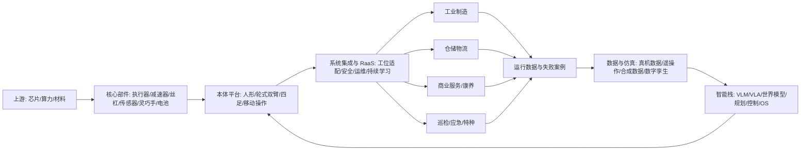

# 具身智能行业研究报告: 从技术验证迈向受约束的场景规模化

## 1. 行业一句话定义

具身智能是让智能体通过物理本体在真实或仿真环境中持续完成“感知—理解—决策—行动—反馈学习”的技术和产业体系; 本报告采用中口径, 覆盖具身模型与数据、仿真和开发工具、核心部件、机器人本体及场景解决方案, 但不把所有传统固定式工业机器人、纯软件智能体或无人驾驶汽车的全部收入计入具身智能市场。

## 2. 研究边界

| 项目 | 内容 |
|---|---|
| 地区 | 全球视角, 重点中国; 美国、欧洲作为技术和商业化对照 |
| 时间范围 | 事实观察以 2023 年至 2026 年 7 月为主, 趋势推演至 2030 年 |
| 行业口径 | 中口径: “模型和数据层 + 仿真/工具链 + 核心部件 + 具身本体 + 部署服务”; 人形机器人是重要形态但不是行业全部 |
| 包括 | 人形、轮式双臂、移动操作、四足等可在物理世界自主交互的本体; VLA/世界模型/运动控制; 传感器、执行器、灵巧手、控制器; 工业、物流、服务、特种场景 |
| 不包括 | 仅按预设程序工作的传统固定式自动化设备; 纯聊天机器人; 无物理执行闭环的 AI; 自动驾驶完整产业链; 军事用途的具体能力评估 |
| 关键假设 | 未来三至五年首先规模化的是高价值、半结构化且可度量的 B2B 任务; 家庭通用机器人商业化晚于工厂和物流; “通用”将由跨任务复用率而不是外形判定 |

### 2.1 研究计划摘要

| 项目 | 内容 |
|---|---|
| 母问题 | 具身智能是否已形成可规模化产业, 价值将在哪里产生, 哪些变量决定 2030 年前的胜负 |
| 子问题 | 技术可行性; 真实需求和单位经济; 市场口径; 产业链与利润池; 中美欧竞争; 生命周期; 景气指标; 风险与机会 |
| 选择的分析层级 | 宏观 + 中观; 微观公司仅作为验证产业进度的案例, 不做个股判断 |
| 必须验证的事项 | 真机连续作业成功率与人工接管率; 单任务总拥有成本; 付费部署数量; 数据复用效率; 安全事故率; 标准化进度; 非试点收入和续约率 |

本次检索先以政策、协会统计、客户方部署披露、原创论文和企业技术文档做广度覆盖, 再对“统一市场规模”“真实商业部署”和“安全标准”做定向闭环。证据最强的是政策文本、IFR 统计、国家统计公报及 BMW 客户侧运行数据; 最弱的是具身智能市场规模预测, 因不同机构常把人形机器人、服务机器人、核心零部件和软件重复计入。

### 2.2 来源矩阵和证据质量

| 关键 Claim | 来源类型 | 本报告用途 | 证据层级 | 证据质量 | 来源状态 | 独立验证状态 | 限制和缺口处理 |
|---|---|---|---|---|---|---|---|
| `claim-cn-policy-priority`: 中国已把具身智能从专项产业政策提升到国家未来产业和真实场景验证层面 | 国务院/工信部政策 | 外部因素、生命周期 | primary | high | obtained | single-source-primary | 目标不等于商业结果, 需跟踪验收和采购数据 |
| `claim-robot-installed-base`: 全球机器人安装基盘为具身智能提供供应链、客户和集成基础 | IFR 原始统计 | 规模代理、需求基础 | near-primary | high | obtained | single-source-primary | IFR 的工业机器人不等于具身智能, 仅作相邻市场代理 |
| `claim-service-robot-demand`: 专业服务机器人已形成增长市场, 物流运输为最大应用类别 | IFR 原始统计 | 下游需求和 RaaS 模式 | near-primary | high | obtained | single-source-primary | 统计含大量非具身、非人形设备 |
| `claim-real-deployment`: 人形机器人已进入少量真实生产和物流部署, 但尚非广泛规模化 | 客户方与供应商披露 | 商业可行性、生命周期 | primary | high | obtained | single-source-primary | BMW 与 GXO 任务较窄, 不应外推为通用能力 |
| `claim-vla-progress`: VLA 和机器人基础模型正在提升跨任务、跨本体迁移能力 | 原创论文和官方技术文档 | 技术可行性、防守性 | primary | high | obtained | single-source-primary | 厂商演示缺少统一第三方基准, 需真实场景复测 |
| `claim-reality-gap`: 仿真/受控环境能力与开放家庭环境可靠性仍有显著差距 | Stanford AI Index 与标准进展 | 生命周期、风险 | near-primary | medium | obtained | single-source-primary | AI Index 聚合的家庭任务基准不等同全部工业场景 |
| `claim-demographic-demand`: 老龄化和劳动供给结构为自动化创造长期需求 | 国家统计局与联合国 | 需求机制、外部因素 | primary | high | obtained | single-source-primary | 人口趋势不能直接证明机器人采购意愿或 ROI |
| `claim-market-size`: 具身智能尚缺全球统一、无重叠的官方市场规模统计 | 官方/协会检索与二手预测对比 | 规模性和估值纪律 | secondary | medium | obtained | secondary-only | 不把咨询预测当成事实; 采用场景数量、付费部署和 TCO 自下而上验证 |

### 2.3 检索缺口闭环结果

| 缺口 | 已尝试轮次和来源 | 当前状态 | 为什么仍重要 | 未补齐原因 | 下一步来源 |
|---|---|---|---|---|---|
| `gap-market-size`: 2025—2030 全球及中国具身智能可比市场规模 | 第1轮: 国家统计、工信部和 IFR; 第2轮: 原始行业报告及协会; 第3轮: 学术/政府引用和咨询预测口径对照 | 部分补齐 | 决定 TAM、渗透率和估值锚; 口径错配可造成数量级误判 | 公开资料混合人形本体, 服务机器人, 软件, 零部件和解决方案, 无统一官方分类 | IFR 人形机器人专项统计, 中国标委会分类标准, 企业经审计分业务收入 |
| `gap-unit-economics`: 典型人形机器人每有效工时成本、接管率和维保成本 | 第1轮: 客户方部署公告; 第2轮: RaaS 厂商官方材料; 第3轮: 公开检索客户 ROI 与合同条款 | 仍未补齐 | 决定商业可行性和价格上限 | 合同价格, 故障率, 人工接管和折旧口径属于商业机密, 无可靠可比公开数据 | GXO/Agility 合同 KPI, BMW 项目复盘, 采购招标和保险数据 |
| `gap-independent-benchmark`: 跨本体、跨场景统一真机基准和安全事故率 | 第1轮: ISO/OSHA; 第2轮: 中国国家/行业标准平台; 第3轮: Stanford 和公开学术基准 | 部分补齐 | 决定厂商演示能否横向比较, 也影响合规和保险成本 | 标准和评测体系仍在形成, 厂商任务集不同且事故分母缺失 | ISO/TC 299 正式标准, YD/T 6770-2026 实施数据, 第三方认证测试 |

## 3. 行业地图

| 模块 | 内容 |
|---|---|
| 纵向产业链 | 上游算力和材料; 中游核心部件、本体、模型/数据/仿真; 下游集成、运维和 RaaS; 终端为制造、物流、服务、康养和特种客户 |
| 横向竞争结构 | 美国强在通用模型、算力平台和高额融资的全栈创业公司; 中国强在机电供应链、制造成本、场景密度和整机迭代; 欧洲/日本强在工业自动化、安全标准和精密部件; 替代品包括专机、协作机器人、AMR、机器视觉和人工外包 |
| 生产要素 | 高功率密度执行器、精密传动、触觉/视觉、端侧算力、电池; 机器人和人类示范数据; 仿真能力; 机器人/AI/工艺复合人才; 长周期资本; 可持续开放的真实工位 |
| 生产关系 | 本体商依赖部件供应商与算力平台; 模型商依赖数据场和本体; 客户掌握高价值场景与验收权; 集成商连接机器人与 MES/WMS/安全体系; 监管、认证、保险决定可部署边界 |
| 关键流向 | 收入从客户按设备、项目或 RaaS 流向整机/集成商; 成本主要流向部件、研发、数据采集和现场运维; 数据从工位回流模型形成迭代飞轮; 政策资金和资本流向本体、模型及训练场 |

| 竞争层 | 代表性参与者或生态 | 当前观察 |
|---|---|---|
| 通用模型、算力与仿真 | Google DeepMind、NVIDIA、Physical Intelligence 等 | 争夺跨本体 VLA、世界模型、合成数据和开发者生态; 开放模型可能压低单一整机的软件租金 |
| 美国全栈本体 | Figure、Agility Robotics、1X、Apptronik、Tesla 等 | 融资和模型投入强, 正通过汽车、物流和家庭早期项目验证; 客户 KPI 与单位经济披露仍不完整 |
| 中国整机与平台 | 优必选、宇树、智元、银河通用、傅利叶、北京人形机器人创新中心等 | 供应链、产品迭代和场景密度强, 公开售价和批量交付信号增加; 同质化、回款和盈利是压力点 |
| 工业自动化与集成生态 | ABB、FANUC、安川、KUKA 及大量系统集成商 | 拥有客户、工艺、安全和服务网络, 既是具身智能的合作方也是替代方案提供者 |
| 场景与数据方 | BMW、GXO、汽车/3C/物流/能源央国企及训练场运营者 | 掌握验收、真实失败数据和采购权, 对行业路线的影响可能大于发布会声量 |

上述名单是角色示例而非排名。中国整机的价格下探可从 [Unitree G1 官方产品页](https://www.unitree.com/g1/) 观察, 但科研/开发者价格不能直接等同工业 TCO; 优必选的经审计披露则提供了“收入增长与盈利仍可分离”的样本。

行业真正的控制点并不天然属于“最像人”的整机。若模型可跨本体迁移, 硬件趋于标准化, 利润可能向算力、模型工具链和场景数据平台集中; 若现场可靠性主要来自软硬一体和工艺 know-how, 能控制本体、部署及运维闭环的全栈厂商更有优势。短期客户的验收对象不是通用智能, 而是某一工位的安全、节拍、可用率和全生命周期成本。

## 4. 生命周期判断

**阶段结论:** 具身智能整体处于导入期后段, 正向早期成长期过渡; 其中“固定/半结构化工业与物流任务”已进入小规模商业验证, 家庭通用机器人仍处技术导入期。该判断避免把少数连续运行案例等同于全行业规模化。

**证据:** 供给侧已有明显跃迁。Google DeepMind 于 2025 年发布 Gemini Robotics, NVIDIA 发布开放权重的 GR00T N1, 展示通用视觉—语言—动作模型、合成数据和跨本体适配成为共同路线。需求侧也出现客户方验证: BMW 披露 Figure 02 在 2025 年十个月内参与超过 3 万辆 X3 的生产, 搬运超过 9 万个部件并运行约 1,250 小时; GXO 与 Agility 在 2024 年签署多年 RaaS 部署协议。中国 2026 年实景实训专项行动把评价指标明确到真实作业成功率、效率提升率、安全可靠性和经济可行性, 并提出形成万台级落地能力, 说明政策关注点已从样机转向工况验证。来源见 [BMW 客户披露](https://www.bmwgroup.com/en/news/general/2026/humanoid-robot-in-leipzig.html)、[GXO/Agility 部署](https://www.agilityrobotics.com/content/gxo-signs-industry-first-multi-year-agreement-with-agility-robotics) 和 [工信部 2026 实景实训通知](https://www.miit.gov.cn/jgsj/kjs/wjfb/art/2026/art_cd666691abf8471fb8553d463aa416e3.html)。

**反证:** 商业部署仍集中于少数客户、窄任务和可改造环境, 合同价格、人工接管率、故障间隔、续约和项目毛利缺乏公开可比数据。Stanford 2026 AI Index 汇总指出, 机器人在真实家庭任务上的成功率仍显著低于仿真基准, 反映开放环境的长尾物体、接触、人的干扰和长时序误差仍会累积。标准层面, ISO 13482 第二版在 2026 年仍处最终草案阶段, 跨本体数据标准也在研制, 说明通用服务机器人的测试和责任边界尚未完全成熟。来源见 [Stanford 2026 AI Index 技术表现](https://hai.stanford.edu/ai-index/2026-ai-index-report/technical-performance) 和 [ISO/TC 299 项目清单](https://www.iso.org/committee/5915511/x/catalogue/)。

**置信度:** 中高。政策、技术发布和客户侧案例能确认“从演示走向受约束部署”; 但缺少行业统一出货、收入和单位经济数据, 无法确认已经进入普遍的高速增长期。

**研究含义:** 对具身智能行业而言, 当前最重要的不是远期“机器人数量”叙事, 而是验证从一个任务复制到十个任务、从一台复制到百台后, 成功率、接管率和毛利是否改善。行业会出现大量概念验证, 但只有通过客户验收、连续运行和复购的方案才构成有效需求。

## 5. 七个核心模块分析

### 5.1 可行性

**结论:** 具身智能在重复、危险、缺工且环境可控的 B2B 任务上已经具备条件性可行性, 但“家庭全能助手”尚不具备可验证的普遍单位经济。正确的商业起点是以任务为中心, 而非以人形外观为中心。

**证据:** 第一, BMW 的客户侧披露证明人形本体可在既有汽车工厂完成取放和定位等窄任务, 但项目同时需要安全隔离、5G 覆盖及生产 IT 配合。第二, GXO 采用 RaaS 多年协议而非一次性设备买断, 说明客户倾向把技术、可用率和残值风险留给供应商。第三, IFR 披露 2024 年专业服务机器人销量接近 20 万台, 其中物流运输约 10.29 万台, RaaS 机队增长 31%, 证明“按结果/服务付费”并非空白模式, 但这些统计不能直接等同人形具身智能。来源见 [IFR 2025 服务机器人报告摘要](https://ifr.org/news/service-robots-see-global-growth-boom/1st-)。

**机制:** B2B 场景能把任务空间收窄、环境标准化并量化节拍, 从而用工程约束降低模型长尾风险; RaaS 又将高额前置资本开支转为运营支出。相反, 家庭场景物体、人员和空间变化大, 价值密度低且安全责任高, 一次失败可能抵消多次成功带来的效用。

**研究含义:** 对具身智能行业, 最可行的进入路径依次是危险/高负荷任务、料箱与工位间搬运、机器上下料、质检巡检, 再扩展到多任务协作; 不宜把会行走或短视频演示当成商业验证。

**关键指标和后续验证:** 每有效作业小时总成本; 单班自主可用率; 每千次任务人工接管次数; 任务成功率和节拍相对人工/专机的差距; 安全停机次数; 客户从 POC 转正式合同的比例; 12 个月续约率。下一步应取得 GXO、BMW 或同类客户的验收 KPI 和 RaaS 合同口径。

### 5.2 规模性

**结论:** 长期潜在空间很大, 但现阶段不适合用单一机构的远期市场规模作为核心结论。可投资/可经营的有效市场应采用“可自动化任务小时 × 可接受每小时价格 × 可达部署率”自下而上估算, 并扣除专机、协作机器人和 AMR 已覆盖的任务。

**证据:** IFR 统计显示, 2024 年全球工业机器人安装约 54.2 万台, 连续第四年超过 50 万台; 专业服务机器人销量接近 20 万台。这证明全球客户、集成商和供应链具备吸收机器人的基础。中国又拥有全球最大的工业机器人使用基盘, 并在 2026 年实景实训行动中提出百个以上高价值场景和万台级落地能力。另一方面, 公开的具身智能市场预测在是否包含无人车、服务机器人、零部件和软件上差异很大, 本报告将其归入 `gap-market-size`, 不做伪精确汇总。来源见 [IFR 2025 工业机器人信息](https://ifr.org/home/P72) 和 [工信部实景实训通知](https://www.miit.gov.cn/jgsj/kjs/wjfb/art/2026/art_cd666691abf8471fb8553d463aa416e3.html)。

**机制:** 规模增长由三条曲线相乘: 可完成任务集合扩大、单机成本下降、客户部署复制加速。VLA 和跨本体数据共享提高技能复用率; 部件量产和模块化降低 BOM; RaaS 降低客户试用门槛。但若每个新工位仍需大量定制、采数和驻场工程师, 收入会增长而毛利与现金流不增长, 形成“项目制伪规模”。

**研究含义:** 对具身智能行业, 近期 SAM 集中在汽车、3C、仓储物流、能源巡检和危险作业; 养老和家庭是远期 TAM, 不是近期收入锚。看规模时应优先采用已验收工位数、在役台数和有效作业小时, 而非发布会订单或意向金额。

**关键指标和后续验证:** 付费在役台数; 平均每客户扩展台数; 单一技能跨客户复用率; 部署周期; 单台年有效工时; 正式订单/意向订单比例; 机器人收入中硬件、软件订阅、运维和定制开发占比。下一步需等待 IFR 人形机器人专项口径和企业经审计的分业务收入。

### 5.3 防守性

**结论:** 当前不存在已经被证明的单一永久护城河。最有希望的壁垒是“高质量真实数据 + 模型/仿真 + 本体工程 + 客户工艺 + 运维网络”的闭环, 仅靠本体参数、单次演示或采购通用部件难以长期防守。

**证据:** Open X-Embodiment 研究显示跨机器人数据训练可产生正迁移, NVIDIA GR00T N1 又把人类视频、真实和仿真轨迹、合成数据组合并开放权重, 这会降低通用模型层的部分进入门槛。与此同时, Figure 强调从人类视频和现场数据扩大 Helix, Google Gemini Robotics 强调跨不同机器人形态适配, 表明行业竞争焦点从“单机动作库”转向数据规模、模型泛化与部署闭环。来源见 [Open X-Embodiment 论文](https://arxiv.org/abs/2310.08864)、[NVIDIA GR00T N1](https://research.nvidia.com/publication/2025-03_nvidia-isaac-gr00t-n1-open-foundation-model-humanoid-robots) 和 [Google Gemini Robotics](https://deepmind.google/blog/gemini-robotics-brings-ai-into-the-physical-world/)。

**机制:** 开源模型和标准部件会压低单点技术租金, 但真实失败数据稀缺且与本体、工艺、安全边界强相关。能进入客户现场的厂商获得长尾案例, 再通过仿真和策略学习改善成功率, 形成“部署—数据—模型—更好部署”的飞轮。若数据不能跨本体/任务复用, 飞轮则退化为昂贵的项目定制。

**研究含义:** 对具身智能行业, 护城河评估应从专利数量和样机参数转向数据权利、客户留存、模型在未见任务上的提升、现场故障闭环速度以及软硬件接口控制力。平台型赢家可能来自模型工具链, 也可能来自拥有最大有效机队的本体商, 尚未定型。

**关键指标和后续验证:** 真实机器人训练小时; 独立任务/场景覆盖; 跨本体零样本或少样本成功率; 单技能迁移所需新增数据量; 现场问题平均关闭时间; 数据合同中的使用权; 开源依赖度。下一步需第三方复现厂商声称的跨场景泛化结果。

### 5.4 盈利性

**结论:** 近期最可能获得较好利润的是稀缺核心部件、算力/仿真工具、经过验证的场景集成和运维服务; 整机层可能因降价、研发摊销和驻场服务承压。行业收入增长不必然带来利润增长。

**证据:** 人形/移动操作机器人需要高功率密度执行器、精密传动、力/触觉传感、灵巧手和端侧算力, 这些环节在供给受限时具备议价能力。另一方面, 工信部 2023 指导意见直接把专用传感器、高功率密度执行器、专用芯片、高能效动力组件列为短板, 说明关键部件仍是产业化约束。优必选 2025 年经审计披露显示, 全尺寸具身人形产品及服务收入已快速增长至 8.206 亿元, 但公司整体仍净亏损 7.898 亿元, 且应收、维修维护和信用减值值得观察; 这说明收入放量并不自动等于成熟利润。IFR 观察到 RaaS 机队增长, 证明经常性收入路径存在; 但本报告未取得人形机器人可比的完整贡献毛利和现金回收周期。来源见 [工信部政策解读](https://www.miit.gov.cn/zwgk/zcjd/art/2023/art_e3f5686c2f0d49f9968b7ae011d558e1.html) 和 [优必选 2025 年度业绩公告](https://www1.hkexnews.hk/listedco/listconews/sehk/2026/0331/2026033102607.pdf)。

**机制:** 早期整机厂同时承担硬件迭代、模型训练、客户定制、现场安全和售后, 固定成本与隐性人工成本高。售价下降若来自 BOM 和部署效率同步改善, 可扩大毛利额; 若仅来自融资补贴式竞争, 会把行业推向高收入、低现金流。RaaS 可提高客户采用率, 却把资产、利用率和残值风险转回供应商, 对资金成本要求更高。

**研究含义:** 对具身智能行业, 未来两三年的利润池不宜按整机出货简单排序。能标准化交付、控制应收和维保、将一次性定制转为可复用软件包的企业, 比仅宣布大额订单的企业更健康。

**关键指标和后续验证:** BOM 降本曲线; 硬件毛利与包含驻场服务后的贡献毛利; 研发费用/收入; 应收账款天数; RaaS 单机利用率和回收期; 故障维修成本; 质保准备; 经营现金流。下一步需企业审计报表及客户合同的收入确认、退换和 SLA 条款。

### 5.5 估值

**结论:** 行业仍处期权价值主导阶段, 适合使用情景化的收入/在役台数/任务经济模型, 不适合把远期机器人总量直接折算为当前价值。可比公司估值必须拆分本体、部件、自动化主业和 AI 平台, 防止业务口径错配。

**证据:** 当前大量核心玩家未盈利或未公开完整财务, 成熟 PE 难以适用; 真实部署虽出现, 但公开单位经济缺失。技术发布和融资提高了未来市场预期, 而统一市场分类和收入确认尚未建立, 使估值对渗透率、价格、毛利和资金成本极其敏感。Figure 等私营公司的融资估值属于资本市场交易事实而非行业现金流证明; 本报告不以单轮融资外推全行业价值。

**机制:** 导入期估值由“潜在任务空间 × 成功概率 × 可捕获利润”决定。任何一项假设变化都会产生非线性影响: 若自主率跨过客户 SLA, 部署可能快速复制; 若人工接管长期居高, 有效收入和毛利会同时下修。利率与风险偏好又会改变远期现金流折现, 导致估值先于经营结果波动。

**研究含义:** 对具身智能行业, 最有解释力的估值锚是经验证的商业里程碑: POC 转正、扩点、续约、单机有效工时、贡献毛利和现金消耗。对多业务上市公司应做分部估值, 对早期公司应采用基准/上行/下行情景并明确融资稀释。

**关键指标和后续验证:** 企业价值/经常性收入; 企业价值/付费在役台数; 单机生命周期贡献毛利; 净现金消耗月数; 下一轮融资条件; 客户集中度; 订单转收入率。下一步需可比公司的分业务收入、客户复购和全周期毛利数据。

### 5.6 外部因素

**结论:** 政策和技术周期强力推动行业, 人口结构提供长期需求, 但安全、责任、数据合规、出口管制和资本纪律会决定实际扩张速度。政策是加速器而非需求替代品。

**证据:** 政治/政策方面, 中国 2025 年政府工作报告把具身智能列为未来产业, 2026 年专项行动进一步要求真实场景部署和经济性评价。经济方面, 高资金成本会压制资产密集的 RaaS, 制造业设备更新和缺工则提升自动化预算。社会方面, 中国 2025 年 65 岁及以上人口达 2.2365 亿、占 15.9%, 但养老机器人仍需证明支付方和责任边界。技术方面, VLA、合成数据和仿真加速进步, 同时 ISO 服务机器人安全标准仍在更新。来源见 [2025 年政府工作报告全文](https://www.gov.cn/yaowen/liebiao/202503/content_7010168.htm)、[国家统计局 2025 年公报](https://www.stats.gov.cn/sj/zxfb/202602/t20260228_1962662.html) 和 [ISO 13482 项目](https://www.iso.org/standard/83498.html)。

**机制:** 政策通过科研资金、场景开放、政府采购和标准建设降低早期试错成本; 人口老龄化和高危岗位替代提高需求价值; 但机器人进入人与设备共存空间后, 一次重大事故可能触发认证、保险和客户部署收紧。数据跨境、摄像头隐私和供应链限制还会增加区域化成本。

**研究含义:** 对具身智能行业, 中国的场景与制造优势有利于快速工程迭代, 美国的模型/算力和风险资本有利于基础模型突破, 欧洲/日本的工业客户、精密制造与标准能力有利于高可靠部署。最终竞争不是单一国家全胜, 而是供应链和生态的重新组合。

**关键指标和后续验证:** 国家和地方实际采购/验收金额; 标准正式发布与认证数量; 机器人相关工伤和召回; 保险费率; 关键芯片和部件出口限制; 训练数据合规规则; 制造业资本开支。下一步需跟踪标委会、ISO/TC 299、OSHA/各国职业安全机构及招投标数据库。

### 5.7 景气度

**结论:** 当前行业景气处于“资本、产品发布和试点高热, 可验证收入与利润滞后”的上行早期。领先指标积极, 同步指标分化, 因此既不能按成熟制造周期看待, 也不能把融资热度当作终端需求。

**证据:** 量方面, IFR 2024 年工业机器人安装 54.2 万台、专业服务机器人销量接近 20 万台, 相邻市场保持较大基盘; 中国国家税务总局口径显示 2026 年 1—5 月具身智能企业销售收入同比增长 22.4%, 工业企业购进具身机器人金额同比增长 2.3 倍, 这是需求升温的官方代理指标, 但其税务识别口径宽于人形整机。中国 2026 年政策还提出百个高价值场景和万台级落地能力。产品方面, Google、NVIDIA、Figure 等持续发布 VLA/基础模型和全身控制进展。商业方面, BMW、GXO 等出现连续运行或多年协议。反面证据是行业仍缺统一的人形/具身出货统计、公开积压订单兑现率、毛利和现金流, 许多企业仍在样机与融资阶段。来源见 [国家税务总局具身智能销售与采购数据](https://tianjin.chinatax.gov.cn/11241000000/0200/020001/20260707141633062.shtml)。

**机制:** 景气传导顺序通常是模型/样机突破 → 融资与扩产 → POC 数增加 → 客户验收 → 扩点和复购 → 标准化收入 → 毛利和现金流改善。当前大致位于 POC 向验收/扩点迁移阶段, 上游订单可能先于终端 ROI 兑现, 容易出现过度扩产和价格战。

**研究含义:** 对具身智能行业, 应把“景气”和“成熟度”分开。短期景气可以很高, 但商业失败率仍高; 只有正式付费部署、单客户扩点和运维效率同步改善, 才能证明上行进入可持续阶段。

**关键指标和后续验证:** 月度/季度付费出货; POC 数与转正率; 客户扩点率; 单台价格和 BOM; 产能利用率; 人员招聘结构; 订单取消率; 存货和应收; 融资金额与估值; 毛利和经营现金流。下一步应建立按企业和场景跟踪的季度看板, 剔除内部采购、框架订单和重复统计。

## 6. 趋势推演

未来一至三年, 第一条主线是从“人形机器人”叙事转向“移动操作系统”竞争。客户会根据任务选择腿、轮、臂、夹爪或灵巧手, 人形只是适配人类环境的一种组合。触发条件是不同本体在同一任务上出现公开的成本、节拍和安全对比; 若轮式双臂在大多数室内工位胜出, 全尺寸双足的近期 SAM 会收缩。

第二条主线是 VLA、世界模型和分层控制融合。高层模型负责语义理解和规划, 低层策略以更高频率处理接触、平衡和动作, 仿真/合成数据补足昂贵真机数据。触发条件是跨本体基准中, 新任务所需示范量持续下降且真机成功率不因环境变化大幅衰减。Google Gemini Robotics、NVIDIA GR00T 和 Figure Helix 的方向已提供供给侧信号, 但仍需第三方复现。

第三条主线是数据从“越多越好”转向“失败数据、接触数据和任务覆盖更值钱”。企业会争夺工厂、仓库、商业空间的数据权利, 同时发展遥操作、可穿戴采集、人类视频迁移和仿真生成。触发条件是单位真机数据带来的成功率提升可以量化; 若数据无法跨本体复用, 数据平台的规模效应将弱于预期。

第四条主线是商业模式由卖样机转向 RaaS、按有效工时或按任务付费。客户把采购门槛降低, 供应商承担资产、运维和 SLA, 行业因而会分化为有现金流和运维能力的平台商与依赖项目回款的硬件商。触发条件是 RaaS 单机利用率、回收期、续约率公开改善; 若资金成本或故障成本过高, 模式会退回设备销售加服务费。

第五条主线是中国进入“场景密集验证 + 成本下探 + 标准形成”的窗口。政策已从产业方向进入实景实训和评测, 供应链有利于 BOM 下降; 但这也可能带来同质化整机、地方重复建设和低价竞争。触发条件是万台级能力转化为客户验收与非补贴收入, 而非产能或框架订单。

到 2030 年可用三种情景理解, 而非预测精确数值:

| 情景 | 核心假设 | 行业结果 | 可证伪指标 |
|---|---|---|---|
| 基准 | 半结构化 B2B 任务可靠性逐步跨过 SLA, 成本温和下降 | 工业、物流、巡检形成成规模细分市场; 家庭仍以试点和高端产品为主 | POC 转正和扩点率持续上升, 贡献毛利转正 |
| 上行 | 跨本体 VLA 显著减少采数, 灵巧操作和安全标准突破 | 多任务平台快速复制, 软件/数据平台价值上升, 服务场景提前放量 | 新任务示范量下降一个数量级, 接管率与事故率同步下降 |
| 下行 | 长尾可靠性、维保和成本改善停滞, 资本收紧 | 退回专用自动化和项目制, 整机价格战与整合加速 | 订单转收入低、库存/应收上升、客户扩点停滞 |

## 7. 事实, 观点和推断分层

| 类型 | 内容 | 来源/依据 | 证据层级 | 证据质量 | 来源状态 | 置信度 |
|---|---|---|---|---|---|---|
| 事实 | 2024 年全球工业机器人安装约 54.2 万台, 连续第四年超过 50 万台 | [IFR World Robotics 2025](https://ifr.org/home/P72) | near-primary | high | obtained | 高 |
| 事实 | 2024 年专业服务机器人销量接近 20 万台, 物流运输约 10.29 万台, RaaS 机队增长 31% | [IFR 服务机器人发布](https://ifr.org/news/service-robots-see-global-growth-boom/1st-) | near-primary | high | obtained | 高 |
| 事实 | BMW 披露 Figure 02 在十个月内支持超过 3 万辆 X3 生产、搬运超过 9 万个部件、约 1,250 运行小时 | [BMW 客户侧项目复盘](https://www.bmwgroup.com/en/news/general/2026/humanoid-robot-in-leipzig.html) | primary | high | obtained | 高 |
| 事实 | 中国 2025 年政府工作报告把具身智能列为未来产业; 2026 年实景实训行动要求评估成功率、效率、安全和经济性 | [中国政府网](https://www.gov.cn/yaowen/liebiao/202503/content_7010168.htm); [工信部](https://www.miit.gov.cn/jgsj/kjs/wjfb/art/2026/art_cd666691abf8471fb8553d463aa416e3.html) | primary | high | obtained | 高 |
| 事实 | 中国 2025 年 65 岁及以上人口为 2.2365 亿, 占 15.9% | [国家统计局](https://www.stats.gov.cn/sj/zxfb/202602/t20260228_1962662.html) | primary | high | obtained | 高 |
| 待核验事实 | 某些公开研究给出 2025 年中国具身智能市场约 52.95 亿元 | 政府/科研文章对行业报告的转引, 未取得原始可比统计底表 | secondary | medium | obtained | 低 |
| 观点 | 人形机器人被视为机器人产业的下一重要方向, 但存在明显限制 | [IFR《Humanoid Robots: Vision and Reality》](https://ifr.org/ifr-press-releases/news/humanoid-robots-vision-and-reality-paper-published-by-ifr) 的协会观点 | near-primary | medium | obtained | 中 |
| 推断 | 行业整体处于导入期后段, 工业/物流窄任务向早期成长过渡 | 基于政策、客户运行、模型发布和公开单位经济缺口 | primary | high | obtained | 中高 |
| 推断 | 未来三年利润更可能向稀缺部件、平台工具和可复用集成倾斜, 而不是无差别流向整机 | 基于产业链稀缺性、RaaS 风险承担和项目制成本机制 | primary | medium | obtained | 中 |

## 8. 多视角压力测试

| 视角 | 质疑 | 为什么重要 | 需要验证 |
|---|---|---|---|
| 行业专家 | “跨任务通用”可能只是同一场景内的技能拼接, 并未证明开放环境泛化 | 若泛化被高估, 数据与模型的规模效应会下降, 行业仍是定制自动化 | 未见物体、未见工位和不同本体的第三方盲测成功率 |
| 投资研究员 | 大额融资、订单和远期机器人数量没有转化为可审计收入、毛利和现金流 | 期权估值可能远高于可捕获利润, 融资收紧时易快速去杠杆 | 订单转收入率、贡献毛利、现金消耗、客户集中度和融资条款 |
| 政策/监管研究者 | 场景补贴和地方产业园可能制造重复建设; 安全、隐私和责任规则滞后 | 供给扩张可能快于有效需求, 事故会改变监管节奏 | 政府采购验收、补贴依赖、事故/召回、标准认证和保险数据 |
| 经营者/创业者 | 与专机、协作机器人、AMR 相比, 人形方案未必有最低 TCO | 客户购买的是任务结果, 不是形态; 替代方案可能更便宜可靠 | 同任务 A/B 对比的节拍、可用率、改造费、人工接管和五年 TCO |
| 一线使用者 | 机器人可能把体力劳动转化为监控、排障和数据标注, 而非真正减少劳动 | 隐性人工会被漏算, 也影响员工接受度和组织再设计 | 每台机器人所需远程操作/维护工时, 岗位变化和培训成本 |
| 反方审稿人 | 主线判断最可能错在把少数头部客户的受控案例外推为全行业拐点 | 若复制到第二、第三客户失败, 生命周期仍是早期导入而非过渡 | 同一技能跨客户部署周期、扩点率、续约率和失败项目比例 |

压力测试后的收敛结论是: 行业方向有真实进步和真实需求, 但“规模化”必须以独立客户复购和单位经济为门槛。最值得相信的信号是客户方连续运行数据; 次一级是供应商技术演示; 最弱的是无口径订单、融资估值和远期数量预测。

## 9. 风险, 机会和不确定性

| 类型 | 内容 | 证据/依据 | 触发条件 |
|---|---|---|---|
| 事实风险 | 开放环境可靠性、安全标准和统一评测仍未成熟 | Stanford 真实家庭任务表现与仿真存在差距; ISO 服务机器人标准仍更新 | 重大事故、认证延后、客户提高 SLA 或要求责任担保 |
| 事实风险 | 商业数据透明度低, 人形机器人单位经济尚不可比 | 合同价格、接管率、故障间隔、续约和项目毛利公开缺失 | 扩点停滞、应收/库存上升、RaaS 现金回收恶化 |
| 假设风险 | 假设 VLA 的跨任务/跨本体正迁移能持续扩大 | Open X-Embodiment 和厂商披露支持方向, 尚缺统一真机盲测 | 新任务仍需大量采数和现场工程, 模型迁移收益趋平 |
| 假设风险 | 假设 BOM 下降会转化为 TCO 优势 | 中国供应链和量产投入提供可能, 但运维与隐性人工可能抵消 | 售价下降而贡献毛利不改善, 故障和驻场成本高企 |
| 数据缺口 | 全球/中国具身智能统一市场规模和企业分业务收入缺失 | 分类标准仍形成, 统计常混入服务机器人和传统自动化 | IFR/标委会建立统一分类, 企业开始披露可审计口径 |
| 上行机会 | 工业和物流从单任务复制到多任务, 形成客户数据飞轮 | BMW/GXO 等已验证受控任务; 模型和仿真工具快速迭代 | POC 转正率、单客户台数、有效工时和复购连续四季度改善 |
| 上行机会 | 中国把制造成本、真实场景和标准化结合, 形成全球供应链平台 | 政策明确实景实训、百个场景和万台级能力 | 非补贴客户收入占比提升, 核心部件可靠性和出口竞争力改善 |
| 上行机会 | RaaS 把自动化从资本品变为按结果付费服务 | IFR 披露 RaaS 机队增长, GXO/Agility 已采用多年协议 | 单机利用率和续约率上升, 融资成本下降, 残值可管理 |

## 10. 后续验证清单

| 待验证问题 | 当前证据状态 | 为什么重要 | 推荐来源 | 优先级 |
|---|---|---|---|---|
| 人形机器人每有效工时的完整成本是否低于人工或专机 | `gap-unit-economics`: 仍未补齐 | 决定需求真实性和价格上限 | 客户验收报告、RaaS 合同、保险和维保数据 | 高 |
| POC 转正式部署及扩点的比例 | 多个客户案例已取得, 行业统计未取得 | 决定行业是否真正进入成长期 | 本体商审计披露、客户采购数据库、行业协会 | 高 |
| 跨本体 VLA 在未见场景的独立成功率 | `gap-independent-benchmark`: 部分补齐 | 决定数据/模型是否具有平台规模效应 | YD/T 6770-2026 测试、ISO/TC 299、第三方实验室 | 高 |
| 中国万台级落地能力中有多少形成付费和常态部署 | 政策目标已取得, 完成结果未到期 | 区分产能、示范与有效需求 | 工信部 2026 专项验收、央企和地方采购公告 | 高 |
| 具身智能市场是否形成统一统计分类 | `gap-market-size`: 部分补齐 | 决定 TAM、渗透率和可比估值 | IFR 专项统计、国家统计分类、工信部标委会 | 中高 |
| 核心部件的国产化、寿命和降本曲线 | 政策列出短板, 可比量产数据不足 | 决定供应链安全、BOM 和利润池 | 部件企业年报、可靠性认证、整机拆解和采购数据 | 中高 |
| 安全事故率和责任分配是否可保险化 | 标准框架已取得, 事故分母未取得 | 决定人机共域部署速度和成本 | OSHA/各国职业安全机构、保险公司、认证机构 | 中高 |

## 11. 报告合规自检表

| 检查项 | 是否通过 | 说明 |
|---|---|---|
| 行业全览模板完整 | 通过 | 使用行业概览标准路线, 保留 1—11 全部章节 |
| 研究简报转译已完成 | 通过 | 已锁定中文、全球重点中国、2023—2026 事实期与 2030 展望 |
| 研究边界和研究计划完整 | 通过 | 地区、时间、口径、包括/不包括、假设和分析层级均已明示 |
| 来源矩阵和检索缺口闭环结果完整 | 通过 | 关键 Claim 绑定稳定 ID; 三个高影响缺口记录实际三轮检索路径 |
| 行业地图和生命周期判断完整 | 通过 | Mermaid 和结构表在生命周期及七模块之前 |
| 七个核心模块完整 | 通过 | 5.1—5.7 均为独立分析小节 |
| 七模块深度和五段结构达标 | 通过 | 每节均含结论、证据、机制、研究含义、关键指标和后续验证 |
| 报告深度 rubric 达标 | 通过 | 生命周期、七模块、趋势、风险和证据分层均达到标准报告阈值 |
| 事实/观点/推断已分层 | 通过 | 独立章节列示来源、层级、质量、状态和置信度 |
| 证据层级和来源状态清楚 | 通过 | 使用 canonical 枚举并披露市场规模与单位经济缺口 |
| 多视角压力测试完成 | 通过 | 覆盖行业、投资、政策、经营、一线使用者和反方视角 |
| 后续验证清单具体 | 通过 | 每项包含当前证据状态、影响、推荐来源和优先级 |

本报告仅供研究和信息参考, 不构成投资建议, 也不构成任何收益承诺.
