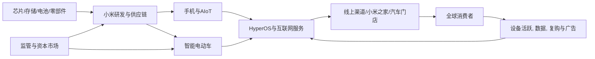

# 小米集团股价大跌原因研究报告

## 0. 研报前置区

### 0.1 报告摘要

小米集团-W, 1810.HK, 从2025年6月27日盘中约61.45港元的高点, 到2026年6月18日收于24.58港元, 最大阶段回撤约60%. 2026年7月16日股价反弹至约27.50港元后, 相对高点仍低约55%. 同期恒生指数从24,284点附近到23,925点附近仅小幅回落, 因此宽基市场不能解释小米的大部分跌幅. 这是一轮明显的公司特异性重估, 港股科技风险偏好只是放大器.

核心原因不是单一事故或单季财报, 而是高估值基础上的盈利预期反转. 2025年股价大涨已经同时计入手机高端化, 汽车快速盈利, AI生态变现和“人车家全生态”协同. 随后, 存储成本上升压缩手机毛利, 低价机型需求受损, IoT补贴高基数消退, 汽车产品切换导致交付环比下滑且新业务重新录得较大经营亏损, 市场开始同时下调盈利预测和估值倍数, 形成“戴维斯双杀”.

汽车事故舆情, 召回和辅助驾驶监管强化了风险溢价, 但不能被简单写成全部下跌的根因. 官方召回说明部分SU7标准版在某些极端场景下的L2辅助驾驶识别, 预警或处置可能不足, 这是可验证的经营风险; 但个别事故的最终技术责任和对订单净影响仍缺完整公开结论. 同样, 配售, 短卖和市场轮动会影响交易节奏, 但公司持续回购, 拥有约2,206亿元人民币现金资源, 互联网服务和IoT用户指标仍增长, 反驳了“流动性危机”或“所有业务全面失速”的说法.

### 0.2 关键结论

| 结论 | 原因 | 证据指向 |
|---|---|---|
| 第一主因是盈利预期下修 | 2026年一季度收入同比下降10.9%, 调整后净利下降43.1%, 经营利润下降59.5% | 港交所2026年一季报, 11.2 |
| 第二主因是手机成本与产品结构压力 | 出货下降19.2%, 手机毛利率由12.4%降至10.1%, 低价机对存储涨价更敏感 | 港交所一季报, Counterpoint, 5.4 |
| 第三主因是汽车估值从“高增长且快速盈利”回到“高增长但兑现波动” | 一季度汽车及AI新业务经营亏损31亿元, 交付环比显著下降, 安全与监管风险抬升 | 港交所一季报, SAMR, MIIT, 11.3 |
| 此前估值过满使坏消息的价格弹性更大 | 高点同时定价手机高端化, 汽车, AI和生态协同; 盈利下修后倍数也被压缩 | 券商SOTP变化, 11.3 |
| 港股科技回调是放大器而非根因 | 小米同期跌幅远大于恒生指数; 同区间恒生科技精确总回报仍需付费行情核验 | FT市场数据, 2.3, 11.1 |
| 下跌不等于公司陷入生存危机 | 现金资源约2,206亿元, 大额回购, IoT设备和互联网服务仍增长 | 港交所一季报及回购公告, 11.4 |

### 0.3 核心指标总览

| 指标 | 行业读数 | 目标公司/产品读数 | 判断 | 证据/来源 |
|---|---|---|---|---|
| 市场规模 | 全球手机约十亿部级, 中国新能源车半年销量超700万辆 | 手机全球前三, 汽车Q1交付80,856辆 | TAM充足, 关键在利润质量 | Counterpoint, 中国政府网, 小米一季报 |
| 增速/渗透率 | 2026手机行业收缩, 新能源车仍增长 | Q1收入-10.9%, 汽车交付+6.6% | 业务周期明显分化 | 小米一季报 |
| 竞争强度 | 手机与中国汽车均为强竞争 | 手机出货-19.2%, 汽车仍在产品换代 | 公司alpha压力大于宽基beta | 小米一季报, 行业数据 |
| 盈利水平 | 存储和汽车竞争压制硬件利润 | 调整后净利-43.1%, 手机毛利10.1% | 盈利预期下修是首要原因 | 小米一季报 |
| 景气度 | 手机偏弱, 新能源车量增利压 | IoT用户增, 但手机和集团收入下降 | 短期偏弱, 中期未被证伪 | 小米一季报, Counterpoint |
| 关键风险 | 存储, 价格战, 安全监管 | 新业务亏损31亿元, 官方召回 | 风险溢价上升 | 小米一季报, SAMR, MIIT |

### 0.4 图表清单或图表占位

| 图表 | 类型 | 用途 |
|---|---|---|
| 图表1: 小米多业务行业地图 | Mermaid | 展示手机, AIoT,互联网服务和汽车的价值链联系 |
| 图表2: 股价与关键事件时间线 | 表格 | 区分高点, 事故, 业绩和回购事件 |
| 图表3: 2026年一季度盈利桥 | 表格 | 展示收入, 毛利,研发和新业务亏损的传导 |
| 图表4: 七模块判断矩阵 | 分节正文 | 展示可行性到景气度的结论和证据 |
| 图表5: 估值预期差与情景 | 表格 | 展示重估所需条件和证伪指标 |

## 1. 目标公司/产品综合判断

小米仍是一家具有手机规模入口, IoT连接网络, 高毛利互联网服务和快速成长汽车业务的多业务科技制造公司, 但资本市场在2025年一度把四条业务线最乐观的结果同时计入价格. 当现实进入存储涨价, 手机需求收缩, 汽车产品换代, AI和研发投入增加的阶段时, 市场不再愿意为尚未稳定兑现的协同支付高倍数. 因此, “股价为什么跌”应拆为两层: 基本面增速和利润确实下降, 同时此前估值过高使同样的基本面变化产生更大股价冲击.

本报告给出的归因权重是分析判断而非可审计事实: 盈利预期下修及手机毛利压力约35%-40%; 汽车盈利, 交付和安全风险重估约20%-25%; 此前估值过满与交易拥挤约20%; 港股科技和宏观风险偏好约10%-15%; 配售, 短卖等技术因素低于10%. 各因素会重叠, 不应机械相加为精确因果分解.

反面证据同样重要. 2025年全年收入增长25%, 调整后净利润增长43.8%, 汽车及AI新业务全年首次录得经营利润; 2026年一季度手机ASP提升8.2%, IoT设备连接数增长18.5%, 互联网服务收入增长4.3%, 汽车新一代SU7锁单仍强. 这些事实说明市场正在下调“增长的速度和盈利质量”, 而不是确认小米商业模式已经失效.

## 2. 研究边界

| 项目 | 内容 |
|---|---|
| 地区 | 经营覆盖全球; 汽车重点中国; 证券市场为香港联交所 |
| 时间范围 | 股价窗口为2025年6月27日至2026年7月17日; 财务以2025年报和2026年一季报为主 |
| 行业口径 | 智能手机, AIoT和家电, 互联网服务, 智能电动车, AI研发及港股科技估值 |
| 公司/产品范围 | 小米集团-W, 1810.HK, 不把非上市关联主体单独估值 |
| 包括 | 价格表现, 业绩, 行业周期, 事故与监管, 估值, 预期差, 资金面和反证 |
| 不包括 | 日内交易建议, 目标买卖价, 保证收益, 未经官方确认的事故责任 |
| 关键假设 | “大跌”指2025年中高点后的累计回撤; 7月17日未收盘时使用7月16日完整交易日数据 |

### 2.1 研究计划摘要

| 项目 | 内容 |
|---|---|
| 母问题 | 小米股价为何从2025年高点大幅回落, 哪些因素是根因, 哪些只是放大器 |
| 子问题 | 股价在哪些窗口下跌; 基本面和预期分别如何变化; 手机与汽车贡献多少; 估值锚为何下移; 哪些反证限制悲观结论 |
| 选择的分析层级 | 宏观+中观+微观+资本市场, 因为这是多业务上市公司的股价归因问题 |
| 必须验证的事项 | 价格区间, 2026Q1收入利润, 手机出货和毛利, 汽车交付和亏损, 安全召回, 现金与回购 |
| 条件模块 | multi_business_split=enabled; portfolio_analysis=enabled; capital_market=enabled |

### 2.2 来源矩阵和证据质量

| 关键 Claim | 来源类型 | 本报告用途 | 证据层级 | 证据质量 | 来源状态 | 独立验证状态 | 限制和缺口处理 |
|---|---|---|---|---|---|---|---|
| `claim-price-drawdown`: 股价出现大幅回撤 | 公开行情数据库 | 确认高点, 低点和成交 | near-primary | high | obtained | same-origin-cross-check | 多页面上游均为交易所行情, 不算独立数据生成 |
| `claim-q1-earnings-reset`: 一季报触发盈利重置 | 港交所公司披露 | 收入, 利润和费用 | primary | high | obtained | single-source-primary | 公司披露已由审阅会计师审阅, 但仍是一季未经审计口径 |
| `claim-phone-memory-pressure`: 存储与结构压制手机 | 公司披露+行业研究 | 手机出货, 毛利和行业机制 | primary | high | obtained | independently_verified | 公司结果与Counterpoint行业跟踪来自不同来源 |
| `claim-ev-expectation-gap`: 汽车增长与利润存在预期差 | 港交所公司披露 | 交付, 收入, 毛利和亏损 | primary | high | obtained | single-source-primary | 分部包含EV, AI和其他新业务, 非纯汽车利润表 |
| `claim-safety-regulatory-risk`: 安全与监管提高风险溢价 | SAMR+MIIT | 召回和监管标准 | primary | high | obtained | independently_verified | 不据此推断个别事故最终责任 |
| `claim-valuation-derating`: 高估值后出现倍数压缩 | 公开券商报告 | 估值锚和预期变化 | secondary | medium | obtained | secondary-only | 完整一致预期历史需Bloomberg或LSEG |
| `claim-industry-beta`: 市场beta只解释部分跌幅 | 指数历史行情 | 小米与宽基比较 | near-primary | medium | obtained | single-source-primary | 恒生科技同区间精确总回报仍是缺口 |
| `claim-balance-sheet-counterevidence`: 不存在流动性危机证据 | 港交所公司披露 | 现金, 回购和韧性业务 | primary | high | obtained | single-source-primary | 回购不保证股价, 现金资源定义含存款和投资 |

一手来源检索状态: 已取得小米2025年报, 2026年一季报, 回购公告, SAMR召回公告和MIIT强制标准. 未取得截至7月17日完整Bloomberg/LSEG历史一致预期序列, 当前公开券商和行情页面仅作为估值补充信号, 不作为精确归因的最终证明.

### 2.3 检索缺口闭环结果

| 缺口 | 已尝试轮次和来源 | 当前状态 | 为什么仍重要 | 未补齐原因 | 下一步来源 |
|---|---|---|---|---|---|
| `gap-exact-current-valuation`: 完整分部估值和一致预期历史 | 第1轮: Bloomberg公开入口; 第2轮: MarketScreener和StockAnalysis; 第3轮: 公开券商报告 | 部分补齐 | 决定盈利下修和倍数压缩的精确贡献 | 完整历史一致预期和分部估值依赖付费数据库, 公开页面口径与时点不完全一致 | Bloomberg Terminal或LSEG Workspace的1810.HK历史一致预期与SOTP序列 |
| `gap-accident-causality`: 事故最终技术责任与订单净影响 | 第1轮: 小米和警方信息; 第2轮: SAMR召回; 第3轮: MIIT标准与可信媒体订单跟踪 | 部分补齐 | 决定风险是一次性还是持续性 | 部分事故仍缺统一公开的最终技术鉴定, 订单取消和转化率未按事故前后披露 | 公安机关最终事故认定, SAMR缺陷调查结论, 小米车型级锁单与退单数据 |
| `gap-hstech-exact-window`: 恒生科技同区间总回报 | 第1轮: 恒生指数公司; 第2轮: Global X ETF; 第3轮: FT和公开行情 | 部分补齐 | 精确拆分行业beta和公司alpha | 公开索引对任意两日总回报提取受限, ETF包含跟踪误差和费用 | 恒生指数公司历史收盘序列或Bloomberg HSTECH Index同区间总回报 |

缺口闭环按一手/近一手优先执行: 先查公司公告, 财报, IR和交易所披露, 再查监管, 行业协会与可信数据库, 最后才用二手资料补充. 上表仅保留三轮后仍未完全补齐的项目.

## 3. 宏观环境分析

宏观层面对小米的影响主要通过消费需求, 组件供给和港股风险偏好三条路径传导, 而不是通过单一GDP数字. 2026年全球手机市场受到存储供给紧张和中低端需求疲弱双重挤压. Counterpoint预计低价机型受冲击显著高于高端机型, 小米的Redmi和POCO覆盖大量价格敏感用户, 因而相同的DRAM/NAND涨价对小米销量和毛利的冲击高于苹果等高端品牌.

中国新能源车仍处于高渗透增长阶段. 2026年上半年新能源车产销均超过700万辆, 行业需求并未消失; 但国内乘用车需求偏弱, 价格竞争, 购置税政策变化和出口不确定性同时存在. 这意味着小米汽车的行业beta是“量仍增长, 但利润不自动增长”. 当市场从看交付量切换到看毛利率, 现金流和安全合规时, 新进入者的估值弹性会明显放大.

资本市场方面, 港股科技在2026年出现风险偏好波动, 地缘冲突和全球科技股抛售会造成短期共振. 然而恒生指数在小米高点到2026年6月18日的可比窗口仅小幅下降, 与小米约60%的回撤不在一个量级. 因此宏观和市场beta只能解释波动放大, 不能替代公司盈利和估值预期差.

| 宏观变量 | 当前判断 | 证据/来源 | 对行业和小米的影响 |
|---|---|---|---|
| 存储供给 | 紧张可能延续至2027年后期 | [Counterpoint](https://counterpointresearch.com/en/reports/smartphone-market-altered-by-memory-supply-shortage) | 低价机涨价难, 毛利和销量二选一 |
| 中国消费与补贴 | 2025补贴造成高基数, 2026部分品类需求回落 | 小米一季报 | IoT收入同比下降23.7%, 但海外增长部分对冲 |
| 新能源车周期 | 高渗透但国内竞争和利润压力并存 | [中国政府网](https://english.www.gov.cn/archive/statistics/202607/09/content_WS6a4f5a96c6d00ca5f9a0c15a.html) | 汽车销量可增长, 估值更看单位利润和现金流 |
| 资金面/风险偏好 | 2026港股科技波动偏大 | FT与ETF行情 | 放大小米估值压缩, 但非首要根因 |

## 4. 中观行业分析

### 4.0 多业务线中观拆分

| 业务线/行业线 | 行业阶段 | 竞争格局 | 关键指标/景气信号 | 对目标公司的含义 |
|---|---|---|---|---|
| 智能手机 | 成熟期叠加供给冲击 | 全球高度集中, 高端利润池被苹果三星主导 | 出货, ASP, 存储成本, 高端占比 | 当前盈利下修的最大来源 |
| AIoT与家电 | 成长期向成熟期过渡 | 品类分散, 渠道和生态协同重要 | 连接设备, 五台以上用户, 海外收入, 补贴 | 用户增长仍强, 收入受高基数和成本扰动 |
| 互联网服务 | 成熟现金牛 | 依赖设备活跃用户和广告游戏生态 | MAU, ARPU, 广告收入, 毛利率 | 提供高毛利缓冲但体量不足以覆盖硬件波动 |
| 智能电动车 | 高增长, 高竞争 | 国内强者密集, 安全与服务网络成为壁垒 | 交付, 锁单, ASP, 毛利, 单车利润,事故率 | 决定长期估值上限, 也是风险溢价来源 |
| AI和芯片研发 | 导入期 | 投入大, 变现路径尚早 | 研发费用, 端侧部署, 活跃使用和商业收入 | 短期压利润, 长期可能强化生态防守性 |

小米的关键矛盾在于, 成熟手机业务提供现金和用户入口, 汽车与AI承担增长叙事, 互联网服务提供利润率, AIoT承担生态粘性. 高点估值要求四者同时顺利; 当前价格重估则反映手机和汽车短期同时承压, AI尚未提供可量化利润增量.

### 4.1 行业一句话定义

本报告把小米所在行业定义为以智能手机为核心入口, 通过AIoT, 互联网服务和智能电动车扩展用户生命周期价值的消费科技与智能制造生态, 而不是单一手机或单一汽车行业.

### 4.2 行业关键指标

| 指标 | 当前判断 | 证据/来源 | 对小米的含义 |
|---|---|---|---|
| 市场规模 | 全球手机约十亿部级, 中国新能源车上半年销量超700万辆 | Counterpoint, 中国政府网 | 两大市场都足够大, 问题是利润率和份额质量 |
| 增速/渗透率 | 手机2026下行, 新能源车继续增长 | 同上 | 业务组合出现周期错位 |
| 供需关系 | 存储短缺, 汽车供给竞争激烈 | Counterpoint, 行业数据 | 手机成本上行, 汽车价格和营销压力并存 |
| 价格/成本 | 手机ASP上升但毛利下降; 汽车毛利环比下降 | 小米一季报 | 提价未完全覆盖成本, 汽车补贴和组件涨价侵蚀利润 |
| 政策/监管 | 辅助驾驶安全要求趋严 | [MIIT](https://www.miit.gov.cn/jgsj/zbys/qcgy/art/2026/art_7bcb480b0db5432f8542157a9fc12841.html) | 合规投入增加, 安全能力成为竞争门槛 |
| 区域/出口 | 手机海外广, 汽车海外化尚在准备 | 小米一季报 | 海外手机分散市场风险, 汽车海外尚未形成利润证明 |

### 4.3 行业地图

| 模块 | 内容 | 对小米的含义 |
|---|---|---|
| 纵向产业链 | 上游存储, 芯片, 电池; 中游整机和软件; 下游渠道与用户 | 存储议价权弱时手机利润受挤压 |
| 横向竞争结构 | 手机对苹果三星华为等; 汽车对比亚迪, 特斯拉, 吉利等 | 两条主战线均为强竞争行业 |
| 生产要素 | 品牌, 研发, 供应链, 渠道, 数据, 制造资本 | 规模和生态是优势, 汽车制造和安全经验仍需积累 |
| 生产关系 | 上游采购, 线上线下渠道, 监管, 开发者和资本市场 | 多业务协同也带来资本配置复杂度 |
| 关键流向 | 硬件毛利支持研发, 用户流量转为互联网收入, 汽车扩大生态 | 手机利润下降时对长期投入的容忍度下降 |
| 目标位置 | 小米处于品牌, 系统, 产品定义和渠道中心 | 能整合价值链, 但承担产品责任和库存风险 |

### 4.4 生命周期判断

**阶段结论:** 小米所处的组合行业不是单一阶段. 手机为成熟期, AIoT为成长期后段, 互联网服务为成熟现金牛, 智能电动车为高增长期, 大模型和具身AI仍处导入期.

**证据:** 手机全球市场2026出现收缩且竞争转向高端化和成本控制; 小米IoT连接设备仍增长18.5%; 中国新能源车销量仍增长且小米汽车交付同比增加; AI研发投入同比增长33.4%但直接商业收入未单列.

**反证:** 汽车一季度交付环比下降和经营亏损说明高增长行业不等于小米每季增长; 手机ASP创高说明成熟行业仍有结构升级机会; IoT收入下降说明用户数增长不必然同步转为当期收入.

**置信度:** 中高. 公司和行业数据支持阶段判断, 但AI变现和汽车长期利润率仍缺足够历史序列.

**研究含义:** 对小米而言, 估值不能只用集团总收入增速. 成熟手机业务应看现金流和毛利, 汽车看交付与单位利润, AI看投入转化率, 各业务需分部估值后再考虑生态协同溢价.

## 5. 七个核心模块分析

### 5.1 可行性

**结论:** 小米“人车家全生态”在需求和产品层面具备可行性, 但资本市场当前质疑的是协同能否稳定转化为利润, 而不是用户是否存在.

**证据:** 第一, 截至2026年3月, AIoT平台连接设备达11.187亿台, 同比增长18.5%, 五台以上设备用户增长22.3%, 说明生态使用具有真实扩散. 第二, 汽车一季度交付80,856辆, 新一代SU7初期锁单超过8万辆, 表明汽车产品需求并未因股价下跌而消失. 同时, 手机出货下降19.2%和经营现金流转负提示需求可行不等于当期财务可行.

**机制:** 手机提供账户, 系统和渠道入口, AIoT增加设备密度, 汽车延长使用场景, 互联网服务实现流量变现. 这一闭环只有在硬件毛利能覆盖研发, 渠道和售后投入时才形成经济价值. 当存储和汽车组件成本上升时, 协同收益会被成本先行吞噬.

**研究含义:** 股价修复需要证明生态指标不仅增长, 还能提高用户ARPU, 复购和分部利润. 单纯发布新设备或大模型, 若没有活跃使用和利润贡献, 难以恢复高点估值.

**关键指标和后续验证:** 跟踪五台以上IoT用户, HyperOS跨设备活跃率, 互联网ARPU, 汽车用户与手机/家居联动率, 分部获客成本. 下一步应核验公司投资者日的生态转化数据和分业务客户留存.

### 5.2 规模性

**结论:** 小米的目标市场足够大, 但2026年的规模问题从“TAM是否存在”转向“低价手机收缩能否由汽车, 高端机和海外IoT补上”.

**证据:** 中国新能源车2026年上半年产销均超过700万辆, 汽车仍是大规模增量市场. 小米2025年汽车交付411,082辆, 2026年一季度仍同比增长6.6%. 另一边, Counterpoint预计全球智能手机2026年明显收缩, 且低价段受存储危机冲击最大; 小米一季度手机出货下降到3,380万部, IoT收入也下降23.7%.

**机制:** 汽车单价高, 少量销量即可贡献较大收入, 但需要制造资本, 售后和安全投入; 手机规模大但单价和毛利低, 对组件成本高度敏感. 如果汽车收入增长快于手机下滑但经营亏损扩大, 集团会出现“收入结构改善而利润质量未改善”.

**研究含义:** 资本市场不会仅因汽车交付增长而给出高估值, 必须看到汽车规模带来毛利和经营利润改善, 同时手机份额下降是主动退出低利润机型而非品牌竞争力恶化.

**关键指标和后续验证:** 汽车月交付, 产能利用率, 车型结构, 单车收入和经营利润; 手机全球份额, 中国高端份额, ASP与出货的组合; IoT海外增速. 核验来源应为季度披露, Omdia/Counterpoint和CPCA.

### 5.3 防守性

**结论:** 小米的规模, 品牌, 渠道和设备生态构成中等偏强防守性, 但上游存储议价权和汽车安全信任是当前两个薄弱环节.

**证据:** 小米连续多个季度位居全球手机前三, 拥有7.462亿全球月活用户和超过11亿IoT连接设备, 这为软件服务和新品分发提供网络基础. 同时, 一季度手机毛利因组件涨价和竞争下降2.3个百分点, 显示规模并未完全抵御上游冲击. SAMR对116,887辆SU7标准版的召回也说明汽车防守性不仅来自订单, 还取决于安全工程与售后闭环.

**机制:** 生态设备越多, 用户切换成本越高, 渠道复用和研发摊销越有效. 但存储是标准化上游要素, 小米的低价结构限制成本转嫁; 汽车一旦发生安全信任冲击, 品牌外溢会从汽车传到手机与生态, 放大风险.

**研究含义:** 防守性不能只看销量排名. 如果高端份额, 服务收入和多设备用户继续上升, 防守性增强; 若手机份额靠低利润补贴维持, 或汽车召回频率和事故争议上升, 护城河会被打折.

**关键指标和后续验证:** 高端手机销量占比, 五台以上IoT用户, 互联网ARPU, 渠道库存, 存储长期采购合同, 汽车召回率和质保成本. 应核验公司分部数据, 监管召回数据库和第三方用户留存.

### 5.4 盈利性

**结论:** 盈利性是本轮下跌的最核心基本面原因. 2026年一季度显示, 手机, IoT和汽车三条硬件线同时面临不同形式的利润压力, 高毛利互联网服务不足以完全抵消, 而研发投入继续上升.

**证据:** 集团收入同比下降10.9%, 毛利润下降14.2%, 经营利润下降59.5%, 调整后净利润下降43.1%. 手机收入下降12.5%, 毛利率由12.4%降至10.1%; IoT收入下降23.7%, 虽然毛利率保持25.2%; 汽车及AI新业务毛利率由23.2%降至20.1%, 并录得31亿元经营亏损. 研发费用同比增加33.4%至90亿元, 经营现金流为-17.9亿元. 这些指标共同说明盈利压力并非一个会计项目.

**机制:** 存储涨价首先抬高手机和IoT成本. 小米若提价, 中低端需求下降; 若不提价, 毛利下降. 汽车在换代期承担购置税补贴, 库存车销售和组件涨价, 同时AI与汽车研发人员扩张推高费用. 收入下滑造成经营杠杆反向作用, 因而经营利润下降速度远快于收入. 互联网服务76.1%的毛利率提供缓冲, 但收入仅94.7亿元, 规模不足以覆盖硬件毛利绝对额下降和新业务投入.

**研究含义:** 市场关注点已从2025年的“汽车何时盈亏平衡”切换为“手机利润是否见底, 汽车能否在产品切换后恢复盈利”. 只要2026盈利预测继续下调, 即使收入恢复, 估值也未必修复. 反之, 手机毛利稳定在10%以上并回升, 汽车经营亏损明显收窄, 会成为更强的重估证据.

**关键指标和后续验证:** 手机毛利率, 存储成本同比与环比, IoT收入和补贴基数, 新业务经营利润, 研发费用率, 经营现金流, 库存减值. 下一步应核验2026年二季度报告, 管理层存储采购指引及汽车分部单位经济数据.

### 5.5 估值

**结论:** 股价大跌是盈利下修与估值倍数压缩叠加的结果. 高点附近小米不是按传统硬件公司估值, 而是按手机现金牛+高增长汽车+AI生态期权进行SOTP定价; 当三项假设同时变弱, 股价跌幅自然大于当期利润跌幅.

**证据:** 2025年6月股价高点约61.45港元, 相比2024年7月约16.84港元上涨超过两倍, 显示市场已提前交易汽车成功和生态溢价. 公开券商报告在乐观期曾对核心业务使用较高盈利倍数并对汽车使用销售倍数; 到2026年3月至5月, 多家券商因存储成本, 手机毛利和汽车估值下调目标价或评级. 当前公开行情页面给出的静态和前瞻PE口径差异较大, 说明精确估值需付费一致预期历史, 本报告不把某一公开PE当成确定事实.

**机制:** 股价可简化为“盈利预期×估值倍数”. 一季报令分母中的2026盈利预期下降; 存储周期可能延续至2027, 汽车安全与亏损增加不确定性, 又抬高风险溢价, 压低倍数. 如果原先市场按高增长公司定价, 后来按消费硬件公司定价, 即便长期战略不变, 市值也会大幅回撤. 这正是高估值资产在预期拐点的非线性反应.

**研究含义:** 不能因为股价跌了60%就自动判断便宜. 估值是否低取决于2026-2027可持续利润, 汽车分部正常化毛利和AI投入回报. 同样, 也不能用一季报最差利润简单年化, 因为汽车换代和补贴具有季度性. 更合理的方法是分部估值并设置正常化利润区间.

**关键指标和后续验证:** 2026-2027一致预期EPS修订方向, 核心业务EV/EBIT或PE, 汽车P/S与正常化经营利润, 净现金调整, 风险溢价. 下一步应在Bloomberg或LSEG提取历史共识, 并用同口径SOTP比较高点和当前.

### 5.6 外部因素

**结论:** 外部因素对小米总体偏负, 其中存储供给和辅助驾驶监管是结构性变量, 地缘与港股风险偏好更多是波动变量.

**证据:** Counterpoint认为AI服务器需求挤占通用存储供给, 低端手机品牌受影响更大, 紧张可能到2027年后期才缓解. MIIT已发布组合驾驶辅助系统强制安全标准, 计划2027年实施; SAMR已记录小米SU7标准版相关召回. 港股层面, 2026年全球科技和地缘风险事件多次造成市场同步下跌, 但恒生指数可比跌幅远小于小米.

**机制:** 存储是直接成本冲击, 通过BOM进入毛利; 监管是合规和产品责任冲击, 通过测试, OTA, 召回和品牌信任进入费用与估值; 地缘风险通过汇率, 海外需求和风险溢价进入估值. 三者时间尺度不同, 若混为一谈, 会误把短期市场波动当成长期经营恶化.

**研究含义:** 对小米的外部风险判断应优先跟踪能影响利润表的变量. 存储价格下行和监管要求明确化可能降低不确定性; 相反, 供应紧张延长或新召回扩大将继续压制利润和估值. 单日恒指下跌只能解释当日共振, 不能解释一年回撤.

**关键指标和后续验证:** LPDDR和NAND合同价, 人民币汇率, 海外手机销量, 辅助驾驶法规实施细则, 召回和事故报告, 港股科技风险溢价. 来源应优先为公司电话会, Counterpoint, MIIT, SAMR和指数公司.

此外, 出口关税, 数据跨境规则和海外售后认证会同时影响手机与未来汽车出海. 这些因素目前尚未成为累计回撤的主要已证实来源, 但若2027汽车海外化启动, 将从远期估值期权变为当期费用和合规变量, 应提前纳入情景测试.

### 5.7 景气度

**结论:** 小米当前处于“手机下行, IoT收入调整但用户增长, 汽车需求仍强但盈利波动”的分化景气阶段. 集团短期景气偏弱, 中期方向未被证伪.

**证据:** 手机出货同比下降19.2%, 低于全球行业跌幅, 表明公司除行业beta外还有产品组合主动收缩或份额压力. IoT收入下降23.7%, 但海外IoT收入创高, 连接设备增长18.5%, 说明收入和用户指标背离. 汽车交付同比增长6.6%, 但较2025年四季度下降44.3%, 新一代SU7锁单又显示换代后需求恢复潜力. 集团库存净额约782亿元, 存货减值计提同比增加, 需要关注库存质量.

**机制:** 手机景气受供给成本和需求共同影响, 是量价利同步观察; IoT受补贴高基数和海外渠道扩张影响, 需要区分短期收入与生态装机; 汽车受车型换代造成季度节奏错位, 单季环比不能直接外推全年. 市场在不确定期通常先压低估值, 等待连续两个季度指标确认.

**研究含义:** 若二季度手机份额继续下降且毛利未改善, 汽车交付恢复却亏损仍高, 股价压力的基本面依据会加强. 若手机毛利企稳, IoT收入恢复, 汽车新车型交付和经营利润同步改善, 当前悲观预期可能过度.

**关键指标和后续验证:** 月度手机sell-through与渠道库存, 高端占比, 存储成本, IoT海外收入, 汽车月交付和锁单转化, 分部毛利, 存货减值, 经营现金流. 用2026年二季报和月度行业数据建立连续序列.

景气判断的验证纪律是同时观察量, 价, 利和现金流. 单独的交付新高可能来自促销或库存释放, 单独的毛利回升也可能来自业务组合变化. 只有出货或交付恢复, 毛利稳定, 库存减值下降并且经营现金流改善, 才足以确认集团景气反转.

## 6. 微观公司/产品分析

小米的经营优势是跨品类规模和统一品牌渠道, 弱点是多条资本密集型业务同时投入. 2026年一季度并非所有业务都恶化: 互联网广告增长, IoT用户扩大, 手机ASP创高, 汽车订单仍有吸引力; 但收入和利润的主导变量恰好集中在承压的手机和汽车上. 市场因此更关注利润质量而非技术发布数量.

公司现金资源约2,206亿元, 使其有能力承受汽车和AI投入, 并实施回购. 但“有钱投入”不等于“投入回报率高”. 未来五年研发计划超过2,000亿元, 如果AI, 芯片和汽车研发能降低采购成本, 提高端侧体验并提升高端份额, 将形成长期壁垒; 若研发只增加费用而未改善毛利和用户变现, 则会继续压低资本回报率.

汽车分部披露仍包含AI和其他新业务, 使投资者难以精确拆分纯汽车单位经济. 这类透明度折价在高增长期不明显, 在盈利下修期会放大. 更清晰的车型级交付, ASP, 毛利, 质保和研发分摊, 能降低估值不确定性.

| 维度 | 分析 | 证据/依据 |
|---|---|---|
| 商业模式 | 硬件获客+互联网变现+生态复购+汽车扩场景 | 公司年报和一季报 |
| 产品/服务 | 手机成熟, AIoT扩张, 汽车高增长, AI导入 | 分部数据和产品发布 |
| 客户和渠道 | 全球手机渠道, 16,000家中国大陆门店, 490个汽车销售中心 | 小米一季报 |
| 财务/运营指标 | 现金强, 但Q1利润和经营现金流承压 | 小米一季报 |
| 护城河 | 品牌, 规模, 生态与渠道; 上游采购和汽车安全经验仍是弱点 | 行业与监管证据 |

## 7. SWOT

| Strengths | Weaknesses |
|---|---|
| 全球手机前三规模; 超11亿IoT连接设备; 高毛利互联网服务; 现金资源充足; 汽车产品定义能力强 | 低价手机对存储涨价敏感; 多业务资本投入大; 汽车历史短; 分部披露难以精确拆纯汽车经济性 |

| Opportunities | Threats |
|---|---|
| 手机高端化; 海外IoT; 汽车新车型和2027海外化; AI降低跨设备交互成本; 自研芯片增强供应链 | 存储短缺延长; 手机份额下滑; 中国汽车价格战; 事故与召回; 辅助驾驶监管; AI投入回报低于预期 |

## 8. 业务/产品组合分析

按组合角色看, 互联网服务是现金牛, 手机是成熟核心与流量入口, AIoT是生态粘性和海外增长业务, 汽车是高增长明星但尚未稳定盈利, AI与自研芯片是高投入期权. 当前股价下跌本质上是市场降低了汽车与AI期权价值, 同时下修手机现金牛的正常化利润.

| 业务 | 组合角色 | 资本配置含义 | 主要证伪指标 |
|---|---|---|---|
| 手机 | 成熟核心 | 保份额不应以持续牺牲毛利为代价 | 毛利率持续低于10%, 高端份额下降 |
| AIoT | 生态增长 | 聚焦高毛利和海外渠道 | 连接数增而收入/ARPU长期不增 |
| 互联网服务 | 现金牛 | 支持研发并提高生态变现 | MAU和广告增速停滞 |
| 汽车 | 高增长明星 | 优先验证单位经济和安全能力 | 交付增长但经营亏损不收窄 |
| AI/芯片 | 战略期权 | 设定阶段性商业化里程碑 | 研发费用上升而产品毛利无改善 |

## 9. 竞争对手对比

竞争对比需要分业务进行. 苹果和三星代表高端手机供应链与定价能力, 华为代表中国高端和本土供应链, 比亚迪与特斯拉代表汽车规模和单位经济. 小米的独特性是跨手机, 家居和汽车, 但市场会要求这种广度转化为可观察利润, 否则广度也可能被理解为资本分散.

| 对象 | 定位 | 优势 | 劣势 | 关键指标 |
|---|---|---|---|---|
| 小米 | 跨手机, AIoT和汽车生态 | 渠道复用, 用户规模, 产品定义 | 多业务投入, 低价机成本敏感 | 手机毛利, 多设备用户, 汽车利润 |
| 苹果 | 高端手机和服务生态 | 定价权, 毛利,供应链 | 汽车缺位, 封闭生态 | iPhone ASP, 服务收入 |
| 三星 | 全产业链消费电子 | 部分组件自供, 全球渠道 | 中国市场弱 | 手机份额, 半导体周期 |
| 华为 | 中国高端与全栈技术生态 | 品牌, 本土供应链, 鸿蒙 | 海外手机受限, 非上市披露少 | 中国高端份额, 鸿蒙生态 |
| 比亚迪 | 新能源车规模龙头 | 电池和制造垂直整合 | 品牌上探与价格战 | 单车利润, 出口, 垂直整合 |
| 特斯拉 | 全球纯电与软件标杆 | 全球品牌, 制造效率, 软件 | 产品周期与区域竞争 | 交付, 汽车毛利, FSD收入 |

## 10. 事实, 观点和推断分层

| 类型 | 内容 | 来源/依据 | 证据层级 | 证据质量 | 来源状态 | 置信度 |
|---|---|---|---|---|---|---|
| 事实 | 2026Q1收入同比-10.9%, 调整后净利-43.1% | 港交所一季报 | primary | high | obtained | 高 |
| 事实 | 手机出货-19.2%, 手机毛利率降至10.1% | 港交所一季报 | primary | high | obtained | 高 |
| 事实 | 新业务经营亏损31亿元, 汽车交付80,856辆 | 港交所一季报 | primary | high | obtained | 高 |
| 事实 | 116,887辆SU7标准版被召回 | SAMR | primary | high | obtained | 高 |
| 待核验事实 | 高点到7月中旬的精确总回报和恒生科技同窗超额收益 | 公开行情页面 | near-primary | medium | obtained | 中 |
| 观点 | 存储危机对低价手机品牌冲击更大 | Counterpoint研究观点 | near-primary | high | obtained | 高 |
| 观点 | 多家券商下调目标或盈利预测 | 券商报告 | secondary | medium | obtained | 中 |
| 推断 | 本轮是盈利下修与估值压缩的双重打击 | 基于财报, 行情和估值锚变化 | near-primary | high | obtained | 中高 |
| 推断 | 事故和监管是风险溢价因素而非全部下跌原因 | 召回, 标准, 事件与股价时间线 | secondary | medium | obtained | 中 |

## 11. 资本市场表现与估值预期变化

### 11.1 股价表现拆解

时间窗口上, 小米从2025年6月27日盘中约61.45港元高点, 下降到2026年6月18日收盘24.58港元, 回撤约60%. 2026年7月16日反弹至约27.50港元, 相对高点仍回撤约55%. 高点之前, 小米股价自2024年7月低位大涨超过两倍, 说明2025年高点已不是传统手机硬件估值, 而是对汽车和生态协同的提前定价.

事件时间线不是“一条新闻对应全部跌幅”. 2025年3月底SU7致命事故后股价出现显著单日下跌; 2025年10月另一事故舆情又造成阶段冲击, 后续官方召回进一步把安全问题从舆论信号转成可验证监管事实. 2025年四季度开始, 公司已提示存储成本显著上升. 2026年3月年报显示全年强劲, 但四季度利润下滑; 5月一季报进一步确认收入和利润下降, 使持续性担忧加强.

与基准相比, 恒生指数在2025年6月27日至2026年6月18日仅从约24,284点降至23,925点, 远小于小米跌幅. 恒生科技指数也在2026年回落, 但公开ETF资料显示其半年跌幅仍明显小于小米. 因而可作高置信推断: 大部分回撤来自公司盈利和估值重估, 行业beta和地缘风险放大了若干交易日的速度. 证据缺口是恒生科技精确同窗总回报, 仍需指数数据库核验.

| 时点/阶段 | 可验证事件 | 股价含义 | 因果置信度 |
|---|---|---|---|
| 2025-06-27 | 盘中高点约61.45港元 | 乐观预期和拥挤交易的起点 | 高 |
| 2025年下半年 | 汽车事故舆情, 召回, 存储涨价预警 | 风险溢价和手机盈利预期上升 | 中高 |
| 2026-03-24 | 2025年报, 全年强但Q4利润下降 | 边际盈利已转弱 | 高 |
| 2026-05-26 | Q1收入和调整后净利同比下滑 | 盈利预期进一步重置 | 高 |
| 2026-05至6月 | 大额回购但股价继续下行 | 回购承接不足以对抗盈利下修 | 中高 |

### 11.2 基本面变化

已报告基本面确实变弱. 2026年一季度收入991.4亿元, 同比下降10.9%; 毛利润218.1亿元, 同比下降14.2%; 经营利润53.1亿元, 同比下降59.5%; 调整后净利润60.7亿元, 同比下降43.1%. 经营现金流为-17.9亿元. 这不是“利润增长但股价误跌”的典型情形, 而是收入, 毛利, 经营利润和现金流方向共同偏弱.

业务拆分后, 手机是最大压力源. 手机出货从4,180万部降到3,380万部, 同比下降19.2%; 虽然ASP提升8.2%至1,310元, 收入仍下降12.5%, 毛利率由12.4%降至10.1%. 这意味着高端化和产品组合优化尚不能完全覆盖出货收缩与组件涨价. IoT收入下降23.7%, 主要受中国补贴减少和高基数影响, 但毛利率维持25.2%, 海外收入创高. 互联网服务收入增长4.3%且毛利率76.1%, 是主要稳定器.

汽车不是“需求崩溃”, 而是换代和盈利节奏低于高点预期. 一季度交付80,856辆, 同比仍增长6.6%, 但较2025年四季度显著下降. 汽车及AI新业务收入198.6亿元, 同比增长6.9%, 毛利率从23.2%降至20.1%, 经营亏损31亿元. 公司解释包括购置税补贴, 库存车销售和关键组件涨价. 新一代SU7初期锁单超过8万辆是反证, 但订单能否转为交付和利润仍需后续季度验证.

因此, 基本面变化应表述为“盈利质量和增长节奏下降”, 而非“全部业务失效”. 现金资源2,206亿元, IoT设备增长和回购能力说明小米仍有战略投入余地. 市场下修的是2026-2027正常化利润, 并要求汽车和AI用财务结果重新证明价值.

管理层指引和业务结构也需要单独观察. 当前业务组合从手机与AIoT主导转向汽车收入占比提升, 但公司未提供足以消除存储周期和纯汽车单位经济不确定性的全年利润指引. 因此市场更依赖季度交付, 毛利和卖方预测来更新预期, 波动会高于指引清晰的成熟公司.

### 11.3 估值逻辑和市场预期差

市场之前定价了四个假设: 手机高端化会同时提升ASP与毛利; IoT和互联网服务会把设备规模转为更高利润; 汽车交付快速增长并持续盈利; AI和自研芯片会增强生态并降低长期成本. 2025全年业绩和汽车成功强化了这些假设, 股价因此大幅上升. 但高点估值的脆弱之处在于, 它要求多个业务同时兑现, 任何一项落后都会降低集团协同溢价.

2026年的新信息改变了估值锚. 手机毛利下滑说明核心现金牛并非稳定; 低价手机对存储涨价的暴露意味着压力可能延续不止一个季度. 汽车重新录得较大经营亏损, 交付环比下降, 安全召回和监管加强又提升长期费用与品牌不确定性. AI和芯片研发提高费用, 但直接商业收入尚未单列. 市场因而从“给成长先估值”转为“先看利润再给估值”.

券商SOTP变化是市场预期差的补充证据. 2025年乐观阶段, 市场对核心业务和汽车都使用较高倍数; 2026年多家券商因存储, 手机毛利和汽车假设下调目标价或评级. 不同机构仍有明显分歧, 部分报告认为一季报好于其自身预测, 说明一致性并未完全崩塌. 这种分裂本身会提高风险溢价, 因为投资者对正常化利润区间缺少共识.

市场可能过度反应之处在于, 把汽车换代季度环比下降外推为长期需求崩塌, 或忽略现金, 回购, IoT用户和新车型订单. 市场也可能反应不足之处在于, 存储短缺若延续到2027年, 低价手机商业模式会面临结构性调整, 而非短暂周期. 所以合理结论不是“跌多必涨”, 而是估值修复必须由盈利预测停止下调来确认.

重估或杀估值的分界点在于公司能否重新证明三项指标: 手机正常化毛利, 汽车正常化经营利润和研发投入转化率. 验证指标应至少覆盖连续两个季度, 否则单季反弹不足以确认rerating, 单季转弱也不足以确认长期derating.

### 11.4 上涨触发器, 下跌风险和情景分析

上涨触发器首先是手机毛利见底. 如果存储成本环比稳定, 小米通过高端化和供应链管理使手机毛利回到11%-12%以上, 且出货降幅收窄, 市场会重新评估核心业务的现金流能力. 第二是汽车交付与利润同步恢复, 不只是订单量. 新一代SU7和YU7的交付爬坡, 新业务经营亏损明显收窄, 单车经济改善, 会降低汽车分部折价. 第三是IoT收入恢复, 互联网服务保持增长, AI产品出现可量化活跃或收入, 证明生态协同不是纯叙事.

下行风险包括存储涨价超预期延长, 手机份额和毛利同时下降, 汽车价格战导致ASP与毛利下滑, 新的重大安全事故或召回, AI和芯片投入继续上升但无财务回报, 海外市场监管和地缘风险. 回购可以减少流通股并传递信心, 但不能替代盈利改善; 若公司持续大额回购而盈利预期仍下修, 股价可能只获得短期支撑.

情景分析不预测具体股价. 乐观情景要求至少两个季度出现手机毛利, 汽车利润和现金流同步改善; 中性情景是假设手机承压但汽车与互联网服务部分对冲, 估值在低位震荡; 悲观情景则是存储与汽车竞争同时恶化, 叠加安全或监管事件, 使盈利预测继续下降. 最关键的先行指标不是新闻情绪, 而是卖方EPS修订, 分部毛利和经营现金流.

| 情景 | 条件 | 需要跟踪的指标 |
|---|---|---|
| 乐观 | 手机毛利回升, 汽车交付和利润同步改善, 无新增重大安全事件 | 手机毛利>11%-12%并改善, 新业务亏损显著收窄, 经营现金流转正 |
| 中性 | 手机出货承压, 汽车换代恢复但利润改善缓慢, 互联网服务稳定 | EPS预测停止下调, 汽车毛利维持约20%, IoT收入恢复 |
| 悲观 | 存储压力延长, 手机份额下降, 汽车价格战或安全风险加剧 | 毛利继续下降, 库存减值上升, 新业务亏损扩大, 新召回或监管处罚 |

本节是研究情景, 不给出具体买卖点, 目标价或收益承诺.

## 12. 多视角压力测试

多Agent压力测试对“单一原因论”提出了共同质疑. 估值视角认为高估值和盈利下修的双击最能解释累计跌幅; 行业视角强调手机存储周期的外生性; 监管视角要求把召回事实与事故责任分开; 经营视角指出订单不等于利润; 反方视角则提醒, 2025全年强劲和2026年回购不能被忽略.

| 视角 | 质疑 | 为什么重要 | 需要验证 |
|---|---|---|---|
| 行业专家 | 手机压力是否只是全行业存储周期, 而非小米竞争力下降 | 决定份额损失是暂时还是结构性 | 同价位品牌出货, 毛利和高端占比 |
| 投资研究员 | 当前估值是否已充分反映2026利润下降 | 决定下跌是基本面合理重估还是过度反应 | Bloomberg/LSEG历史一致预期和SOTP |
| 政策/监管研究者 | 召回是否预示更高测试, 质保和合规成本 | 影响汽车正常化利润和品牌风险 | SAMR调查, MIIT实施细则, 公司质保计提 |
| 经营者/创业者 | 汽车锁单能否转化为按期交付和正经营利润 | 订单热度可能掩盖产能和费用问题 | 月交付, 退单, 产能利用率, 单车利润 |
| 反方审稿人 | 股价大跌是否主要因高点泡沫, 而非公司长期价值恶化 | 若成立, 过度悲观判断会误读正常化估值 | 高点隐含假设与当前正常化利润对比 |

压力测试后的修正结论是: 不把事故, 做空, 配售或某一季利润下降单独视为全部原因; 也不因现金和回购充足就忽略盈利质量下降. 最稳健的归因仍是“高估值+盈利预期下修”为主, 手机和汽车因素负责传导, 市场beta负责放大.

## 13. 风险, 机会和不确定性

事实风险包括手机出货与毛利下降, 汽车新业务亏损, 经营现金流转负, 官方召回和存储供给紧张. 这些均有一手或近一手证据. 假设风险包括把一季度换代影响外推全年, 把召回直接等同于事故责任, 或假设存储一定在特定季度回落. 报告没有采用这些未经验证的强假设.

数据缺口主要是完整历史一致预期, 纯汽车单位经济, 事故最终鉴定和恒生科技精确同窗回报. 这些缺口降低精确归因比例的置信度, 但不改变多因素方向判断. 特别是汽车分部包含AI与其他新业务, 任何“每辆车亏损”的简单除法都可能误导.

上行机会来自高端手机占比提升, 海外IoT扩张, 汽车新车型交付, AI赋能端侧和制造, 自研芯片降低长期依赖. 触发条件必须可测量: 毛利改善, EPS停止下修, 汽车经营亏损收窄, 现金流转正和无新增重大安全事件. 行业结构风险与公司特异风险应分开, 前者是存储与汽车价格战, 后者是产品组合, 执行, 召回和资本配置.

## 14. 后续行动建议

1. 在2026年二季报发布后48小时内, 用同一张表更新手机出货, ASP, 毛利率, IoT收入, 汽车交付, 新业务经营利润和经营现金流, 判断盈利预测是否停止下修.

2. 每月跟踪Counterpoint/Omdia手机份额, LPDDR/NAND价格和小米汽车交付, 只在连续两个月改善时把它视为趋势, 避免被单周促销或单日股价误导.

3. 使用Bloomberg或LSEG提取2025年6月至今的2026E/2027E EPS和分部估值历史, 将股价回撤拆为盈利下修和倍数压缩两部分, 替代媒体式单因果叙事.

4. 对安全风险建立监管清单, 记录SAMR召回, MIIT标准实施, 事故最终认定和公司质保计提, 不把未经证实的社交媒体信息纳入核心判断.

## 15. 方法论和数据来源说明

本报告使用事件研究, 分部基本面, 生命周期, 七模块和资本市场预期差框架. 先核验股价窗口, 再以港交所披露确认财务事实, 以监管公告确认召回和标准, 以行业研究解释存储和需求机制, 最后才使用券商和媒体观点解释市场叙事. 同一公司文件在港交所和IR的镜像不算独立来源.

关键证据质量最高的是2025年报, 2026年一季报, 回购公告, SAMR召回和MIIT标准. 行情页面属于近一手, 多个页面可能共享交易所上游, 只能做同源交叉核对. 券商目标价和PE属于观点和模型结果, 不能替代财务事实. 事故媒体报道只用于事件时间线, 不用于确定责任.

| 来源类型 | 用途 | 证据层级 | 证据质量 | 备注 |
|---|---|---|---|---|
| 监管与行业协会 | 召回, 标准, 新能源车行业 | primary/near-primary | high | 定义和期间需一致 |
| 公司公告/财报/港交所 | 财务, 运营, 现金和回购 | primary | high | 分部含合并口径限制 |
| 可信市场与行业数据库 | 行情, 手机行业和成本周期 | near-primary | medium/high | 行情可能同源, 预测需标注 |
| 券商/财经媒体 | 估值观点, 共识和事件叙事 | secondary | medium | 只作补充, 不替代一手事实 |

## 16. 后续验证清单

| 待验证问题 | 当前证据状态 | 为什么重要 | 推荐来源 | 优先级 |
|---|---|---|---|---|
| 2026Q2手机毛利是否见底 | Q1已取得, Q2待发布 | 决定核心业务盈利锚 | 港交所季报, 公司电话会 | 高 |
| 汽车换代后交付与利润是否同步恢复 | 订单和Q1交付已取得, 单位经济不足 | 决定汽车分部估值 | 公司月交付, 季报分部利润 | 高 |
| 2026/2027 EPS历史下修幅度 | 公开券商部分补齐 | 精确拆分盈利和倍数贡献 | Bloomberg或LSEG | 高 |
| 事故最终责任及订单净影响 | 部分补齐 | 决定安全风险持续性 | 公安认定, SAMR, 公司退单数据 | 高 |
| 恒生科技同窗超额收益 | 部分补齐 | 精确计算公司alpha | 恒生指数公司, Bloomberg | 中 |
| AI和芯片投入的商业回报 | 研发投入已取得, 收入未单列 | 决定长期生态溢价 | 公司投资者日, 分部披露 | 中 |

## 17. 报告合规自检表

| 检查项 | 是否通过 | 说明 |
|---|---|---|
| 模板骨架完整 | 通过 | 保留公司资本市场报告0-17骨架及条件章节 |
| 研究简报转译已完成 | 通过 | 已锁定1810.HK, 时间窗, 四层分析和来源优先级 |
| 未误触发显式短答模式 | 通过 | 用户未要求短答, 使用标准研报 |
| Deep Research可见痕迹完整 | 通过 | 含计划, Claim矩阵, 缺口闭环和验证清单 |
| 分析层级选择正确 | 通过 | 宏观, 中观, 微观和资本市场均启用 |
| 多业务线中观拆分完成 | 通过 | 手机, AIoT, 互联网, 汽车和AI分别分析 |
| 七个核心模块全部出现 | 通过 | 5.1至5.7完整 |
| 七模块结构完整 | 通过 | 均含结论, 证据, 机制, 研究含义和后续验证 |
| 重点模块展开深度足够 | 通过 | 盈利, 估值, 外部因素和景气度重点展开 |
| 宏观/中观/微观/资本市场章节深度足够 | 通过 | 均含证据, 因果与验证项 |
| 报告深度rubric达标 | 通过 | 重点章节达到具体结论, 多证据, 机制, 含义与不确定性要求 |
| 资本市场章节适用时已出现 | 通过 | 11.1至11.4完整 |
| 来源层级, 证据质量和来源状态清楚 | 通过 | 来源矩阵按契约字段列示 |
| 独立验证状态和缺口清楚 | 通过 | 标记同源核对, 单一一手和独立验证 |
| 事实/观点/推断已分层且证据层级清楚 | 通过 | 第10章单独列示 |
| 后续验证清单具体 | 通过 | 指向具体指标和一手来源 |
| Markdown标题格式正确 | 通过 | 单一H1, 规范H2/H3, 免责声明为末行 |

本报告仅供研究和信息参考, 不构成投资建议, 也不构成任何收益承诺.
