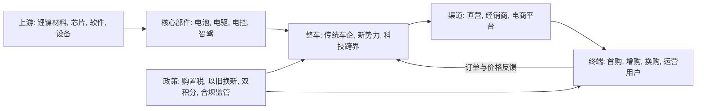

# 中国新能源汽车行业价格战研究报告: 为什么最近价格战这么激烈?

## 1. 直接回答

中国新能源汽车价格战激烈, 核心不是市场突然没有需求, 而是需求仍在增长、供给和产品迭代更快、参与者又把市场份额视为生存门票, 因而形成了“增长市场中的淘汰赛”。在渗透率跨过早期普及阶段后, 新增消费者更加看重总价和性价比; 同时传统车企、新势力和科技企业共同争夺相近价格带, 单纯依靠“新能源”标签已难以溢价。企业为了维持工厂利用率、渠道周转和品牌能见度, 更容易选择降价或权益加码。

价格战能够打得起来, 是因为供应链降本给了头部企业“弹药”。动力电池材料价格回落、规模化生产、平台化车型和垂直整合降低了单位成本。头部车企可以把一部分降本让给消费者, 用低价扩大销量、摊薄固定成本并压缩对手空间; 成本更高或规模更小的企业又不得不跟进, 否则销量、渠道和融资预期会同时受损。因此, 成本下降原本是产业进步, 在竞争结构中却被转化为更快的价格下探。

价格战之所以在年中、年末或政策窗口附近更尖锐, 还因为渠道库存、销量考核和补贴时点共同制造了短周期压力。经销商需要回笼现金, 厂家需要完成批售或零售目标, 消费者则可能等待下一轮优惠。降价一旦开始, “等等还会更便宜”的预期会降低当期成交, 迫使企业再加优惠, 形成观望与促销相互强化的循环。

更深层的原因是产品同质化与技术迭代速度同时上升。三电技术、智能座舱、辅助驾驶和舒适配置快速普及, 新车往往以更低价格提供旧款高配功能, 造成在售车型被动降价。若品牌、渠道服务和使用场景不足以形成清晰差异, 价格就成为最直接的比较维度。新能源车的软件化和快速改款还缩短了产品“新鲜期”, 放大旧款清库存压力。

因此, 这轮价格战可以概括为五个机制叠加: 供给扩张快于有效需求释放, 成本下降提供降价空间, 同质化降低非价格壁垒, 库存和考核放大短期冲量, 政策补贴窗口集中可争夺需求。监管反“内卷”会压制低于成本、虚假宣传和向供应商转嫁压力等无序行为, 但不会消除合理的技术降本和市场竞争。未来竞争更可能从公开降价转向配置升级、金融权益、保险补贴和服务权益, 价格压力仍会存在, 只是表现形式更隐蔽。

## 2. 结论摘要

| 观点 | 原因 | 事实依据 | 产业发展推演 |
|---|---|---|---|
| 这是增长市场中的淘汰赛 | 渗透率提高后, 车企争夺的是份额、规模和生存位置 | 需求增长与高渗透并存 | 行业进入成长后期向成熟竞争过渡 |
| 供需错配是底层矛盾 | 车型、产能和品牌投入快于有效需求释放 | 库存预警和目标完成率承压 | 尾部品牌退出、并购和产能整合增加 |
| 成本下降是价格战的必要条件 | 电池材料下行和规模经济释放空间 | 工信部锂电运行数据 | 头部企业继续用成本优势换份额 |
| 同质化把竞争推向价格 | 三电和配置趋同, 新车迭代快 | 工信部转载专家研究 | 差异化将转向软件、服务、品牌和生态 |
| 政策与考核放大时间窗口 | 补贴、年中年末任务集中刺激抢单 | 商务部补贴政策与流通协会调查 | 监管后显性降价减少, 权益竞争增加 |

## 3. 研究边界

| 项目 | 内容 |
|---|---|
| 地区 | 中国大陆乘用车市场 |
| 时间范围 | 重点观察2024年至2026年上半年, 以2025年价格战升级期为主 |
| 行业口径 | 纯电动和插电式混合动力乘用车整车市场 |
| 包括 | 官方指导价、终端折扣、限时权益、以旧换新补贴叠加、供应链成本、库存和监管 |
| 不包括 | 商用车专题、单一车企估值、二手车价格、海外市场价格竞争 |
| 关键假设 | “价格战”包括直接降价, 也包括高配低价、金融和服务权益; “最近”指2024年至2026年上半年 |

### 3.1 研究计划摘要

| 项目 | 内容 |
|---|---|
| 母问题 | 为什么中国新能源汽车行业最近价格战这么激烈? |
| 子问题 | 需求是否变弱; 供给为何更快; 企业为何必须跟价; 成本是否支持; 政策和渠道如何放大; 何时可能缓和 |
| 选择的分析层级 | 宏观政策 + 中观产业结构 + 议题树; 微观公司仅作机制示例, 不作为分析目标 |
| 必须验证的事项 | 新能源销量和渗透、库存与目标压力、电池成本、产品同质化、补贴规则、监管态度 |

### 3.2 来源矩阵和证据质量

| 关键 Claim | 来源类型 | 本报告用途 | 证据层级 | 证据质量 | 来源状态 | 独立验证状态 | 限制和缺口处理 |
|---|---|---|---|---|---|---|---|
| `claim-demand-growth`: 需求仍高速增长, 价格战不是绝对需求萎缩的单因结果 | 工信部新闻发布会 | 销量、增速、占比 | primary | high | obtained | single-source-primary | 官方口径权威, 但仅覆盖上半年 |
| `claim-channel-pressure`: 库存和任务压力推动以价换量 | 中国汽车流通协会调查 | 渠道库存、目标完成 | near-primary | high | obtained | single-source-primary | 样本以百强经销商集团为主, 不等同全市场普查 |
| `claim-battery-cost`: 电池供给扩张和价格下行释放整车降价空间 | 工信部行业运行数据 | 成本与供应链 | primary | high | obtained | single-source-primary | 行业均值不能直接代表每款车的采购成本 |
| `claim-homogenization`: 三电与功能趋同削弱差异化 | 工信部转载专业期刊专家文章 | 竞争机制 | near-primary | medium | obtained | single-source-primary | 属专家判断, 不是统计普查 |
| `claim-policy-demand`: 以旧换新补贴放大换购需求窗口 | 商务部政策 | 政策和需求时点 | primary | high | obtained | single-source-primary | 证明政策强度, 不单独证明促销因果量级 |
| `claim-profit-regulation`: 无序价格战侵蚀可持续性并触发监管 | 工信部负责人回应 | 盈利、研发和监管边界 | primary | high | obtained | single-source-primary | 是主管部门判断, 需结合企业财报验证量级 |

**关键证据质量说明:** 最强证据来自工信部和商务部的一手统计、政策与监管表态; 渠道压力来自行业协会原创调查; 同质化来自专业期刊专家判断。所有 Claim 均已取得达到最低层级的证据, 但当前均为单一数据生成源, 因此报告不把任何具体数字外推为全行业精确因果贡献。

### 3.3 检索缺口闭环结果

首轮检索后, 围绕渠道压力和盈利可持续性分别进行了定向补充, 已取得中国汽车流通协会调查和工信部监管回应。最终高影响 Claim 均通过准入, 没有需要以“仍未补齐”状态保留的高影响缺口。企业级真实成交价、单车成本和产能利用率仍属于持续监测指标, 但不影响本报告对结构性原因的回答。

| 缺口 | 已尝试轮次和来源 | 当前状态 | 为什么仍重要 | 未补齐原因 | 下一步来源 |
|---|---|---|---|---|---|

## 4. 行业一句话定义

中国新能源汽车乘用车行业是以动力电池、电驱、电控和智能化系统为技术底座, 由整车企业通过直销或经销渠道向个人和机构用户销售纯电动及插电式混合动力乘用车的制造与服务产业。

## 5. 行业地图



| 模块 | 内容 | 与问题的关系 |
|---|---|---|
| 纵向产业链 | 材料和芯片 -> 三电与智能化部件 -> 整车 -> 直营或经销 -> 用户 | 上游降本向终端传导, 整车承担研发、制造和渠道固定成本 |
| 横向竞争结构 | 国有与民营传统车企、新势力、科技企业, 纯电与插混并行 | 多类玩家争夺重叠价格带, 退出成本高 |
| 生产要素 | 资本、工厂、平台技术、软件数据、品牌、渠道和人才 | 固定投入高, 规模和利用率影响单位成本 |
| 生产关系 | 整车对供应商和渠道具有不同议价力, 政策影响供需两端 | 压价可能沿供应链传导, 经销商承担库存和现金流压力 |
| 关键流向 | 消费者付款与补贴形成收入流; 材料、研发、营销形成成本流; 车辆数据反哺迭代 | 快速迭代和补贴时点使旧款折价更快 |

## 6. 问题拆解和议题树

```text
母问题: 为什么中国新能源汽车行业最近价格战这么激烈?
- 供需: 总需求增长时, 为什么仍出现相对过剩和库存压力?
- 竞争: 为什么企业宁愿牺牲利润也要守住销量和份额?
- 成本: 电池与制造降本给价格下探提供了多少空间?
- 产品: 同质化和快速迭代如何压缩旧款生命周期?
- 放大器: 补贴窗口、渠道考核和消费者观望如何形成反馈循环?
- 边界: 监管反内卷能否终止价格竞争?
```

这棵议题树区分“原因”和“条件”。相对供给过剩、份额争夺与同质化是结构原因; 电池降本是能够降价的条件; 库存、考核和补贴时点是短期放大器; 监管则决定竞争的合规边界。若把所有降价都归因于需求不足, 会遗漏增长市场里供给扩张更快和份额价值更高这两个关键机制。

从因果强弱看, 第一层是供给与竞争结构。汽车是高固定成本行业, 工厂、研发平台、门店和服务网络不能随销量同步收缩。企业即使面对利润下降, 仍可能选择继续生产和促销, 因为停产或大幅收缩会使单位固定成本更高, 还可能失去渠道、供应商和消费者信心。新能源转型又同时吸引传统车企、新势力和科技企业投入, 多套产能和品牌组合在相近时期释放, 使“总市场增长”与“单个企业产能不足以被订单吸收”同时成立。这也是价格战比普通消费品更持久的原因。

第二层是份额的战略价值。对头部企业而言, 当前销量不仅贡献收入, 还影响采购价格、平台数据、软件迭代、补能网络利用和下一轮车型的用户基础。以较低毛利扩大销量, 可能换来未来更低的采购成本和更强的渠道控制。对尾部企业而言, 销量又关系到融资、供应商信用和售后网络能否继续运转, 即使明知跟价会亏损, 也很难率先退出。因此市场形成类似囚徒困境: 所有企业都希望行业停止降价, 但任何一家担心自己先停手后丢失份额。

第三层是产品迭代和消费者预期。智能化配置通过软件和芯片快速下放, 新车型常以同价增配或降价增配重新定义性价比, 旧车型即使指导价不变也会实际贬值。频繁促销又教育消费者等待, 降低品牌对短期价格的承诺可信度。订单延后后, 企业面对更高库存再度促销, 形成“新车发布—旧款折价—消费者观望—库存上升—再次促销”的反馈环。要打破这一循环, 仅靠口头停战不够, 还需要车型节奏稳定、库存回归合理区间和价格规则更透明。

第四层是政策与监管的双向作用。消费补贴、购置税优惠和基础设施建设扩大市场, 有利于吸收供给; 但固定期限的补贴也会形成抢单节点, 各品牌争夺同一批换购用户时更愿意叠加企业优惠。反内卷监管则约束虚假降价、低价倾销、不合理账期和质量牺牲, 有助于减少价格战的负外部性。它无法也不应消除通过真实降本形成的合理低价, 所以未来更可能出现竞争方式迁移, 而不是价格竞争突然结束。

## 7. 证据链分析

| 子问题 | 结论 | 事实 | 观点 | 推断 | 来源/依据 | 证据层级 | 证据质量 | 来源状态 | 置信度 |
|---|---|---|---|---|---|---|---|---|---|
| 需求是否崩塌 | 没有, 行业仍增长 | 2025年上半年销量和占比显著增长 | 高增长不等于每家企业都有足够订单 | 价格战来自相对供需和结构分化 | [工信部发布会](https://www.miit.gov.cn/xwfb/bldhd/art/2025/art_ee70dcf2aa474bd791a7b290e7617635.html) | primary | high | obtained | 高 |
| 渠道为何促销 | 库存和目标压力逼迫回款 | 库存预警高于荣枯线, 多数门店未达目标 | 协会判断以价换量持续 | 考核节点放大终端折扣 | [流通协会调查](https://www.cada.cn/Data/info_85_10285.html) | near-primary | high | obtained | 高 |
| 是否有降价空间 | 电池和材料成本下降提供空间 | 锂电供给扩张, 产品价格下跌 | 成本下降幅度不等于整车降价幅度 | 头部企业把降本转化为份额工具 | [工信部锂电数据](https://www.miit.gov.cn/gyhxxhb/jgsj/dzxxs/dzjc/art/2025/art_b6fabc541b094897b3f27eea54981762.html) | primary | high | obtained | 中高 |
| 为什么易跟价 | 差异化不足 | 三电和功能存在趋同 | 专家认为同质化削弱先发优势 | 消费者比较维度更集中于价格与配置 | [专业期刊专家文章](https://www.miit.gov.cn/ztzl/rdzt/xxgyhqk/tjyd/zjlt/art/2025/art_3cfeca22303f408ebd82978701e71ff9.html) | near-primary | medium | obtained | 中 |
| 政策如何放大 | 补贴形成集中换购窗口 | 新能源报废和置换补贴力度明确 | 政策不必然导致价格战 | 企业会围绕可争夺需求集中促销 | [商务部政策](https://www.mofcom.gov.cn/xwfb/rcxwfb/art/2025/art_169ef029ecb14ceb8acfb6066e028324.html) | primary | high | obtained | 中高 |
| 价格战有何边界 | 无序竞争受到监管约束 | 工信部明确将整治内卷式竞争 | 合理降本竞争仍受鼓励 | 竞争将转向价值和隐性权益 | [工信部回应](https://www.miit.gov.cn/xwfb/mtbd/wzbd/art/2025/art_68aafd9c515c47fbb64bcb5736890033.html) | primary | high | obtained | 高 |

事实是, 2025年上半年中国新能源汽车销量为693.7万辆, 同比增长40.3%, 新车销量占比为44.3%, 这与“行业总需求已经绝对萎缩”的说法不一致。

价格战不能简单解释为行业总需求绝对萎缩。

渠道端的直接压力也可观测: 2025年6月库存预警指数为56.6%, 上半年72.5%的受访4S店未完成销量计划, 协会明确记录了“以价换量”持续。

供应链方面, 2024年全国锂电池总产量为1170GWh, 同比增长24%, 同期锂电池产品价格下跌, 为整车价格下探提供了成本条件。

同质化则降低了拒绝跟价的能力: 三电路线、功能、设计和商业运营趋同, 使缺乏品牌或场景差异的车型更容易被放在同一张价格配置表中比较。

政策层面, 报废旧车购买新能源乘用车补贴2万元, 置换更新补贴最高1.5万元; 这扩大了政策窗口内可争夺的需求, 但促销强度仍由企业竞争行为决定。

以旧换新补贴形成明确的政策窗口, 扩大了车企集中争夺的换购需求。

主管部门已明确指出, 无序价格战会冲击正常经营和持续研发投入, 并将通过产业结构调整与反不正当竞争执法约束其外部性。

## 8. 生命周期判断

**阶段结论:** 中国新能源汽车乘用车行业整体处于成长后期向成熟竞争过渡阶段。行业销量仍快速增长, 但新能源已经从差异化新品类变为主流选择, 竞争重心从“教育市场”转向份额、成本、产品组合和淘汰赛。

**证据:** 新能源汽车销量和渗透率仍高增, 支持其尚未进入总量衰退; 同时库存压力、产品同质化、行业盈利承压和监管反内卷又具有成熟竞争特征。企业需要更高研发投入维持智能化迭代, 却难以普遍通过提价覆盖投入。

**反证:** 插混、增程、智能驾驶和海外出口仍可能开辟新增空间, 部分细分价格带并未成熟; 头部企业的规模扩张也可能说明供给并非全面过剩。因此, 不能把行业笼统定义为衰退或绝对产能过剩。

**置信度:** 中高。销量和政策证据清晰, 但全行业产能利用率、真实成交价和单车利润缺少统一高频公开口径。

**研究含义:** 成长后期的典型矛盾是总盘子增长与企业分化并存。只要退出速度慢于供给扩张、消费者价格敏感度上升, 价格战就可能持续; 缓和通常需要产能退出、品牌整合或差异化价值重新建立。

## 9. 七个核心模块分析

### 9.1 可行性

**结论:** 新能源汽车的真实需求和商业可行性已经得到规模销量验证, 价格战不是需求不存在, 而是企业商业模式和单位经济性分化。

**证据:** 工信部发布的销量、增速和新车销量占比显示市场仍扩张; 反面证据是多数深度电动化车企的盈利能力仍承压, 高研发、渠道和售后投入需要更大销量摊薄。

**机制:** 当消费者接受度提高后, 行业可行性从“能否卖出去”转为“能否在合理获客成本和残值预期下赚钱”。降价能加速获客, 却会降低单车毛利并伤害老车主残值, 因而只对成本领先或现金充足的企业更可持续。

**研究含义:** 价格战会验证而不是否定行业可行性, 它淘汰的是无法建立单位经济性和差异化的商业模式。

**关键指标和后续验证:** 单车毛利、获客费用、售后成本、保值率、复购和经营现金流; 优先查看车企年报和经销商审计数据。

### 9.2 规模性

**结论:** 市场仍有增长空间, 但高渗透阶段的边际增量更难获取, 促使企业用价格换规模。

**证据:** 2025年上半年销量和占比继续增长; 以旧换新又释放换购需求。缺口在于各价格带、城市层级和动力路线的真实订单拆分并不完全公开。

**机制:** 在固定成本高、平台研发投入大的整车行业, 多卖一辆可以摊薄模具、软件和工厂成本。头部企业降价后销量增加可能进一步降低单位成本, 形成“降价—放量—降本”的正反馈; 尾部企业则可能陷入“跟价—亏损—研发减弱”的负反馈。

**研究含义:** 大市场并不自动带来普遍利润。规模价值越高, 企业越愿意牺牲短期毛利来争夺长期位置。

**关键指标和后续验证:** 分价格带销量、订单取消率、产能利用率、平台车型共用率和出口消化能力。

### 9.3 防守性

**结论:** 行业整体防守壁垒正在从三电硬件转向成本体系、软件数据、品牌、渠道服务和生态, 中间层车型的价格防守最弱。

**证据:** 专家研究指出三电、功能、技术和设计趋同; 同时电池供应链规模化使标准部件更易获得。尚缺统一数据量化不同品牌的用户迁移和价格弹性。

**机制:** 当核心配置快速普及, 竞品可以在下一次改款复制卖点, 原有车型只能通过降价维持相对价值。真正能抵御价格战的因素包括低成本制造、可靠性口碑、补能网络、服务体验、软件持续更新和清晰品牌定位。

**研究含义:** 仅靠“堆配置”的领先期会缩短; 没有结构性壁垒的品牌即使不主动降价, 也会被竞品高配低价所迫。

**关键指标和后续验证:** 品牌复购率、净推荐值、二手残值、软件付费率、补能覆盖、维修时长和用户转化弹性。

### 9.4 盈利性

**结论:** 价格战把利润池从整车品牌向具备资源、技术或规模优势的环节重新分配, 整车尾部和库存较高的经销商承压最大。

**证据:** 流通协会调查显示库存和目标压力推动以价换量; 工信部明确指出无序价格战冲击正常经营和持续研发。电池成本下降为整车让利提供空间, 但不能证明所有车企成本降幅都覆盖终端优惠。

**机制:** 头部整车企业可以利用采购议价、垂直整合和平台规模吸收降价; 弱势企业可能向供应商延长账期、削减渠道返利或压缩研发来维持现金。若厂家指导价与终端成交价长期倒挂, 经销商库存融资和售后服务也会恶化。

**研究含义:** 判断价格战是否接近底部, 不能只看销量, 还要看毛利、现金流、账期和退出。利润率稳定、库存下降和弱者退出比一次“停止降价”更可靠。

**关键指标和后续验证:** 整车毛利率、经营现金流、供应商账期、经销商价格倒挂、库存周转和研发费用率。

### 9.5 估值

**结论:** 虽然本报告不评价个股, 但价格战会使行业估值逻辑从单纯销量增长转向“规模增长的质量”。

**证据:** 销量仍高增长而监管同时警示盈利和研发可持续性, 说明收入增长不能替代利润与现金流验证。公开数据对不同车企的真实促销成本分摊不充分。

**机制:** 在高增长早期, 市场愿意为渗透率和交付增长定价; 进入淘汰赛后, 同样的销量增长若来自大幅折扣, 其价值低于靠产品力、复购和成本优势获得的增长。价格战还提高未来售后、残值补偿和渠道重整的不确定性。

**研究含义:** 行业景气与企业价值会进一步分化, 不能以新能源总销量推断所有参与者前景。

**关键指标和后续验证:** 单车收入、毛利、自由现金流、促销费用、订单质量、保值率及资本开支回报。

### 9.6 外部因素

**结论:** 政策是需求支撑和竞争边界的双重变量, 宏观消费谨慎、技术迭代和监管反内卷共同塑造价格战。

**证据:** 商务部以旧换新政策直接支持报废和置换购车; 工信部支持通过技术和管理创新降本, 同时反对无序价格战并强化执法。消费者收入预期与汽车信贷条件仍需高频数据补充。

**机制:** 补贴提高换购支付能力, 也形成车企集中抢单窗口; 技术升级降低成本却加快旧款贬值; 监管限制虚假宣传、低于成本和不合理账期, 但不会禁止正常竞争。社会层面, 频繁降价会强化等待心理和残值担忧。

**研究含义:** 反内卷更可能改变竞争方式而非取消价格压力。企业会把竞争转向配置、金融、服务和品牌价值。

**关键指标和后续验证:** 补贴申请节奏、购置税变化、居民消费信心、汽车贷款利率、监管执法案例和车型改款周期。

### 9.7 景气度

**结论:** 行业呈现“量强、价弱、库存有压、利润分化”的景气组合, 总量景气与企业盈利景气背离。

**证据:** 新能源销量保持高增; 年中经销商库存预警位于荣枯线以上且目标完成承压; 电池产品价格下跌降低成本; 主管部门又对价格战外部性作出明确回应。

**机制:** 量增说明电动化趋势仍强, 价弱说明供给竞争和消费者议价增强。上游降本部分对冲整车降价, 但若终端降幅超过成本改善, 利润和现金流继续恶化。库存与促销互相作用, 使短期景气看似热闹却质量偏弱。

**研究含义:** 价格战缓和的领先信号应是库存回落、促销趋稳和现金流改善同步出现, 而不是单月销量创新高。

**关键指标和后续验证:** 月度零售与批售差、真实成交价、经销商库存系数、电池价格、整车利润、现金流和供应商应收账款。

## 10. 多视角压力测试

受并发槽位已满限制, 本次未能启动独立子Agent, 以下按 Skill 规定降级为单Agent模拟多视角压力测试, 不把模拟意见视为新增证据。

| 视角 | 质疑 | 为什么重要 | 需要验证 |
|---|---|---|---|
| 行业专家 | “供给过剩”是否被夸大, 高增长本可消化新增产能 | 决定价格战是暂时错配还是长期结构问题 | 分企业和区域产能利用率、停产和新建产能 |
| 投资研究员 | 降价是否被上游成本下降完全覆盖 | 决定销量增长质量和行业估值逻辑 | 单车材料成本、折扣、毛利与现金流桥接 |
| 政策研究者 | 补贴究竟扩大需求还是仅提前需求 | 决定政策退出后的需求波动 | 补贴申请、无补贴地区对照和跨期销量 |
| 经营者 | 经销商库存调查能否代表直营品牌 | 直营和经销模式的库存压力不同 | 直营在途库存、门店订单和退订数据 |
| 消费者 | 持续降价是否损害残值和品牌信任 | 可能降低当期成交并提高长期获客成本 | 二手残值、投诉、复购和等待周期 |
| 供应商 | 整车降价是否通过账期和年降转嫁 | 关系到供应链质量与安全 | 应收账款天数、价格年降、质量投入 |
| 魔鬼代言人 | 真正原因是否只是头部企业主动定价 | 若成立, 供需和政策只是次要解释 | 头部降价事件前后的竞品销量与跟价时滞 |

压力测试后的保留结论是: “供给相对需求扩张更快”比“需求崩塌”更符合现有证据; 但公开资料不足以量化各因素的贡献率。直营模式、出口消化和细分价格带可能减弱全行业库存推断, 因此报告把库存视为放大器, 而非唯一根因。

## 11. 风险, 机会和不确定性

| 类型 | 内容 | 证据/依据 | 触发条件 |
|---|---|---|---|
| 事实风险 | 库存和价格倒挂损害渠道现金流 | 流通协会库存调查 | 终端需求低于批售和考核目标 |
| 事实风险 | 过度降价压缩研发、质量和服务投入 | 工信部监管回应 | 降价超过降本, 亏损持续 |
| 假设风险 | 企业通过供应商账期转嫁压力 | 产业链议价机制推断 | 应付账款显著拉长, 供应商现金流恶化 |
| 数据缺口 | 缺少统一真实成交价和车型级单车利润 | 公开统计多为行业或企业汇总 | 无法精确量化价格战贡献率 |
| 上行机会 | 成本领先者通过规模扩大并推动行业整合 | 电池降本与规模机制 | 销量增长同时带来现金流改善 |
| 上行机会 | 竞争从价格转向安全、智能和服务价值 | 监管反内卷导向 | 消费者愿意为差异化支付溢价 |

## 12. 后续验证清单

| 待验证问题 | 当前证据状态 | 为什么重要 | 推荐来源 | 优先级 |
|---|---|---|---|---|
| 各车企真实成交价下降幅度是否超过单车成本下降 | 已有方向证据, 缺车型级桥接 | 判断价格战可持续性 | 车企财报、价格监测和供应链访谈 | 高 |
| 新能源整车产能利用率及闲置产能分布 | 尚无统一公开高频口径 | 验证供给过剩的强度 | 国家统计、工信部、地方项目环评和公司公告 | 高 |
| 直营品牌与经销品牌库存是否同样承压 | 经销体系证据较强, 直营证据不足 | 避免把渠道样本外推全行业 | 公司运营数据、门店订单与交付周期 | 高 |
| 补贴带来新增需求还是需求前置 | 政策事实已确认, 因果量级未确认 | 判断政策退出后的销量 | 商务部申请数据、地区面板对照 | 中高 |
| 价格战是否向供应商账期和质量投入传导 | 监管关注, 缺系统量化 | 评估产业链安全 | 上市供应商财报、应收账款和质量通报 | 中高 |
| 反内卷后显性价格是否转为隐性权益 | 需持续追踪 | 判断监管实际效果 | 市场监管案例、成交价和权益清单 | 中 |

## 13. 报告合规自检表

| 检查项 | 是否通过 | 说明 |
|---|---|---|
| 行业具体问题模板完整 | 通过 | 使用具体问题模板和规范章节顺序 |
| 研究简报转译已完成 | 通过 | 内部锁定中文、标准深度、宏观和中观层级 |
| 已先直接回答用户问题 | 通过 | H1后立即进入直接回答 |
| 研究计划和来源矩阵完整 | 通过 | 六个稳定Claim均逐项展示 |
| 行业地图和生命周期判断完整 | 通过 | 地图位于生命周期和七模块之前 |
| 七个核心模块完整 | 通过 | 9.1至9.7均独立分析 |
| 七模块深度和五段结构达标 | 通过 | 每节含结论、证据、机制、含义和验证 |
| 报告深度 rubric 达标 | 通过 | 重点扩展供需、盈利、外部因素和景气 |
| 证据链区分事实/观点/推断 | 通过 | 证据链表逐项分列 |
| 证据层级和来源状态清楚 | 通过 | 标注tier、quality、obtained和独立性限制 |
| 多视角压力测试完成 | 通过 | 子Agent槽位已满, 明示降级并模拟七种视角 |
| 后续验证清单具体 | 通过 | 给出问题、影响、来源与优先级 |
| 逐 Claim 证据准入通过 | 通过 | 六个Claim均为supported |
| 正文 Claim 和 Evidence 精确绑定通过 | 通过 | report-claims.json经final fidelity audit验证 |
| 关键数字核对和抽样审计完成 | 通过 | truthfulness-audit.md记录agent-self-check |

本报告仅供研究和信息参考, 不构成投资建议, 也不构成任何收益承诺.
