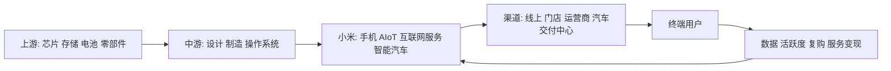

# 小米集团股价大幅下跌原因研究报告

## 0. 研报前置区

### 0.1 报告摘要

小米集团-W在香港上市, 股份代码为1810.HK. 本报告将用户所说的“跌了这么多”界定为从2025年9月25日52周高点59.90港元, 至2026年6月26日52周低点21.30港元的回撤. 截至2026年7月20日收盘27.74港元, 股价已较低点回升, 但仍远低于高点. 这不是一个单一事件造成的下跌, 而是“高预期基线+盈利下修+行业成本冲击+汽车兑现节奏后移+估值压缩”的共振.

2025年的小米给市场了一个非常强的参照基线: 全年收入4573亿元, 同比增长25.0%; 调整后净利润392亿元; 智能电动车, AI和其他新业务首次实现年度经营盈利. 在这种基线上, 高点股价不仅定价了手机和AIoT的稳定, 也提前定价了汽车高增长, 利润转正和“人车家”生态协同. 因此, 当2026年一季度收入同比下降10.9%, 调整后净利同比下降43.1%, 电动车新业务又出现经营亏损时, 市场不是只下调一个季度的利润, 而是重新评估中期利润路径和合理估值倍数.

归因上, 第一层是基本面预期重置: 手机出货和收入下降, AIoT经历补贴高基数后回落, 整体利润降幅超过收入降幅. 第二层是外生成本冲击: AI服务器对高利润存储产能的需求推高了手机存储器成本, 对性价比产品占比高的小米更不利. 第三层是汽车的估值兑现不再线性: 交付仍增长, 新车订单仍强, 但产品切换, 购置税补贴和关键部件价格上升使该分部重回亏损. 第四层是估值运动: 当市场对未来盈利的预期下调时, 高估值公司往往同时遭遇利润下修和估值倍数下修, 从而产生非线性跌幅.

反证同样重要. 小米截至2026年一季度末仍有约2206亿元现金资源, 年内至5月22日已回购约2.505亿股, 涉资约84亿港元; 互联网服务收入同比仍增长4.3%, IoT连接设备数也保持两位数增长. 这些数据不支持“公司资金链出问题”的解释. 更合理的结论是: 股价从过度乐观的汽车和生态估值向更保守的分部利润和现金流估值回归.

### 0.2 关键结论

| 结论 | 原因 | 证据指向 |
|---|---|---|
| 下跌是多因素共振, 不是单一事件 | 高估值起点与盈利下修同时发生 | 2025年报, 2026年一季报, 历史行情 |
| 手机业务是当前最直接的盈利压力源 | 存储器成本上升, 出货下降, 价格转嫁受限 | 小米2026年一季报, Omdia, Gartner |
| 汽车叙事未失效, 但利润兑现时间被后移 | 交付和订单仍有支撑, 但经营亏损重现 | 小米2026年一季报 |
| 当前不宜把下跌解释为流动性危机 | 现金充足, 回购规模较大, 高毛利互联网服务仍增长 | 小米3月底流动性披露和回购公告 |
| 后续能否修复取决于可验证的盈利改善 | 单纯交付增长不足以恢复高估值 | 手机毛利率, 汽车分部经营利润, 自由现金流 |

### 0.3 核心指标总览

| 指标 | 行业读数 | 目标公司/产品读数 | 判断 | 证据/来源 |
|---|---|---|---|---|
| 市场规模 | 手机市场成熟, 中国智能电动车仍有扩容空间 | 多终端业务已形成实质收入规模 | 规模空间仍大, 但需要证明利润质量 | 2025年报和2026Q1公告 |
| 增速/渗透率 | 智能手机行业出货预期下调, 汽车智能化仍渗透 | 2026Q1集团收入同比-10.9%, 汽车交付同比增长6.6% | 分部景气分化 | 小米2026Q1业绩公告, Omdia, Gartner |
| 竞争强度 | 手机和中国新能源车竞争均强 | 手机性价比定位受成本夹击, 汽车需持续投入 | 竞争压力限制价格转嫁 | 小米2026Q1业绩公告 |
| 盈利水平 | 存储成本上升放大硬件利润弹性 | 2026Q1调整后净利润同比-43.1%, 手机毛利率10.1% | 利润降幅超过收入降幅 | 小米2026Q1业绩公告 |
| 景气度 | 手机短期偏弱, 汽车需求与利润景气分化 | 互联网服务仍增长, 汽车分部经营亏损31亿元 | 组合景气偏弱但非全面恶化 | 小米2026Q1业绩公告 |
| 关键风险 | 存储高价和汽车价格战可能持续 | 股价从59.90港元高点至21.30港元低点大幅回撤 | 盈利下修和估值压缩可能互相放大 | 公开行情和公司披露 |

### 0.4 图表清单或图表占位

| 图表 | 类型 | 用途 |
|---|---|---|
| 图表1: 人车家产业地图 | Mermaid | 展示上游成本, 小米三条业务线和用户变现 |
| 图表2: 高点至低点回撤 | 数据表 | 界定本报告的价格窗口 |
| 图表3: 分部收入与毛利 | 数据表 | 解释盈利混合的变化 |
| 图表4: 估值预期差传导链 | 流程图 | 解释为何利润变化会放大为股价变化 |
| 图表5: 主要竞争对手对比 | 对比表 | 区分手机, IoT和汽车的不同参照系 |

## 1. 目标公司/产品综合判断

小米已从单一手机硬件公司转向“手机与AIoT现金流+互联网高毛利变现+智能电动车成长期权”的多业务组合. 这种结构的优点是用户, 渠道, 品牌和研发可以复用; 缺点是不同业务处在不同生命周期, 估值容易因为高增长业务的稍微失速而剧烈波动.

竞争位置上, 小米在全球手机出货中仍居头部, AIoT平台连接设备规模庞大, 互联网服务毛利率高, 汽车已证明品牌延伸和产品定义能力. 但当前的关键约束也很清晰: 手机价格带对存储成本极其敏感, AIoT收入受政策补贴和地产相关耐用品周期影响, 汽车则需要持续资本开支, 研发和渠道投入. 在估值上, 市场不再愿意只为“交付量增长”付高溢价, 而要求分部利润和现金流证明成长质量.

因此, 本报告的综合判断是: 小米的产业能力没有被本轮下跌否定, 但它从“高速成长的确定性”退回了“多业务高投入阶段的可选性”. 股价的主要修复条件不是新故事, 而是手机毛利企稳, AIoT恢复内生增长, 汽车分部经营亏损收窄, 以及这些改善能够转换为持续现金流.

## 2. 研究边界

| 项目 | 内容 |
|---|---|
| 地区 | 公司经营覆盖全球, 汽车主要分析中国大陆, 股价以香港联交所1810.HK为准 |
| 时间范围 | 行情主窗口为2025-09-25至2026-07-20, 基本面以2025年报和2026Q1为主 |
| 行业口径 | 智能手机, AIoT与互联网服务, 中国智能电动车的中口径 |
| 公司/产品范围 | 小米集团及其主要分部, 不对单一车型或手机机型做产品测评 |
| 包括 | 价格表现, 行业成本, 分部利润, 估值预期差, 回购与现金反证 |
| 不包括 | 买卖点, 目标价, 收益承诺, 日内交易指令, 未公布的订单或事故责任 |
| 关键假设 | 本次访问的公开行情页截至2026-07-20, 因此以该日作为最近可复核完整交易日; 将最近显著高点至低点视为“大跌” |

### 2.1 研究计划摘要

| 项目 | 内容 |
|---|---|
| 母问题 | 小米股价为何从高点大幅回撤, 什么是核心原因和验证指标 |
| 子问题 | 行业成本冲击有多大; 手机与AIoT基线如何变化; 汽车增长是否转化为利润; 高点定价了什么; 修复需要什么证据 |
| 选择的分析层级 | 宏观+中观+微观+资本市场, 因为股价回撤涉及行业beta, 公司分部和估值预期差 |
| 必须验证的事项 | 股价窗口, 最新季度盈利, 手机毛利, 汽车分部经营结果, 现金和回购 |
| 条件模块 | multi_business_split=enabled; portfolio_analysis=enabled; capital_market=enabled |

### 2.2 来源矩阵和证据质量

| 关键 Claim | 来源类型 | 本报告用途 | 证据层级 | 证据质量 | 来源状态 | 独立验证状态 | 限制和缺口处理 |
|---|---|---|---|---|---|---|---|
| `claim-price-drawdown`: 最近显著高点至年中低点回撤超过一半 | 公开市场数据页 | 界定价格窗口 | near-primary | high | obtained | single-source-primary | Investing历史行情可访问; FT页面时点不匹配, 未计为已取得交叉验证 |
| `claim-q1-reset`: 最新一季度收入和利润同步下滑 | HKEX公司披露 | 验证盈利基线重置 | primary | high | obtained | single-source-primary | 权威一手披露, 但尚未经独立数据生成者复验 |
| `claim-high-base`: 前一年强增长和汽车盈利转正形成高基线 | HKEX年报 | 解释高估值起点 | primary | high | obtained | single-source-primary | 年报为一手来源, 预期含义为研究推断 |
| `claim-phone-pressure`: 存储成本与竞争促使手机在量利之间取舍 | HKEX季报 | 解释手机利润压力 | primary | high | obtained | single-source-primary | 管理层对成本原因的解释仍需与上游价格数据持续复核 |
| `claim-ev-execution`: 汽车交付仍增长但经营亏损重现 | HKEX季报 | 评估汽车估值兑现 | primary | high | obtained | single-source-primary | 新业务分部同时含AI和其他业务, 非纯汽车口径 |
| `claim-liquidity-counterevidence`: 现金, 回购和互联网服务韧性反驳流动性危机 | HKEX季报和回购披露 | 构建反证 | primary | high | obtained | single-source-primary | 现金充足不等于估值不会继续变化 |
| `claim-industry-memory-cycle`: 存储供给冲击提高成本并压低手机出货预期 | Omdia与Gartner展望 | 验证行业共性压力 | near-primary | high | obtained | independently_verified | 两家预测降幅不同, 本报告只采用方向一致性, 不强行合并 |

最强的证据是HKEX上的小米年报和季报, 它们直接支持收入, 利润, 分部毛利, 交付和现金数据. 它们的限制是同属公司披露这一数据生成源. 股价轨迹目前由一个可访问的近一手行情页支持, FT页面因数据时点滞后仅记录为口径不匹配的失败尝试. Omdia和Gartner对智能手机行业方向给出独立研究, 但其预测是模型结果而非已发生事实.

### 2.3 检索缺口闭环结果

| 缺口 | 已尝试轮次和来源 | 当前状态 | 为什么仍重要 | 未补齐原因 | 下一步来源 |
|---|---|---|---|---|---|
| `gap-consensus-valuation-history`: 高点和当前严格对齐的分部估值与一致预期历史序列 | 首轮: 公开行情页和小米IR; 第一轮: HKEX与公开券商报告; 第二轮: Bloomberg与LSEG公开入口; 第三轮: 多个公开行情页交叉核对 | 部分补齐 | 它决定能否精确区分盈利下修和估值倍数压缩的贡献 | 历史一致预期和可比的分部SOTP时序主要依赖付费数据库 | Bloomberg Terminal或LSEG Workspace的1810.HK历史一致预期和SOTP时序 |

## 3. 宏观环境分析

宏观环境对小米股价的影响主要通过消费能力, 成本, 汇率和风险偏好四条通道传导. 中国的以旧换新和消费补贴在2025年抬高了家电和数码产品基线, 而2026年基数效应和补贴节奏变化使同比增速变弱. 这个机制对AIoT尤其重要: 家电消费具有耐用品周期, 补贴容易把未来需求前置, 导致次年增长看起来更弱.

存储器供给则是更直接的成本变量. AI数据中心对HBM和高性能存储的需求改变了半导体厂商的产能分配, 传统手机存储器价格上升. Omdia和Gartner均在2026年预计全球手机出货将下降, 虽然幅度不同, 但对成本压力和低价产品需求敏感的方向判断一致. 小米的海外收入占比较高, 汇率, 运费和地缘政治波动还会进一步影响成本和定价.

资金面上, 小米是典型长期成长资产. 当利率, 风险溢价或港股科技板块风险偏好变化时, 未来汽车和AI现金流的现值会比当期手机利润更敏感. 但从已取得证据看, 宽基市场beta难以独立解释超过一半的回撤, 公司盈利和估值预期差仍是主因.

| 宏观变量 | 当前判断 | 证据/来源 | 对行业和小米的影响 |
|---|---|---|---|
| 政策/监管 | 消费补贴影响高基数, 汽车安全合规要求提升 | 公司年报和季报 | 影响AIoT需求节奏和汽车合规成本 |
| 经济/消费周期 | 可选消费对价格上升敏感 | Omdia, Gartner | 限制手机提价转嫁和耐用品换新 |
| 技术周期 | AI算力需求抬高存储成本, 同时提供终端AI机会 | 行业研究和小米披露 | 短期成本负面, 长期生态价值正面 |
| 资金面/风险偏好 | 高估值长期成长资产对风险溢价更敏感 | 估值框架推断 | 放大盈利下修对股价的影响 |

## 4. 中观行业分析

### 4.0 多业务线中观拆分

| 业务线/行业线 | 行业阶段 | 竞争格局 | 关键指标/景气信号 | 对目标公司的含义 |
|---|---|---|---|---|
| 智能手机 | 成熟期中的成本冲击阶段 | 苹果, 三星, 华为及多家中国品牌竞争 | 出货, ASP, 存储器价格, 毛利率 | 小米低价产品暴露度高, 盈利弹性为负 |
| AIoT与消费电子 | 成长与成熟并存 | 品类分散, 渠道和生态竞争突出 | 连接设备, 多设备用户, 家电补贴, 毛利率 | 用户基础稳健, 但收入增长受高基数影响 |
| 互联网服务 | 成熟现金流业务 | 广告和增值服务受平台活跃度驱动 | MAU, 广告收入, 海外收入, 毛利率 | 是对冲硬件毛利波动的关键利润池 |
| 智能电动车 | 高成长与高投入阶段 | 价格战, 产品周期快, 安全与智驾能力重要 | 锁单, 交付, ASP, 毛利, 分部经营利润 | 决定长期估值上限, 也带来最大资本开支和执行风险 |

### 4.1 行业一句话定义

本报告将小米所处行业定义为: 以智能手机为用户入口, 以AIoT和互联网服务延伸用户价值, 并以智能电动车扩张至出行场景的智能终端生态行业.

### 4.2 行业关键指标

| 指标 | 当前判断 | 证据/来源 | 对小米的含义 |
|---|---|---|---|
| 市场规模 | 手机市场庞大但成熟, 汽车仍处于智能化替代阶段 | Omdia, Gartner, 公司交付 | 增长需从份额, 高端化和跨品类获取 |
| 增速/渗透率 | 手机出货短期收缩, 汽车渗透和交付仍有增长 | 行业预测, 小米公告 | 业务组合从手机向汽车倾斜, 收入质量取决于汽车利润 |
| 供需关系 | 存储供给偏紧, 汽车供给充足且竞争强 | Omdia, Gartner, 公司披露 | 手机成本上升, 汽车价格和营销投入承压 |
| 价格/成本 | 成本上升时低价产品更难转嫁 | 小米季报和行业展望 | 必须以高端化, 产品结构和采购调整保护毛利 |
| 政策/监管 | 补贴节奏和汽车安全合规同时影响需求与成本 | 公司披露, 监管方向 | 增长数据需剔除政策前置效应 |
| 区域/出口 | 海外仍是手机, IoT和互联网服务的增量来源 | 小米季报 | 增长机会与汇率, 合规和渠道成本并存 |

### 4.3 行业地图

| 模块 | 内容 | 对小米的含义 |
|---|---|---|
| 纵向产业链 | 存储和芯片供应商→制造与软件→品牌生态→渠道→用户 | 上游成本和下游价格敏感共同夹击硬件毛利 |
| 横向竞争结构 | 手机与苹果, 三星, 华为等竞争; IoT与家电和平台厂商竞争; 汽车与头部新能源车企竞争 | 不存在单一可比公司, 必须分部对比 |
| 生产要素 | 芯片, 存储, 电池, 软件, AI模型, 资本, 品牌与数据 | 资本和研发能力较强, 但存储与芯片定价受上游影响 |
| 生产关系 | 供应商, 代工厂, 线上平台, 门店, 运营商, 广告主和汽车用户 | 生态用户和门店可降低获客成本, 但汽车服务网络仍需投资 |
| 关键流向 | 硬件收入和成本流, 设备数据流, 用户流量, 互联网服务利润流 | 高毛利服务能否覆盖高投入硬件决定生态价值 |
| 目标位置 | 小米处于品牌, 系统, 用户入口和渠道组织者位置, 汽车还向制造延伸 | 战略控制点增多, 资本强度和执行复杂度也同时上升 |

### 4.4 生命周期判断

**阶段结论:** 小米的组合业务不适合用单一生命周期标签. 智能手机为成熟期, AIoT和互联网服务为成长后期至成熟期, 智能电动车则为高成长和高投入阶段. 组合层面处于“成熟现金流支撑新成长曲线”的转换期.

**证据:** 手机市场全球出货增长较弱且价格竞争强; 小米互联网服务已具有高毛利和稳定用户基础; 智能电动车分部收入已达到较大规模, 但分部经营利润仍因产品切换和投入节奏波动.

**反证:** 手机市场虽成熟, 高端化和AI换机仍可创造结构增长; 汽车业务虽处增长期, 但中国新能源车竞争已呈现成熟市场的价格战特征. 因此不应把增长期等同于自然高利润.

**置信度:** 中高. 公司分部数据支持业务阶段的区分, 但汽车行业价格和竞争节奏快, 周期判断需持续更新.

**研究含义:** 对小米而言, 估值不应用单一PE倍数机械处理. 成熟业务应强调利润和现金流, 汽车应强调收入增长, 毛利和经营亏损收窄. 股价大跌本质上是市场从过度强调增长期权, 转向重新审视成熟业务现金流和新业务投入成本.

## 5. 七个核心模块分析

### 5.1 可行性

**结论:** 小米的“人车家”需求基础和品牌延伸能力已经得到验证, 当前争议不是业务能否存在, 而是多终端规模能否转化为可持续利润.

**证据:** 公司披露2026年一季度手机出货3380万台, AIoT平台连接设备11.187亿台, 全球MAU为7.462亿, 智能汽车交付80856辆. 这些是实际用户和交付证据. 另一方面, 公司当季整体收入和利润下降, 说明使用规模不会自动等于利润稳定.

**机制:** 手机是账户和流量入口, AIoT提高设备密度和用户留存, 汽车扩展高客单价场景, 互联网服务负责高毛利变现. 只有当获客, 研发, 渠道和售后成本低于协同带来的增量毛利时, 生态模式才能转化为企业价值.

**研究含义:** 对小米股价问题, 需求可行性并不是主要矛盾; 单位经济性和分部利润才是估值修复的必要证明.

**关键指标和后续验证:** 跟踪多设备用户数, 互联网每用户收入, 汽车订单转交付率, 售后成本和分部现金流. 下一步优先核验小米中期报分部数据和IR交流中的用户变现指标.

### 5.2 规模性

**结论:** 小米的总市场空间仍大, 但规模增长的来源已从单纯手机出货转向高端化, AIoT渗透, 海外服务变现和汽车交付.

**证据:** 2025年小米总收入达4573亿元, 汽车, AI及其他新业务收入为1061亿元, 证明新业务已成为实质收入支柱. 2026年一季度IoT连接设备同比增长18.5%, 海外互联网服务收入仍增长. 反面证据是整体收入当季下降, 表明规模曲线不会线性上升.

**机制:** 成熟手机市场中, 规模增长更多来自份额和ASP, 但这两者都受竞争与成本约束. 汽车提供更高客单价和新TAM, 同时需要工厂, 销售和售后网络. 规模仅在固定成本被有效摊薄时才能形成价值.

**研究含义:** 市场会继续给汽车和AI增长权, 但对只有规模而没有利润的增长会给更低权重. 小米需要证明新业务增长不是靠持续补贴换取.

**关键指标和后续验证:** 跟踪手机全球份额与ASP, IoT连接设备和多设备用户, 汽车锁单和月度交付, 以及分部收入增长与毛利增长的匹配程度.

### 5.3 防守性

**结论:** 小米的护城河主要来自品牌, 用户规模, 多设备生态, 供应链和渠道协同, 但在单一硬件产品上的转换成本并不高.

**证据:** AIoT平台已连接超过11亿台设备, 五台及以上设备用户继续增长, 这为生态粘性提供证据. 小米手机在全球出货仍居前三, 说明品牌和渠道具有广泛覆盖. 但手机毛利率对存储价格和竞争快速反应, 说明上游议价与下游定价权并非绝对.

**机制:** 设备越多, 用户迁移成本越高, 账户, 家庭场景和数据协同也越强. 然而, 如果竞争对手在单品上提供更强性价比, 用户仍可选择多品牌混用. 汽车的服务和数据联动可以增强粘性, 但安全和售后能力也可能成为新的防守短板.

**研究含义:** 小米估值不能只依赖硬件出货份额, 需要用多设备渗透, 服务变现和汽车复购证明生态护城河能产生可持续经济回报.

**关键指标和后续验证:** 跟踪多设备用户增长, 用户留存, 互联网每用户收入, 高端手机份额, 汽车售后成本和NPS. 优先查证公司IR与第三方用户调研.

### 5.4 盈利性

**结论:** 小米盈利的核心问题不是总收入能否增长, 而是低毛利硬件, 高毛利互联网服务和高投入汽车之间的利润组合能否持续改善. 当前盈利性比2025年高点定价所假设的路径更弱.

**证据:** 2026年一季度公司总收入同比下降10.9%, 毛利同比下降14.2%, 经营利润同比下降59.5%, 调整后净利润同比下降43.1%. 利润降幅远大于收入降幅, 显示经营杠杆反向运行. 手机毛利率为10.1%, 互联网服务毛利率为76.1%, 汽车, AI及其他新业务毛利率为20.1%, 但经营亏损31亿元. 存储器涨价与消费电子竞争共同压缩了小米以性价比为核心的手机利润空间，并迫使公司在销量与毛利之间取舍。

**机制:** 手机还是最重要的用户入口和收入来源, 但其性价比定位使得提价转嫁受限. 如果吸收存储成本, 毛利下降; 如果提价或减少低端机, 出货量和用户获取受损. 互联网服务的高毛利可以缓冲, 但其收入规模仍小于硬件. 汽车毛利不差, 但研发, 销售网络, 工厂和新车上市成本使经营利润落后于毛利.

**研究含义:** 股价修复需要盈利质量而非只有收入规模. 市场需要看到手机毛利企稳, AIoT收入降幅收窄, 汽车分部经营亏损收窄, 以及经营现金流能覆盖新业务资本开支. 任何一项缺失都可能使估值修复只停留在情绪层面.

**关键指标和后续验证:** 手机ASP和毛利率, 存储采购成本, IoT毛利率, 互联网服务收入占比, 汽车分部毛利和经营亏损, 研发费用率, 资本开支与自由现金流. 下一步以中报和分部附注为主要验证来源.

### 5.5 估值

**结论:** 小米的估值应使用分部加总而非单一倍数. 本轮大跌同时包含盈利预期下修和估值倍数压缩, 但由于缺少付费数据库的历史一致预期时序, 两者的精确贡献不应伪精确化.

**证据:** 价格从52周高点59.90港元跌至21.30港元, 而最新季度收入仅下降10.9%, 这表明股价变化不可能只是对当期收入的线性反应. 2025年汽车分部首次实现年度经营盈利, 2026年一季度又出现亏损, 使市场需要重新评估汽车权益价值. 同时, 现金和回购为估值下限提供了某种反证.

**机制:** 手机和AIoT应以稳定利润和现金流估值; 互联网服务可以给予高毛利平台业务的相对溢价; 汽车应根据收入, 毛利, 产能和转盈路径给予情景价值. 当高点已定价汽车快速转盈时, 一个季度的亏损不只减少当期利润, 还会延长折现期间并提高风险折价.

**研究含义:** 低价本身不代表便宜, 高点大幅回撤也不自动意味著估值修复. 关键是新的盈利基线是否稳定, 汽车分部的权益价值是否还有足够安全边际, 以及现金能否在高投入后继续增长.

**关键指标和后续验证:** 跟踪预期PE, EV/EBITDA, 分部PS, 汽车SOTP权重, 一致预期盈利修正幅度, 自由现金流收益率和回购节奏. 历史序列应优先从Bloomberg或LSEG获取.

额外验证应将分部估值与净现金单独列示, 避免把回购带来的每股改善误当为经营性重估. 若盈利不再下修但倍数仍压缩, 则主要矛盾已转向风险偏好; 若倍数稳定而盈利仍下修, 则主要矛盾仍在基本面.

### 5.6 外部因素

**结论:** 外部因素当前整体偏负面, 其中存储器供给是最可量化的成本冲击, 消费补贴高基数影响AIoT增速, 汽车价格战和合规要求提高执行门槛. AI技术进展同时是中长期机会.

**证据:** 小米在季报中明确将存储和大宗商品价格上升, 地缘政治和竞争加剧列为逆风. Omdia预计2026年全球手机出货下降7%, Gartner预计下降8.4%, 两者虽口径和模型不同, 但都把存储成本列为关键变量. 小米同时在大模型, 跨设备AI助手和具身智能上增加研发, 这是成本也是未来选择权.

**机制:** 存储成本先压缩手机和IoT毛利, 如果提价转嫁则抑制出货, 再通过广告流量和设备活跃度影响互联网收入. 汽车价格战和补贴影响ASP与毛利, 安全合规影响研发和保修成本. 风险偏好下降又将这些经营不确定性转化为更高折现率.

**研究含义:** 本轮股价回撤中, 外部成本冲击是真实因素, 但它不能完全开脱公司的产品结构和估值管理. 同样的存储器涨价对高端产品占比高, 定价权强的厂商影响更小; 小米的暴露是行业冲击与战略定位共同的结果.

**关键指标和后续验证:** DRAM与NAND合约价格, 低端手机出货, 各区域汇率与运费, 中国消费补贴细则, 汽车终端折扣与监管要求. 优先核验半导体价格数据, 官方政策和公司下季度毛利披露.

验证时还应区分外部冲击和管理响应. 如果全行业出货下降而小米份额稳定, 更多是行业风险; 如果小米份额和毛利同时弱于主要同行, 则会转化为公司特异性风险.

### 5.7 景气度

**结论:** 小米当前景气呈现明显分化: 手机和AIoT短期偏弱, 互联网服务保持韧性, 汽车需求仍强但利润景气弱于交付景气. 组合景气的领先指标是毛利和分部亏损, 而不是单一交付量.

**证据:** 智能手机行业的存储供给冲击提高了成本并压低行业出货预期，低价位产品占比较高的厂商更敏感。 小米一季度手机收入为442.7亿元, 低于上年同期的506.1亿元; IoT收入也低于上年同期. 但互联网服务收入同比增长4.3%, 汽车交付同比增长6.6%, 显示需求并非全面走弱.

**机制:** 景气传导的顺序是“存储成本→产品价格和配置→出货和库存→硬件毛利→设备活跃与服务变现”. 汽车则是“锁单→产能→交付→单车毛利→分部经营利润”. 当前手机处于前半段负向传导, 汽车则是量增但利润传导受阻.

**研究含义:** 不应因为汽车订单强就判定小米整体景气向上, 也不应因为手机出货下降就判定生态逻辑失效. 最关键的跨业务证据是集团毛利, 经营利润和经营现金流能否同步企稳.

**关键指标和后续验证:** 手机月度出货与ASP, 渠道库存, 存储合约价, IoT收入和毛利, 互联网服务MAU与广告收入, 汽车锁单, 交付, 单车收入和分部亏损. 优先使用小米季报, Omdia或IDC出货数据和公开存储价格序列.

高频跟踪中还需避免单月噪声. 手机出货至少观察连续两个季度, 汽车交付应与分部毛利和费用同时阅读, 互联网活跃用户应与广告变现一起看, 这样才能区分景气反转与暂时波动.

## 6. 微观公司/产品分析

小米的微观优势在于高效产品定义, 规模化供应链, 广泛渠道, 大量活跃用户和多设备生态. 汽车的成功进入表明公司具有跨品类品牌迁移能力. 微观弱点是硬件定位依赖性价比, 在上游成本快速上涨时定价权不足; 汽车扩张又使研发, 资本开支和售后服务的固定成本显著上升.

| 维度 | 分析 | 证据/依据 |
|---|---|---|
| 商业模式 | 硬件获取用户, 互联网服务和生态提升用户价值, 汽车扩展高客单价场景 | 小米分部披露和用户数据 |
| 产品/服务 | 手机, IoT, 互联网服务和汽车形成多终端组合 | 公司年报和季报 |
| 客户和渠道 | 线上与门店并行, 中国大陆门店超过16000家, 海外新零售门店超过520家 | 2026Q1公司披露 |
| 财务/运营指标 | 现金充足, 但当季收入和利润下降, 汽车分部亏损重现 | 2026Q1业绩公告 |
| 护城河 | 品牌, 用户规模, 生态和供应链是主要优势, 单品转换成本较低 | AIoT连接数, MAU与行业竞争格局 |

公司在2026年一季度将研发费用增加33.4%至90亿元, 研发人员26048人. 这为AI, 芯片, 汽车和操作系统提供能力, 但也是当期利润杠杆的一部分. 对资本市场而言, 研发增长只在形成可商业化的高毛利收入或明显降低单位成本时才能成为估值正催化.

## 7. SWOT

| Strengths | Weaknesses |
|---|---|
| 全球品牌和渠道; 庞大AIoT设备基础; 高毛利互联网服务; 汽车产品定义与交付已获验证; 现金资源充足 | 手机性价比定位对成本上涨敏感; 多业务执行复杂; 汽车资本和研发强度高; 分部利润波动大 |

| Opportunities | Threats |
|---|---|
| AI跨设备应用; 高端手机; 海外IoT和互联网服务; 汽车新车型和规模效应; 回购改善每股价值 | 存储器成本持续高位; 手机出货收缩; 汽车价格战和安全合规; 高估值对风险偏好敏感; 海外汇率和地缘政治 |

## 8. 业务/产品组合分析

按照“市场成长性”与“相对竞争位置”的BCG思路, 小米的业务组合可以理解为: 手机是成熟市场中的规模基座, 互联网服务是高毛利现金流来源, AIoT是生态渗透和用户粘性来源, 智能电动车是高成长但高投入的明星业务. AI基础模型和具身智能尚处选择权阶段, 暂时不宜给予高确定性价值.

| 组合对象 | 成长性 | 竞争位置 | 资源分配含义 |
|---|---|---|---|
| 智能手机 | 低至中 | 全球头部 | 保份额的同时应优先保毛利和高端化, 不宜单纯追求出货 |
| AIoT | 中 | 生态优势较强 | 应提高高毛利品类和海外渠道占比 |
| 互联网服务 | 中 | 依附大规模硬件用户 | 应作为利润池和生态变现重点, 但关注用户体验约束 |
| 智能电动车 | 高 | 产品已验证, 利润仍波动 | 继续投入但必须设立单车毛利, 分部亏损和现金流约束 |
| AI与具身智能 | 潜在高 | 商业化待证明 | 用阶段里程碑管理, 避免未商业化研发过度稀释当期回报 |

## 9. 竞争对手对比

小米没有一个完全对等的单一可比公司. 苹果可用于高端手机和生态变现比较, 三星可用于硬件规模和供应链比较, 华为可用于中国高端手机和多终端生态比较, 比亚迪和理想等车企可用于汽车规模, 毛利和产品周期比较. 任何对比都必须保持分部口径, 不应把整体估值倍数直接并列.

| 对象 | 定位 | 优势 | 劣势 | 关键指标 |
|---|---|---|---|---|
| 小米 | 性价比多终端生态+智能汽车 | 用户规模, 品类协同, 汽车产品定义 | 手机毛利敏感, 多业务高投入 | 手机毛利, 多设备用户, 汽车分部利润 |
| 苹果 | 高端终端+服务生态 | 品牌和定价权, 服务变现 | 价格带较高, 中低端覆盖有限 | ASP, 服务收入占比, 毛利率 |
| 三星 | 全球手机与零部件综合集团 | 供应链纵向整合, 全球渠道 | 多业务周期复杂 | 手机份额, 半导体周期, 分部毛利 |
| 华为 | 中国高端手机与多终端生态 | 品牌, 研发, 本土生态 | 非上市口径可比数据有限 | 中国高端份额, 生态设备数 |
| 中国头部新能源车企 | 智能电动车 | 产能, 渠道或技术积累 | 价格战和资本强度高 | 交付, ASP, 单车毛利, 自由现金流 |

## 10. 事实, 观点和推断分层

| 类型 | 内容 | 来源/依据 | 证据层级 | 证据质量 | 来源状态 | 置信度 |
|---|---|---|---|---|---|---|
| 事实 | 2026Q1收入991.4亿元, 同比下降10.9%, 调整后净利润下降43.1% | [小米2026Q1业绩公告](https://www.hkexnews.hk/listedco/listconews/sehk/2026/0526/2026052600770.pdf) | primary | high | obtained | 高 |
| 事实 | 2025年总收入4573亿元, 调整后净利润392亿元, 汽车新业务首次年度经营盈利转正 | [小米2025年报](https://www1.hkexnews.hk/listedco/listconews/sehk/2026/0428/2026042800526.pdf) | primary | high | obtained | 高 |
| 待核验事实 | 股价高低点为59.90和21.30港元 | [Investing.com历史行情](https://ca.investing.com/equities/xiaomi-historical-data) | near-primary | high | obtained | 中高, 仅有单一可访问行情源, FT页面时点不匹配 |
| 观点 | 存储成本将促使2026年全球手机出货下降 | [Omdia展望](https://omdia.tech.informa.com/pr/2026/mar/omdia-global-smartphone-shipments-to-fall-7percent-in-2026-amid-memory-constraints-and-geopolitical-pressures), [Gartner展望](https://www.gartner.com/en/newsroom/press-releases/2026-02-26-gartner-says-surging-memory-costs-will-reduce-global-pc-and-smartphone-shipments-in-2026) | near-primary | high | obtained | 中高, 属模型预测 |
| 推断 | 本轮下跌同时包含盈利下修和估值倍数压缩 | 基于股价回撤幅度, 业绩变化和分部转盈路径 | near-primary | medium | obtained | 中, 缺历史一致预期时序 |
| 推断 | 现金和回购使流动性危机解释不成立 | 小米现金资源, 回购和互联网服务数据 | primary | high | obtained | 高 |

## 11. 资本市场表现与估值预期变化

### 11.1 股价表现拆解

小米股价从最近显著高点到年中低点经历了超过一半的回撤，明显超出一般日常波动。 公开行情显示, 52周高点为2025年9月25日的59.90港元, 低点为2026年6月26日的21.30港元, 最大回撤约64.4%. 2026年7月20日收盘27.74港元, 较低点已有反弹, 但仍较高点低约53.7%. 价格页的限制是它们可能来自同一交易所行情源, 因此属于同源交叉核对, 不是两个独立生成的价格序列.

价格路径应分为三段理解. 第一段是高预期后的初步去估值: 市场已经给予汽车产品成功和生态协同很高权重. 第二段是2025年四季度至2026年一季度的盈利弱化, 存储成本, 手机出货和AIoT高基数共同影响。 第三段是一季报确认收入下降, 利润降幅更大且汽车新业务重回经营亏损后, 市场将担忧从短期成本问题扩展到中期利润路径.

直接催化与慢变量也要区分. 业绩发布, 行业存储价格预测, 新车上市和回购公告是可见事件; 但高点定价的汽车利润和AI生态选择权发生压缩, 是一个持续的估值过程. 对标指数的同窗口总回报未在本次Run中取得严格可比数据, 因此本报告不给出“行业beta贡献了多少百分点”的伪精确拆分.

本节的时间窗口是高点日至最近完整交易日, 不是任意选取的日内时间区间. 仍存在证据缺口: 未取得同窗口恒生科技指数总回报与个股历史beta序列, 因而无法精确分摊行业beta与公司特异因素.

### 11.2 基本面变化

最近一季的收入、经营利润和调整后净利润同步下滑，意味着市场面对的是盈利基线重置，而不是单一业务的小波动。 2026年一季度收入991.4亿元, 同比下降10.9%; 毛利下降14.2%; 经营利润下降59.5%; 调整后净利润下降43.1%. 这种“利润降幅超过收入降幅”的结构, 会让市场担心成本吸收和费用投入对未来几个季度仍有影响.

手机与AIoT的变化并不只是销量. 手机出货3380万台, 手机收入442.7亿元, 手机毛利率10.1%. 公司通过优化产品结构和渠道来应对成本上涨, 但结果仍是收入和毛利承压. IoT收入246.8亿元, 低于上年同期的323.4亿元, 显示补贴和高基数的影响. 反证是IoT毛利率环比回升至25.2%, 互联网服务收入仍增长至94.7亿元, 说明优化产品结构和高毛利服务具有缓冲能力.

智能电动车业务仍有订单和交付增长，但产品切换、购置税补贴和关键部件涨价使新业务重新出现经营亏损，削弱了汽车估值兑现速度。 当季汽车, AI和其他新业务收入198.6亿元, 毛利率20.1%, 经营亏损31亿元; 交付80856辆, 同比增长6.6%. 新一代SU7初始锁单和YU7累计交付是上行证据, 但市场会更关注新车交付后的毛利和分部亏损是否收窄.

从基本面与市场预期的区分看, 收入, 毛利和分部亏损是已披露基本面, 而股价对“亏损何时收窄”的反应是预期变化. 公司未在一季报中给出全年分部利润指引, 因此应继续验证业务结构与现金流, 不能把锁单直接等同于现金流改善.

### 11.3 估值逻辑和市场预期差

前一年的高速增长与汽车盈利转正抬高了估值起点，使后续任何低于高预期的结果都会触发更大幅度的去估值。 2025年收入增长25.0%, 调整后净利润增长43.8%, 汽车新业务实现年度经营盈利转正, 这些信息支持了“成熟业务稳定+汽车快速转盈”的乐观定价. 当新一年收入和利润开局转弱, 市场不仅下调当期EPS, 还下调增长的确定性和汽车转盈的速度.

估值锚应拆成三部分. 手机与AIoT的核心是稳定利润和自由现金流; 互联网服务的核心是用户活跃, 广告和海外变现; 汽车的核心是交付, 毛利, 经营亏损和长期现金流. 高点定价对汽车权重过高时, 汽车分部经营亏损重现会同时减少预期利润并提高折现风险, 因而产生“戴维斯双杀”式的非线性下跌.

市场也可能在某些方面过度反应. 一季度汽车亏损受产品切换和购置税补贴影响, 未必代表全年单车经济性恶化; IoT收入下降同时伴随毛利率环比改善; 公司现金和回购规模较大. 但这些反证只能说明底层能力和资金状况未崩坏, 不能直接证明高点估值应该恢复. 真正需要重新证明的是手机毛利, 汽车经营利润和集团自由现金流.

这就是市场预期差的核心: 之前定价了成熟业务稳定和汽车快速转盈, 新信息则显示两者都需更长时间验证. 重估或杀估值并非对一个季度的机械反应, 而是对转盈时间, 长期毛利和风险溢价的同时更新.

### 11.4 上涨触发器, 下跌风险和情景分析

现金资源、回购与互联网服务韧性表明这次下跌更像估值和盈利预期重定价，而不是流动性危机。 这个反证很重要, 因为它表明公司有时间通过业务调整修复盈利, 但资金充足并不自动带来估值上涨. 回购可以减少流通股数和提供需求支撑, 但只有盈利路径改善才能改变中期定价中枢.

上涨触发器应以可验证指标定义. 第一, 存储器成本见顶或手机通过高端化使毛利率企稳. 第二, AIoT收入在完成高基数消化后恢复内生增长, 同时保持较高毛利. 第三, 新一代SU7和YU7的锁单转为交付, 汽车分部经营亏损连续收窄. 第四, 自由现金流在较高研发和资本开支下仍保持稳定. 第五, 持续回购与盈利修正同向, 而不是仅用回购对冲业绩压力.

下跌风险同样需要指标化. 存储成本继续上升且手机提价无法转嫁, 会造成出货和毛利双弱; 汽车价格战, 产品节奏或售后与安全成本上升, 会延后分部转盈; 研发与资本开支增长超过毛利增长, 会压缩自由现金流. 如果上述情况出现, 即使股价已大幅下跌, 估值锚仍可以继续下移.

| 情景 | 条件 | 需要跟踪的指标 |
|---|---|---|
| 乐观 | 存储成本压力收窄, 手机毛利企稳, 汽车分部亏损快速收窄, 现金流稳健 | 手机毛利率, 汽车分部经营利润, 自由现金流, 一致预期上修 |
| 中性 | 手机和AIoT慢恢复, 汽车交付增长但盈利改善温和 | 分部收入增长, 毛利, 费用率, 回购与现金变化 |
| 悲观 | 存储高价持续, 手机量利双弱, 汽车价格战使转盈继续后移 | 渠道库存, 手机出货和毛利, 汽车终端折扣, 分部亏损, 自由现金流 |

上述情景是研究框架, 不是股价预测, 也不构成买卖建议. 最有效的使用方式是将每个情景转化为季度验证清单, 当指标跨越情景边界时再更新判断.

## 12. 多视角压力测试

review_mode: `single-agent-simulated`. 执行时并行Agent席位已被同一批前向任务占用, 因此以单Agent分角色完成压力测试, 不视为独立Agent审查. 下表与`challenges.json`一致, 所有质疑已复核和闭环.

| 质疑 ID | 视角 | 目标 Claim/章节 | 重要性 | 核心质疑 | 裁决 | 证据/Gap | 报告改动 | 复核状态 |
|---|---|---|---|---|---|---|---|---|
| `challenge-mixed-lifecycle` | 行业专家 | `claim-industry-memory-cycle` / 4.4 生命周期判断 | high | 手机存储周期证据不能被外推为小米所有业务处于同一生命周期. | partially_valid | `temp-omdia-smartphone-outlook` | 第4.0和4.4节保留四业务分拆, 组合层仅定义为成熟现金流支撑新成长曲线的转换期. | closed |
| `challenge-valuation-attribution` | 投资研究员 | `claim-price-drawdown` / 11.3 估值逻辑和市场预期差 | high | 没有高点与当前时点的历史一致预期和分部SOTP序列, 无法将跌幅精确归因于盈利下修和倍数压缩. | unresolved | `temp-investing-historical`; 付费数据缺口 | 第2.3, 11.1, 11.3和15节显式保留数据缺口, 将双杀降级为机制性解释而非百分比归因. | closed |
| `challenge-subsidy-base-effect` | 政策或监管研究者 | `claim-q1-reset` / 3. 宏观环境分析 | medium | AIoT同比回落中国家补贴减少的定量贡献未披露, 不应把全部回落都归因于政策高基数. | partially_valid | `hk-hkexnews` | 第3和13节将补贴仅表述为重要机制之一, 并保留品类拆分和无补贴地区对比的验证任务. | closed |
| `challenge-ev-segment-scope` | 经营者或创业者 | `claim-ev-execution` / 11.2 基本面变化 | high | 公司披露的经营亏损属于智能电动车, AI和其他新业务混合分部, 不能当作纯汽车经营亏损. | partially_valid | `hk-hkexnews` | 第5.4, 6, 8和11.2节统一使用新业务分部口径, 并将纯车型利润保留为待验证项. | closed |
| `challenge-liquidity-not-bottom` | 魔鬼代言人 | `claim-liquidity-counterevidence` / 11.4 上涨触发器, 下跌风险和情景分析 | medium | 现金和回购只能反驳流动性危机, 不能证明盈利或估值已见底. | confirmed | `hk-hkexnews` | 第11.4和13节明确写入资金充足不等于估值上涨, 修复仍需分部利润与现金流证据. | closed |

## 13. 风险, 机会和不确定性

事实风险包括已披露的收入和利润下降, 手机毛利承压, 汽车分部经营亏损重现. 这些都是公司披露中可直接核对的小米自身驱动. 行业结构风险包括存储供给紧张, 手机需求走弱, 中国新能源车价格战和合规要求提高. 前者决定公司是否处在不利环境, 后者决定小米相对同行的暴露程度.

假设风险主要有三个. 第一, 报告假设用户所说的大跌是从最近显著高点开始, 如用户成本价或关注窗口不同, 直观感受会不同. 第二, 报告将一季度汽车亏损视为转盈节奏后移, 但如果产品切换结束后利润快速恢复, 当前估值可能过度悲观. 第三, 历史一致预期和SOTP数据缺口使本报告无法精确拆分盈利下修与倍数压缩.

数据缺口不只是估值序列. 公开披露中缺少按车型的锁单转化, 单车完整利润和现金流, 也缺少手机采购合同与存储成本的实时口径. 这些缺口使外部分析者只能通过毛利和管理层解释间接推断成本冲击. 因此对短期利润修复的置信度应低于对“当前已经承压”的判断.

上行机会包括存储价格见顶, 高端手机混合改善, IoT海外增长和高毛利品类占比上升, 汽车新车型成功转交付并改善产能利用率, 以及AI能力在多设备中形成可付费应用. 触发条件必须是可观察的分部毛利, 经营利润和现金流, 而不是发布会话题度或单月股价反弹.

## 14. 后续行动建议

对研究使用者, 建议建立一个季度化的分部验证表, 而不是用日常股价判断基本面. 第一项任务是在下一份业绩公告发布后的24小时内更新手机收入, 毛利, IoT收入, 互联网服务和汽车分部经营利润. 第二项任务是每月更新手机出货, 存储价格和汽车交付, 但只在数据构成连续趋势时修改中期结论.

第三项任务是补齐历史一致预期和SOTP缺口. 在可访问Bloomberg或LSEG的环境中, 应导出高点, 四季报后, 一季报后和当前四个时点的未来两年盈利预期与分部估值. 然后将股价变化拆分为预期盈利变化, 估值倍数变化和净现金变化. 这项工作可以把定性的“双杀”转化为可量化的归因.

第四项任务是设立证伪条件. 若手机毛利继续下降, 汽车交付增长但分部亏损不收窄, 或自由现金流在高投入下持续恶化, 应下调修复置信度. 若手机毛利企稳, IoT恢复内生增长, 汽车分部亏损连续收窄且现金流稳定, 则可以提高对估值修复的置信度. 这些是研究行动, 不是交易指令.

## 15. 方法论和数据来源说明

本报告先将问题路由为上市公司资本市场问题, 选择宏观, 中观, 微观和资本市场四层分析. 研究过程以HKEX公司披露为一手财务与运营来源, 以公开行情页核对股价窗口, 以Omdia和Gartner的自主研究交叉验证手机存储冲击. 所有高影响Claim都使用稳定ID, 并在内部Evidence Ledger记录文档URL, 访问日期, 报告期间, 最短证据片段和独立性状态.

证据准入在起草前已通过v64预报告门禁. 每个计划Claim均有符合所需证据层级的获取证据, 无conflicted, gapped或orphaned状态. 对仅由公司一手披露支持的Claim, 报告在来源矩阵明确标记single-source-primary, 没有把公司IR和HKEX上的同一文件当作独立验证. 对行业预测, 报告将其视为展望而非已发生的事实.

回撤百分比为简单比例计算: 高点59.90港元至低点21.30港元的变化约为-64.4%, 高点至7月20日27.74港元收盘约为-53.7%. 这些派生数字在报告正文中用于说明幅度, 而非预测. 高点与当前SOTP和一致预期时序因付费数据库限制未能完全补齐, 因此不对估值压缩的精确贡献做定量宣称.

| 来源类型 | 用途 | 证据层级 | 证据质量 | 备注 |
|---|---|---|---|---|
| 交易所披露/年报/季报 | 收入, 利润, 分部, 交付, 现金和回购 | primary | high | 同一公司披露不重复计为独立来源 |
| 公开市场数据页 | 股价高低点和收盘 | near-primary | high | 可能来自同一交易所数据源 |
| 行业研究机构 | 手机存储成本和出货展望 | near-primary | high | 两个独立研究来源, 但属预测 |
| 媒体/券商观点 | 检索市场叙事和发现来源线索 | secondary | medium | 未作为本报告核心财务事实的唯一证明 |

## 16. 后续验证清单

| 待验证问题 | 当前证据状态 | 为什么重要 | 推荐来源 | 优先级 |
|---|---|---|---|---|
| 手机毛利率是否连续企稳 | 季报一手证据, 单季观察 | 决定存储器成本能否被产品结构和提价吸收 | 小米中报/季报, 业绩演示和调用会 | 高 |
| AIoT收入下降中多少是补贴高基数 | 一手总量已获得, 政策拆分不足 | 决定回落是暂时周期还是份额问题 | 公司IR品类拆分, 商务部和地方补贴数据 | 高 |
| 汽车分部经营亏损能否随新车交付收窄 | 季报一手证据, 转盈时序待验证 | 决定汽车权益价值和集团估值上限 | 小米分部披露, 月度交付, 业绩会管理层指引 | 高 |
| 历史盈利下修和估值压缩各贡献多少 | 部分补齐, 付费库缺口 | 可以将大跌从定性解释转为定量归因 | Bloomberg Terminal或LSEG Workspace的历史一致预期和SOTP | 高 |
| 回购是否持续提升每股价值 | HKEX回购披露已获得 | 回购可提供支撑, 但需与估值, 现金流和员工股权稀释综合评估 | HKEX次日披露表, 月报表和中报 | 中 |

## 17. 报告合规自检表

| 检查项 | 是否通过 | 说明 |
|---|---|---|
| 模板骨架完整 | 通过 | 保留0至17章公司路由骨架和资本市场子节 |
| 研究简报转译已完成 | 通过 | 内部简报锁定中文, 标准深度, 公司资本市场路由 |
| 未误触发显式短答模式 | 通过 | 用户未要求简短回答 |
| Deep Research 可见痕迹完整 | 通过 | 含研究计划, 来源矩阵, 缺口闭环和验证清单 |
| 分析层级选择正确 | 通过 | 宏观, 中观, 微观和资本市场均已覆盖 |
| 多业务线中观拆分完成 | 通过 | 拆分手机, AIoT, 互联网服务和智能电动车 |
| 七个核心模块全部出现 | 通过 | 5.1至5.7独立呈现 |
| 七模块结构完整 | 通过 | 每节均含结论, 证据, 机制, 研究含义和关键指标与后续验证 |
| 重点模块展开深度足够 | 通过 | 盈利性, 估值, 外部因素和景气度显著深于前三节 |
| 宏观/中观/微观/资本市场章节深度足够 | 通过 | 各章均有证据, 机制, 含义和验证项 |
| 报告深度 rubric 达标 | 通过 | 主要章节经自评达到标准报告阈值 |
| 资本市场章节适用时已出现 | 通过 | 包含11.1至11.4的价格, 基本面, 估值和情景分析 |
| 来源层级, 证据质量和来源状态清楚 | 通过 | 来源矩阵使用规定枚举 |
| 独立验证状态和缺口清楚 | 通过 | 股价为single-source-primary, 公司披露为single-source-primary, 行业展望为independently_verified |
| 事实/观点/推断已分层且证据层级清楚 | 通过 | 第10章独立分层 |
| Challenge Ledger 闭环和九列摘要一致 | 通过 | 无pending, 无open或disputed的high质疑, 与challenges.json一致 |
| Pressure Test 改写后重跑 v64 | 通过 | 范围, 证据独立性和置信处理已同步到report-claims.json并重跑最终忠实度检查 |
| 后续验证清单具体 | 通过 | 每项含状态, 重要性, 推荐来源和优先级 |
| Markdown 标题格式正确 | 通过 | 仅有一个动态H1, 第二个非空行为0章 |
| 逐 Claim 证据准入通过 | 通过 | 7个Claim均为supported, 无conflicted, gapped或orphaned |
| 正文 Claim 和 Evidence 精确绑定通过 | 通过 | report-claims.json覆盖全部Plan Claim并绑定同Claim证据 |
| 关键数字核对和抽样审计完成 | 通过 | 绑定句无阿拉伯数字token; truthfulness-audit.md由agent-self-check复核全部Claim |

本报告仅供研究和信息参考, 不构成投资建议, 也不构成任何收益承诺.
