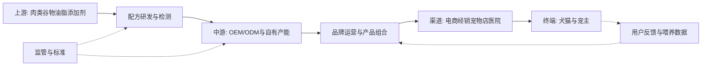

# 中国宠物食品行业研究报告: 从数量红利走向结构升级

## 1. 行业一句话定义

中国宠物食品行业是以城镇家庭饲养的宠物犬猫为核心服务对象, 将动物蛋白, 谷物, 油脂, 营养添加剂和配方研发转化为主粮, 零食与营养品, 并通过品牌, 经销, 电商和专业渠道实现复购的快速消费品行业. 本报告采用中口径: 纳入干粮, 湿粮, 冻干, 烘焙, 鲜粮, 零食和营养补充品, 但不将宠物医疗, 用品和服务计入宠物食品市场.

核心结论是: 这不再是一个单靠“更多人养宠”就能普涨的赛道, 而是必须同时管理产品力, 食安信任, 获客成本, 供应链波动和渠道效率的结构性增长市场. 主粮的高频刚需属性给行业提供需求底盘, 但产品同质化和线上流量成本会迅速侵蚀表面上的高毛利. 真正有质量的增长来自可验证的配方价值, 主粮复购, 低退货与低客诉, 以及不依赖过度投流的渠道组合.

## 2. 研究边界

| 项目 | 内容 |
|---|---|
| 地区 | 中国大陆, 以城镇宠物犬猫消费为主 |
| 时间范围 | 重点观察2021至2025年, 信息截止日为2026年7月22日, 展望未来1至3年 |
| 行业口径 | 中口径, 包含宠物主粮, 零食和营养品 |
| 包括 | 上游原料与添加剂, 配方研发, OEM/ODM, 自有品牌, 经销, 电商, 宠物店与专业渠道 |
| 不包括 | 水族和鸟类食品的市场规模, 医疗, 用品, 活体交易, 寄养和美容 |
| 关键假设 | 公开白皮书摘要能反映方向, 但不等同于经审计的行业总量; 上市公司案例只用于解释机制 |

本研究选择宏观和中观两层. 宏观层关注法规, 消费结构, 人口与社会文化变化; 中观层关注市场结构, 价值链, 竞争, 利润池, 生命周期与景气度. 微观层没有作为独立公司研究, 仅引用中宠股份的公开披露帮助识别品牌, 渠道与代工的利润差异.

### 2.1 研究计划摘要

| 项目 | 内容 |
|---|---|
| 母问题 | 中国宠物食品行业现在处于什么阶段, 未来的增长与利润将从哪里来 |
| 子问题 | 需求是否真实; 规模与增速如何; 竞争壁垒在哪里; 哪个环节获取利润; 监管和成本风险如何传导 |
| 选择的分析层级 | 宏观+中观; 微观公司仅作代表性案例 |
| 必须验证的事项 | 城镇犬猫消费与数量口径, 食品消费份额, 监管原文, 代表企业毛利差异, 原料和汇率风险 |

### 2.2 来源矩阵和证据质量

| 关键 Claim | 来源类型 | 本报告用途 | 证据层级 | 证据质量 | 来源状态 | 独立验证状态 | 限制和缺口处理 |
|---|---|---|---|---|---|---|---|
| `claim-food-largest-segment`: 食品是城镇犬猫消费最大类目 | 白皮书公开摘要 | 市场结构 | secondary | medium | obtained | secondary-only | 未取得原始样本与问卷附录, 不将转载当作独立来源 |
| `claim-spend-led-growth`: 消费额快于宠物数量增长 | 白皮书公开摘要 | 需求与生命周期 | secondary | medium | obtained | secondary-only | 总消费额还包括非食品类目, 仅用作行业背景 |
| `claim-regulatory-framework`: 生产与进口受许可, 标签和卫生要求约束 | 农业农村部公告 | 政策与准入 | primary | high | obtained | single-source-primary | 权威原始文件, 但本报告未对地方执法差异做独立抽样 |
| `claim-functional-premiumization`: 鲜食与功能化偏好上升 | 白皮书公开摘要 | 产品趋势 | secondary | medium | obtained | secondary-only | 偏好不等于实际购买, 需用平台销售数据验证 |
| `claim-channel-brand-profit`: 渠道和业务模式影响毛利 | 上市公司年报 | 利润池 | primary | high | obtained | single-source-primary | 单一公司的业务结构不代表行业均值 |
| `claim-lifecycle-transition`: 行业向成熟期过渡 | 白皮书数据与分析推断 | 生命周期 | secondary | medium | obtained | secondary-only | 属基于增速和结构的推断, 非来源直接结论 |
| `claim-cost-and-fx-risk`: 原料和汇率影响盈利 | 上市公司披露 | 成本与风险 | primary | high | obtained | single-source-primary | 公司外销比例较高, 风险暴露不完全适用于纯内销企业 |

证据质量结论: 最强证据是农业农村部公告和上市公司披露; 市场规模, 数量和消费偏好依赖白皮书的公开摘要, 不能视为多起源独立验证. 因此本报告可对行业阶段和机制做中等置信度判断, 但不应把某个总规模口径当作精确的宠物食品可审计收入.

### 2.3 检索缺口闭环结果

| 缺口 | 已尝试轮次和来源 | 当前状态 | 为什么仍重要 | 未补齐原因 | 下一步来源 |
|---|---|---|---|---|---|

初始广度检索已为全部高影响 Claim 获得达到最低准入层级的证据, 未产生需要 Engine 授权进入闭环轮次的高影响 Gap. 因此上表不虚构第二或第三轮尝试. 白皮书方法附录未获取属证据局限, 但不是本 Run 内阻断正式报告的高影响缺口; 后续仍应通过原始样本说明和平台成交数据做稳健性验证. 如需再检, 下一步一手或近一手来源为行业协会原始报告, 平台去重成交数据和上市公司财报.

## 3. 行业地图

| 模块 | 内容 |
|---|---|
| 纵向产业链 | 动物蛋白, 谷物, 油脂和营养添加剂→配方研发和安全检测→干粮, 湿粮, 零食与营养品生产→品牌和分销→宠主 |
| 横向竞争结构 | 国际综合品牌, 国产综合品牌, 垂直猫粮或鲜粮品牌, 代工厂, 白牌和平台定制款共存; 家庭自制食物是替代方案 |
| 生产要素 | 稳定原料, 兽医与营养人才, 配方和工艺, 检测能力, 产能, 品牌资产, 用户与复购数据 |
| 生产关系 | 原料供应商与工厂决定成本底盘; 平台和分销商掌握流量; 监管者决定许可与合规; 宠主通过复购和评价重构品牌信任 |
| 关键流向 | 收入从终端经平台或分销回流品牌; 成本从原料, 生产, 履约和投流递增; 数据从交易和喂养反馈回流研发; 政策通过许可, 标签和抽检影响全链条 |

产业链中最稀缺的并不是基础生产能力, 而是将配方证据, 稳定品质, 宠物适口性与可持续获客结合的组织能力. 一家企业可以通过代工快速上新, 却难以只靠包装和成分叙事建立长期信任. 反之, 有产能也不等于有品牌: 如果缺少实际喂养数据, 产品使用教育和复购运营, 固定资产反而会在需求波动时放大负担.

## 4. 生命周期判断

**阶段结论:** 中国宠物食品行业处于成长后半段向成熟期过渡, 仍增长但数量红利放缓, 竞争重心转向结构升级.

**证据:** [2026年中国宠物行业白皮书公开摘要](https://m.gmw.cn/2026-01/05/content_1304291767.htm)显示, 2025年城镇犬猫消费市场仍在增长, 但城镇犬猫数量的增幅更低, 同时食品继续保持最大消费类目地位. 这组信号表明需求底盘稳定, 但单纯依赖宠物数量增加的粗放增长已经减弱. 中国城镇犬猫消费额增长快于宠物数量增长，行业增量更依赖单宠支出。

**反证:** 行业尚未完全成熟. 一方面, 鲜粮, 烘焙, 冻干和功能性配方仍在扩品类; 另一方面, 国产品牌仍在从代工向自有品牌, 从零食向主粮, 从单一电商向多渠道迁移. 产品和渠道格局尚未稳定, 头部品牌仍可通过研发, 用户教育和组织效率取得高于大盘的增长.

**置信度:** 中. 消费额, 犬猫数量与食品份额来自同一白皮书的公开摘要, 能支持方向性判断, 但缺少原始样本框和连续可比的宠物食品零售额数据.

**研究含义:** 对中国宠物食品行业而言, 研究重点应从“还有多少新宠物”转为“多少现有宠物愿意长期复购更合适的食品”. 因此规模性仍重要, 但盈利性, 防守性, 产品验证和渠道效率的权重必须上升.

## 5. 七个核心模块分析

### 5.1 可行性

**结论:** 行业的需求可行性较强, 因为宠物主粮具有持续喂养, 低可中断性和明显的适口性要求; 但单个新品牌的商业模式只有在复购收入能覆盖研发, 品控, 投流和履约成本时才成立. 鲜食和功能化偏好上升，配方透明与科学性成为产品升级方向。

**证据:** 白皮书公开摘要显示, 犬主人对冻干, 烘焙, 鲜粮与主食湿粮的偏好度上升; 购买鲜粮时, 食材新鲜度与来源, 营养成分和配方科学性是重要考量. 另一个证据是食品在城镇犬猫消费中保持最大份额, 说明食品不是边缘或低频需求.

**机制:** 宠物不能用语言表达营养和健康感受, 宠主因此通过配料表, 肉源, 粗蛋白等指标, 品牌口碑与喂养后反馈来降低信息不对称. 一旦某款主粮同时满足适口性, 便便状态和过敏风险等条件, 换粮的隐性成本会提高复购稳定性. 但功能声称若缺乏证据, 也会快速转化为口碑和合规风险.

**研究含义:** 对行业进入者, 可行性问题不是“能否找到工厂做出一袋粮”, 而是“能否对特定宠物人群持续交付可验证价值”. 没有用户分层, 喂养数据和客诉闭环的产品创新, 很容易变成短期营销概念.

**关键指标和后续验证:** 核心指标包括首购转化率, 二次与六月复购率, 单宠月均食用量, 退货率, 客诉类型, 适口性测试和第三方检测通过率. 下一步应获取品牌用户队列数据, 独立实验室报告和完整配方声称证据.

### 5.2 规模性

**结论:** 宠物食品已经是中国城镇犬猫消费中占比最高的细分市场。行业绝对规模仍具扩张条件, 但从结构看, 未来增量将更多来自单宠支出, 主食渗透, 产品升级和猫经济, 而不是宠物数量的高速扩张.

**证据:** [公开摘要](https://m.gmw.cn/2026-01/05/content_1304291767.htm)显示, 2025年城镇犬猫消费市场为3126亿元, 同比增长4.1%, 其中食品份额为53.7%. 按两个口径做机械乘法可得到级1679亿元的食品消费代理值, 但该数是本报告手工推算, 不是白皮书直接披露的经审计市场规模, 不宜与厂商收入或零售监测口径直接比较. 同期城镇犬猫数量增幅低于消费额增幅, 支持单宠消费驱动的判断.

**机制:** 规模扩张可拆成“宠物数量×商业粮渗透率×单宠喂养量×平均售价”. 当宠物数量增速降低时, 品牌仍可通过从剩饭或低价粮向全价商业粮迁移, 从普通干粮向湿粮和功能配方迁移, 以及增加零食和营养品的场景获得增量. 这也意味着行业增速对价格带和品类结构更敏感.

**研究含义:** 市场空间并不等于新品牌可获得空间. 对单一企业来说, 应用可服务市场而非总市场规模定义机会: 例如猫用主食湿粮, 敏感肠胃配方, 老龄宠物营养或高性价比全价粮. 每个细分市场都应分别验证人群, 价格带, 喂养频率和可达渠道.

**关键指标和后续验证:** 跟踪城镇犬猫数量, 食品消费占比, 单只年均消费, 主粮/零食/营养品结构, 猫犬结构, 价格带和渠道成交额. 应优先取得白皮书完整方法附录, 平台去重成交数据与企业终端销售口径.

### 5.3 防守性

**结论:** 行业生产端的基础门槛中等, 品牌端的短期防守性偏弱, 但主粮复购数据, 长期稳定品质, 专业信任和多渠道触达可形成累积性壁垒. 设备和代工资源能被多个品牌共享, 所以“能生产”不等于“能防守”.

**证据:** 产业链显示原料, 配方, 生产和渠道可以分属不同主体, 新品牌可借助OEM/ODM进入. 但宠物食品需要遵守生产许可, 标签与卫生要求, 并长期承担食品安全责任. 白皮书偏好信号还显示宠主更关心食材来源和配方科学性, 这使可追溯能力和专业内容成为品牌防守的基础.

**机制:** 壁垒主要通过四条链形成. 第一, 采购规模与供应商管理提升原料稳定性; 第二, 配方研发, 喂养试验和质量回溯降低事故率; 第三, 长期复购和口碑降低获客边际成本; 第四, 电商, 经销, 宠物店和专业渠道的组合降低对单一平台的依赖. 任何一环失效都会将壁垒退化为高投放换增长.

**研究含义:** 对行业长期格局, “研发+品控+数据+渠道”的复合壁垒比单一爆品更关键. 中小品牌仍可在窄人群和窄场景中生存, 但若无法沉淀复购证据, 很难将营销先发转为持久优势.

**关键指标和后续验证:** 跟踪主粮复购率, 自有配方收入占比, 产品质量批次合格率, 召回与客诉, 供应商集中度, 电商平台销售集中度和自然流量占比. 后续应获取多品牌同口径用户留存与质量抽检数据.

### 5.4 盈利性

**结论:** 利润池更倾向掌握品牌, 产品定义和终端用户关系的环节, 代工能够提供规模与现金流底盘, 却通常承受更强客户议价和原料成本传导. 代表性企业披露显示，直销与境内业务的毛利率高于代工与境外业务，品牌和渠道控制影响利润池。

**证据:** [中宠股份2025年年报](https://static.cninfo.com.cn/finalpage/2026-04-24/1225158412.PDF)披露, 直销业务毛利率38.87%, OEM业务毛利率27.71%; 境内业务毛利率38.83%, 境外业务毛利率24.34%. 这是单一公司的一手披露, 它能支持模式差异的存在, 但不足以证明所有市场和企业都有同样的毛利差.

**机制:** 自有品牌获得的零售价差不会自动变成净利. 品牌需承担产品经理, 研发, 包装, 平台佣金, 广告投流, 促销, 退货和客服等成本. 只有当用户复购降低后续获客成本, 且规模采购和产能利用率改善制造成本时, 高毛利才能转化为更好的经营利润和现金流. 代工模式虽利润率较低, 但在客户稳定时可以提高产能利用率并分摊固定成本.

**研究含义:** 评价行业盈利性不应只看毛利率. 更关键的是销售费用率, 库存周转, 促销后实际售价, 复购贡献, 经营现金流和产能利用率. 对高投流品牌, “毛利高, 净利低”可能是结构问题; 对代工厂, “毛利低, 周转快”仍可形成可接受的资本回报.

**关键指标和后续验证:** 按自有品牌/代工, 主粮/零食, 直销/经销, 境内/境外拆分收入和毛利; 同时跟踪销售费用率, 库存周转天数, 应收与应付周转, 经营现金流, 投流回收期与产能利用率. 需要多家上市与非上市企业的同口径数据验证行业利润池.

### 5.5 估值

**结论:** 过渡期行业不适合只用高增长叙事估值, 更合适的逻辑是将增长持续性, 主粮复购, 品牌毛利, 销售费用效率和自由现金流结合. 对代工与品牌并存的企业, 分部估值比单一市销率更有解释力.

**证据:** 生命周期判断显示行业仍增长, 但增长驱动已从数量向单宠支出和产品结构迁移. 代表公司的不同业务模式存在明显毛利差异, 意味着相同收入规模可对应完全不同的经济质量. 同时, 原料价格, 汇率和投流可使报表利润大幅偏离品牌收入增速.

**机制:** 品牌业务的价值来自可持续复购和未来定价权, 可用PE和DCF的盈利与现金流框架检验; 快速增长但利润未成熟的品牌可暂用PS, 但必须用长期毛利和费用率假设约束. 代工业务更贴近制造企业, 估值应关注产能利用, 客户集中, 折旧和经营现金流. 将两者混在一起会误判增长质量.

**研究含义:** 行业估值的上行条件是品牌收入占比提升的同时复购和经营现金流改善; 若只有销售费用驱动的规模增长, 估值溢价会变得脆弱. 对成熟品牌, 现金转化率和产品安全纪录可能比单年增速更重要.

**关键指标和后续验证:** 关注自有品牌收入占比, 主粮收入, 用户复购, 毛利与销售费用差额, 经营现金流/净利, ROIC, 库存周转和自由现金流. 估值比较应统一品牌/代工结构, 内外销和会计口径, 否则可比倍数可能失真.

### 5.6 外部因素

**结论:** 政策端已建立明确的产品质量和准入底线, 社会文化端的陪伴和科学喂养提供长期需求, 但消费理性化, 技术声称证据与平台规则变化会同时提高运营难度. 中国宠物食品生产和进口已纳入许可证、标签与卫生要求框架。

**证据:** [农业农村部第20号公告](https://nyncw.sh.gov.cn/nybgfxwj/20180824/0009-105085.html)发布了宠物饲料管理办法, 生产企业许可条件, 标签规定, 卫生规定和申报材料要求, 并对国产与进口产品设置过渡安排. 白皮书偏好数据另外显示宠主对食材来源, 配方科学性和功能性成分的关注提高.

**机制:** 在PEST框架下, 政治/监管因素通过许可, 标签和卫生指标影响准入与召回风险; 经济因素通过可支配收入, 原料价格和汇率影响价格带与毛利; 社会文化因素通过宠物家庭成员化提高喂养标准; 技术因素通过烘焙, 冻干, 鲜食保鲜, 配方数据和追溯体系拓展产品边界. 四类因素的交互决定产品升级是否能产生价值.

**研究含义:** 监管是底线而不是完整壁垒. 企业需在法定合规之上建立更严格的供应商审核, 批次检测, 溯源和不良反应处理机制. 同时, 所有功能性营销都应在法规语境下区分营养支持与疾病治疗, 避免将消费者教育做成过度承诺.

**关键指标和后续验证:** 跟踪监管抽检合格率, 许可证数量, 进口登记, 标签违规, 召回和行政处罚, 同时跟踪居民消费, 城镇养宠结构, 冷链与保鲜技术成本. 后续应系统检索各省监管抽检和典型处罚数据.

### 5.7 景气度

**结论:** 中期需求仍向上, 但近期景气是“量增放缓, 结构升级, 利润分化”而非全行业同步高增长. 原材料价格和汇率波动仍会影响宠物食品企业毛利与现金流。

**证据:** 需求端, 2025年城镇犬猫消费额仍增长, 食品份额提升至53.7%, 鲜粮与功能化偏好走强. 供给和利润端, [中宠股份2025年半年报](https://money.finance.sina.com.cn/corp/view/vCB_AllBulletinDetail.php?id=11279814&stockid=002891)明确披露, 原材料上涨时客户调价存在滞后, 短期毛利可承压; 外销占比较高使企业暴露于外汇波动. 这是单一企业披露, 应保留业务结构限制.

**机制:** 景气传导顺序是销量和产品结构决定收入, 原料与汇率决定单位成本, 平台促销和投流决定费用, 库存周转和账期最终决定现金流. 当消费增速放缓时, 企业容易通过促销维持表面增长, 却可能同时出现库存上升, 销售费用上升和现金转化下降. 因此不能只看GMV或营收.

**研究含义:** 对行业周期位置的判断应从总额转向“量, 价, 库存, 成本, 利润, 现金流”的联合仪表盘. 如果主粮复购和自然流量上升, 即使总量增速放缓也可能是质量改善; 如果销量只由大促和投流推动, 则高增长可能不可持续.

**关键指标和后续验证:** 月度类目GMV和销量, 平均成交价, 折扣率, 主粮复购, 渠道库存周转, 鸡肉/鱼粉/谷物/油脂价格, 汇率, 毛利率, 销售费用率, 经营现金流和扩产计划. 应优先获得连续月度平台数据与主要公司季度报表.

## 6. 趋势推演

未来1至3年, 第一条主线是从“高肉含量叙事”走向“可验证的分阶段和功能喂养”. 幼年, 成年, 老龄, 肠胃敏感, 体重管理, 泌尿系统与皮肤被毛等场景会继续细分. 但趋势成立的条件是配方声称有充分证据, 产品能在实际喂养中交付价值, 而不是只在直播间提高溢价. 领先指标包括功能主粮复购, 客诉结构和第三方检测覆盖.

第二条主线是猫经济和湿粮, 鲜粮的结构性增长. 猫的喂养场景, 饮水与湿粮需求, 以及罐头, 猫条和冻干等多品类组合使单宠支出具备提升空间. 这一趋势的瓶颈是履约和保质: 鲜粮需要更好的冷链, 产销协同和短保库存管理, 否则毛利会被损耗和退货吞噬. 领先指标是湿粮和鲜粮的销量, 客单价, 损耗率与复购.

第三条主线是渠道从单一平台爆发走向全域经营. 传统电商仍是交易基本盘, 内容平台负责认知和新品教育, 宠物店与宠物医院能够提供专业信任和试用场景. 趋势的胜负手不是“上了多少渠道”, 而是不同渠道的价格体系, 产品组合和用户数据能否协同. 领先指标是单平台集中度, 新老客成本, 会员收入和线下动销.

第四条主线是行业集中度缓慢提升而长尾品牌高频轮换. 监管合规, 食安事故承受力, 产品研发和多渠道运营的综合成本会提高持续经营门槛. 但代工和内容电商仍会不断创造新进入者, 所以集中度不会像典型重资产行业一样快速上升. 触发条件是抽检和标签执法更严, 平台流量成本继续上升, 以及头部品牌完成品类和渠道覆盖.

## 7. 事实, 观点和推断分层

| 类型 | 内容 | 来源/依据 | 证据层级 | 证据质量 | 来源状态 | 置信度 |
|---|---|---|---|---|---|---|
| 事实 | 2025年城镇犬猫消费总额与数量仍增长, 食品份额为53.7% | 2026年白皮书公开摘要 | secondary | medium | obtained | 中 |
| 事实 | 农业农村部发布宠物饲料管理, 生产许可, 标签和卫生规范 | 农业农村部第20号公告 | primary | high | obtained | 高 |
| 事实 | 中宠股份披露的直销与境内业务毛利率高于OEM与境外业务 | 2025年年报 | primary | high | obtained | 高, 但仅适用于该公司 |
| 观点 | 宠物食品的产品升级应转向分阶段和功能喂养 | 基于白皮书消费偏好的分析观点 | secondary | medium | obtained | 中 |
| 推断 | 行业处于成长后半段向成熟期过渡 | 消费额与宠物数量增速差, 食品份额, 品类创新综合推理 | secondary | medium | obtained | 中 |
| 推断 | 长期利润更取决于复购, 品牌和渠道效率而非表面毛利 | 年报毛利差异与快消品经济机制 | primary | medium | obtained | 中 |

这一分层的意义在于避免把“公开调查显示偏好”直接写成“某产品必然高增长”, 也避免把单一公司的毛利结构写成行业规律. 报告中的阶段判断, 壁垒与未来趋势都是推断, 应随平台销售, 用户复购和更多企业披露持续更新.

## 8. 多视角压力测试

review_mode: single-agent-simulated. 由于本轮可用的独立 Agent 并发槽已占满, 以下角色由同一 Agent 分角色复核, 不构成独立 Agent 审查.

| 质疑 ID | 视角 | 目标 Claim/章节 | 重要性 | 核心质疑 | 裁决 | 证据/Gap | 报告改动 | 复核状态 |
|---|---|---|---|---|---|---|---|---|
| `challenge-lifecycle-window` | 行业专家 | `claim-lifecycle-transition` / 生命周期判断 | high | 仅凭一年增速差判断成长后半段可能忽略统计口径和周期扰动 | partially_valid | `temp-guangming-whitepaper-2026` | 将阶段结论缩窄为条件性判断, 补充品类创新与格局未定的反证, 置信度设为中 | closed |
| `challenge-margin-to-return` | 投资研究员 | `claim-channel-brand-profit` / 盈利性 | medium | 直销毛利较高可能被销售费用, 库存和获客成本抵消, 不能直接推出更高资本回报 | partially_valid | `temp-cninfo-zhongchong-2025-annual` | 明确毛利不等于净利或ROIC, 将销售费用率, 库存周转和经营现金流纳入验证 | closed |
| `challenge-rule-enforcement-gap` | 政策或监管研究者 | `claim-regulatory-framework` / 外部因素 | medium | 中央规范的存在不能证明各地区和各渠道执法强度一致 | partially_valid | `temp-moa-announcement-20` | 将结论限定为规则框架已建立, 不推断执法一致, 并将地方抽检和处罚列入验证清单 | closed |
| `challenge-preference-economics` | 经营者或创业者 | `claim-functional-premiumization` / 可行性 | medium | 鲜粮和功能化偏好不等于能够覆盖冷链, 损耗, 教育与退货成本的真实购买 | partially_valid | `temp-guangming-whitepaper-2026` | 将该信号限定为产品升级方向, 增加复购, 损耗, 履约成本和区域密度的经营验证 | closed |

压力测试后, 中心结论仍保留, 但被缩窄为一个条件性判断: 行业有需求底盘和结构升级空间, 只有当产品复购, 费用效率和现金流同步改善时, 这个空间才能转化为高质量商业价值.

## 9. 风险, 机会和不确定性

| 类型 | 内容 | 证据/依据 | 触发条件 |
|---|---|---|---|
| 事实风险 | 原料上涨和调价滞后可压缩毛利, 外销企业还面临汇率波动 | 中宠股份半年报风险披露 | 主要肉类或油脂价格快速上涨, 汇率大幅波动 |
| 事实风险 | 产品必须满足许可, 标签和卫生要求, 事故可导致召回与信任损失 | 农业农村部公告 | 抽检不合格, 批次污染, 标签或功能声称违规 |
| 假设风险 | 将公开调查偏好等同于真实购买和复购 | 白皮书方法附录未获取 | 平台成交与问卷偏好长期背离 |
| 假设风险 | 品牌业务的高毛利可能被投流, 促销和线下扩张成本抵消 | 代表性年报只支持毛利差异 | 销售费用增速持续高于收入, 经营现金流恶化 |
| 数据缺口 | 缺少公开, 连续, 去重的宠物食品全渠道零售和价格带数据 | 现有证据主要为年度调查摘要 | 不同报告口径产生较大规模差异 |
| 上行机会 | 主粮复购, 猫经济, 湿粮/鲜粮和分阶段功能配方提升单宠支出 | 消费额快于宠物数量增长, 偏好结构升级 | 复购与客单价同升, 而退货, 客诉和获客成本受控 |
| 上行机会 | 国产企业从代工向品牌, 从零食向主粮, 从单一线上向全渠道升级 | 代表企业的毛利结构差异 | 品牌占比提升的同时销售费用效率和现金流改善 |

风险和机会存在同一机制的两面: 品类细分能提高单宠支出, 也会增加SKU, 库存和教育成本; 线上渠道能快速抵达用户, 也会提高价格透明度和投流依赖; 自有品牌能获得高毛利, 也必须承担更高的品牌与合规责任. 所以任何上行判断都应绑定复购, 费用和现金流触发条件.

## 10. 后续验证清单

| 待验证问题 | 当前证据状态 | 为什么重要 | 推荐来源 | 优先级 |
|---|---|---|---|---|
| 宠物食品2025年实际零售额和同比是多少 | 白皮书摘要已获取, 缺完整方法附录 | 直接影响规模和生命周期 | 派读白皮书完整版, 大型平台去重成交数据 | 高 |
| 主粮, 零食, 营养品与新型粮的连续份额 | 公开偏好数据已获取, 真实成交待验证 | 判断结构升级是否兑现 | 平台品类成交, 零售扫码与头部公司分产品披露 | 高 |
| 自有品牌高毛利能否转化为ROIC | 单一公司一手证据 | 决定利润池和估值逻辑 | 乖宝, 中宠, 佩蒂等年报与调研中的同口径分部数据 | 高 |
| 行业的复购与获客经济性 | 公开环境缺口, 非阻断Claim | 决定新品牌模式是否成立 | 品牌CRM队列, 电商平台复购和会员数据 | 高 |
| 监管执法和抽检的地区差异 | 中央规范原文已获取, 地方执法待核查 | 影响合规成本与出清速度 | 各省农业农村部门抽检, 市场监管处罚和召回通报 | 中 |
| 原料与汇率冲击是否具有行业普遍性 | 单一公司一手证据 | 影响景气和盈利弹性 | 多公司风险披露, 原料价格指数和海关贸易数据 | 中 |

## 11. 报告合规自检表

| 检查项 | 是否通过 | 说明 |
|---|---|---|
| 行业全览模板完整 | 通过 | 使用overview路由与完整章节顺序 |
| 研究简报转译已完成 | 通过 | 内部锁定中文, 标准报告, 宏观+中观与Workspace Report File |
| 研究边界和研究计划完整 | 通过 | 地理, 时间, 口径, 包含, 排除与假设已显示 |
| 来源矩阵和检索缺口闭环结果完整 | 通过 | 每行绑定一个Claim; 无高影响未闭环Gap |
| 行业地图和生命周期判断完整 | 通过 | 地图位于生命周期与七模块之前 |
| 七个核心模块完整 | 通过 | 七个模块均独立展开 |
| 七模块深度和五段结构达标 | 通过 | 每节均有结论, 证据, 机制, 研究含义, 关键指标和后续验证 |
| 报告深度 rubric 达标 | 通过 | 主要章节自评不低于7/10, 未用表格替代核心论证 |
| 事实/观点/推断已分层 | 通过 | 设置独立分层章节 |
| 证据层级和来源状态清楚 | 通过 | 区分primary与secondary, 如实记录obtained和独立性 |
| 多视角压力测试完成 | 通过 | 行业, 投资, 政策和经营四个核心角色按single-agent-simulated模式完成复核 |
| Challenge Ledger 闭环和九列摘要一致 | 通过 | 无pending, 无open或disputed high, 与challenges.json一致 |
| Pressure Test 改写后重跑 v64 | 通过 | 受影响Claim的准入, 绑定和最终忠实度已按修订正文重跑 |
| 后续验证清单具体 | 通过 | 每项含状态, 重要性, 一手或近一手来源和优先级 |
| 逐 Claim 证据准入通过 | 通过 | 7项Claim均为supported, 无conflicted, gapped或orphaned |
| 正文 Claim 和 Evidence 精确绑定通过 | 通过 | report-claims.json覆盖全部计划Claim |
| 关键数字核对和抽样审计完成 | 通过 | truthfulness-audit.md由agent-self-check抽样3项Claim |

本报告仅供研究和信息参考, 不构成投资建议, 也不构成任何收益承诺.
