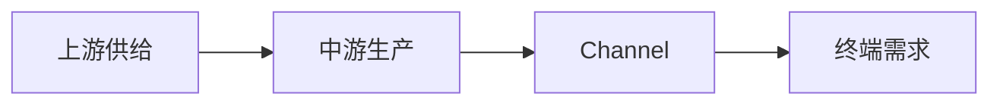

# Example Industry Research Report

## 1. One-Sentence Industry Definition

行业研究边界来源EvidenceIndustry MapLifecycleFactOpinionInferencePressure Test合规检查行业研究边界来源EvidenceIndustry MapLifecycleFactOpinionInferencePressure Test合规检查行业研究边界来源EvidenceIndustry MapLifecycleFactOpinionInferencePressure Test合规检查行业研究边界来源EvidenceIndustry MapLifecycleFactOpinionInferencePressure Test合规检查行业研究边界来源EvidenceIndustry MapLifecycleFactOpinionInferencePressure Test合规检查行业研究边界来源EvidenceIndustry MapLifecycleFactOpinionInferencePressure Test合规检查行业研究边界来源EvidenceIndustry MapLifecycleFactOpinionInferencePressure Test合规检查行业研究边界来源EvidenceIndustry MapLifecycleFactOpinionInferencePressure Test合规检查行业研究边界来源EvidenceIndustry MapLifecycleFactOpinionInferencePressure Test合规检查行业研究边界来源EvidenceIndustry MapLifecycleFactOpinionInferencePressure Test合规检查行业研究边界来源EvidenceIndustry MapLifecycleFactOpinionInferencePressure Test合规检查行业研究边界来源EvidenceIndustry MapLifecycleFactOpinionInferencePressure Test合规检查行业研究边界来源EvidenceIndustry MapLifecycleFactOpinionInferencePressure Test合规检查行业研究边界来源EvidenceIndustry MapLifecycleFactOpinionInferencePressure Test合规检查行业研究边界来源EvidenceIndustry MapLifecycleFactOpinionInferencePressure Test合规检查行业研究边界来源EvidenceIndustry MapLifecycleFactOpinionInferencePressure Test合规检查行业研究边界来源EvidenceIndustry MapLifecycleFactOpinionInferencePressure Test合规检查行业研究边界来源EvidenceIndustry MapLifecycleFactOpinionInferencePressure Test合规检查行业研究边界来源EvidenceIndustry MapLifecycleFactOpinionInferencePressure Test合规检查行业研究边界来源EvidenceIndustry MapLifecycleFactOpinionInferencePressure Test合规检查

## 2. Research Scope

行业研究边界来源EvidenceIndustry MapLifecycleFactOpinionInferencePressure Test合规检查行业研究边界来源EvidenceIndustry MapLifecycleFactOpinionInferencePressure Test合规检查行业研究边界来源EvidenceIndustry MapLifecycleFactOpinionInferencePressure Test合规检查行业研究边界来源EvidenceIndustry MapLifecycleFactOpinionInferencePressure Test合规检查行业研究边界来源EvidenceIndustry MapLifecycleFactOpinionInferencePressure Test合规检查行业研究边界来源EvidenceIndustry MapLifecycleFactOpinionInferencePressure Test合规检查行业研究边界来源EvidenceIndustry MapLifecycleFactOpinionInferencePressure Test合规检查行业研究边界来源EvidenceIndustry MapLifecycleFactOpinionInferencePressure Test合规检查行业研究边界来源EvidenceIndustry MapLifecycleFactOpinionInferencePressure Test合规检查行业研究边界来源EvidenceIndustry MapLifecycleFactOpinionInferencePressure Test合规检查行业研究边界来源EvidenceIndustry MapLifecycleFactOpinionInferencePressure Test合规检查行业研究边界来源EvidenceIndustry MapLifecycleFactOpinionInferencePressure Test合规检查行业研究边界来源EvidenceIndustry MapLifecycleFactOpinionInferencePressure Test合规检查行业研究边界来源EvidenceIndustry MapLifecycleFactOpinionInferencePressure Test合规检查行业研究边界来源EvidenceIndustry MapLifecycleFactOpinionInferencePressure Test合规检查行业研究边界来源EvidenceIndustry MapLifecycleFactOpinionInferencePressure Test合规检查行业研究边界来源EvidenceIndustry MapLifecycleFactOpinionInferencePressure Test合规检查行业研究边界来源EvidenceIndustry MapLifecycleFactOpinionInferencePressure Test合规检查行业研究边界来源EvidenceIndustry MapLifecycleFactOpinionInferencePressure Test合规检查行业研究边界来源EvidenceIndustry MapLifecycleFactOpinionInferencePressure Test合规检查

### 2.1 Research Plan Summary

行业研究边界来源EvidenceIndustry MapLifecycleFactOpinionInferencePressure Test合规检查行业研究边界来源EvidenceIndustry MapLifecycleFactOpinionInferencePressure Test合规检查行业研究边界来源EvidenceIndustry MapLifecycleFactOpinionInferencePressure Test合规检查行业研究边界来源EvidenceIndustry MapLifecycleFactOpinionInferencePressure Test合规检查行业研究边界来源EvidenceIndustry MapLifecycleFactOpinionInferencePressure Test合规检查行业研究边界来源EvidenceIndustry MapLifecycleFactOpinionInferencePressure Test合规检查行业研究边界来源EvidenceIndustry MapLifecycleFactOpinionInferencePressure Test合规检查行业研究边界来源EvidenceIndustry MapLifecycleFactOpinionInferencePressure Test合规检查行业研究边界来源EvidenceIndustry MapLifecycleFactOpinionInferencePressure Test合规检查行业研究边界来源EvidenceIndustry MapLifecycleFactOpinionInferencePressure Test合规检查行业研究边界来源EvidenceIndustry MapLifecycleFactOpinionInferencePressure Test合规检查行业研究边界来源EvidenceIndustry MapLifecycleFactOpinionInferencePressure Test合规检查行业研究边界来源EvidenceIndustry MapLifecycleFactOpinionInferencePressure Test合规检查行业研究边界来源EvidenceIndustry MapLifecycleFactOpinionInferencePressure Test合规检查行业研究边界来源EvidenceIndustry MapLifecycleFactOpinionInferencePressure Test合规检查行业研究边界来源EvidenceIndustry MapLifecycleFactOpinionInferencePressure Test合规检查行业研究边界来源EvidenceIndustry MapLifecycleFactOpinionInferencePressure Test合规检查行业研究边界来源EvidenceIndustry MapLifecycleFactOpinionInferencePressure Test合规检查行业研究边界来源EvidenceIndustry MapLifecycleFactOpinionInferencePressure Test合规检查行业研究边界来源EvidenceIndustry MapLifecycleFactOpinionInferencePressure Test合规检查

### 2.2 Source Matrix and Evidence Quality

| Key Claim | Source Type | Use in This Report | Evidence Tier | Evidence Quality | Source Status | Independent Verification Status | Limitations and Gap Handling |
|---|---|---|---|---|---|---|---|
| `claim-sample-1`: Market Size与供需 | 官方统计/Regulation/Industry Association | 核实市场, Policy, 供需和价格 | primary | high | obtained | independently_verified | 口径和时效Limitations已Explanation |
| `claim-sample-2`: 趋势与预测 | Credible Database/国际组织/行业报告 | 对比趋势和预测Metric | near-primary | medium | paid-database | single-source-primary | 预测假设仍需Verification |
| `claim-sample-3`: 补充市场信号 | 媒体/访谈/专家Opinion | 补充Opinion | secondary | low | obtained | secondary-only | 不能替代一手Fact |
行业研究边界来源EvidenceIndustry MapLifecycleFactOpinionInferencePressure Test合规检查行业研究边界来源EvidenceIndustry MapLifecycleFactOpinionInferencePressure Test合规检查行业研究边界来源EvidenceIndustry MapLifecycleFactOpinionInferencePressure Test合规检查行业研究边界来源EvidenceIndustry MapLifecycleFactOpinionInferencePressure Test合规检查行业研究边界来源EvidenceIndustry MapLifecycleFactOpinionInferencePressure Test合规检查行业研究边界来源EvidenceIndustry MapLifecycleFactOpinionInferencePressure Test合规检查行业研究边界来源EvidenceIndustry MapLifecycleFactOpinionInferencePressure Test合规检查行业研究边界来源EvidenceIndustry MapLifecycleFactOpinionInferencePressure Test合规检查行业研究边界来源EvidenceIndustry MapLifecycleFactOpinionInferencePressure Test合规检查行业研究边界来源EvidenceIndustry MapLifecycleFactOpinionInferencePressure Test合规检查行业研究边界来源EvidenceIndustry MapLifecycleFactOpinionInferencePressure Test合规检查行业研究边界来源EvidenceIndustry MapLifecycleFactOpinionInferencePressure Test合规检查行业研究边界来源EvidenceIndustry MapLifecycleFactOpinionInferencePressure Test合规检查行业研究边界来源EvidenceIndustry MapLifecycleFactOpinionInferencePressure Test合规检查行业研究边界来源EvidenceIndustry MapLifecycleFactOpinionInferencePressure Test合规检查行业研究边界来源EvidenceIndustry MapLifecycleFactOpinionInferencePressure Test合规检查行业研究边界来源EvidenceIndustry MapLifecycleFactOpinionInferencePressure Test合规检查行业研究边界来源EvidenceIndustry MapLifecycleFactOpinionInferencePressure Test合规检查行业研究边界来源EvidenceIndustry MapLifecycleFactOpinionInferencePressure Test合规检查行业研究边界来源EvidenceIndustry MapLifecycleFactOpinionInferencePressure Test合规检查

### 2.3 Retrieval Gap Closure Results

| Gap | Attempted Rounds and Sources | Current Status | Why It Still Matters | Unresolved Reason | Next Source |
|---|---|---|---|---|---|
| `gap-sample-1`: 最新Market Size, Penetration Rate, 价格变化和供需数据 | Round 1: 官方统计和Regulation文件. Round 2: Industry Association和Credible Database. Round 3: 替代关键词, 本地语言和可信二手交叉Verification | Still Open | 这些Gap会Impact行业Lifecycle, 七模块权重和RiskOpportunityJudgment | 部分数据库需要Paid Database或登录, 公开检索无可靠结果, Definition Mismatch | 官方统计, Industry Association, Regulation公告, Credible Database |
行业研究边界来源EvidenceIndustry MapLifecycleFactOpinionInferencePressure Test合规检查行业研究边界来源EvidenceIndustry MapLifecycleFactOpinionInferencePressure Test合规检查行业研究边界来源EvidenceIndustry MapLifecycleFactOpinionInferencePressure Test合规检查行业研究边界来源EvidenceIndustry MapLifecycleFactOpinionInferencePressure Test合规检查行业研究边界来源EvidenceIndustry MapLifecycleFactOpinionInferencePressure Test合规检查行业研究边界来源EvidenceIndustry MapLifecycleFactOpinionInferencePressure Test合规检查行业研究边界来源EvidenceIndustry MapLifecycleFactOpinionInferencePressure Test合规检查行业研究边界来源EvidenceIndustry MapLifecycleFactOpinionInferencePressure Test合规检查行业研究边界来源EvidenceIndustry MapLifecycleFactOpinionInferencePressure Test合规检查行业研究边界来源EvidenceIndustry MapLifecycleFactOpinionInferencePressure Test合规检查行业研究边界来源EvidenceIndustry MapLifecycleFactOpinionInferencePressure Test合规检查行业研究边界来源EvidenceIndustry MapLifecycleFactOpinionInferencePressure Test合规检查行业研究边界来源EvidenceIndustry MapLifecycleFactOpinionInferencePressure Test合规检查行业研究边界来源EvidenceIndustry MapLifecycleFactOpinionInferencePressure Test合规检查行业研究边界来源EvidenceIndustry MapLifecycleFactOpinionInferencePressure Test合规检查行业研究边界来源EvidenceIndustry MapLifecycleFactOpinionInferencePressure Test合规检查行业研究边界来源EvidenceIndustry MapLifecycleFactOpinionInferencePressure Test合规检查行业研究边界来源EvidenceIndustry MapLifecycleFactOpinionInferencePressure Test合规检查行业研究边界来源EvidenceIndustry MapLifecycleFactOpinionInferencePressure Test合规检查行业研究边界来源EvidenceIndustry MapLifecycleFactOpinionInferencePressure Test合规检查

## 3. Industry Map

行业研究边界来源EvidenceIndustry MapLifecycleFactOpinionInferencePressure Test合规检查行业研究边界来源EvidenceIndustry MapLifecycleFactOpinionInferencePressure Test合规检查行业研究边界来源EvidenceIndustry MapLifecycleFactOpinionInferencePressure Test合规检查行业研究边界来源EvidenceIndustry MapLifecycleFactOpinionInferencePressure Test合规检查行业研究边界来源EvidenceIndustry MapLifecycleFactOpinionInferencePressure Test合规检查行业研究边界来源EvidenceIndustry MapLifecycleFactOpinionInferencePressure Test合规检查行业研究边界来源EvidenceIndustry MapLifecycleFactOpinionInferencePressure Test合规检查行业研究边界来源EvidenceIndustry MapLifecycleFactOpinionInferencePressure Test合规检查行业研究边界来源EvidenceIndustry MapLifecycleFactOpinionInferencePressure Test合规检查行业研究边界来源EvidenceIndustry MapLifecycleFactOpinionInferencePressure Test合规检查行业研究边界来源EvidenceIndustry MapLifecycleFactOpinionInferencePressure Test合规检查行业研究边界来源EvidenceIndustry MapLifecycleFactOpinionInferencePressure Test合规检查行业研究边界来源EvidenceIndustry MapLifecycleFactOpinionInferencePressure Test合规检查行业研究边界来源EvidenceIndustry MapLifecycleFactOpinionInferencePressure Test合规检查行业研究边界来源EvidenceIndustry MapLifecycleFactOpinionInferencePressure Test合规检查行业研究边界来源EvidenceIndustry MapLifecycleFactOpinionInferencePressure Test合规检查行业研究边界来源EvidenceIndustry MapLifecycleFactOpinionInferencePressure Test合规检查行业研究边界来源EvidenceIndustry MapLifecycleFactOpinionInferencePressure Test合规检查行业研究边界来源EvidenceIndustry MapLifecycleFactOpinionInferencePressure Test合规检查行业研究边界来源EvidenceIndustry MapLifecycleFactOpinionInferencePressure Test合规检查

## 4. Lifecycle Assessment

**Lifecycle Phase:** 行业处于Growth Phase向Mature Phase过渡阶段, 需求仍增长但竞争结构开始分化.行业处于Growth Phase向Mature Phase过渡阶段, 需求仍增长但竞争结构开始分化.行业处于Growth Phase向Mature Phase过渡阶段, 需求仍增长但竞争结构开始分化.行业处于Growth Phase向Mature Phase过渡阶段, 需求仍增长但竞争结构开始分化.行业处于Growth Phase向Mature Phase过渡阶段, 需求仍增长但竞争结构开始分化.行业处于Growth Phase向Mature Phase过渡阶段, 需求仍增长但竞争结构开始分化.行业处于Growth Phase向Mature Phase过渡阶段, 需求仍增长但竞争结构开始分化.行业处于Growth Phase向Mature Phase过渡阶段, 需求仍增长但竞争结构开始分化.

**Evidence:** Market Size, Penetration Rate, 供需关系和Competitive Landscape仍有增长信号, 但价格和Profit率压力已经出现.Market Size, Penetration Rate, 供需关系和Competitive Landscape仍有增长信号, 但价格和Profit率压力已经出现.Market Size, Penetration Rate, 供需关系和Competitive Landscape仍有增长信号, 但价格和Profit率压力已经出现.Market Size, Penetration Rate, 供需关系和Competitive Landscape仍有增长信号, 但价格和Profit率压力已经出现.Market Size, Penetration Rate, 供需关系和Competitive Landscape仍有增长信号, 但价格和Profit率压力已经出现.Market Size, Penetration Rate, 供需关系和Competitive Landscape仍有增长信号, 但价格和Profit率压力已经出现.Market Size, Penetration Rate, 供需关系和Competitive Landscape仍有增长信号, 但价格和Profit率压力已经出现.Market Size, Penetration Rate, 供需关系和Competitive Landscape仍有增长信号, 但价格和Profit率压力已经出现.

**Counterevidence:** 如果Regulation口径, 替代品扩张或需求放缓数据持续恶化, Lifecycle可能更接近Mature Phase.如果Regulation口径, 替代品扩张或需求放缓数据持续恶化, Lifecycle可能更接近Mature Phase.如果Regulation口径, 替代品扩张或需求放缓数据持续恶化, Lifecycle可能更接近Mature Phase.如果Regulation口径, 替代品扩张或需求放缓数据持续恶化, Lifecycle可能更接近Mature Phase.如果Regulation口径, 替代品扩张或需求放缓数据持续恶化, Lifecycle可能更接近Mature Phase.如果Regulation口径, 替代品扩张或需求放缓数据持续恶化, Lifecycle可能更接近Mature Phase.如果Regulation口径, 替代品扩张或需求放缓数据持续恶化, Lifecycle可能更接近Mature Phase.如果Regulation口径, 替代品扩张或需求放缓数据持续恶化, Lifecycle可能更接近Mature Phase.

**Confidence:** 中等, 因为关键行业数据仍需要官方统计, Industry Association和Credible Database继续Verification.中等, 因为关键行业数据仍需要官方统计, Industry Association和Credible Database继续Verification.中等, 因为关键行业数据仍需要官方统计, Industry Association和Credible Database继续Verification.中等, 因为关键行业数据仍需要官方统计, Industry Association和Credible Database继续Verification.中等, 因为关键行业数据仍需要官方统计, Industry Association和Credible Database继续Verification.中等, 因为关键行业数据仍需要官方统计, Industry Association和Credible Database继续Verification.中等, 因为关键行业数据仍需要官方统计, Industry Association和Credible Database继续Verification.中等, 因为关键行业数据仍需要官方统计, Industry Association和Credible Database继续Verification.

**Research Implication:** 七模块应更重视Profitability, Defensibility和Prosperity拐点.七模块应更重视Profitability, Defensibility和Prosperity拐点.七模块应更重视Profitability, Defensibility和Prosperity拐点.七模块应更重视Profitability, Defensibility和Prosperity拐点.七模块应更重视Profitability, Defensibility和Prosperity拐点.七模块应更重视Profitability, Defensibility和Prosperity拐点.七模块应更重视Profitability, Defensibility和Prosperity拐点.七模块应更重视Profitability, Defensibility和Prosperity拐点.

## 5. Seven Core Modules Analysis

### 5.1 Feasibility

**Conclusion:** ConclusionContentConclusionContentConclusionContentConclusionContentConclusionContentConclusionContentConclusionContentConclusionContentConclusionContentConclusionContentConclusionContentConclusionContentConclusionContentConclusionContentConclusionContentConclusionContentConclusionContentConclusionContentConclusionContentConclusionContentConclusionContentConclusionContentConclusionContentConclusionContentConclusionContent

**Evidence:** EvidenceContentEvidenceContentEvidenceContentEvidenceContentEvidenceContentEvidenceContentEvidenceContentEvidenceContentEvidenceContentEvidenceContentEvidenceContentEvidenceContentEvidenceContentEvidenceContentEvidenceContentEvidenceContentEvidenceContentEvidenceContentEvidenceContentEvidenceContentEvidenceContentEvidenceContentEvidenceContentEvidenceContentEvidenceContent

**Mechanism:** MechanismContentMechanismContentMechanismContentMechanismContentMechanismContentMechanismContentMechanismContentMechanismContentMechanismContentMechanismContentMechanismContentMechanismContentMechanismContentMechanismContentMechanismContentMechanismContentMechanismContentMechanismContentMechanismContentMechanismContentMechanismContentMechanismContentMechanismContentMechanismContentMechanismContent

**Research Implication:** Research ImplicationResearch ImplicationResearch ImplicationResearch ImplicationResearch ImplicationResearch ImplicationResearch ImplicationResearch ImplicationResearch ImplicationResearch ImplicationResearch ImplicationResearch ImplicationResearch ImplicationResearch ImplicationResearch ImplicationResearch ImplicationResearch ImplicationResearch ImplicationResearch ImplicationResearch ImplicationResearch ImplicationResearch ImplicationResearch ImplicationResearch ImplicationResearch Implication

**Key Metrics and Follow-up Verification:** Metrics to Track和Primary SourceVerificationMetrics to Track和Primary SourceVerificationMetrics to Track和Primary SourceVerificationMetrics to Track和Primary SourceVerificationMetrics to Track和Primary SourceVerificationMetrics to Track和Primary SourceVerificationMetrics to Track和Primary SourceVerificationMetrics to Track和Primary SourceVerificationMetrics to Track和Primary SourceVerificationMetrics to Track和Primary SourceVerificationMetrics to Track和Primary SourceVerificationMetrics to Track和Primary SourceVerificationMetrics to Track和Primary SourceVerificationMetrics to Track和Primary SourceVerificationMetrics to Track和Primary SourceVerificationMetrics to Track和Primary SourceVerificationMetrics to Track和Primary SourceVerificationMetrics to Track和Primary SourceVerificationMetrics to Track和Primary SourceVerificationMetrics to Track和Primary SourceVerificationMetrics to Track和Primary SourceVerificationMetrics to Track和Primary SourceVerificationMetrics to Track和Primary SourceVerificationMetrics to Track和Primary SourceVerificationMetrics to Track和Primary SourceVerification

### 5.2 Scalability

**Conclusion:** ConclusionContentConclusionContentConclusionContentConclusionContentConclusionContentConclusionContentConclusionContentConclusionContentConclusionContentConclusionContentConclusionContentConclusionContentConclusionContentConclusionContentConclusionContentConclusionContentConclusionContentConclusionContentConclusionContentConclusionContentConclusionContentConclusionContentConclusionContentConclusionContentConclusionContent

**Evidence:** EvidenceContentEvidenceContentEvidenceContentEvidenceContentEvidenceContentEvidenceContentEvidenceContentEvidenceContentEvidenceContentEvidenceContentEvidenceContentEvidenceContentEvidenceContentEvidenceContentEvidenceContentEvidenceContentEvidenceContentEvidenceContentEvidenceContentEvidenceContentEvidenceContentEvidenceContentEvidenceContentEvidenceContentEvidenceContent

**Mechanism:** MechanismContentMechanismContentMechanismContentMechanismContentMechanismContentMechanismContentMechanismContentMechanismContentMechanismContentMechanismContentMechanismContentMechanismContentMechanismContentMechanismContentMechanismContentMechanismContentMechanismContentMechanismContentMechanismContentMechanismContentMechanismContentMechanismContentMechanismContentMechanismContentMechanismContent

**Research Implication:** Research ImplicationResearch ImplicationResearch ImplicationResearch ImplicationResearch ImplicationResearch ImplicationResearch ImplicationResearch ImplicationResearch ImplicationResearch ImplicationResearch ImplicationResearch ImplicationResearch ImplicationResearch ImplicationResearch ImplicationResearch ImplicationResearch ImplicationResearch ImplicationResearch ImplicationResearch ImplicationResearch ImplicationResearch ImplicationResearch ImplicationResearch ImplicationResearch Implication

**Key Metrics and Follow-up Verification:** Metrics to Track和Primary SourceVerificationMetrics to Track和Primary SourceVerificationMetrics to Track和Primary SourceVerificationMetrics to Track和Primary SourceVerificationMetrics to Track和Primary SourceVerificationMetrics to Track和Primary SourceVerificationMetrics to Track和Primary SourceVerificationMetrics to Track和Primary SourceVerificationMetrics to Track和Primary SourceVerificationMetrics to Track和Primary SourceVerificationMetrics to Track和Primary SourceVerificationMetrics to Track和Primary SourceVerificationMetrics to Track和Primary SourceVerificationMetrics to Track和Primary SourceVerificationMetrics to Track和Primary SourceVerificationMetrics to Track和Primary SourceVerificationMetrics to Track和Primary SourceVerificationMetrics to Track和Primary SourceVerificationMetrics to Track和Primary SourceVerificationMetrics to Track和Primary SourceVerificationMetrics to Track和Primary SourceVerificationMetrics to Track和Primary SourceVerificationMetrics to Track和Primary SourceVerificationMetrics to Track和Primary SourceVerificationMetrics to Track和Primary SourceVerification

### 5.3 Defensibility

**Conclusion:** ConclusionContentConclusionContentConclusionContentConclusionContentConclusionContentConclusionContentConclusionContentConclusionContentConclusionContentConclusionContentConclusionContentConclusionContentConclusionContentConclusionContentConclusionContentConclusionContentConclusionContentConclusionContentConclusionContentConclusionContentConclusionContentConclusionContentConclusionContentConclusionContentConclusionContent

**Evidence:** EvidenceContentEvidenceContentEvidenceContentEvidenceContentEvidenceContentEvidenceContentEvidenceContentEvidenceContentEvidenceContentEvidenceContentEvidenceContentEvidenceContentEvidenceContentEvidenceContentEvidenceContentEvidenceContentEvidenceContentEvidenceContentEvidenceContentEvidenceContentEvidenceContentEvidenceContentEvidenceContentEvidenceContentEvidenceContent

**Mechanism:** MechanismContentMechanismContentMechanismContentMechanismContentMechanismContentMechanismContentMechanismContentMechanismContentMechanismContentMechanismContentMechanismContentMechanismContentMechanismContentMechanismContentMechanismContentMechanismContentMechanismContentMechanismContentMechanismContentMechanismContentMechanismContentMechanismContentMechanismContentMechanismContentMechanismContent

**Research Implication:** Research ImplicationResearch ImplicationResearch ImplicationResearch ImplicationResearch ImplicationResearch ImplicationResearch ImplicationResearch ImplicationResearch ImplicationResearch ImplicationResearch ImplicationResearch ImplicationResearch ImplicationResearch ImplicationResearch ImplicationResearch ImplicationResearch ImplicationResearch ImplicationResearch ImplicationResearch ImplicationResearch ImplicationResearch ImplicationResearch ImplicationResearch ImplicationResearch Implication

**Key Metrics and Follow-up Verification:** Metrics to Track和Primary SourceVerificationMetrics to Track和Primary SourceVerificationMetrics to Track和Primary SourceVerificationMetrics to Track和Primary SourceVerificationMetrics to Track和Primary SourceVerificationMetrics to Track和Primary SourceVerificationMetrics to Track和Primary SourceVerificationMetrics to Track和Primary SourceVerificationMetrics to Track和Primary SourceVerificationMetrics to Track和Primary SourceVerificationMetrics to Track和Primary SourceVerificationMetrics to Track和Primary SourceVerificationMetrics to Track和Primary SourceVerificationMetrics to Track和Primary SourceVerificationMetrics to Track和Primary SourceVerificationMetrics to Track和Primary SourceVerificationMetrics to Track和Primary SourceVerificationMetrics to Track和Primary SourceVerificationMetrics to Track和Primary SourceVerificationMetrics to Track和Primary SourceVerificationMetrics to Track和Primary SourceVerificationMetrics to Track和Primary SourceVerificationMetrics to Track和Primary SourceVerificationMetrics to Track和Primary SourceVerificationMetrics to Track和Primary SourceVerification

### 5.4 Profitability

**Conclusion:** ConclusionContentConclusionContentConclusionContentConclusionContentConclusionContentConclusionContentConclusionContentConclusionContentConclusionContentConclusionContentConclusionContentConclusionContentConclusionContentConclusionContentConclusionContentConclusionContentConclusionContentConclusionContentConclusionContentConclusionContentConclusionContentConclusionContentConclusionContentConclusionContentConclusionContent

**Evidence:** EvidenceContentEvidenceContentEvidenceContentEvidenceContentEvidenceContentEvidenceContentEvidenceContentEvidenceContentEvidenceContentEvidenceContentEvidenceContentEvidenceContentEvidenceContentEvidenceContentEvidenceContentEvidenceContentEvidenceContentEvidenceContentEvidenceContentEvidenceContentEvidenceContentEvidenceContentEvidenceContentEvidenceContentEvidenceContent

**Mechanism:** MechanismContentMechanismContentMechanismContentMechanismContentMechanismContentMechanismContentMechanismContentMechanismContentMechanismContentMechanismContentMechanismContentMechanismContentMechanismContentMechanismContentMechanismContentMechanismContentMechanismContentMechanismContentMechanismContentMechanismContentMechanismContentMechanismContentMechanismContentMechanismContentMechanismContent

**Research Implication:** Research ImplicationResearch ImplicationResearch ImplicationResearch ImplicationResearch ImplicationResearch ImplicationResearch ImplicationResearch ImplicationResearch ImplicationResearch ImplicationResearch ImplicationResearch ImplicationResearch ImplicationResearch ImplicationResearch ImplicationResearch ImplicationResearch ImplicationResearch ImplicationResearch ImplicationResearch ImplicationResearch ImplicationResearch ImplicationResearch ImplicationResearch ImplicationResearch Implication

**Key Metrics and Follow-up Verification:** Metrics to Track和Primary SourceVerificationMetrics to Track和Primary SourceVerificationMetrics to Track和Primary SourceVerificationMetrics to Track和Primary SourceVerificationMetrics to Track和Primary SourceVerificationMetrics to Track和Primary SourceVerificationMetrics to Track和Primary SourceVerificationMetrics to Track和Primary SourceVerificationMetrics to Track和Primary SourceVerificationMetrics to Track和Primary SourceVerificationMetrics to Track和Primary SourceVerificationMetrics to Track和Primary SourceVerificationMetrics to Track和Primary SourceVerificationMetrics to Track和Primary SourceVerificationMetrics to Track和Primary SourceVerificationMetrics to Track和Primary SourceVerificationMetrics to Track和Primary SourceVerificationMetrics to Track和Primary SourceVerificationMetrics to Track和Primary SourceVerificationMetrics to Track和Primary SourceVerificationMetrics to Track和Primary SourceVerificationMetrics to Track和Primary SourceVerificationMetrics to Track和Primary SourceVerificationMetrics to Track和Primary SourceVerificationMetrics to Track和Primary SourceVerification

### 5.5 Valuation

**Conclusion:** ConclusionContentConclusionContentConclusionContentConclusionContentConclusionContentConclusionContentConclusionContentConclusionContentConclusionContentConclusionContentConclusionContentConclusionContentConclusionContentConclusionContentConclusionContentConclusionContentConclusionContentConclusionContentConclusionContentConclusionContentConclusionContentConclusionContentConclusionContentConclusionContentConclusionContent

**Evidence:** EvidenceContentEvidenceContentEvidenceContentEvidenceContentEvidenceContentEvidenceContentEvidenceContentEvidenceContentEvidenceContentEvidenceContentEvidenceContentEvidenceContentEvidenceContentEvidenceContentEvidenceContentEvidenceContentEvidenceContentEvidenceContentEvidenceContentEvidenceContentEvidenceContentEvidenceContentEvidenceContentEvidenceContentEvidenceContent

**Mechanism:** MechanismContentMechanismContentMechanismContentMechanismContentMechanismContentMechanismContentMechanismContentMechanismContentMechanismContentMechanismContentMechanismContentMechanismContentMechanismContentMechanismContentMechanismContentMechanismContentMechanismContentMechanismContentMechanismContentMechanismContentMechanismContentMechanismContentMechanismContentMechanismContentMechanismContent

**Research Implication:** Research ImplicationResearch ImplicationResearch ImplicationResearch ImplicationResearch ImplicationResearch ImplicationResearch ImplicationResearch ImplicationResearch ImplicationResearch ImplicationResearch ImplicationResearch ImplicationResearch ImplicationResearch ImplicationResearch ImplicationResearch ImplicationResearch ImplicationResearch ImplicationResearch ImplicationResearch ImplicationResearch ImplicationResearch ImplicationResearch ImplicationResearch ImplicationResearch Implication

**Key Metrics and Follow-up Verification:** Metrics to Track和Primary SourceVerificationMetrics to Track和Primary SourceVerificationMetrics to Track和Primary SourceVerificationMetrics to Track和Primary SourceVerificationMetrics to Track和Primary SourceVerificationMetrics to Track和Primary SourceVerificationMetrics to Track和Primary SourceVerificationMetrics to Track和Primary SourceVerificationMetrics to Track和Primary SourceVerificationMetrics to Track和Primary SourceVerificationMetrics to Track和Primary SourceVerificationMetrics to Track和Primary SourceVerificationMetrics to Track和Primary SourceVerificationMetrics to Track和Primary SourceVerificationMetrics to Track和Primary SourceVerificationMetrics to Track和Primary SourceVerificationMetrics to Track和Primary SourceVerificationMetrics to Track和Primary SourceVerificationMetrics to Track和Primary SourceVerificationMetrics to Track和Primary SourceVerificationMetrics to Track和Primary SourceVerificationMetrics to Track和Primary SourceVerificationMetrics to Track和Primary SourceVerificationMetrics to Track和Primary SourceVerificationMetrics to Track和Primary SourceVerification

### 5.6 External Factors

**Conclusion:** ConclusionContentConclusionContentConclusionContentConclusionContentConclusionContentConclusionContentConclusionContentConclusionContentConclusionContentConclusionContentConclusionContentConclusionContentConclusionContentConclusionContentConclusionContentConclusionContentConclusionContentConclusionContentConclusionContentConclusionContentConclusionContentConclusionContentConclusionContentConclusionContentConclusionContent

**Evidence:** EvidenceContentEvidenceContentEvidenceContentEvidenceContentEvidenceContentEvidenceContentEvidenceContentEvidenceContentEvidenceContentEvidenceContentEvidenceContentEvidenceContentEvidenceContentEvidenceContentEvidenceContentEvidenceContentEvidenceContentEvidenceContentEvidenceContentEvidenceContentEvidenceContentEvidenceContentEvidenceContentEvidenceContentEvidenceContent

**Mechanism:** MechanismContentMechanismContentMechanismContentMechanismContentMechanismContentMechanismContentMechanismContentMechanismContentMechanismContentMechanismContentMechanismContentMechanismContentMechanismContentMechanismContentMechanismContentMechanismContentMechanismContentMechanismContentMechanismContentMechanismContentMechanismContentMechanismContentMechanismContentMechanismContentMechanismContent

**Research Implication:** Research ImplicationResearch ImplicationResearch ImplicationResearch ImplicationResearch ImplicationResearch ImplicationResearch ImplicationResearch ImplicationResearch ImplicationResearch ImplicationResearch ImplicationResearch ImplicationResearch ImplicationResearch ImplicationResearch ImplicationResearch ImplicationResearch ImplicationResearch ImplicationResearch ImplicationResearch ImplicationResearch ImplicationResearch ImplicationResearch ImplicationResearch ImplicationResearch Implication

**Key Metrics and Follow-up Verification:** Metrics to Track和Primary SourceVerificationMetrics to Track和Primary SourceVerificationMetrics to Track和Primary SourceVerificationMetrics to Track和Primary SourceVerificationMetrics to Track和Primary SourceVerificationMetrics to Track和Primary SourceVerificationMetrics to Track和Primary SourceVerificationMetrics to Track和Primary SourceVerificationMetrics to Track和Primary SourceVerificationMetrics to Track和Primary SourceVerificationMetrics to Track和Primary SourceVerificationMetrics to Track和Primary SourceVerificationMetrics to Track和Primary SourceVerificationMetrics to Track和Primary SourceVerificationMetrics to Track和Primary SourceVerificationMetrics to Track和Primary SourceVerificationMetrics to Track和Primary SourceVerificationMetrics to Track和Primary SourceVerificationMetrics to Track和Primary SourceVerificationMetrics to Track和Primary SourceVerificationMetrics to Track和Primary SourceVerificationMetrics to Track和Primary SourceVerificationMetrics to Track和Primary SourceVerificationMetrics to Track和Primary SourceVerificationMetrics to Track和Primary SourceVerification

### 5.7 Prosperity

**Conclusion:** ConclusionContentConclusionContentConclusionContentConclusionContentConclusionContentConclusionContentConclusionContentConclusionContentConclusionContentConclusionContentConclusionContentConclusionContentConclusionContentConclusionContentConclusionContentConclusionContentConclusionContentConclusionContentConclusionContentConclusionContentConclusionContentConclusionContentConclusionContentConclusionContentConclusionContent

**Evidence:** EvidenceContentEvidenceContentEvidenceContentEvidenceContentEvidenceContentEvidenceContentEvidenceContentEvidenceContentEvidenceContentEvidenceContentEvidenceContentEvidenceContentEvidenceContentEvidenceContentEvidenceContentEvidenceContentEvidenceContentEvidenceContentEvidenceContentEvidenceContentEvidenceContentEvidenceContentEvidenceContentEvidenceContentEvidenceContent

**Mechanism:** MechanismContentMechanismContentMechanismContentMechanismContentMechanismContentMechanismContentMechanismContentMechanismContentMechanismContentMechanismContentMechanismContentMechanismContentMechanismContentMechanismContentMechanismContentMechanismContentMechanismContentMechanismContentMechanismContentMechanismContentMechanismContentMechanismContentMechanismContentMechanismContentMechanismContent

**Research Implication:** Research ImplicationResearch ImplicationResearch ImplicationResearch ImplicationResearch ImplicationResearch ImplicationResearch ImplicationResearch ImplicationResearch ImplicationResearch ImplicationResearch ImplicationResearch ImplicationResearch ImplicationResearch ImplicationResearch ImplicationResearch ImplicationResearch ImplicationResearch ImplicationResearch ImplicationResearch ImplicationResearch ImplicationResearch ImplicationResearch ImplicationResearch ImplicationResearch Implication

**Key Metrics and Follow-up Verification:** Metrics to Track和Primary SourceVerificationMetrics to Track和Primary SourceVerificationMetrics to Track和Primary SourceVerificationMetrics to Track和Primary SourceVerificationMetrics to Track和Primary SourceVerificationMetrics to Track和Primary SourceVerificationMetrics to Track和Primary SourceVerificationMetrics to Track和Primary SourceVerificationMetrics to Track和Primary SourceVerificationMetrics to Track和Primary SourceVerificationMetrics to Track和Primary SourceVerificationMetrics to Track和Primary SourceVerificationMetrics to Track和Primary SourceVerificationMetrics to Track和Primary SourceVerificationMetrics to Track和Primary SourceVerificationMetrics to Track和Primary SourceVerificationMetrics to Track和Primary SourceVerificationMetrics to Track和Primary SourceVerificationMetrics to Track和Primary SourceVerificationMetrics to Track和Primary SourceVerificationMetrics to Track和Primary SourceVerificationMetrics to Track和Primary SourceVerificationMetrics to Track和Primary SourceVerificationMetrics to Track和Primary SourceVerificationMetrics to Track和Primary SourceVerification

## 6. Trend Outlook

行业研究边界来源EvidenceIndustry MapLifecycleFactOpinionInferencePressure Test合规检查行业研究边界来源EvidenceIndustry MapLifecycleFactOpinionInferencePressure Test合规检查行业研究边界来源EvidenceIndustry MapLifecycleFactOpinionInferencePressure Test合规检查行业研究边界来源EvidenceIndustry MapLifecycleFactOpinionInferencePressure Test合规检查行业研究边界来源EvidenceIndustry MapLifecycleFactOpinionInferencePressure Test合规检查行业研究边界来源EvidenceIndustry MapLifecycleFactOpinionInferencePressure Test合规检查行业研究边界来源EvidenceIndustry MapLifecycleFactOpinionInferencePressure Test合规检查行业研究边界来源EvidenceIndustry MapLifecycleFactOpinionInferencePressure Test合规检查行业研究边界来源EvidenceIndustry MapLifecycleFactOpinionInferencePressure Test合规检查行业研究边界来源EvidenceIndustry MapLifecycleFactOpinionInferencePressure Test合规检查行业研究边界来源EvidenceIndustry MapLifecycleFactOpinionInferencePressure Test合规检查行业研究边界来源EvidenceIndustry MapLifecycleFactOpinionInferencePressure Test合规检查行业研究边界来源EvidenceIndustry MapLifecycleFactOpinionInferencePressure Test合规检查行业研究边界来源EvidenceIndustry MapLifecycleFactOpinionInferencePressure Test合规检查行业研究边界来源EvidenceIndustry MapLifecycleFactOpinionInferencePressure Test合规检查行业研究边界来源EvidenceIndustry MapLifecycleFactOpinionInferencePressure Test合规检查行业研究边界来源EvidenceIndustry MapLifecycleFactOpinionInferencePressure Test合规检查行业研究边界来源EvidenceIndustry MapLifecycleFactOpinionInferencePressure Test合规检查行业研究边界来源EvidenceIndustry MapLifecycleFactOpinionInferencePressure Test合规检查行业研究边界来源EvidenceIndustry MapLifecycleFactOpinionInferencePressure Test合规检查

## 7. Fact, Opinion, and Inference Layers

| Type | Content | Source/Basis | Evidence Tier | Evidence Quality | Source Status | Confidence |
|---|---|---|---|---|---|---|
| Fact | 行业Fact | 官方统计 | primary | high | obtained | 高 |
| Opinion | 专家Opinion | 访谈或报告 | secondary | medium | obtained | 中 |
| Inference | 趋势Inference | 基于Fact和Opinion | near-primary | medium | obtained | 中 |
行业研究边界来源EvidenceIndustry MapLifecycleFactOpinionInferencePressure Test合规检查行业研究边界来源EvidenceIndustry MapLifecycleFactOpinionInferencePressure Test合规检查行业研究边界来源EvidenceIndustry MapLifecycleFactOpinionInferencePressure Test合规检查行业研究边界来源EvidenceIndustry MapLifecycleFactOpinionInferencePressure Test合规检查行业研究边界来源EvidenceIndustry MapLifecycleFactOpinionInferencePressure Test合规检查行业研究边界来源EvidenceIndustry MapLifecycleFactOpinionInferencePressure Test合规检查行业研究边界来源EvidenceIndustry MapLifecycleFactOpinionInferencePressure Test合规检查行业研究边界来源EvidenceIndustry MapLifecycleFactOpinionInferencePressure Test合规检查行业研究边界来源EvidenceIndustry MapLifecycleFactOpinionInferencePressure Test合规检查行业研究边界来源EvidenceIndustry MapLifecycleFactOpinionInferencePressure Test合规检查行业研究边界来源EvidenceIndustry MapLifecycleFactOpinionInferencePressure Test合规检查行业研究边界来源EvidenceIndustry MapLifecycleFactOpinionInferencePressure Test合规检查行业研究边界来源EvidenceIndustry MapLifecycleFactOpinionInferencePressure Test合规检查行业研究边界来源EvidenceIndustry MapLifecycleFactOpinionInferencePressure Test合规检查行业研究边界来源EvidenceIndustry MapLifecycleFactOpinionInferencePressure Test合规检查行业研究边界来源EvidenceIndustry MapLifecycleFactOpinionInferencePressure Test合规检查行业研究边界来源EvidenceIndustry MapLifecycleFactOpinionInferencePressure Test合规检查行业研究边界来源EvidenceIndustry MapLifecycleFactOpinionInferencePressure Test合规检查行业研究边界来源EvidenceIndustry MapLifecycleFactOpinionInferencePressure Test合规检查行业研究边界来源EvidenceIndustry MapLifecycleFactOpinionInferencePressure Test合规检查

## 8. Multi-Perspective Pressure Test

| Perspective | Challenge | Why It Matters | Verification Needed |
|---|---|---|---|
| Industry Expert | 行业Judgment可能过于乐观 | Impact行业Conclusion | Verification行业数据 |
行业研究边界来源EvidenceIndustry MapLifecycleFactOpinionInferencePressure Test合规检查行业研究边界来源EvidenceIndustry MapLifecycleFactOpinionInferencePressure Test合规检查行业研究边界来源EvidenceIndustry MapLifecycleFactOpinionInferencePressure Test合规检查行业研究边界来源EvidenceIndustry MapLifecycleFactOpinionInferencePressure Test合规检查行业研究边界来源EvidenceIndustry MapLifecycleFactOpinionInferencePressure Test合规检查行业研究边界来源EvidenceIndustry MapLifecycleFactOpinionInferencePressure Test合规检查行业研究边界来源EvidenceIndustry MapLifecycleFactOpinionInferencePressure Test合规检查行业研究边界来源EvidenceIndustry MapLifecycleFactOpinionInferencePressure Test合规检查行业研究边界来源EvidenceIndustry MapLifecycleFactOpinionInferencePressure Test合规检查行业研究边界来源EvidenceIndustry MapLifecycleFactOpinionInferencePressure Test合规检查行业研究边界来源EvidenceIndustry MapLifecycleFactOpinionInferencePressure Test合规检查行业研究边界来源EvidenceIndustry MapLifecycleFactOpinionInferencePressure Test合规检查行业研究边界来源EvidenceIndustry MapLifecycleFactOpinionInferencePressure Test合规检查行业研究边界来源EvidenceIndustry MapLifecycleFactOpinionInferencePressure Test合规检查行业研究边界来源EvidenceIndustry MapLifecycleFactOpinionInferencePressure Test合规检查行业研究边界来源EvidenceIndustry MapLifecycleFactOpinionInferencePressure Test合规检查行业研究边界来源EvidenceIndustry MapLifecycleFactOpinionInferencePressure Test合规检查行业研究边界来源EvidenceIndustry MapLifecycleFactOpinionInferencePressure Test合规检查行业研究边界来源EvidenceIndustry MapLifecycleFactOpinionInferencePressure Test合规检查行业研究边界来源EvidenceIndustry MapLifecycleFactOpinionInferencePressure Test合规检查

## 9. Risks, Opportunities, and Uncertainties

Fact Risk, Assumption Risk, Data Gap, Upside Opportunity和Trigger Condition需要分别评估.Fact Risk, Assumption Risk, Data Gap, Upside Opportunity和Trigger Condition需要分别评估.Fact Risk, Assumption Risk, Data Gap, Upside Opportunity和Trigger Condition需要分别评估.Fact Risk, Assumption Risk, Data Gap, Upside Opportunity和Trigger Condition需要分别评估.Fact Risk, Assumption Risk, Data Gap, Upside Opportunity和Trigger Condition需要分别评估.Fact Risk, Assumption Risk, Data Gap, Upside Opportunity和Trigger Condition需要分别评估.Fact Risk, Assumption Risk, Data Gap, Upside Opportunity和Trigger Condition需要分别评估.Fact Risk, Assumption Risk, Data Gap, Upside Opportunity和Trigger Condition需要分别评估.Fact Risk, Assumption Risk, Data Gap, Upside Opportunity和Trigger Condition需要分别评估.Fact Risk, Assumption Risk, Data Gap, Upside Opportunity和Trigger Condition需要分别评估.Fact Risk, Assumption Risk, Data Gap, Upside Opportunity和Trigger Condition需要分别评估.Fact Risk, Assumption Risk, Data Gap, Upside Opportunity和Trigger Condition需要分别评估.Fact Risk, Assumption Risk, Data Gap, Upside Opportunity和Trigger Condition需要分别评估.Fact Risk, Assumption Risk, Data Gap, Upside Opportunity和Trigger Condition需要分别评估.Fact Risk, Assumption Risk, Data Gap, Upside Opportunity和Trigger Condition需要分别评估.Fact Risk, Assumption Risk, Data Gap, Upside Opportunity和Trigger Condition需要分别评估.Fact Risk, Assumption Risk, Data Gap, Upside Opportunity和Trigger Condition需要分别评估.Fact Risk, Assumption Risk, Data Gap, Upside Opportunity和Trigger Condition需要分别评估.Fact Risk, Assumption Risk, Data Gap, Upside Opportunity和Trigger Condition需要分别评估.Fact Risk, Assumption Risk, Data Gap, Upside Opportunity和Trigger Condition需要分别评估.Fact Risk, Assumption Risk, Data Gap, Upside Opportunity和Trigger Condition需要分别评估.Fact Risk, Assumption Risk, Data Gap, Upside Opportunity和Trigger Condition需要分别评估.Fact Risk, Assumption Risk, Data Gap, Upside Opportunity和Trigger Condition需要分别评估.Fact Risk, Assumption Risk, Data Gap, Upside Opportunity和Trigger Condition需要分别评估.Fact Risk, Assumption Risk, Data Gap, Upside Opportunity和Trigger Condition需要分别评估.Fact Risk, Assumption Risk, Data Gap, Upside Opportunity和Trigger Condition需要分别评估.Fact Risk, Assumption Risk, Data Gap, Upside Opportunity和Trigger Condition需要分别评估.Fact Risk, Assumption Risk, Data Gap, Upside Opportunity和Trigger Condition需要分别评估.Fact Risk, Assumption Risk, Data Gap, Upside Opportunity和Trigger Condition需要分别评估.Fact Risk, Assumption Risk, Data Gap, Upside Opportunity和Trigger Condition需要分别评估.Fact Risk, Assumption Risk, Data Gap, Upside Opportunity和Trigger Condition需要分别评估.Fact Risk, Assumption Risk, Data Gap, Upside Opportunity和Trigger Condition需要分别评估.Fact Risk, Assumption Risk, Data Gap, Upside Opportunity和Trigger Condition需要分别评估.Fact Risk, Assumption Risk, Data Gap, Upside Opportunity和Trigger Condition需要分别评估.Fact Risk, Assumption Risk, Data Gap, Upside Opportunity和Trigger Condition需要分别评估.Fact Risk, Assumption Risk, Data Gap, Upside Opportunity和Trigger Condition需要分别评估.Fact Risk, Assumption Risk, Data Gap, Upside Opportunity和Trigger Condition需要分别评估.Fact Risk, Assumption Risk, Data Gap, Upside Opportunity和Trigger Condition需要分别评估.Fact Risk, Assumption Risk, Data Gap, Upside Opportunity和Trigger Condition需要分别评估.Fact Risk, Assumption Risk, Data Gap, Upside Opportunity和Trigger Condition需要分别评估.

## 10. Follow-up Verification Checklist

| Verification Item | Current Evidence Status | Why It Matters | Recommended Source | Priority |
|---|---|---|---|---|
| 行业需求与Profit池 | Partially Closed | Impact阶段和盈利Judgment | 官方统计和Industry Association | 高 |

## 11. Report Compliance Checklist

| Check | Passed | Explanation |
|---|---|---|
| 行业全览模板完整 | 通过 | 结构完整 |
行业研究边界来源EvidenceIndustry MapLifecycleFactOpinionInferencePressure Test合规检查行业研究边界来源EvidenceIndustry MapLifecycleFactOpinionInferencePressure Test合规检查行业研究边界来源EvidenceIndustry MapLifecycleFactOpinionInferencePressure Test合规检查行业研究边界来源EvidenceIndustry MapLifecycleFactOpinionInferencePressure Test合规检查行业研究边界来源EvidenceIndustry MapLifecycleFactOpinionInferencePressure Test合规检查行业研究边界来源EvidenceIndustry MapLifecycleFactOpinionInferencePressure Test合规检查行业研究边界来源EvidenceIndustry MapLifecycleFactOpinionInferencePressure Test合规检查行业研究边界来源EvidenceIndustry MapLifecycleFactOpinionInferencePressure Test合规检查行业研究边界来源EvidenceIndustry MapLifecycleFactOpinionInferencePressure Test合规检查行业研究边界来源EvidenceIndustry MapLifecycleFactOpinionInferencePressure Test合规检查行业研究边界来源EvidenceIndustry MapLifecycleFactOpinionInferencePressure Test合规检查行业研究边界来源EvidenceIndustry MapLifecycleFactOpinionInferencePressure Test合规检查行业研究边界来源EvidenceIndustry MapLifecycleFactOpinionInferencePressure Test合规检查行业研究边界来源EvidenceIndustry MapLifecycleFactOpinionInferencePressure Test合规检查行业研究边界来源EvidenceIndustry MapLifecycleFactOpinionInferencePressure Test合规检查行业研究边界来源EvidenceIndustry MapLifecycleFactOpinionInferencePressure Test合规检查行业研究边界来源EvidenceIndustry MapLifecycleFactOpinionInferencePressure Test合规检查行业研究边界来源EvidenceIndustry MapLifecycleFactOpinionInferencePressure Test合规检查行业研究边界来源EvidenceIndustry MapLifecycleFactOpinionInferencePressure Test合规检查行业研究边界来源EvidenceIndustry MapLifecycleFactOpinionInferencePressure Test合规检查

This report is for research and informational purposes only. It does not constitute investment advice or any guarantee of returns.